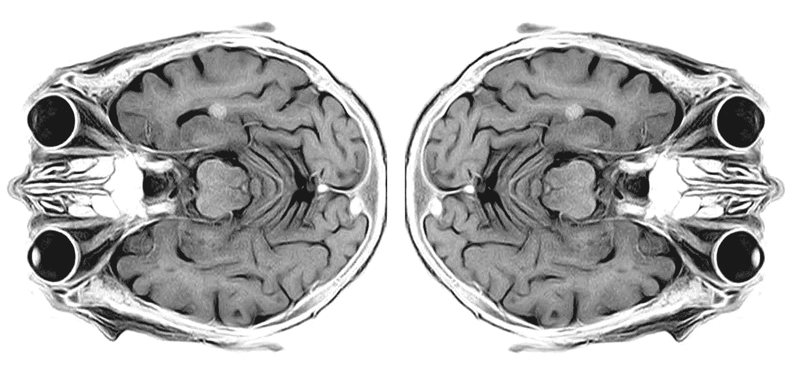

# 脑成像数据分析导论——第一部分:fMRI 数据结构

> 原文：<https://medium.com/coinmonks/visualizing-brain-imaging-data-fmri-with-python-e1d0358d9dba?source=collection_archive---------2----------------------->

Structural MRI scan of the human brain (modified from [toubibe](https://pixabay.com/users/toubibe-647761/))

对医学数据应用机器学习技术的兴趣越来越大。来自磁共振成像实验(MRI)的大脑扫描已经成为一种流行的选择，结合 MRI 和机器学习的出版物数量在过去几年中呈指数增长(见下面来自 [PubMed](https://www.ncbi.nlm.nih.gov/pubmed/) 的数据)。因此，在第一篇文章中，我们将介绍一些基础知识…