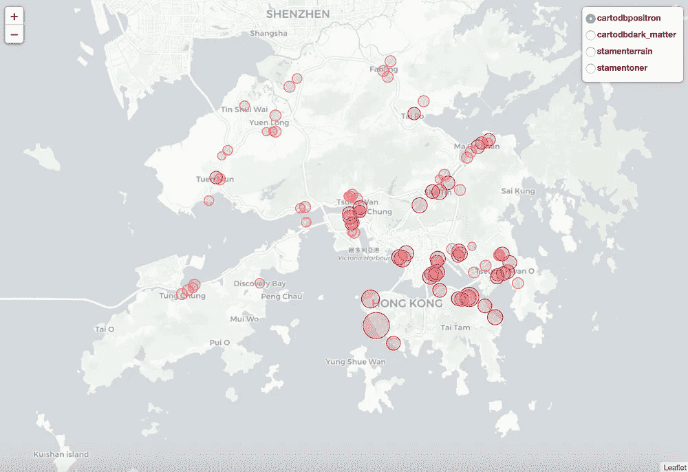
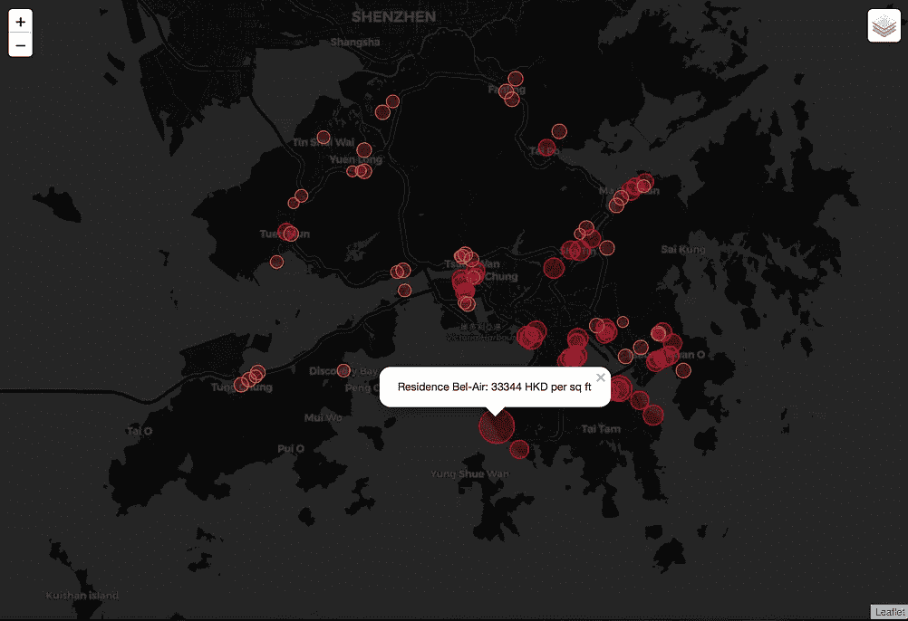
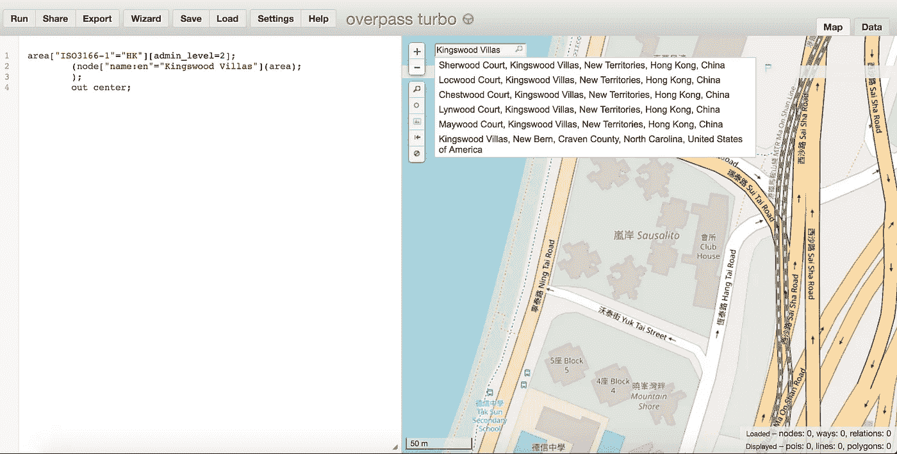
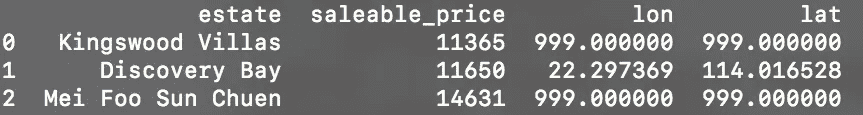
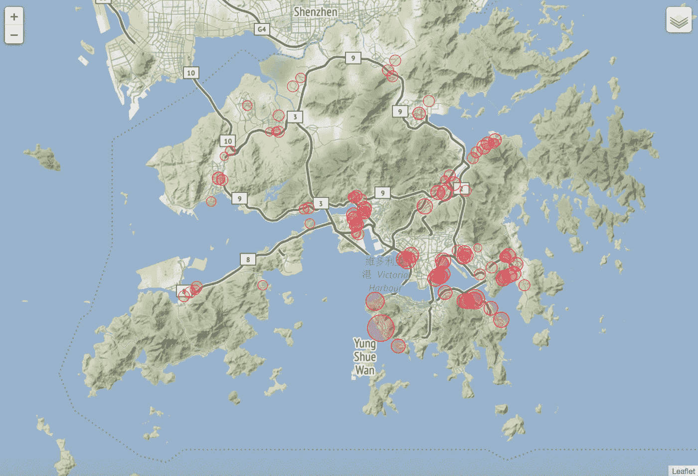

# 用熊猫、Overpy 和叶子形象化香港的房地产价格

> 原文：<https://medium.com/coinmonks/visualizing-property-prices-in-hong-kong-with-pandas-overpy-and-folium-595240ffca90?source=collection_archive---------1----------------------->



Visualization of Hong Kong housing data using Folium, a Python wrapper for Leaflet.js maps

香港以其高得离谱的房地产市场而闻名。2018 年 1 月，这座城市被评为世界上最不可负担的城市。房价中值是收入中值的 15 倍以上。2017 年，尼科尔森山项目中的两个单元被认为是亚洲最昂贵的公寓，售价总计 1.49 亿美元。另一方面，更便宜但宜居的公寓平均每月租金为 10，000 HKD (1，300 美元)。考虑到香港房价的巨大差异，我们如何使用 Python 可视化这些数据呢？


香港几乎没有公开的数据来源。最简单的方法来获得房地产价格估计是从房地产代理网站。米德兰房地产价格图表等价格图表提供了住房数据，如每平方英尺的毛价格和可销售平均价格。使用 pdf 到 csv 转换器，我们可以提取一个简单的数据集，其中包含房地产及其每平方的价格。制成当然，需要数据清理来删除或估算损坏或丢失的数据。为了您的方便，从美联物业价格图表中提取的样本数据集包含在[数据](https://github.com/enochk22/hk_prop_price_visualization/tree/master/code/data)文件夹中。你可以在我的 [Github repo](https://github.com/enochk22/hk_prop_price_visualization/tree/master/) 找到完整的代码。

首先，我们需要预处理数据并获得所列属性的坐标(经度和纬度)。一个很好的 GPS 坐标来源是 OpenStreetMap.org 的。通过将香港指定为区号并提供每个位置的节点名，可以对天桥 API 进行简单的查询。你可以在这里了解更多关于 Overpass API 和 Overpass SQL[的内容。我还推荐阅读](https://wiki.openstreetmap.org/wiki/Overpass_API) [Nikolai Janakiev](https://medium.com/u/eb95fc687c6a?source=post_page-----595240ffca90--------------------------------) 关于[用 Python 和 transition API 从 OpenStreetMap 加载数据的文章](https://towardsdatascience.com/loading-data-from-openstreetmap-with-python-and-the-overpass-api-513882a27fd0)。

您可能会很快注意到，在数据集中的 99 个属性中，并不是所有的属性都可以作为 OpenStreetMap 上的节点使用。有些物业，如马鞍山新建成的 Sausalito，可作为路(节点的集合)。



Some locations are not available on OpenStreetMap

因此，查询功能被设计为处理三种情况:属性被标记为节点、方式或不存在。如果该属性不存在，我们只需将其坐标标记为[999，999]以将其从地图中删除。

```
def overpyq(loc):
 quer = '''
  area["ISO3166-1"="HK"][admin_level=2];
  (node["name:en"="'''+str(loc)+'''"](area);
  );
  out center;
  '''
 res = api.query(quer)
 if not res.nodes:
  quer2 = '''
   area["ISO3166-1"="HK"][admin_level=2];
   (way["name:en"="'''+str(loc)+'''"](area);
   );
   out center;
   '''
  res = api.query(quer2).ways[0].get_nodes(resolve_missing=True)[0] if api.query(quer2).ways != [] else 999
  return res
 res = api.query(quer).nodes[0]
 return res
```

值得一提的是，原始数据集包含美元符号和逗号。使用 Python 中的正则表达式和字符串操作，可以剪切和替换这些特殊字符。然后将预处理的数据放入一个字典中，使用我们之前定义的函数进行查询。

```
# preprocessing
places = []
prices = []
places += [place for place in data.estate]
prices += list(chain.from_iterable(map(int, re.findall(r'\d+',price.replace(',', ''))) for price in data.avg_price_saleable))
querydict = dict(zip(places,prices))# collect coords into list
api = overpy.Overpass()
coords  = []
lons = []
lats = []
for key in querydict:
 r = overpyq(str(key))
 coords += [(float(r.lon), float(r.lat))] if r != 999 else [(float(999), float(999))]
lons += [lon[1] for lon in coords]
lats += [lat[0] for lat in coords]
```

使用**熊猫**，我们可以将房产名称、价格和坐标组合到一个巨大的数据框架中进行映射。请注意，坐标标记为[999，999]的属性不会显示在最终地图上，因为它们没有在 OpenStreetMap 上标记。



最后一步是创建一个**叶子**图。Folium 是用于**leafle . js**的 python 包装器，这是一个用于移动友好的交互式地图的开源 **JavaScript** 库。通过添加`LayerControl()`,我们可以给我们的叶子地图添加不同的图块。Folium 有许多默认的平铺层可供选择，您也可以导入自定义的平铺层。在地图上添加圆形标记，其半径对应于资产价格。不同深浅的红色也对应着价格是否高于每平方 10，000 和 15，000 HKD。制成地图保存为`hkmap.html`，可以在浏览器中查看。

```
m = folium.Map(location=[22.34, 114.1], tiles='cartodbpositron', zoom_start=10.5)
folium.TileLayer('cartodbdark_matter').add_to(m)
folium.TileLayer('stamenterrain').add_to(m)
folium.TileLayer('stamentoner').add_to(m)
folium.LayerControl().add_to(m)
for i in range(0,len(querydf)):
 col = '#FF0033' if querydf.iloc[i]['saleable_price'] > 15000 else ('#FF6633' if querydf.iloc[i]['saleable_price'] > 10000 else '#FFCC33')
 folium.Circle(
   location=[querydf.iloc[i]['lon'], querydf.iloc[i]['lat']],
   popup=querydf.iloc[i]['estate']+': '+str(querydf.iloc[i]['saleable_price'])+' HKD per sq ft',
   radius=querydf.iloc[i]['saleable_price']/25,
   color=col,
   fill=True,
   opacity= 0.89,
   fill_color=col,
   stroke= True,
   weight= 1
 ).add_to(m)
m.save('hkmap.html')
```

现在你知道了。在 Python 库的帮助下，可视化香港的各种房地产价格似乎并不太难。随意派生我的 [repo](https://github.com/enochk22/hk_prop_price_visualization) 或者甚至使用其他库创建你自己的可视化。



感谢您阅读我的第一篇文章。

> [直接在您的收件箱中获得最佳软件交易](https://coincodecap.com/?utm_source=coinmonks)

[](https://coincodecap.com/?utm_source=coinmonks)