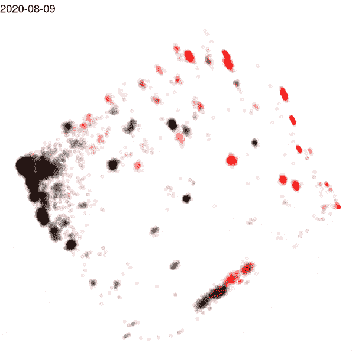
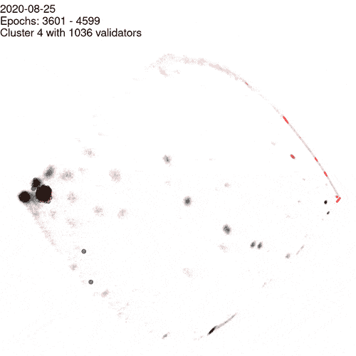
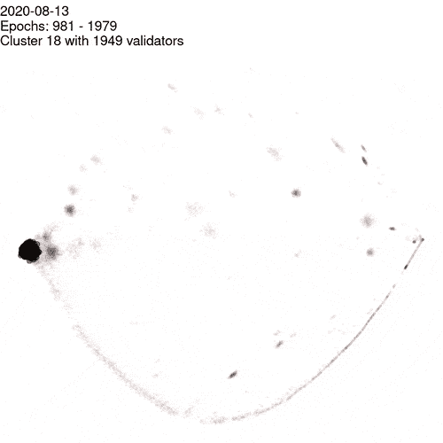
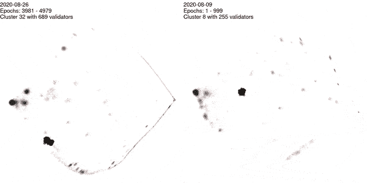

# 在梅达拉汹涌的海洋中观察鲸鱼，以太坊 2 号试验网

> 原文：<https://medium.com/coinmonks/visualizing-whales-in-the-rough-seas-of-medalla-the-ethereum-2-testnet-f748592fc08a?source=collection_archive---------0----------------------->

在密码世界中，鲸鱼是网络参与者，它们控制着大包的密码，而在即将到来的以太坊 2 赌注证明(POS)网络中，这相当于许多验证器。如果这些验证器在同一台计算机上运行，并且系统脱机，则所有验证器将同时停止证明，从而导致区块链上记录的证明行为相互关联。还有其他原因可以解释为什么一组验证者会同时停止验证，比如互联网提供商的中断、云服务或软件中的错误。随着时间的推移，鲸鱼的证明行为越相关，网络就越脆弱，并且在 eth 2 协议中存在避免停机时间相关性的激励。

拥有测量、监控和可视化证明行为相关性的方法将是一种重要的反馈机制，可以最大限度地提高 eth 2 mainnet 上的网络稳定性。为了在 Medalla testnet 上检测随时间的相关性，生成了一个矩阵，其中每个历元的成功证明记录在一个 14000(历元)x 75858(验证器)的二进制矩阵中，范围从 me dalla genesis 2020 年 8 月 4 日到 10 月 5 日。导出主成分是降低这种高维数据集的维度的流行方法，通常与绘制两个最佳主成分(PC1 和 PC2)相结合，以将高维数据分离成更适合人类消费的两个维度。

Plot of the PC1 (x-axis) and PC2 (y-axis) where each point is a validator and the color indicates succesful (black) or unsuccessful (red) attestation. Each frame plots the PC1 and PC2 for a segment of 1000 epochs, with an increment of 20 epochs per frame.

上面的动画展示了 Medalla testnet 上随时间推移的证明行为的两个最佳原则组件，每个验证器表示为一个点。左侧的验证器是每个时期的稳定的成功证明者，由于模糊的证明行为，分散在角落的一个小区域中，偶尔会错过证明。最右边是在当前时段窗口中没有成功认证的验证器，用红色表示，集中在角落，因为离线验证器没有模糊行为。在这两个极端之间，我们发现了最有趣的观察结果——左边是从成功验证的汹涌大海中出现的验证者(鲸鱼)群，当它们突破匿名和模糊的表面时变红。

当测试网上的单个验证器被简单地绘制成如上所述的随时间变化的图时，可以看到如此多的大型集群，这是令人吃惊的，这意味着许多网络参与者具有大量的验证器。与 mainnet 上的数据相比，这种 testnet 数据的强集群性质被认为是夸大的，因为 testnet 参与者希望用许多验证器来支持和压力测试网络。他们还在试验软件和硬件，导致定期停机，因此在此分析中定期显示为集群。在 mainnet 上，维护一个稳定的系统将会有真正的货币风险和回报，证明行为可能(希望)不那么集中。

A whale spotted repeatedly breaching, diving and resurfacing over several days. The ~1000 validators in the cluster are highlighted by making all validators not in the cluster more see-through

这些集群可能属于同一个用户，或者具有共同的技术漏洞。为了最大限度地提高网络稳定性，参与者的目标应该是彼此不相关，而不是所有人都依赖于相同的故障点，例如每个人都在 aws 上有自己的验证器或使用相同的 eth 2 客户端。在左边的动画中，突出显示了一大组 1036 个验证器，它们在几天的时间里在黑色和红色之间闪烁了几次。

这种分析的一个有用方面是可视化网络的健康状况，并获得网络故障的可视化。因为数据是从一系列时期产生的，所以在突然网络故障的情况下，给出网络的实时可视化不会立即提供信息，但是可以在几个小时的尺度上提供启发，以获得事后事件的可视化。在更短的时期范围内进行分析使得可视化更能响应实时或最近的事件，但是也使得可视化本身不太稳定，并且更难以在视觉上跟踪。这些差异在与[相关的 github 库](https://github.com/petclippy/medalla/blob/main/README.md)中进行了探索和演示，其中也有更多的动画展示了其他集群验证器的不同类型的行为。

The “roughtime” incident when the Medalla network went offline for several days starting from august 15th. A cluster of validators that remained online during most of the incident is highlighted

Medalla 生活中最重要的事件是“roughtime”事件，当时一个 bug 影响了最常用的 eth 2 客户端 Prysm，从 8 月 15 日起使网络离线几天。左侧是该事件的图示，突出显示了一组验证器，在大部分事件中，当大部分网络离线时，这些验证器成功地进行了验证。这个集群很可能是除 Prysm 之外的客户端上的验证器，突出了在发生重大网络事件时使用这个分析框架来识别验证器之间的共同特征的可能性。

随着时间的推移，相关网络行为的可视化可以被开发成网络资源，其示出了类似于上面第一幅图的网络可视化，示出了先前时代集的主要组成部分的(略微延迟的)概览，从而示出了网络中所有参与者的可视化表示。在整个网络历史中检测到的群集可以包含在数据库中，并与公共地址相关联。这将允许用户搜索他们的验证器，并揭示证明行为如何与其他行为相关，当强相关性被揭示时，可能具有时间点的视觉输出。这种类型的信息可以是对网络参与者的有价值的反馈机制，以最大化 mainnet 上的网络稳定性。如果验证器对集群的属性足够好，这个分析框架也可以用于分析网络中财富的分布和控制。github 存储库中演示了该分析的初步版本。

To clusters of validators that repeatedly all go offline and come back online at the same times

该分析的原始数据是通过查询 Lighthouse beacon 节点 api 获得的，用 bash 脚本进行预处理，并导入到 R 中进行进一步的分析和可视化。所有的代码和进一步的注释都可以在相关的 github 资源库中找到，用于 [petclippy/medalla](https://github.com/petclippy/medalla/blob/main/README.md) 。

## 另外，阅读

*   最好的[密码交易机器人](/coinmonks/crypto-trading-bot-c2ffce8acb2a)
*   [密码本交易平台](/coinmonks/top-10-crypto-copy-trading-platforms-for-beginners-d0c37c7d698c)
*   最好的[加密税务软件](/coinmonks/best-crypto-tax-tool-for-my-money-72d4b430816b)
*   [最佳加密交易平台](/coinmonks/the-best-crypto-trading-platforms-in-2020-the-definitive-guide-updated-c72f8b874555)
*   最佳[加密借贷平台](/coinmonks/top-5-crypto-lending-platforms-in-2020-that-you-need-to-know-a1b675cec3fa)
*   [最佳区块链分析工具](https://bitquery.io/blog/best-blockchain-analysis-tools-and-software)
*   [加密套利](/coinmonks/crypto-arbitrage-guide-how-to-make-money-as-a-beginner-62bfe5c868f6)指南:新手如何赚钱
*   最佳[加密制图工具](/coinmonks/what-are-the-best-charting-platforms-for-cryptocurrency-trading-85aade584d80)
*   [莱杰 vs 特雷佐](/coinmonks/ledger-vs-trezor-best-hardware-wallet-to-secure-cryptocurrency-22c7a3fd391e)
*   了解比特币的[最佳书籍有哪些？](/coinmonks/what-are-the-best-books-to-learn-bitcoin-409aeb9aff4b)
*   [3 商业评论](/coinmonks/3commas-review-an-excellent-crypto-trading-bot-2020-1313a58bec92)
*   [AAX 交易所审核](/coinmonks/aax-exchange-review-2021-67c5ea09330c) |推荐代码、交易费用、利弊
*   [德里比特评论](/coinmonks/deribit-review-options-fees-apis-and-testnet-2ca16c4bbdb2) |选项、费用、API 和 Testnet
*   [FTX 密码交易所评论](/coinmonks/ftx-crypto-exchange-review-53664ac1198f)
*   [n 零审核](/coinmonks/ngrave-zero-review-c465cf8307fc)
*   [Bybit 交换审查](/coinmonks/bybit-exchange-review-dbd570019b71)
*   [3Commas vs Cryptohopper](/coinmonks/cryptohopper-vs-3commas-vs-shrimpy-a2c16095b8fe)
*   最好的比特币[硬件钱包](/coinmonks/the-best-cryptocurrency-hardware-wallets-of-2020-e28b1c124069?source=friends_link&sk=324dd9ff8556ab578d71e7ad7658ad7c)
*   最佳 [monero 钱包](https://blog.coincodecap.com/best-monero-wallets)
*   [莱杰 nano s vs x](https://blog.coincodecap.com/ledger-nano-s-vs-x)
*   [Bitsgap vs 3 commas vs quad ency](https://blog.coincodecap.com/bitsgap-3commas-quadency)
*   [莱杰纳米 S vs 特雷佐 one vs 特雷佐 T vs 莱杰纳米 X](https://blog.coincodecap.com/ledger-nano-s-vs-trezor-one-ledger-nano-x-trezor-t)
*   [block fi vs Celsius](/coinmonks/blockfi-vs-celsius-vs-hodlnaut-8a1cc8c26630)vs Hodlnaut
*   Bitsgap 评论——一个轻松赚钱的加密交易机器人
*   为专业人士设计的加密交易机器人
*   [PrimeXBT 审查](/coinmonks/primexbt-review-88e0815be858) |杠杆交易、费用和交易
*   [埃利帕尔泰坦评论](/coinmonks/ellipal-titan-review-85e9071dd029)
*   [SecuX Stone 评论](https://blog.coincodecap.com/secux-stone-hardware-wallet-review)
*   [BlockFi 评论](/coinmonks/blockfi-review-53096053c097) |从您的密码中赚取高达 8.6%的利息