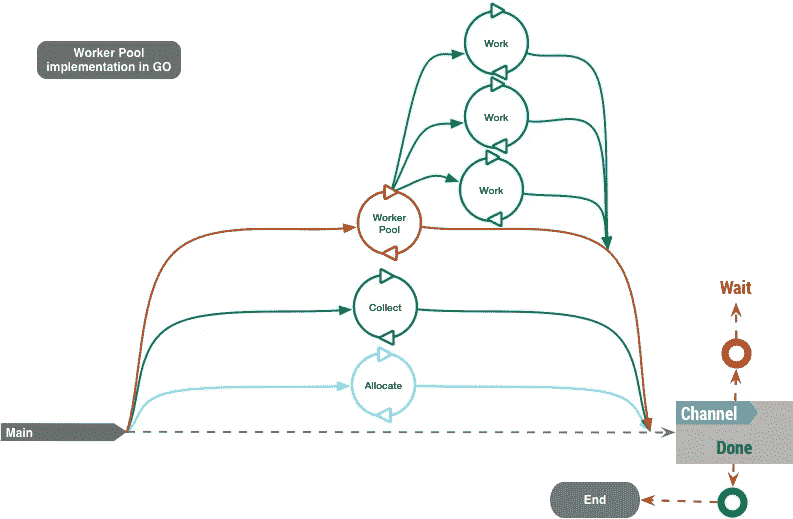
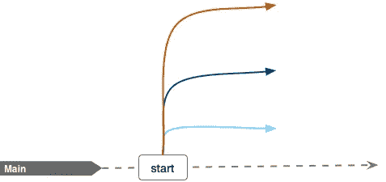
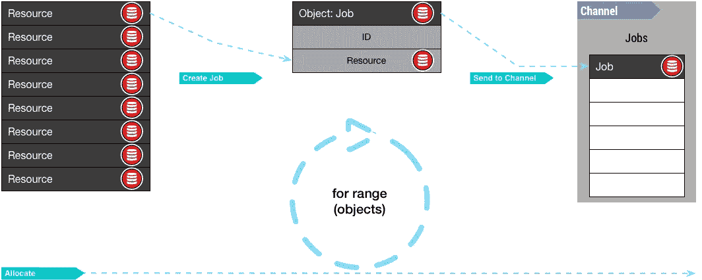
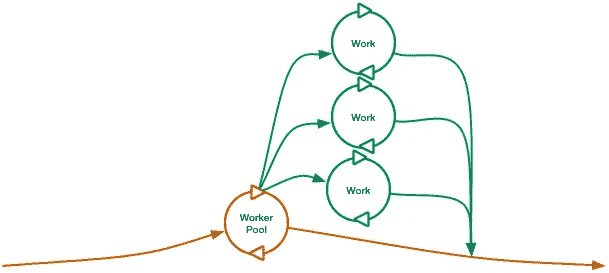
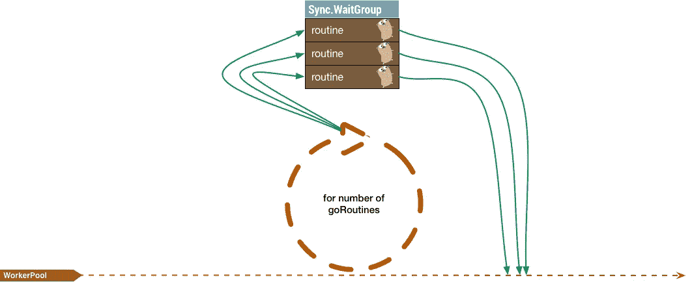
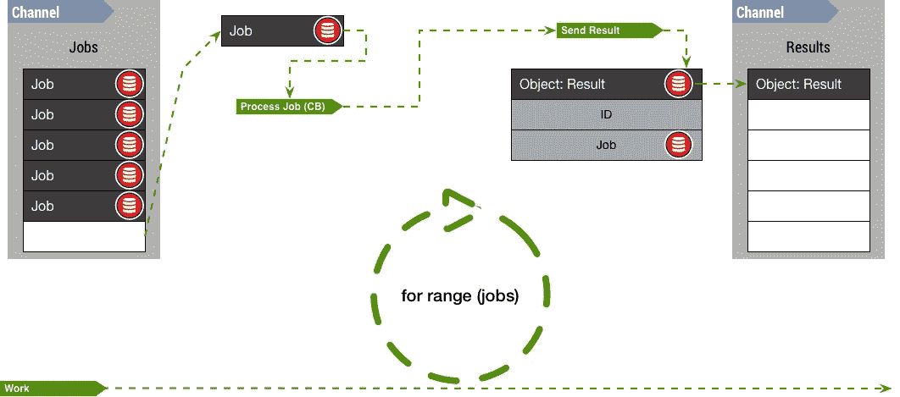
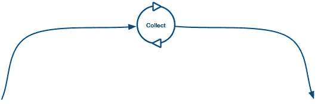
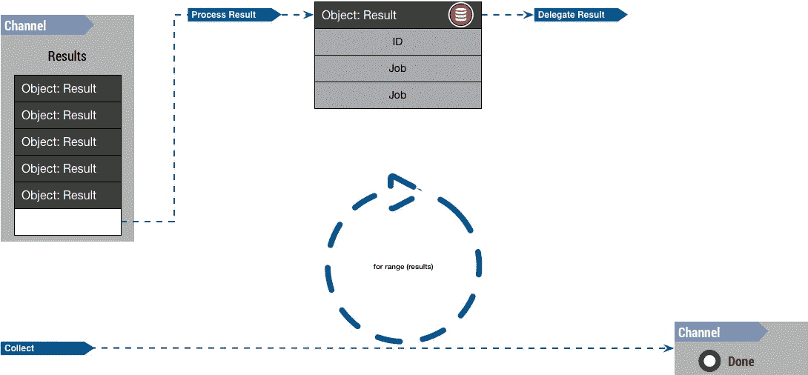

# 直观了解员工池

> 原文：<https://medium.com/coinmonks/visually-understanding-worker-pool-48a83b7fc1f5?source=collection_archive---------0----------------------->

Example diagram of a worker pool process in Go using goRoutines

我们需要关注的问题是创建一个更加**可视化的**方法来理解模式和一些其他**解决方案架构**，如果它们没有被正确理解，可能会在你的内部团队中产生一个黑箱情况。

通常，我们倾向于“复制和粘贴”代码，甚至没有意识到底层是如何工作的。今天，我们将回顾著名的(然而**被低估的**)工人池(又名线程池)。在 ***Go、*** 中，通常使用[缓冲通道](https://tour.golang.org/concurrency/3)作为 goRoutines 之间的主队列和通信通道。为了更清楚地理解，在继续这篇文章之前，先了解[频道](https://tour.golang.org/concurrency/2)。

## 理解图表

我们在这篇文章开始时展示了一个工人池在 ***Go*** 中实现的高层图。它恢复了需要在任何工作池实现中发生的主要操作:

*   “分配”要处理的资源
*   “工作”(或处理)那些资源
*   并且“收集”结果用于进一步的后处理

这些操作可以以不同的方式完成，甚至是具有迭代行的单个脚本，但今天我们将在*Go 中使用并发和并行设计，以最大化可用的硬件资源，尽可能快地获得结果，并继续向[微服务](https://en.wikipedia.org/wiki/Microservices)架构发展的趋势。*

*让我们以更详细的“放大”方式查看每个组件:*

**

***主 GoRoutine 是正常的程序执行**，在这种情况下，我们的程序没有做什么特别的事情，因为我们关注的是工人池，要执行的唯一具体任务是生成和控制与工人池的正确执行相关的其他 go routine*

**

*Boolean Channel “Done”*

*[通道](https://tour.golang.org/concurrency/2)“完成”(`done chan bool`)作为主程序控制，表示所有任务已经执行，所有程序已经完成。与“主循环”设计不同，主 GoRoutine 等待通过此通道发送的信号来停止和结束程序。为什么我们使用一个通道来控制程序的执行并等待所有的程序很容易回答:**简单性***

*在前面的例子中，我们的程序等待继续执行，直到通道变量“done”(`<-m.done`)收到一个值。这使得代码更小，更易于阅读。*

## *分配资源*

**

*“Allocate” goRoutine*

*“分配”goRoutine 是从主 goRoutine 派生出来的一个子程序，它的目的是**分配将被工人池使用的资源**。它有一个生命周期有限的主循环:直到所有的资源都被分配。为了更好地理解这一点，让我们看一下下图:*

**

*“Allocate” goRoutine tasks*

*“*只要有资源可以分配，goRoutine 就会继续它的操作*”是更好地描述上图的表达方式。分配执行接收一个未知大小的资源数组，并遍历该数组，将其转换为一个结构“作业”,该作业稍后可以由另一个 goRountine 处理。被转换为“作业”的资源被发送到具有有限大小/维度的缓冲通道“作业”。您可能已经注意到，在示例中，资源数组大于通道中可以缓冲/发送的元素，这是通过设计实现的**，它控制可以同时执行的并行作业的数量**。就是这样，如果“Jobs”通道已满，那么对资源的**迭代将停止**，直到它可以再次在 Jobs 通道中分配作业。*

*为什么我们将资源转换为渠道工作遵循 [**关注点分离**](https://en.wikipedia.org/wiki/Separation_of_concerns) **的设计原则。**发送到作业通道的资源将被另一个 goRoutine 拾取，以进行后续处理，从而将分配限制为仅接收、转换和分配。以下代码代表了所讨论的图表:*

## *处理作业通道(待完成的作业)*

**

*“工作池”的日常存在是由“作业”通道定义的:只要有作业需要处理，就继续做下去。继续 [**关注点分离**](https://en.wikipedia.org/wiki/Separation_of_concerns) 这个例程的目的是作业的实际处理，并且在大多数情况下，它以并发和并行的方式工作。这是**我们讨论的最关键部分**，因为它涵盖了**工人池**的创建和工作分配。*

**

*Worker Pool using Sync.WaitGroup to control spawning new GoRoutines*

*在这种情况下，工人池 goRoutine 产生新的“工作”(或“工人”)goRoutine，多少 to [spawn](https://gobyexample.com/goroutines) 由配置定义或注入到我们的解决方案中，现在让我们将“3”定义为池中工人的数量。任何工作池(或线程池)的一个关键因素是控制池的大小，如果你不这样做，硬件资源很可能会耗尽，甚至你的程序会死锁。*

*我们将通过使用 [Sync 来简化我们的解决方案。WaitGroup](https://nanxiao.me/en/use-sync-waitgroup-in-golang/) 基本上是一个结构，我们可以随时询问它，看是否所有的 goRoutines 都已完成。类似于我们的“Done”通道， [WaitGroup](https://golang.org/pkg/sync/#WaitGroup) 包公开了一个 [Wait](https://golang.org/pkg/sync/#Cond.Wait) 方法，该方法将暂停执行，直到接收到一个值。代码看起来类似于:*

*您可能已经注意到了，同步只是一个原子计数器，我们在每个子例程中递增(`Add`)然后递减(`Done`)。然后，workerPool 停止执行，直到满足`wg.Wait()`条件。*

*现在让我们看看每个“工作”(或工作者)的实际执行，以便更好地理解所有的同步和作业的实际处理。*

**

*“Work” goRoutine process*

*在 WokerPool goRoutine 中，我们看到了如何通过调用`go m.work`来创建新的 goRoutine，从而在 for 循环中生成新的“工作”goRoutine。*

*在这个新的 goRoutine 内部，是作业的实际**处理和分配结果**，为此，每个新的“工作”goRoutine 将在通道“作业”上执行一个`for range jobs`循环。这样做的效果是，每个工作例程将获得一个**唯一的**作业，因为 Go 中实现了使用锁的通道，并确保通道中只有一个项目可以被 goRoutine 获取，这也定义了“工作”goRoutine 的**生存期**:**只要作业通道中有工作要做，就继续迭代**。这种技术可以更好地阅读和理解代码，它隐藏了所有锁定和解锁进程间共享结构的机制。*

*一旦我们从通道“Jobs”中选择了一个作业，我们就处理它并创建一个“Result”对象，然后将它发送到“Results”通道。这是我们采用的 [**关注点分离**](https://en.wikipedia.org/wiki/Separation_of_concerns) 设计的延续，一个“工作”的生命周期由处理一个“作业”和将结果发送到“结果”通道所花费的时间来定义，如果它还没有关闭，它将再次迭代“作业”通道。*

*前面的代码代表了这一章，正如你所看到的，变量`wg` ( `sync.WaitGroup`)作为方法的引用被传递，所以当我们处理完所有的“作业”时，我们可以调用`wg.Done()`让父 goRoutine (workerPool)知道这个特定的 goRoutine 已经完成。*

## ***收集结果***

******

***“Collect” goRoutine***

***那么，一旦结果被发送到“结果”通道，我们应该做什么呢？答案很简单:**收集，处理，委托结果**。***

******

***我们的缓冲通道“Results”保存了来自所有 workers 的所有结果，因此我们有一种不同的方法来处理这个“queue”(在本例中，我们只是对它们进行迭代)。关于这个实现的重要部分是**理解处理一个作业与处理它的结果有不同的关注点**。人们可以根据结果采取不同的行动。***

***从前面的代码中很重要的理解了与图表相关的几个因素:***

*   ***[依赖注入](https://en.wikipedia.org/wiki/Dependency_injection)再次用于将结果注入到“后处理器”中，这在池上下文之外创建了结果的**委托**，其中注入的函数可以采取不同的动作。
    这种类型的签名类似于:
    `type ResultProcessorFunc func(result Result) error`***
*   ***我们只是在通道上迭代，**这定义了收集例程**的生命周期。我们可以交换这种方法，创建另一个工作池来加速结果的后处理，但是从设计上来说，这是不必要的，因为在“work”go routines 中处理一个“Job”理论上应该比后处理结果花费更多的时间。如果后者对您的设计不满意，这意味着您的结果中可能有许多值得研究的业务逻辑规则，并被转移到“作业”处理中。***
*   ***最后的`m.done <- true`向“Done”通道发出信号，让主 goRoutine 知道工作池已经完成。***

## ***下一步是什么？***

***至此，我们已经在 **Go** 中设计、理解并实现了一个完全并发、并行和抽象的工人池。自从信息时代开始以来，为我们的问题解决方案创建**视觉表示和/或图表的实践受到了高度重视。它帮助你抽象、发现模式和机会来改进你的解决方案，并且有希望为更好的文档创造肥沃的土壤。*****

***请随意在此获取完整的代码和一些示例:***

*** [## dmora/工人池

### 这个小的 Go-Lang 包实现了工人池模式

github.com](https://github.com/dmora/workerpool) 

> 加入 Coinmonks [电报频道](https://t.me/coincodecap)和 [Youtube 频道](https://www.youtube.com/c/coinmonks/videos)获取每日[加密新闻](http://coincodecap.com/)

## 另外，阅读

*   [复制交易](/coinmonks/top-10-crypto-copy-trading-platforms-for-beginners-d0c37c7d698c) | [加密税务软件](/coinmonks/crypto-tax-software-ed4b4810e338)
*   [网格交易](https://coincodecap.com/grid-trading) | [加密硬件钱包](/coinmonks/the-best-cryptocurrency-hardware-wallets-of-2020-e28b1c124069)
*   [密码电报信号](http://Top 4 Telegram Channels for Crypto Traders) | [密码交易机器人](/coinmonks/crypto-trading-bot-c2ffce8acb2a)
*   [最佳加密交易所](/coinmonks/crypto-exchange-dd2f9d6f3769) | [印度最佳加密交易所](/coinmonks/bitcoin-exchange-in-india-7f1fe79715c9)
*   [币安 vs Bitstamp](https://coincodecap.com/binance-vs-bitstamp) | [Bitpanda vs 比特币基地 vs Coinsbit](https://coincodecap.com/bitpanda-coinbase-coinsbit)
*   [如何购买瑞波(XRP)](https://coincodecap.com/buy-ripple-india) | [非洲最好的加密交易所](https://coincodecap.com/crypto-exchange-africa)
*   [非洲最佳加密交易所](https://coincodecap.com/crypto-exchange-africa) | [Hoo 交易所评论](https://coincodecap.com/hoo-exchange-review)
*   [eToro vs robin hood](https://coincodecap.com/etoro-robinhood)|[MoonXBT vs by bit vs Bityard](https://coincodecap.com/bybit-bityard-moonxbt)
*   [开发人员的最佳加密 API](/coinmonks/best-crypto-apis-for-developers-5efe3a597a9f)
*   最佳[密码借贷平台](/coinmonks/top-5-crypto-lending-platforms-in-2020-that-you-need-to-know-a1b675cec3fa)
*   [免费加密信号](/coinmonks/free-crypto-signals-48b25e61a8da) | [加密交易机器人](/coinmonks/crypto-trading-bot-c2ffce8acb2a)
*   杠杆代币的终极指南***