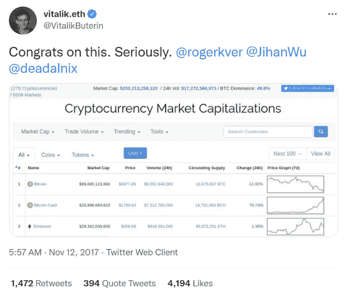

# 维塔利克猛烈抨击 BTC 马克思主义者。比特币现金社区对萨尔瓦多-BTC 交易持怀疑态度。

> 原文：<https://medium.com/coinmonks/vitalik-slams-btc-maximalists-c2c87d47a16e?source=collection_archive---------7----------------------->

*Image from:* [*Flickr*](https://live.staticflickr.com/4342/37155971382_03b9bdc95c_b.jpg) *(*[*Creative Commons Licence*](https://creativecommons.org/licenses/by/2.0/)*), modified*

几天前，Vitalik Buterin 在 Reddit 上发表了一篇关于 Bukele 政府和强制使用 BTC(与 LN 和 Strike/Chivo 钱包)的方法的评论。

比特币现金社区一直对萨尔瓦多的交易持怀疑态度，我之前在 Vitalik 的 Reddit 帖子上批评过萨尔瓦多的交易，称其为“[惨败](/coinmonks/bitcoin-cash-is-the-last-line-of-defence-against-the-upcoming-cbdcs-invasion-3edc97db224f)”。

正如我所料，r/cryptocurrency 在评论后禁止了我，所以我(再次)删除了我的 Reddit 帐户。我认为这个网站是对言论自由的威胁，对于交流建设性的想法和观点来说毫无用处。

Reddit 的方法是创建强大的枢纽来控制信息流，审查是 subreddit 管理员广泛使用的方法。我不想与这样一个滥用互联网高流量权力的平台有任何关系。

少数处于控制中的管理员的目的仅仅是为了促进他们的利益(沉重的包袱),并从讨论中排除他们认为威胁到他们在加密市场的利润的论点。

由于我不想成为这些密码管理员(青少年和不成熟的业余爱好者)操纵战术的工具，我远离 Reddit，并建议每个人都这样做。

r/加密货币和 r/比特币也是如此。这些分支是可审查的，并且促进私人利益。

使用关键词“Reddit”和“审查”搜索谷歌，我们收到**1270 万**关于这个话题的结果。

Reddit 只是另一个奥威尔式的反乌托邦，几乎没有任何兴趣，除了可能仍然有一些非常有创意的调查者的神秘子 Reddit。

> 订阅 [**Coinmonks Youtube 频道**](https://www.youtube.com/c/coinmonks/videos) 获取每日加密新闻。

# 维塔利克猛烈抨击“BTC”主义者。

*Image from* [*Flickr*](https://www.flickr.com/photos/techcrunch/22987802684/) *(*[*Creative Commons Licence*](https://creativecommons.org/licenses/by/2.0/)*) , by* [*TechCrunch*](https://www.flickr.com/photos/techcrunch/)

总得有人说话，我很高兴是维塔利克。

> 这个观点没什么不受欢迎的。强制企业接受特定的加密货币违背了自由的理念，而自由对于加密领域来说是如此重要。此外，这种在几乎没有事先教育的情况下同时向萨尔瓦多数百万人推广 BTC 的策略是鲁莽的，并有可能使大量无辜的人受到黑客攻击或诈骗。为所有不加批判地赞美他的人感到羞耻(好吧，我会叫出主要负责人:为比特币最大化主义者感到羞耻)。
> 
> [来源](https://www.cryptoglobe.com/latest/2021/10/ethereum-creator-vitalik-buterin-slams-bitcoin-maximalists-for-supporting-el-salvadors-invasive-legislation/)

不过，Vitalik 并没有关闭集中的 Chivo/Strike 钱包。我的问题是关于它的，然而，r/cryptocurrency 开发者认为我不应该在那里询问他们推广的集中式服务的问题。

维塔利克在这里陈述了显而易见的事实，但比特币现金社区的大多数人已经对此表示怀疑。维塔利克痛斥了 BTC 最大化主义者，但也通过这篇文章给出了另一个信号，一个比特币现金社区也经常讨论的信号。

**维塔利提到布克勒接受了 BTC(但没有使用比特币这个词)**

也许这比这篇评论中描述的任何事情都更伤害最大主义者。他们不在乎布克勒强制使用加密货币的战术；他们不关心 LN 的中央集权问题，只想推动有助于 BTC 达到更高价格的叙事。

虽然，他们只关心一个因素；品牌名称(比特币)。

Vitalik 聪明地使用了比特币这个词，只在描述 maximalists 的时候，这是贬义的，不是正面的人物塑造。

尤其是当我们讨论技术的时候，做一个狭隘的只支持一种技术而忽略其他技术的最大主义者，只意味着无知和缺乏知识或理解。

自称为比特币最大主义者是自相矛盾的。你只是在告诉世界，你对代码是什么、进步意味着什么知之甚少，只是宣布对加密货币金融技术一无所知。

当然，我们称比特币最大化者为所有那些 BTC 包包持有者，但这个术语也应该改为 BTC 最大化者。

BTC 已经没有比特币了，这只是区块流对品牌名称的劫持，维塔利克明白这一点。

# 最后

*Source:* [*Twitter*](https://twitter.com/vitalikbuterin/status/929558722170429440)

比特币现金将很快超越市场，达到足够高的水平，再次挑战 BTC。

BTC 最大化主义者只能通过审查来自公众的比特币现金新闻和文章来拖延时间。

最终，比特币现金将传到新投资者的耳朵里，他们将不再像绵羊一样听从 Reddit 和社交媒体社区的建议和控制内容。

需要一个有道德观的受欢迎的人站出来反对投机者和个人推动监管和驯服加密货币的叙事控制。

BTC 最大主义者正在阻碍这一领域的进步和创新，他们支持一个威权政权，用枪指着一项有争议的货币监管。

至少以太坊社区到目前为止一直反对这种奇怪的发展。然而，令人难过的是，看到一些 BTC 的支持者没有大声反对我们今天看到的这种监管服务和独裁主义的模式。

> 我一直认为，早期的比特币企业家和倡导者，如北海巨妖的首席执行官杰西·鲍威尔(Jesse Powell)或安德烈亚斯·安东诺普洛斯(Andreas Antonopoulos)，会对加密世界的托管服务采取强硬态度。似乎已经没有人在乎了。如果道德妥协有助于提高价格，那么这是 BTC 最大主义者可以接受的方法吗？
> 
> [*2021 年 9 月 29 日*](https://read.cash/@Pantera/subservience-to-the-state-custodial-wallets-invalidate-cryptocurrency-1df5c08b)

**相关资料(之前 read.cash 上的文章):**

*   [屈从于国家——保管钱包使加密货币失效](https://read.cash/@Pantera/subservience-to-the-state-custodial-wallets-invalidate-cryptocurrency-1df5c08b)
*   [原则的背叛——BTC 现代最大主义&监管议程](https://read.cash/@Pantera/betrayal-of-principles-btc-modern-maximalism-the-regulatory-agenda-7e1b67cc)
*   [BTC (LN 硬币):99.8%的银行合规率](https://read.cash/@Pantera/btc-ln-coin-998-bank-compliant-6afcbe88)
*   [银行&政府决定，而不是市场](https://read.cash/@Pantera/the-banks-the-government-decided-not-the-market-f09a5841)
*   [银行如何利用 Blockstream 作为特洛伊木马劫持比特币——为什么是比特币现金](https://read.cash/@Pantera/how-the-banks-hijacked-bitcoin-using-blockstream-as-a-trojan-horse-why-bitcoin-cash-74eb96c5)
*   [比特币(BTC)的营销 Ponzi 化](https://read.cash/@Pantera/the-marketing-ponzification-of-bitcoin-btc-47ad770f)
*   [BTC 被收养、遗弃和拒绝的真相](https://read.cash/@Pantera/the-truth-about-btc-adoption-abandonment-and-rejection-e3bc96cd)

**也建议阅读:**

*   [秘密新闻网站:大规模操纵、宣传&比特币现金审查](https://read.cash/@Pantera/crypto-news-websites-massive-manipulation-propaganda-censorship-of-bitcoin-cash-071010ae)
*   [比特币现金——排除万难](https://read.cash/@Pantera/bitcoin-cash-against-all-odds-c432ddad)

Follow me on: ● [ReadCash](https://read.cash/@Pantera) ● [NoiseCash](https://noise.cash/u/Pantera99) ● [Medium](/@panterabch) ● [Hive](https://hive.blog/@pantera1) ● [Steemit](https://steemit.com/@pantera1) ●[Vocal](https://vocal.media/authors/pantera) ● [Minds](https://www.minds.com/pantera99/) ● [Twitter](https://twitter.com/Panterabch) ● [LinkedIn](https://www.linkedin.com/in/panterabch/) ● [email](https://read.cash/@Pantera/localcryptos-p2p-exchange-is-now-offering-bitcoin-cash-trading-06637230#bad-link)

***支持内容创作者。***

如果你喜欢这个故事，就订阅吧！

*原载于*[*https://read . cash*](https://read.cash/@Pantera/vitalik-slams-btc-maximalists-3de263c5)*。*

> 加入 Coinmonks [电报频道](https://t.me/coincodecap)和 [Youtube 频道](https://www.youtube.com/c/coinmonks/videos)了解加密交易和投资

## 也阅读

*   [BlockFi 信用卡](https://blog.coincodecap.com/blockfi-credit-card) | [如何在币安购买比特币](https://blog.coincodecap.com/buy-bitcoin-binance)
*   [火币交易机器人](https://blog.coincodecap.com/huobi-trading-bot) | [如何购买 ADA](https://blog.coincodecap.com/buy-ada-cardano) | [Geco。一篇评论](https://blog.coincodecap.com/geco-one-review)
*   [加密副本交易平台](/coinmonks/top-10-crypto-copy-trading-platforms-for-beginners-d0c37c7d698c) | [五大 BlockFi 替代方案](https://blog.coincodecap.com/blockfi-alternatives)
*   [CoinLoan 点评](https://blog.coincodecap.com/coinloan-review)|[Crypto.com 点评](/coinmonks/crypto-com-review-f143dca1f74c) | [火币保证金交易](/coinmonks/huobi-margin-trading-b3b06cdc1519)
*   [Bybit vs 币安](https://blog.coincodecap.com/bybit-binance-moonxbt)|[stealth x 回顾](/coinmonks/stealthex-review-396c67309988) | [Probit 回顾](https://blog.coincodecap.com/probit-review)
*   [顶级付费加密货币和区块链课程](https://blog.coincodecap.com/blockchain-courses)
*   [在美国如何使用 BitMEX？](https://blog.coincodecap.com/use-bitmex-in-usa) | [BitMEX 评论](https://blog.coincodecap.com/bitmex-review)
*   [最佳期货交易信号](https://blog.coincodecap.com/futures-trading-signals) | [期交所评论](https://blog.coincodecap.com/liquid-exchange-review)
*   [南非的加密交易所](https://blog.coincodecap.com/crypto-exchanges-in-south-africa) | [BitMEX 加密信号](https://blog.coincodecap.com/bitmex-crypto-signals)
*   [MoonXBT 副本交易](https://blog.coincodecap.com/moonxbt-copy-trading) | [阿联酋的加密钱包](https://blog.coincodecap.com/crypto-wallets-in-uae)
*   [雷米塔诺审查](https://blog.coincodecap.com/remitano-review)|[1 英寸协议指南](https://blog.coincodecap.com/1inch)
*   [MoonXBT vs Bybit vs 币安](https://blog.coincodecap.com/bybit-binance-moonxbt) | [Arbitrum:第二层解决方案](https://blog.coincodecap.com/arbitrum)
*   [买 PancakeSwap(蛋糕)](https://blog.coincodecap.com/buy-pancakeswap)|[matrix export Review](https://blog.coincodecap.com/matrixport-review)
*   [最佳免费加密信号](https://blog.coincodecap.com/free-crypto-signals) | [YoBit 评论](/coinmonks/yobit-review-175464162c62) | [Bitbns 评论](/coinmonks/bitbns-review-38256a07e161)