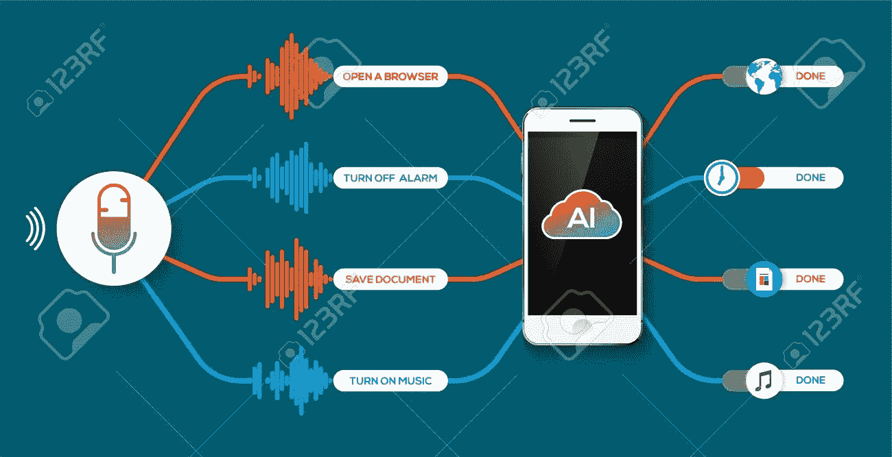

# 语音助手:人工智能的黑仔应用

> 原文：<https://medium.com/coinmonks/voice-assistant-the-killer-app-for-artificial-intelligence-756cbff16552?source=collection_archive---------9----------------------->

在数字世界中，数字助理正在将语音交互推向另一个层次。科技领域的发展方式听起来很迷人，这也是大型科技公司大力投资于带语音控制智能助理的智能手机的原因。技术从不分化，创新每天都在酝酿。因此，期望也超过了他们之前的期望。许多应用正在从触摸转向语音，从而帮助用户升级或扩展语音助手。

> 有趣的是，智能辅助通过语音交互提供了大量资源。这项技术正在创造一段时间以来的大技术玩家 R&D 焦点。

**语音辅助的范围**

科技巨头正在语音交互上投入巨资。谈到语音识别的挑战，随着人工智能领域的发展和探索，它需要更广泛的奉献。不仅是 iOS 应用程序，Android 应用程序也推出了支持语音助手的功能，以增强用户体验。通过语音搜索和语音激活设备控制，这些高级应用程序让用户体验世界。像发送消息或检查新邮件这样的正常活动可以通过语音辅助进行处理，融合了人工智能体验，旨在为用户提供对话互动。语音辅助它智能地为用户拉出相关信息。因此，无需花费时间，它就可以了解更多关于用户选择的信息。同样，用户可以通过其日常活动等数据进行跟踪。用户的兴趣和日常搜索是什么？这可能有助于个人信息。与应用程序集成的语音助手是一种趋势，因为它允许用户在不同的维度体验相同的空间。随着这种技术融合的引入，用户可以通过各种各样的语音控制来看世界。

对话语音助手的功能表现得像人一样。人工智能正在崛起，这意味着你不必继续进行对话。语音助手是一个强大的工具，当你和它说话时，当其他人在房间里时，它也会提供帮助。

**语音助手如何协助用户**

**1。语境理解**

语音辅助技术随着上下文理解而发展，这是许多组织关注的领域。有了这样的特点，这项技术在走向未来的道路上抓住了更多的机会。语音助手理解后续问题的上下文，不会让用户落后。当谈到不同的基于上下文的语言时，是的，它支持它。

大多数数字助理都致力于提供自发的上下文响应。谷歌(Google)和苹果(Apples)等巨头正在科技竞赛中争夺市场和用户思维。
在科技的帮助下，语音助手正在更多地融入用户生活的一部分。组织需要有一个长期的愿景，定期推进对背景的理解。你可以说，理解用户所说的话并将其转化为有用的对话的能力就是语音助手。语音助手最棒的部分是能够理解最后一句话并预测下一句话。

**2。基于用户的市场**

应用程序正在主导市场，同样，应用程序开发公司的开发人员正在试图解决多个平台之间的设备碎片化问题。许多公司选择这项技术的原因是为了保持其市场份额。现在市场上可以买到语音辅助设备，对于那些买不起这种设备的用户来说，这些设备具有每一种更便宜的选择。语音生态系统正在加速扩张以征服市场。这种智能语音助手可以帮助用户从触摸转向语音。当开发人员开发带有语音辅助的应用程序时，他们需要关注碎片化。这是用户了解语音辅助功能的时候。

> **语音助手正在跨各种平台构建无缝、直观的用户体验。**

**3。用户要求轻松的体验**

技术在各个方面都在升级。现在用户行为正从屏幕交互转向语音交互。[移动开发者](http://www.quytech.com/hire-dedicated-developers.php)正努力通过提供更无缝的体验来满足用户需求。据观察，用户更喜欢语音增强功能。因此，用户需要快速、高效和方便的数字体验。为了立足于用户需求，品牌正在寻找新的方法。因此，减少摩擦点的语音技术使用户能够使用自然语言。为了减少用户的工作量，开发者必须完全投入到他们的目标中。

用户每天都在寻找各种信息，并寻找更快、更有效的方法来实现他们的目标。以多种方式纠正问题语音正成为各种查询的理想解决方案。用户使用声控助手来揭示我们的数字世界正在走向何方。

**4。用户参与度和忠诚度**

带着一个问题“品牌将如何调整他们的用户参与策略？”市场正朝着语音辅助的方向发展，逐渐远离触摸交互。在这种情况下，主要议程是如何使用语音作为解决方案来留住用户。现在是语音辅助技术的时代了。巨人开发者开发有用户参与的应用。它们提供了帮助消费者和开发者的解决方案。全球市场都存在用户参与和保留问题。因此，每天的技术人员都想出一种或另一种集成语音交互的解决方案。

和谷歌、苹果一样，亚马逊发布了 Alexa 技能包。它旨在提升用户参与度。因此，开发者现在可以了解用户如何响应语音协助。

**5。声控设备**

> **从恒温器到警报系统，开发者们正在开发能够与领先的数字助理语音技术相集成的语音控制设备。**

利用家用电器设备到安全设备的技术，用户可以在任何地方体验语音协助的解决方案。有许多公司正在利用新的语音技术。今天，如果没有智能语音设备，智能家居是不完整的，因为语音助手会在你进入房间的那一刻帮助你。

亚马逊最近推出了一款设备，用户可以利用亚马逊 Echo 通过简单的语音命令来控制家里的温度。同样，从警报系统到烟雾和一氧化碳警报，语音助手可以保护、思考、说话和提醒用户。科技行业也为工作场所提供语音助手。加强工作场所的环境和时间管理。

**结束…**

如今，语音辅助正被广泛采用。此外，对话式用户界面是商业目的的焦点。像苹果、亚马逊和谷歌这样的品牌巨头在围绕语音界面的技术上投入了成本和时间。这场竞赛推动了对语音助手的需求。因此，[虚拟现实开发公司](http://www.quytech.com/virtual-reality.php)提供的界面如今变得越来越有吸引力和互动性。这就是为什么每个其他行业都在寻找为用户提供对话式语音界面的价值。

[dev.to](https://dev.to/) 是软件开发人员呆在圈子里避免职业停滞的地方。[报名(免费！)是第一步。](https://dev.to/enter)

> [在您的收件箱中直接获得最佳软件交易](https://coincodecap.com/?utm_source=coinmonks)

*原载于* [*dev.to*](https://dev.to/gaurav81839196/voice-assistant-advance-level-of-artificial-intelligence-2gi) *。*