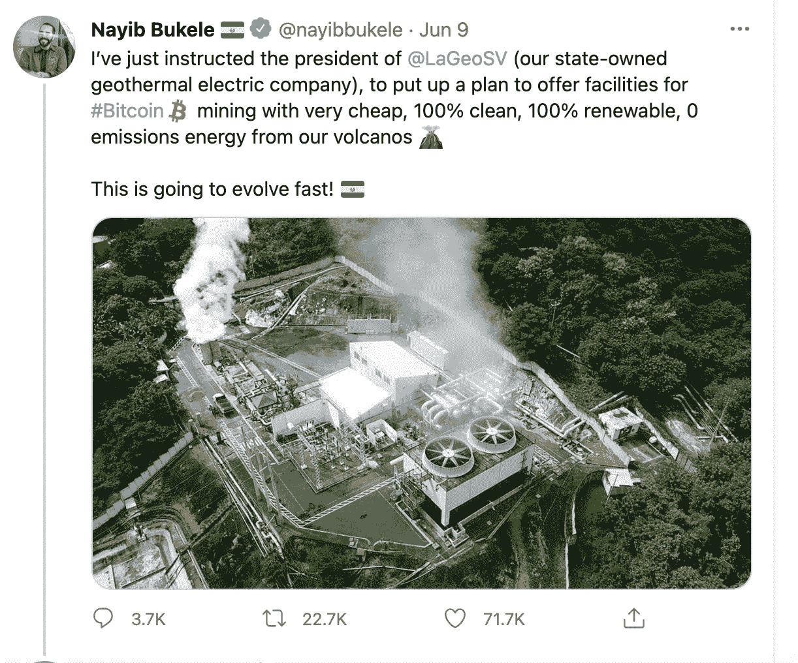

# 火山和不稳定的比特币提供了改变经济的潜力

> 原文：<https://medium.com/coinmonks/volcanoes-and-volatile-bitcoin-offer-the-potential-to-transform-economies-d7c2bfb84ddc?source=collection_archive---------8----------------------->

对于那些懂伦敦腔押韵俚语的人来说:“你会亚当吗？”(亚当和夏娃——相信)。如果萨尔瓦多通过立法将比特币视为法定货币还不够激进的话，该国总统纳伊布·布克勒(Nayib Bukele)现在已经指示国有地热电力公司研究开采比特币。

Source: Twitter