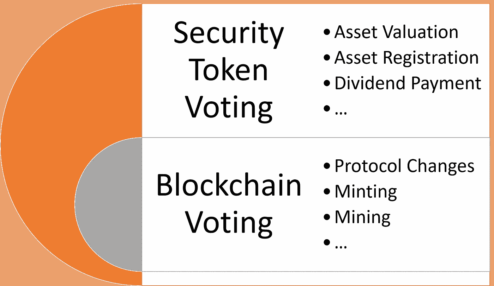
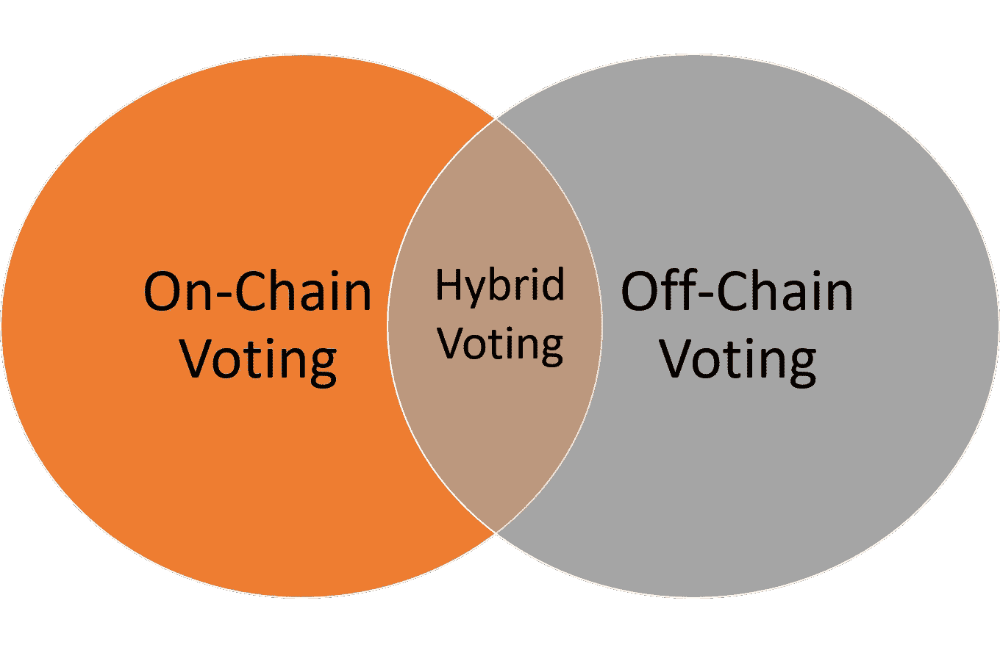

# 安全令牌中的投票和治理

> 原文：<https://medium.com/coinmonks/voting-and-governance-in-security-tokens-1e3d041dabb8?source=collection_archive---------6----------------------->

安全令牌正在成为加密货币市场中最重要的部分之一，当然也是最有趣的部分之一。在现阶段，安全代币之所以如此引人入胜，是因为我们只是在构建能够成为新金融基础设施的第一块基石。安全令牌社区谦虚地承认，没有人知道所有的答案，我们只是在不断地解决问题。从流动性到监管问题，再到交易所的第一个模型，安全令牌生态系统的许多方面都需要解决，以允许这种新型加密资产的主流采用。在这些因素中，投票和治理将在下一代安全令牌中发挥重要作用。

投票和治理在区块链协议中已经非常重要，那么是什么让这些元素在安全令牌空间中如此重要呢？好吧，虽然区块链协议的投票和治理被限制在诸如采矿、铸造或在极端情况下协议变更等方面；安全令牌的整个生命周期似乎是围绕投票决策发展的。从资产注册到流动性模型，安全令牌总是容易受到投票和治理决策的影响。尽管有其相关性，但我认为关于安全令牌的投票和治理模型的工作仍处于非常初级的阶段。从市场上的主要平台来看，似乎只有[证券化](https://www.securitize.io/)作为[他们的协议](https://www.securitize.io/uploads/whitepapers/DS-Protocolv1.0.pdf)的一等公民参与投票(至少从我目前看到的情况来看)。

# 离线和在线投票

可以说，使投票和治理在安全令牌领域如此具有挑战性的是 toke 生命周期的重要部分发生在链外的事实。从对资产进行令牌化的法律流程到涉及股息支付的决策或验证令牌价值的审计流程，安全令牌会受到许多要求达成共识和投票的链外流程的影响。从这个角度来看，任何可行的安全令牌治理模型都应该考虑链内和链外投票。

# 链上投票

就像传统的加密资产一样，安全令牌面临许多需要网络参与者达成共识的情况。为了解决这些情况，安全令牌协议应该包括链上投票机制，以便不同的节点提交和处理投票。[证券化白皮书](https://www.securitize.io/uploads/whitepapers/DS-Protocolv1.0.pdf)提出了这些投票机制如何工作的方法。

## 在线投票场景:红利分配

让我们以一个安全令牌为例，它代表了一组类似于房地产交易所交易基金(ETF)的房地产租赁。代表令牌的智能合同保证了基于基础资产产生的现金流的季度分红。在这种情况下，在每个季度结束时，审计员将评估不同租约的利润和风险，确定适当的分红，并提交提案供不同的令牌持有人投票。

# 链外投票

作为对链上投票机制的补充，安全令牌协议还应该考虑许多需要在链外世界建立法律和监管程序的情况。为了维持一个真正分散的模型，安全令牌应该促进不同方之间的链外共识，然后可以转化为链上行动。

## 链外投票场景:资产评估

让我们以代表不动产租赁清单的安全令牌为例。这些资产的令牌化过程需要合法方来验证合同，还需要专家来评估令牌的潜在价值和相应的风险。安全令牌的评估需要考虑不同的因素，如租赁期限、现金流、付款或违约风险等。在完成尽职调查后，不同的当事人可以提交他们的调查结果并同意资产的估价。将来，许多这些过程将在链上进行，但是安全令牌协议的当前阶段需要考虑链外投票和共识。

# 安全令牌投票中的博弈论攻击

就像传统的区块链一样，安全令牌投票机制容易受到不同类型的攻击。哪些经典的区块链攻击(如 51%控制权)在安全令牌领域并不那么重要，而链外方的参与打开了我们以前从未见过的新漏洞之门。

## 令牌突袭攻击

令牌 raid 攻击描述了一个场景，其中一个大的令牌持有人可以通过操纵其他令牌持有人故意压低安全令牌的价格。让我们以分红的安全令牌为例；在收到分红提议后，大的令牌持有者可以向其他令牌持有者表明他打算投反对票并阻止任何分红。这一行动压低了令牌的价格，激励许多令牌持有者将他们的头寸出售给更大的令牌持有者。

## 内幕攻击

安全令牌模型非常容易受到不对称信息攻击，例如公开市场上的内幕交易。让我们以一个代表私人公司股票的代币为例。代币持有者可以通过许多方式获得关于公司状态、新产品发布或资金筹集等的非实质性公开信息，这些信息可以被用作操纵目标安全代币价格的优势。类似地，竞争对手可以过滤关于令牌化公司的假坏消息，导致证券令牌的价格下跌，影响投资者和令牌持有者。

## 阻挡攻击

假设一家公司基于其资产推出了一个安全令牌。竞争者使用第三方工具购买足够的代币来影响投票决定。之后，竞争对手决定阻止或推迟任何投票提案，因此该令牌慢慢贬值，投资者感到沮丧。当这种情况发生时，竞争对手为他的企业推出了类似的证券代币，并试图影响沮丧的代币持有者抛售他们的头寸，买入他的产品。