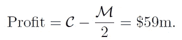
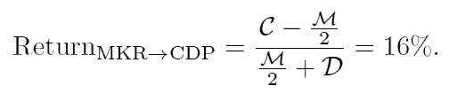
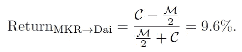
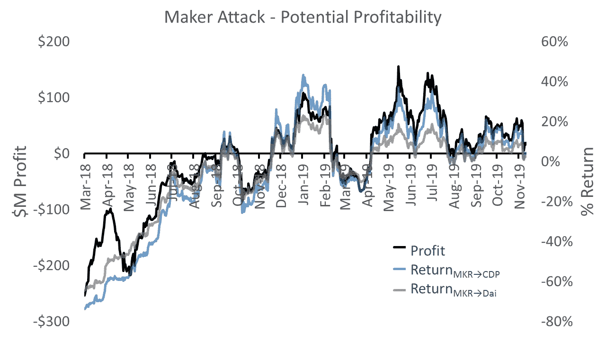
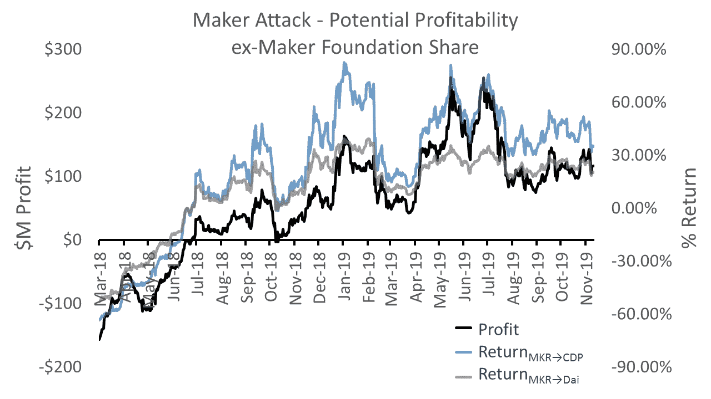

# Maker 中的漏洞:Oracle 治理攻击、攻击 DAOs 和(去)集中化

> 原文：<https://medium.com/coinmonks/vulnerabilities-in-maker-oracle-governance-attacks-attack-daos-and-de-centralization-d943685adc2f?source=collection_archive---------2----------------------->

制造商 stablecoin Dai 的安全性依赖于可信神谕来提供定价信息。这些是通过链上治理选择的。因此，MKR 令牌持有者可以操纵 oracle 提要。在本文中，我讨论了与 51%攻击风格类似的对制造商的攻击，尽管不一定需要 51%的 MKR，在这种攻击中，联盟可以有利地操纵治理来“窃取”系统抵押品。这些攻击会影响当前的单并行 Dai (SCD 或“Sai”)和即将到来的多并行 Dai (MCD)实施，以及具有链上治理的类似系统。

这些攻击的后果是，在当前和历史的市场价格下，“完全分散”的戴是不安全的激励错位。这里的“完全分散”要求 MKR 足够分散，以达到分散的目的。目前的创客体系是半中央集权的，大多数 MKR 据说由少数创客个人和创客基金会持有。这表明市场可能会低估 MKR 的价值，因为它没有充分分散，因此戴的安全性依赖于与创客基金会的信任关系以及在受到攻击时诉诸法律的可能性。要么是市场没有意识到 MKR 治理受到攻击的可能性应该导致定价下限，要么是市场在说，如果 MKR 完全分权的话，它的价值会更高。

这些攻击还表明了 Dai 的严重扩展问题:为了维护安全，MKR 价值的增长速度需要大大快于 Dai 和附属供应。戴和 CDP 的持有者需要抬高这些价格来保证他们的安全。本质上，稳定资产持有者需要在高风险资产中持有大量头寸，以确保他们的稳定头寸，这可能会违背稳定货币的目的。

# 一.创客治理:神谕和全球结算

制作器系统由 MKR 令牌持有者管理，他们在链上投票以决定系统参数和过程。他们被委以三项与 oracle 安全相关的重要任务。

首先，MKR 持有者占据了创造者的可信神谕名单。做市商系统依靠这些可信的神谕来提供真实世界的价格数据，这些数据用于确定抵押债务头寸(CDP)清算的阈值。

第二，MKR 持有者影响了针对甲骨文操纵的保护措施。做市商系统内置了给定时间内的最大 oracle 价格变化(“价格反馈敏感度参数”)和新 oracle 价格生效的每小时延迟。MKR 持有者直接决定价格反馈敏感度参数。

第三，MKR 持有者决定了可以触发全球结算的“全球定居者”的集合，因此他们可以有效地控制全球结算。在全球结算中，做市商系统被冻结，参与者(Dai 和 CDP 持有人)能够根据最后的 oracle 价格收回其抵押品部分。

假设诚实的 MKR 治理，甲骨文操纵可能得到合理控制。小时价格延迟为紧急先知(由 MKR 持有者预先确定)提供了对攻击做出反应的时间。制造商价格馈送采用甲骨文价格的中间值，因此大多数甲骨文(包括紧急甲骨文)将不得不串通。最大 oracle 价格变化限制了攻击的即时严重性。此外，如果所有其他方法都失败了，价格延迟为全球定居者(由 MKR 持有者预先确定)提供了触发全球结算的时间。

# 二。Maker 中的 Oracle 治理攻击

对于不诚实的 MKR 持有者，两种重要的攻击成为可能:

*   **MKR→CDP 退出攻击:** MKR 持有者可以持有大量 CDP，合谋选择传递 ETH 价格的神谕 **→** ∞，然后引发全球结算。
*   **→戴退出攻击:**持有者可以大量持有戴，合谋选择传递 ETH 价格的神谕 **→** 0，进而引发全球结算。

在这两种情况下，通过(分别)持有 CDP 或 Dai，不诚实的持有者将获得抵押品价值。CDP 或 Dai 的盈利金额将取决于促进攻击所需的在 MKR 的价值(更多信息请见下文)。

请注意，Maker 内置的 oracle 保护不能防止这些攻击。不诚实的 MKR 持有者可以在攻击前合谋设定更高的最大小时价格变化。通过 oracles，他们可以计算几个小时内的最大价格变化。这给了其他参与者(如戴和 CDP 持有人)反应的时间。让我们来看看戴市场会发生什么:

在 MKR→CDP 退出攻击中，当 Dai 持有人意识到操纵攻击时，他们对长期 Dai 价格的期望趋于零。Dai 市场变成了大甩卖，因为所有 Dai 持有者都试图交易其他资产。这导致戴价格下跌，但并不阻止不诚实的 MKR 持有者继续操纵甲骨文，并在随后触发全球结算，实现他们的收益。

在→戴退出攻击中，当 CDP 持有人意识到操纵攻击时，他们对自己在全球结算中所占抵押品价值份额的预期为零。他们急于打开他们的抵押品。MKR 持有者设定更高的超额抵押门槛，可以部分阻止这种情况。为了解锁抵押品，CDP 持有者争相回购戴。然而，Dai 持有者现在期望他们的 Dai 值更多。考虑到额外的抵押品价值，Dai 的市场价格会上涨，此时 CDP 持有者已经亏损了。不诚实的 MKR 持有者可以再次继续操纵甲骨文，然后触发全球结算，实现他们的收益。

为了确保攻击成功，串通的 MKR 持有者需要控制 50%以上的 MKR 代币。然而，用更少的钱，攻击也可能成功。例如，选民参与率通常很低，网络可能会堵塞，诚实的参与者几乎没有机会做出反应，不诚实的 MKR 持有者可能会与矿商勾结，审查投票和 CDP 担保交易。另一个增加的复杂性是，当关闭 CDP 时，MKR 被烧了。因此， **→** 戴退出攻击中的攻击者似乎可以用的 50%来攻击甲骨文，一旦 CDP 持有人开始关闭 CDP，实际上就获得了全部的 50%。

# 三。在目前的价格下，创客治理是脆弱的

这些攻击的潜在回报是锁定在 Maker 中的抵押品的总价值。这些攻击的成本可能是 MKR 供应量的 50%。如果这种回报大于成本，那么对追求利润的 MKR 持有者来说，就有一种不正当的激励，在这种激励下，大多数 MKR 持有者可能会合谋进行攻击。

截至 2019 年 11 月 5 日，这些价值为抵押品价值*C*= 3.36 亿美元，*M*= 5.55 亿美元，戴市值*D*= 9600 万美元。这产生了潜在的攻击利润

在 MKR→CDP 退场攻击下，这代表了联合联军的回归

在→戴的退场攻击下，这代表着联合联军的回归

随着过去几天 MKR 价格的上涨，这一攻击盈利能力指标已降至 1900 万美元。这仍然很可观，特别是考虑到盈利能力仅来自当前的 SCD 系统，该系统的市值较小，而 MKR 的价格前景源于即将推出的 MCD 系统，该系统预计将实现更大的规模。图 1 追踪了这些盈利能力测量的全部历史。在很长一段时间里，这些攻击的利润要高得多。

Figure 1: Potential profitability of a MKR oracle attack historically.

## 实际盈利能力可能要高得多

请注意，*实际盈利能力*可能会因为一些原因而显著提高。首先，据报道持有 MKR 30%股份的创客基金会已经承诺不参与治理投票(见[这里](https://community-development.makerdao.com/governance/governance#is-there-more-than-one-type-of-vote))。如果他们坚持这一点，或者在某个时候取消他们在智能合同中的投票权，那么 MKR 给予联盟的控股权就会少得多，从而大大降低攻击成本。图 2 显示了这种情况下盈利能力的显著提高。其次，少数 MKR 持有者和主要矿商可能会合谋实施袭击。第三，这种攻击可以结合起来，利用其他系统来利用制造者的神谕。

Figure 2: Potential profitability of a MKR oracle attack historically with Maker Foundation shares restricted from voting.

## 其他复杂因素

有几个复杂的因素会影响分析。如果攻击者需要获得 MKR，他们将需要购买或借用它。虽然借入 MKR 的利率可能很低(9 月份 30 万美元的非常小的资金池的 Nuo 利率为 2.6%)，但如果许多 MKR 持有者是诚实的长期持有者，大型收购将产生市场挤压效应，可能会很困难。同样，如果攻击者需要获得大量 Dai 或 CDP，考虑到市场力量，这可能会很困难。成功的收购可能会持续很长一段时间。同样，执行攻击步骤的天然气成本也会影响盈利能力。

## 与安“攻刀”相勾结

尽管如此，实际上，我们不知道谁拥有、戴和 CDPs 的联合股份，许多代理人可能相互勾结。我们不能排除某个联盟控制着使这次袭击有利可图的混合资产。如果存在这样一个联盟，那么这个联盟就有不正当的动机参与这次袭击。为了确保足够多的共谋很好地协调，可以创建一个“攻击道”,将所需的资产组合在一起，并触发攻击步骤来获利。

# 四。对 MKR 定价的影响

MKR 价值来自两个因素:(1)常规现金流的(贴现)价值，和(2)来自治理操纵的条件现金流价值。定期现金流来自用于燃烧 MKR 的制造商费用(“稳定费”)——这定期减少供应，类似于公司股票回购计划。与常规现金流相关的 MKR 值与围绕 Dai 增长的预期相关，因为更大的 Dai 系统会导致更多费用。治理操纵条件现金流代表了 MKR 精心策划的攻击的潜在盈利能力，例如上面描述的 51%攻击。这是 MKR 持有者套现的一种“替代”方式。

为了防止治理操纵，MKR 市值必须大于 2 倍总抵押品价值(*如果我们考虑到上面提到的更复杂的攻击和创客基金会的无投票权承诺，可能会高得多*)。可以说，分散的 Dai 中的 MKR 价格应该通过市场力量达到这些水平，否则攻击对某些联盟来说就代表了类似套利的机会(尽管这并不完全清楚，如下一节所讨论的)。

## 半集权化的影响

正如引言中所提到的，创客体系目前是半中央集权的:大多数 MKR 被创客基金会和少数创客个人持有。在这种情况下，治理攻击实际上必须由 Maker 自己来执行。在这种攻击中，他们是可以被识别的，因此可能承担法律责任。在这种情况下，较低的 MKR 价格可能是合理的，因为潜在的法律责任抵消了为快速获利而进行攻击的任何动机。但这将信任链接到了创客基金会。

因为上面概述的攻击在今天可能是有利可图的，要么市场没有意识到 MKR 治理攻击的潜在可能会导致安全定价的下限，要么市场可能会因为不够分散而对*MKR*打折扣。换句话说，如果 MKR 的分布更加分散，它的价值会更高。

## 现金流能保护系统吗？

出于上述原因，我们可以认为，MKR 今天的价格代表了通过 CDP 操作购买和焚烧 MKR 的定期现金流的预期(这本质上类似于股票回购)。这为设计这样的安全系统提供了有价值的数据。重要的是，这说明，在大多数情况下，这些现金流*不足以*保护制造商。

事实上，如果制造商*被*充分分散，来自股票回购的定期现金流可能对治理安全不太必要，因为我们可能期望理性代理人将 MKR 价格抬高到攻击价值。从安全角度来看，股票回购只是将 MKR 价格略微推高至攻击价值之上所必需的。因此，因为 Maker 是半中央集权的，所以对用户征收有效的税来支持 MKR 价格，而收费收入可以更好地支持长期稳定。

## 缩放问题

这些攻击表明 Dai 存在严重的规模问题:为了保持安全性，MKR 价值的增长速度必须大大快于 Dai 供应和锁定抵押品的增长速度。为了确保资金安全，戴和 CDP 的持有者可能需要抬高的价格。因此，稳定的资产持有人需要持有高风险资产的大量头寸，以确保他们的稳定头寸，这可能会违背稳定货币的目的。

# 动词 （verb 的缩写）来解决这些问题

上述攻击和问题发生在一个更广泛的背景下:stablecoin、CDP 和 MKR 持有者(也可能是矿工)之间的游戏，他们从战略上决定他们持有的资产组合。对这个游戏建模可以帮助我们理解不同玩家为了保护系统需要持有的资产(例如，多少 MKR)。特别是，球员不能冒太大的风险，MKR 被拥有适当资产组合的人拥有，以进行有利可图的攻击。

在这种情况下，有几点值得探讨。它可以帮助我们理解需要如何分发令牌来保护系统。如果风险资产的持有量需要很高，那么对于许多玩家来说，参与游戏可能是不值得的(例如，稳定币持有者，如果他们必须持有 MKR 以保护系统)。在哪些环境中，玩家为了保护系统而抬高治理价格是值得的？除了对资产进行安全定价，还有其他均衡吗？所有相关代币波动的后果是什么？

就最后一点而言，MKR 价格源于与抵押品相关的“创造”价值，其价值是抵押品价值的数倍。MKR 价值反映了戴稳定货币的不确定性。在系统崩溃中(例如，由于攻击)，系统的总价值崩溃为附带价值，使许多人一无所有。MKR*打算*吸收这一点，并在这一事件中变得一文不值，对 stablecoin 和 CDP 持有者负有抵押品结算义务。然而，通过上述攻击的延伸，stablecoin 和 CDP 头寸也有这种风险。如果 MKR 价格低于安全水平，那么各种 MKR、稳定币和 CDP 头寸可以在结算中从它们的价值中扣除。这些风险应该考虑到这些资产的波动性。

不管是有意还是无意，Maker 对这些问题的解决方案一直是集中治理所有权，并在 Maker 上放置一个信任链接(尽管除非面临严重威胁，否则不一定会调用它)。这不一定是个问题——许多传统系统都是这样运行的。但是，我们应该公开理解，这种信任线是存在的。值得注意的是，攻击仍可能与矿工勾结进行。

根据在敌无双与 Maker 团队的对话，他们讨论了如何设置调用全球结算的正确阈值，例如，设置为 MKR 的 10%。然而，还不清楚这是否解决了这里讨论的激励问题。一点是，不清楚在袭击早期呼吁全球和解是诚实的 10% MKR 联盟的最佳对策。这是因为在基于攻击的解决方案中，他们的价值仍然会受到很大的打击(可能到 0)。不诚实的 10%联盟也可能有其他滥用结算的行为。理解激励因素就要回到理解 MKR、CDP 和稳定币持有者之间的博弈。通过这种不同的设置，潜在的结果可能是攻击方向 10%的 MKR 联盟行贿，或者在其他党派之间行贿。

以分散的方式解决这些问题仍然是一个悬而未决的问题，因此按照本节的讨论进行严格的机制设计工作是很重要的。

