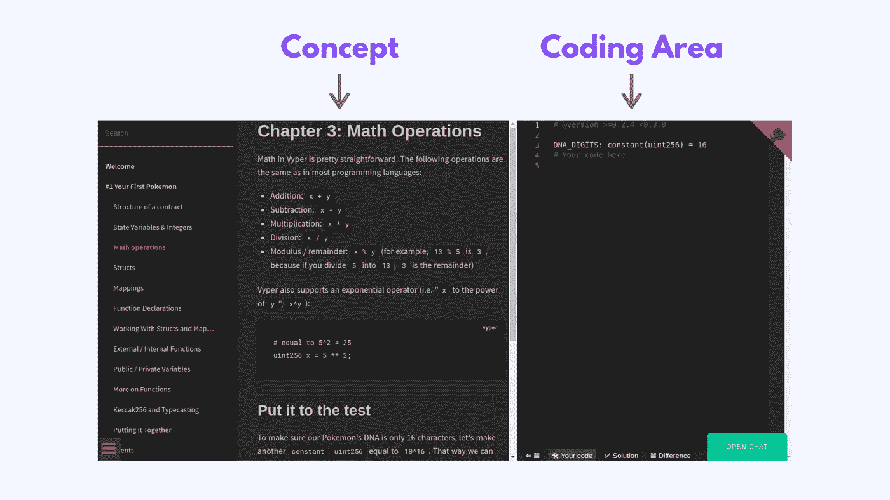
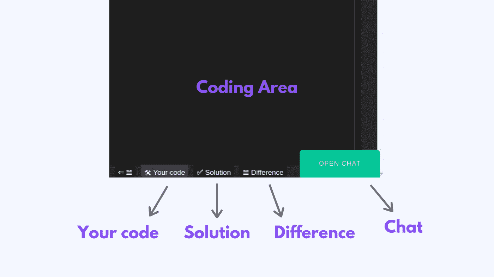

# Vyper.fun:通过构建一个口袋妖怪游戏来学习 Vyper。

> 原文：<https://medium.com/coinmonks/vyper-fun-learn-vyper-by-building-a-pokemon-game-7b8c981c9b42?source=collection_archive---------1----------------------->

## 【Vyper 的 crypto zombies+ether naut

上个月，我开始探索 DeFi。

在我的 twitter feed 中有很多大惊小怪的事情，所以我想看看引擎盖下发生了什么。

在检查不同的 DeFi 项目时，我遇到了 [Vyper](https://vyper.readthedocs.io/en/stable/) ，一种相对较新的智能合同语言。我以前听说过它，但从未用过。

我看了一下，对它的安全第一的原则印象深刻。我想了解更多，所以我搜索文章，视频。但是大部分都过时了。

没有可用的好资源…除了文档。但是，说实话，那是你最不想学习的地方。

我想起了我从[隐型僵尸](https://cryptozombies.io/)和[以太人](https://ethernaut.openzeppelin.com/)开始学习[坚固性](https://solidity.readthedocs.io/en/v0.7.1/)的时候。对维普来说，这是前所未有的。

所以我们开始建造一个。

Vyper.fun 是一个任何人都可以学习 Vyper 的网站，即使这是他们的第一语言。

 [## Vyper.fun

### 通过构建口袋妖怪游戏来学习 Vyper。研究合同的结构，类型，变量和常数，报表…

vyper.fun](https://vyper.fun/?ref=medium) 

为了让学习体验变得有趣，**你将在区块链上从头开始构建一个口袋妖怪游戏**。口袋妖怪训练者与野生口袋妖怪战斗以击败并捕获它们的游戏。

在每一章中，你都会学到一个概念。您将使用这些概念在**内置代码编辑器**中构建游戏。

您可以在 **🛠您的代码**选项卡中编写您的代码，并在 **✅解决方案**选项卡中查看解决方案。您可以在 **𝌡差异**选项卡中查看 **🛠您的代码**和 **✅解决方案**之间的差异。

如果您有任何疑问或对如何改进网站有任何建议，您可以在网站内打开聊天，无需离开网站🤯

由于我们仍在努力建设网站，您可以通过许多方式为这个令人惊叹的项目做出贡献:

1.  在 Gitter [chat](https://gitter.im/vyper-fun/lobby) 上告诉我们任何问题/建议。
2.  您还可以在 [Github repo](https://github.com/vyperfun/vyper.fun) 上添加问题。
3.  你可以把这些章节翻译成其他语言。如果你有兴趣，请在[聊天](https://gitter.im/vyper-fun/lobby)中告诉我们。
4.  你可以通过捐助我们的[数字硬币补助金](https://gitcoin.co/grants/1122/vyperfun)来支持我们。

你可以在我们的 [Gitter 频道](https://gitter.im/vyper-fun/lobby)和 [twitter](https://twitter.com/VyperFun) 上关注我们的更新。

## 另外，阅读

*   最好的[加密交易机器人](/coinmonks/crypto-trading-bot-c2ffce8acb2a)
*   [密码本交易平台](/coinmonks/top-10-crypto-copy-trading-platforms-for-beginners-d0c37c7d698c)
*   最好的[加密税务软件](/coinmonks/best-crypto-tax-tool-for-my-money-72d4b430816b)
*   [最佳加密交易平台](/coinmonks/the-best-crypto-trading-platforms-in-2020-the-definitive-guide-updated-c72f8b874555)
*   最佳[加密贷款平台](/coinmonks/top-5-crypto-lending-platforms-in-2020-that-you-need-to-know-a1b675cec3fa)
*   [最佳区块链分析工具](https://bitquery.io/blog/best-blockchain-analysis-tools-and-software)
*   [加密套利](/coinmonks/crypto-arbitrage-guide-how-to-make-money-as-a-beginner-62bfe5c868f6)指南:新手如何赚钱
*   最佳[加密制图工具](/coinmonks/what-are-the-best-charting-platforms-for-cryptocurrency-trading-85aade584d80)
*   [莱杰 vs 特雷佐](/coinmonks/ledger-vs-trezor-best-hardware-wallet-to-secure-cryptocurrency-22c7a3fd391e)
*   了解比特币的[最佳书籍有哪些？](/coinmonks/what-are-the-best-books-to-learn-bitcoin-409aeb9aff4b)
*   [3 商业评论](/coinmonks/3commas-review-an-excellent-crypto-trading-bot-2020-1313a58bec92)
*   [AAX 交易所评论](/coinmonks/aax-exchange-review-2021-67c5ea09330c) |推荐代码、交易费用、利弊
*   [Deribit 审查](/coinmonks/deribit-review-options-fees-apis-and-testnet-2ca16c4bbdb2) |选项、费用、API 和 Testnet
*   [FTX 密码交易所评论](/coinmonks/ftx-crypto-exchange-review-53664ac1198f)
*   [n 零审核](/coinmonks/ngrave-zero-review-c465cf8307fc)
*   [逐位交换审查](/coinmonks/bybit-exchange-review-dbd570019b71)
*   [3Commas vs Cryptohopper](/coinmonks/cryptohopper-vs-3commas-vs-shrimpy-a2c16095b8fe)
*   最好的比特币[硬件钱包](/coinmonks/the-best-cryptocurrency-hardware-wallets-of-2020-e28b1c124069?source=friends_link&sk=324dd9ff8556ab578d71e7ad7658ad7c)
*   最佳 [monero 钱包](https://blog.coincodecap.com/best-monero-wallets)
*   [莱杰 nano s vs x](https://blog.coincodecap.com/ledger-nano-s-vs-x)
*   [bits gap vs 3 commas vs quad ency](https://blog.coincodecap.com/bitsgap-3commas-quadency)
*   [莱杰纳米 S vs 特雷佐 one vs 特雷佐 T vs 莱杰纳米 X](https://blog.coincodecap.com/ledger-nano-s-vs-trezor-one-ledger-nano-x-trezor-t)
*   [block fi vs Celsius](/coinmonks/blockfi-vs-celsius-vs-hodlnaut-8a1cc8c26630)vs Hodlnaut
*   [bits gap review](/coinmonks/bitsgap-review-a-crypto-trading-bot-that-makes-easy-money-a5d88a336df2)——一个轻松赚钱的加密交易机器人
*   为专业人士设计的加密交易机器人
*   [PrimeXBT 审查](/coinmonks/primexbt-review-88e0815be858) |杠杆交易、费用和交易
*   [埃利帕尔泰坦评论](/coinmonks/ellipal-titan-review-85e9071dd029)
*   [赛克斯石评论](https://blog.coincodecap.com/secux-stone-hardware-wallet-review)
*   [BlockFi 评论](/coinmonks/blockfi-review-53096053c097) |赚取高达 8.6%的加密利息