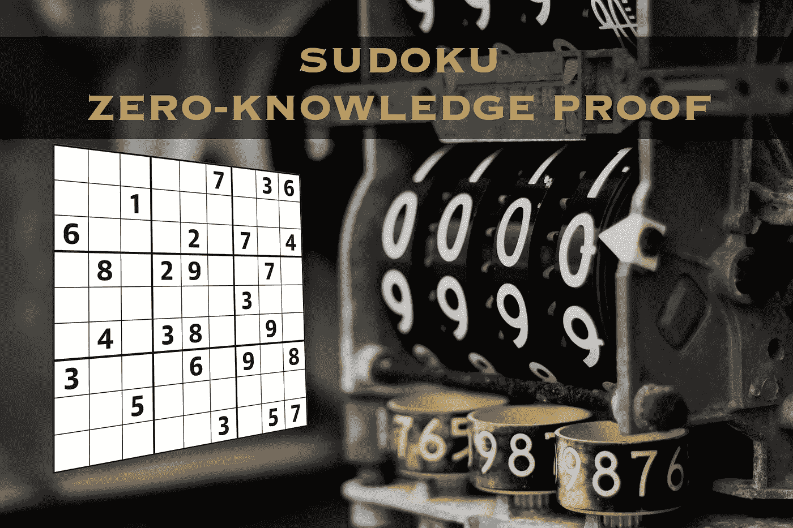

# 数独游戏的交互式零知识证明演练

> 原文：<https://medium.com/coinmonks/walkthrough-of-an-interactive-zero-knowledge-proof-for-sudoku-puzzle-ac563588f1a8?source=collection_archive---------2----------------------->

## 🔏了解如何用零知识证明拥有数独解决方案，并使用纯 Python 构建 PoC。

Original Photo by [Logan Kirschner](https://www.pexels.com/@logankir?utm_content=attributionCopyText&utm_medium=referral&utm_source=pexels) from [Pexels](https://www.pexels.com/photo/meter-at-0000-1364700/?utm_content=attributionCopyText&utm_medium=referral&utm_source=pexels)

# 📖介绍

毫无疑问，我们目前生活在一个数据驱动的社会，事实上，数据已经成为一种更有价值的资源…