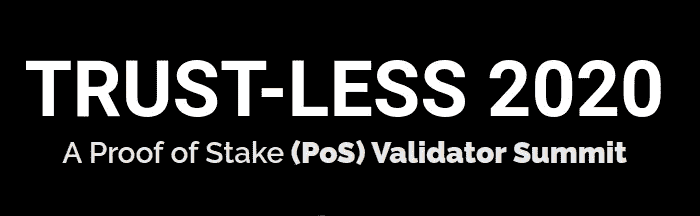

# 想建立一个赌注服务创业？

> 原文：<https://medium.com/coinmonks/wanna-build-a-staking-service-startup-18bc67cf4a35?source=collection_archive---------3----------------------->

## 了解利害关系证明、定位、验证器和定位服务

嘿伙计们，

如你所知，许多区块链网络使用利害关系证明作为共识算法。这意味着人们可以通过下注他们的硬币来获得回报。于是很多新的 [***跑马圈地服务***](https://coincodecap.com/category/staking) 提供商冒了出来。但这个空间正在增长，有大量的机会，市场是巨大的，所以这是建立一个赌注服务创业公司的理想时机。

会议议程很有教育意义，我建议你们报名参加。

## [报名参加跑马圈地大会](https://trust-less-2020.dystopialabs.com/)

如果您想了解更多关于股权证明、标桩、验证和标桩服务的信息，请查看我们的策展 [***此处***](https://medium.com/coinmonks/crypto-staking/home) ***。***