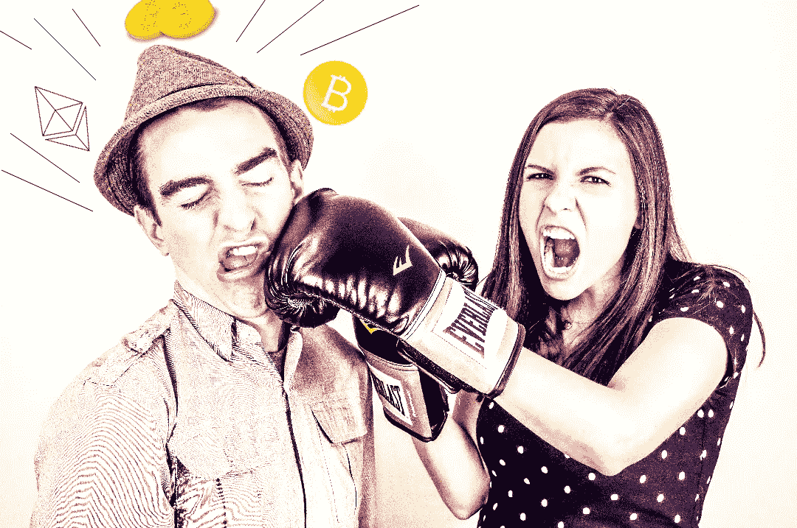

# 想要更好的加密回报？像女孩一样投资

> 原文：<https://medium.com/coinmonks/want-better-crypto-returns-invest-like-a-girl-d48b3a9aa261?source=collection_archive---------8----------------------->

> 与其知道那么多不真实的事情，不如不知道那么多——亚伯拉罕·林肯

## ***女生 vs 男生***

男人和女人谁是更好的司机？更好的飞行员？更好做饭？家庭主妇？这些问题可能有一个答案，尽管考虑到话语的状态，这个答案可能会引发一场争论。然而，谁是更好的投资者呢？事实证明男人可以从女人身上学到一些东西。

我在攻读金融法律硕士时，偶然发现了这篇[研究论文](https://academic.oup.com/qje/article-abstract/116/1/261/1939000?redirectedFrom=fulltext)。这份报纸现在有点旧了(它是 2001 年出版的)，所以 crypto 还没有出现。尽管如此，虽然本文的重点是围绕普通股票交易，我认为其中的经验教训也适用于加密领域。

> 事实证明男人可以从女人身上学到一些东西

这些研究人员测试的核心思想是过度自信对投资者行为的影响。他们衡量了六年期间的交易和投资结果。他们将这些结果按性别分类，然后[发现](https://academic.oup.com/qje/article-abstract/116/1/261/1939000?redirectedFrom=fulltext):

> …男性的交易量比女性多 45%。交易使男性的净回报率每年减少 2.65 个百分点，而女性则减少 1.72 个百分点。

一言以蔽之，男人交易的多，男人也因此损失的多。为什么？因为他们往往比女性更过于自信，尤其是在财务方面。

奇怪的是，过度自信最有可能发生在最不可能发生的情况下。股票和密码市场是一个完美的例子。总体而言，金融市场几乎不可能预测。反馈极其嘈杂，信息不对称，非理性无孔不入。换句话说，市场就像天气系统……它们天生就是混乱的。

## ***但是，我有一个简单易行的战胜市场的方法……***

不可避免地，某个地方会有一个交易者会生气。而且，我肯定他们会很乐意告诉我他们的超级核，狡猾的超级天才，不可能失败的交易策略，仅在上周他们就赚了数百万美元。也许他们会…但是，我不会打赌。

> 过度自信最有可能发生在最不可能发生的情况下

人们有权表达自己的观点，但无权陈述自己的事实。谈到金融，有些“事实”比另一些更好。在我看来，我只是跟着研究走。而且，研究非常清楚……交易策略往往不如买入并持有策略。同样，交易策略(包括管理基金)的表现往往不如大盘。

当然，交易者可以成功，也确实成功了，但这只是短期现象。简单地说，在足够长的时间范围内，一切都将回归均值。有时你可以战胜市场，但那几乎总是会被你做不到的时候所反击。一些交易者运气好，跑赢了市场一段时间，但是迟早，一次糟糕的交易(或者十次，或者一百次)会让他们的表现下降。

## ***女人在哪些方面比男人强？***

他们交易的不多。就是这样。另一方面，男性倾向于:

> 过度交易会降低他们的预期效用；他们持有不切实际的信念，认为他们的回报会有多高，以及这些回报能被精确地估计出来；他们在投资信息上花费了太多的资源(例如时间和金钱)( [Odean 1998](https://papers.ssrn.com/sol3/papers.cfm?abstract_id=94141) )

如果你是一个正在阅读这篇文章的人，并且认为‘是的，好吧，我是*不同的*’，我会建议你重新考虑你的立场。我们都无法避免过度自信、[生存偏差](https://www.jstor.org/stable/2962224)和/或[控制错觉](https://www.ncbi.nlm.nih.gov/pmc/articles/PMC4013923/)。然而，我们的目标是从投资加密中获得最大的潜在回报。为此，我认为重要的是我们要尽一切努力将非理性和偏见对我们投资决策的影响降至最低。

我认为秘密市场的本质加剧了过度自信和偏见的问题。与已经存在了一个多世纪的股票市场不同，加密领域仍处于起步阶段。现在，人们疯狂地奔向公用事业，但是还没有人真正到达那里。有一大堆承诺，也有一大堆关于什么是有希望的观点。所有这些都只是猜测，我们不知道标准会是什么，直到它成为标准，而不是更早一秒。

十年后，我想我们会对什么可行什么不可行有一个很好的认识。在那之前，谁也说不准。与此同时，这种信息真空为过度自信和偏见打开了大门。股票市场和外汇市场上到处都是失败的交易计划。密码市场也不例外。获胜者谈论他们的成功——很多。失败者不会。问题是，在交易中，输家总是比赢家多。

> 秘密市场的性质大大加剧了过度自信和偏见的问题

## ***像个姑娘。不要交易。***

说实话，交易是*的乐趣*。阅读蜡烛图，试图预测市场走势，只是修补比把你的玩具放在架子上欣赏有趣得多。交易可以[上瘾](https://www.ncbi.nlm.nih.gov/pmc/articles/PMC5422017/)。与[猎奇行为](https://www.jstor.org/stable/20487979)相关，也与[犯罪行为](https://link.springer.com/chapter/10.1007/978-1-4615-0943-1_3)强相关。如果你想知道为什么金融领域有如此多的欺诈，这里有一个线索。

归结起来，有两种主要的加密投资赚钱的方法。你要么 a)在短期内低买高卖；或者 b)低买高卖做多。研究很清楚，如果你试图在短时间内交易(例如日内交易)，你可能不会像那些在长时间内买入并持有的人赚那么多钱。差别可能很小，也可能很大。风向对你来说都取决于运气。

不过，加密空间是独一无二的。它让散户投资者有机会像风险投资家一样，几乎不受限制地投资早期初创企业。毫无疑问，初创企业投资存在巨大风险。即使一个项目在纸面上看起来是不可阻挡的，也有很多事情可以让它脱轨。法律变更、内部分歧、投资者撤资、竞争先发制人、供应链问题、不可预见的技术问题、失去租约、创始人遭遇车祸——实际上，阻碍实现好主意的事情数不胜数。

> 如果你试图在短时间内交易，你可能不会赚那么多钱

特斯拉在生产 Model 3 时几乎破产。很容易说埃隆·马斯克成功了，因为他在某种程度上是*特别的*。事实是，他很幸运。事实上，如果你听几乎所有的成功故事，有趣的部分并不是他们做对了什么。让他们活下来的幸运环境应该引起你的注意。

但是，如果你碰巧投资了一家公司，这家公司能够解决他们面临的所有不可预见的问题，*和*他们在这个过程中运气不错，那么你的投资可能会相当不错。你能做到的最简单的方法就是当它上升的时候，你要抓住它。当然，困难的部分是找到可以拿的东西。我打算在以后的文章中更深入地介绍我选择加密投资的过程。同时，如果你感兴趣的话，这里有一个[小入门](/coinmonks/crypto-risk-management-to-vc-or-not-to-vc-60dc3682a857)。

## ***Grrl 功率***

回到眼下的话题，研究人员发现了男性和女性在投资方面的哪些差异？基本上，女性倾向于根据可信的建议进行投资。他们往往只是偶尔检查一下投资，比如每半年或一年一次。当他们检查时，他们倾向于不改变任何东西，除非可信赖的顾问告诉他们应该这样做。

然后他们冲洗和重复，直到他们退休。当她们真的退休时，女性可以期望比她们的日间交易、商业新闻消费、股票市场跟踪男性同行每年高出 2%左右。现在，这些是对历史悠久且相对稳定的股票市场的参与者而言的结果。那些特殊的策略(还)不完全适用于加密。

> 女性有望在日交易、商业新闻消费、股市跟踪方面比男性高出 2%

当你坐以待毙的时候，没有秘密的共同基金或交易所交易基金可以注入资金。在某种程度上，你必须是一个积极的投资者。我只是建议你尽可能将这种活动保持在最低限度。这里有一些让你开始行动的建议:

1.  只投资你了解的项目
2.  只投资你相信的项目
3.  只投资在你的[风险承受范围内的项目](/coinmonks/crypto-risk-management-to-vc-or-not-to-vc-60dc3682a857)
4.  只投资你能承受损失的钱
5.  仅在达到绩效指标时销售

数字 5 是 *Grrl 力量*的人格化。坚持到你得到你想要的。例如，如果我以 1 美元购买一个代币，我的个人绩效指标告诉我，我将持有该资产，直到它上涨 400–500%。我不关心短期的价格变动。我检查我的资产，因为我喜欢它，但我从不涨跌交易。我只是坐着等。如果达到我的价位，我就获利。如果没有，我会一直坚持到项目结束或者达到指标。如果我特别看好一个项目，我可能会买一个 dip。否则，我在买入和持有之间什么都不做，直到项目找到我的卖出价格。

但是要舒适，这个策略需要首先解决前面的四个步骤。如果我对我投资的项目有深刻的理解，我真的相信他们在做什么，那我为什么不持有呢？这个项目已经在我的风险承受范围内，所以不用担心。我可以承受失去整个包，这不是很好，但我可能在更愚蠢的事情上花了更多的钱。我只是把玩具放在盒子里，放在架子上，直到它变得更值钱。

这需要耐心。这需要纪律。这需要谦逊。我脑子里藏着丰富的金融知识。我花了数千个小时[研究和撰写](https://papers.ssrn.com/sol3/cf_dev/AbsByAuth.cfm?per_id=2573368)关于货币和金融的文章。通过这一切，我学到的最重要的两件事是，我并不特别，我不能控制结果。说到底，我不知道是什么让女人不那么容易交易。但我知道我想变得更像他们。不管他们的理由是什么，这似乎是有效的。

> 加入 Coinmonks [电报频道](https://t.me/coincodecap)和 [Youtube 频道](https://www.youtube.com/c/coinmonks/videos)了解加密交易和投资

## 也阅读

 [## 杠杆代币[多头代币]终极指南

### 杠杆化令牌是具有杠杆化风险敞口的 ERC20 令牌，不考虑保证金、要求、管理…

medium.com](/coinmonks/leveraged-token-3f5257808b22)  [## 最佳加密交易所| 2021 年十大加密货币交易所

### 加密货币交易所的加密交易需要了解市场，这可以帮助你获得利润。之前…

blog.coincodecap.com](https://blog.coincodecap.com/crypto-exchange)  [## 2021 年最佳加密交换平台| CoinCodeCap

### 如果我们看看今天的场景，许多加密货币交换平台提供了广泛的功能和深度…

blog.coincodecap.com](https://blog.coincodecap.com/best-swap-platforms)  [## 2021 年最佳免费加密交易机器人

### 2021 年币安、比特币基地、库币和其他密码交易所的最佳密码交易机器人。四进制，位间隙…

medium.com](/coinmonks/crypto-trading-bot-c2ffce8acb2a)  [## BlockFi 评论 2021:利弊和利率| CoinCodeCap

### 今天，我们提出了一个全面的 BlockFi 评论，这是一个成立于 2017 年的加密贷款平台，拥有其…

blog.coincodecap.com](https://blog.coincodecap.com/blockfi-review)  [## 如何在印度购买比特币？2021 年购买比特币的 7 款最佳应用[手机版]

### 如何使用移动应用程序购买比特币印度

medium.com](/coinmonks/buy-bitcoin-in-india-feb50ddfef94)  [## 加密税务软件——五大最佳比特币税务计算器[2021]

### 不管你是刚接触加密还是已经在这个领域呆了一段时间，你都需要交税。

medium.com](/coinmonks/best-crypto-tax-tool-for-my-money-72d4b430816b)  [## 存储比特币的最佳加密硬件钱包[2021] | CoinCodeCap

### 保管您的数字资产很容易，但找到正确的存储方式却是一项繁琐的任务。在线钱包有一个风险…

blog.coincodecap.com](https://blog.coincodecap.com/best-hardware-wallet-bitcoin)  [## Pionex 评论 2021 |免费加密交易机器人和交换

### Pionex 是为交易自动化提供工具的后起之秀。Pionex 上提供了 9 个加密交易机器人…

medium.com](/coinmonks/pionex-review-exchange-with-crypto-trading-bot-1e459d0191ea)  [## 仙境提供了 83，412%的 APY 赌注:仙境是一个骗局吗？CoinCodeCap

### 仙境是雪崩网络的第一个基于时间令牌的分散储备货币协议。一篮子…

blog.coincodecap.com](https://blog.coincodecap.com/wonderland-offers-an-83412-apy-on-staking-is-wonderland-a-scam)  [## 天秤座货币——脸书的加密货币

### 自 2018 年马克·扎克伯格决定致力于改善区块链以来，关于天秤座货币的传言就一直存在…

blog.coincodecap.com](https://blog.coincodecap.com/libra-currency-a-cryptocurrency-by-facebook)