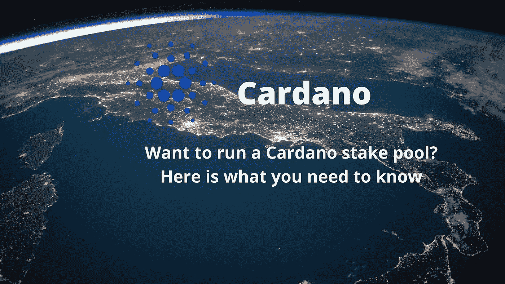
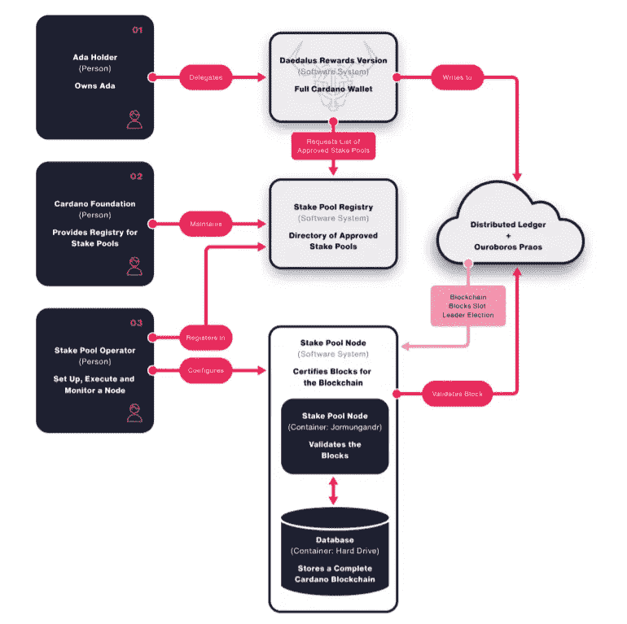
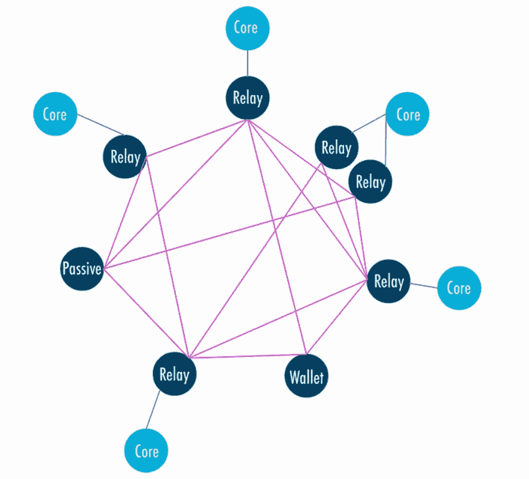

# 想开一个卡达诺赌注池吗？以下是你需要知道的

> 原文：<https://medium.com/coinmonks/want-to-run-a-cardano-stake-pool-here-is-what-you-need-to-know-a53a34314cb2?source=collection_archive---------0----------------------->

最近，我收到了一封朋友转发的邮件，询问我是否有兴趣经营/委托 Cardano 赌注池。因为我从未尝试过运行一个节点，也完全不知道需要检查的所有先决条件细节。所以，我想试一试，至少目前我准备好获取一些关于一切是如何发生的知识。在这里，我分享你需要什么，如果你想运行一个股份池。

**什么是赌注池？**

一个 staking pool 允许多个用户组合他们的资源并参与协议，而不用担心运行和验证节点。如果您想参与(委托)赌注池，那么您既不需要任何持续的互联网连接，也不需要一直监控代币值。stake pool 节点代表您完成所有这些工作。

赌注池是 Cardano PoS 协议的关键组成部分，代表池用户作为一个整体的组合赌注，并负责处理交易和产生新的区块。为了保持安全性和网络活动性，该协议要求足够数量的节点在线。作为回报，股权池经营者将获得激励。

**资金池经营者必备条件**

卡尔达诺股份池运营商必须具备以下条件:

关于初始环境设置的知识。

该节点需要始终处于活动状态，即 24*7*365。

应具备系统操作技能，即能够运行和维护 Cardano 节点。

关于服务器维护和操作活动的知识。

开发和运营经验(DevOps)将非常有用

熟悉 Prometheus 或 Grafana 的警报和监控功能，或您选择的其他监控框架。

**经营股份池的最低要求**

需要以下硬件要求:

4 GB 内存

24 GB 硬盘空间

良好的网络连接和每小时 1 GB 的带宽

公共 IP4 地址

注意，运行一个赌注池并不主要依赖于处理器速度。

**赌注池操作键**

操作员需要管理池的热(在线)和冷(离线)密钥。冷密钥应该安全地保存在没有互联网连接的设备中。

股份池运营商需要以下类型的密钥:

桩池冷钥匙

赌注池热键(KES 密钥)-用于验证用户身份节点操作密钥。KES 密钥带有有效期，其中提到了开始时间和密钥周期参数，并且需要每 90 天更新一次。

赌注池 VRF 密钥签署验证密钥。存储在操作证书内

**操作证书**

股份池运营商必须提供操作证书，以验证该池有权运行，并检查操作密钥是否有效，以防止恶意干扰。

证书包括:-

操作员签名。

其他重要信息，如地址、密钥等。关于游泳池

在复制到节点以验证用于签署块的 KES 密钥之前，使用离线/冷密钥在离线机器上生成证书。该证书标识当前的操作密钥，并由操作员的离线密钥签名。

证书包含一个 kes-period(开始日期)，表示证书的有效期。

这些证书还在节点生成的每个块的报头中包含一个计数器编号。计数器编号有助于识别证书的状态。

计数器在防止 KES 密钥泄露方面起着至关重要的作用。在这种情况下，冷密钥的所有者可以创建新的 KES 密钥和具有更高发行号的新证书。因此，每当节点识别出源自相同冷密钥但使用不同 KES 密钥的两个块时，就选择较高的发布计数器。

**公共股权池**

公共股权池包含由股权池运营商发送的注册证书中的元数据。尽管这个特征是可选的。该证书可能包含一个最长为 64 字节的 URL，该 URL 指向一个 JSON 对象，其内容如下:

3-5 个字符的收报机，用于在钱夹中紧凑显示赌注池。

最多 50 个字符的标题/名称。

简短的文本描述

主页链接，包含泳池的其他信息(可选)。

关于元数据，需要注意以下重要事项:

元数据信息以 UTF-8 编码，永远不会超过 512 字节

URL 中引用的 JSON 对象的内容散列(如果存在)应该与注册证书中的内容散列相匹配。如果有任何差异，该池将不会显示在钱包中。

要使 wallet 显示池，必须满足以下条件

o 注册证书必须引用元数据。

o 元数据必须有效，并且具有正确的内容哈希。

o 引用的 JSON 对象的 URL 应该存在，并且能够使用注册证书中的内容哈希进行验证。如果此过程失败，wallet 将不会显示池。

元数据中的任何改变都需要具有新内容散列的新的股份池注册证书，该新内容散列将由股份池运营商提供。

**元数据代理服务器**

元数据使用代理服务器查询注册证书中包含的 URL，然后使用池的 id 作为关键字缓存元数据。Wallets 查询这些代理服务器以检索池的元数据，而不是向每个池的元数据 URL 发送单独的请求。如果缓存元数据与证书上列出的内容哈希不匹配，它将无效。

因此，这种方法通过使用代理服务器提供了理想的安全优势。但是他们可以成为一个中心。为了避免这种情况，他们提供第三方(股份池、社区成员等。)的代码和二进制文件，这样他们就可以运行他们的代理服务器并防止集中化。

**股权池架构**

stake pool 节点是一个 rmungandr 服务器，用于验证来自卡尔达诺区块链的块。赌注池操作者设置赌注池节点，并且在设置之后，它在赌注池注册表上注册。该注册表由 Cardano Foundation 维护，其中包含有关股份池所有者的元数据。这些数据将显示在代达罗斯界面上。如果没有在代达罗斯上市的用户有足够的 ADA 来支付交易费用，他们仍然可以建立一个股份池。代币持有者可以通过导航到代达罗斯界面中的委托标签来选择他们想要委托他们的股份的股份池。这一授权行为被记录在卡达诺区块链上，并将影响下一个时代的槽头选择过程。

作为股份池运营商，您将拥有两种类型的节点:

**核心节点-** 负责生产区块。它配置有各种密钥对和块生成所需的操作证书(冷密钥、KES 热键和 VRF 热键)。它只连接到它的一个或多个中继节点。

**中继节点-** 负责与其核心节点、其他中继、外部广播块通信。中继节点不需要任何密钥，因此不能产生块。

每个节点都应该运行在专用服务器上，核心节点服务器的防火墙应该配置为只允许来自其中继的传入连接。

如果您想从源代码安装节点，那么请按照这里的步骤[执行](https://docs.cardano.org/projects/cardano-node/en/latest/getting-started/install.html)

资源:

[http://static . IOHK . io/docs/guides/IOHK-StakePoolOperatorsGuide-eng . pdf](http://static.iohk.io/docs/guides/IOHK-StakePoolOperatorsGuide-ENG.pdf)

 [## 赌注池操作入门- Cardano 文档 1.0.0 文档

### 股份池使用 Cardano 节点来验证池如何与网络交互、发送事务、创建…

docs.cardano.org](https://docs.cardano.org/en/latest/getting-started/stake-pool-operators/index.html) 

> 加入 Coinmonks [电报频道](https://t.me/coincodecap)和 [Youtube 频道](https://www.youtube.com/c/coinmonks/videos)获取每日[加密新闻](http://coincodecap.com/)

## 另外，阅读

*   [密码电报信号](http://Top 4 Telegram Channels for Crypto Traders) | [密码交易机器人](/coinmonks/crypto-trading-bot-c2ffce8acb2a)
*   [复制交易](/coinmonks/top-10-crypto-copy-trading-platforms-for-beginners-d0c37c7d698c) | [加密税务软件](/coinmonks/crypto-tax-software-ed4b4810e338)
*   [网格交易](https://coincodecap.com/grid-trading) | [加密硬件钱包](/coinmonks/the-best-cryptocurrency-hardware-wallets-of-2020-e28b1c124069)
*   [最佳加密交易所](/coinmonks/crypto-exchange-dd2f9d6f3769) | [印度最佳加密交易所](/coinmonks/bitcoin-exchange-in-india-7f1fe79715c9)
*   开发人员的最佳加密 API
*   最佳[密码借贷平台](/coinmonks/top-5-crypto-lending-platforms-in-2020-that-you-need-to-know-a1b675cec3fa)
*   杠杆代币的终极指南
*   [Bookmap 评论](https://coincodecap.com/bookmap-review-2021-best-trading-software) | [美国 5 大最佳加密交易所](https://coincodecap.com/crypto-exchange-usa)
*   [如何在 FTX 交易所交易期货](https://coincodecap.com/ftx-futures-trading) | [OKEx vs 币安](https://coincodecap.com/okex-vs-binance)
*   [CoinLoan 审查](https://coincodecap.com/coinloan-review) | [YouHodler 审查](/coinmonks/youhodler-4-easy-ways-to-make-money-98969b9689f2) | [BlockFi 审查](https://coincodecap.com/blockfi-review)
*   XT.COM 评论 | [币安评论](https://coincodecap.com/xt-com-review)