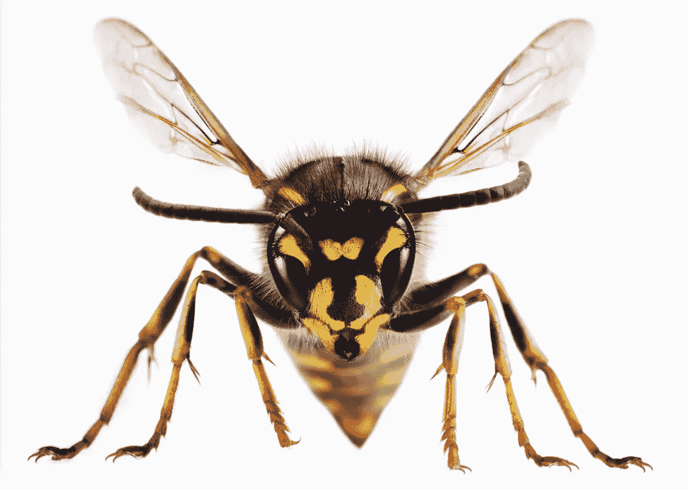

# WASP——全球无广告社交媒体项目

> 原文：<https://medium.com/coinmonks/wasp-worldwide-ad-free-social-media-project-d7adfc481cf5?source=collection_archive---------2----------------------->

aat de Kwaasteniet
22–11–2020 版本 1.0

# 客观黄蜂

在互联网上设计一个(付费)社交聚会场所，作为“免费”社交媒体平台的替代品，如脸书、instagram、twitter、youtube 等。所有这些都具有通过数据挖掘、剖析和/或广告收入的收入模式。在 WASP，用户完全摆脱了围绕他/她的账户的营销活动。所以没有数据挖掘，没有剖析，没有广告等等。
达到目标的条件是:

1.  不会收集任何数据，也不会对用户进行分析。
2.  工作是通过应用程序完成的，所以 WASP 不是基于网络的。
3.  该应用程序是开源的。
4.  应用程序中不会放置广告。
5.  WASP 以外的任何人都无法接触到广告或营销提案。
6.  尽可能少的帐户数据将被存储在中央服务器上(所以实际上只有签名代码，个人资料图片和发送的消息)。
7.  不需要输入可验证的数据。(因此，用户必须通过例如电子邮件或电话验证来检查友谊请求是否真的属于他的朋友)
8.  一段时间后(最多一个月)，所有存储的工作数据将从服务器中删除。
9.  (订阅)费用的支付通过加密货币居尔登(NLG)完成，因为居尔登允许小额支付，居尔登的技术已经发展到目前为止，处理可以干净利落地完成，没有太多的交易费用。
10.  要开发的 app 是免费提供的。

# 登记

通过选择用户名和个人资料图片来创建帐户。从用户名和个人资料图片的组合中生成一个唯一的签名代码(这些图片不会完全可见，因此签名代码不能在 WASP 之外生成)。签名代码加上用户名构成了 WASP ID 的基础。用户的匿名居尔登地址也可以附加到特征码上。
不会使用电子邮件地址或其他社交媒体账户来追踪用户，以防服务器遭到黑客攻击。
只需支付一次性注册费，例如 500 居尔登(+/-€3.50)。除了收取启动资金之外，注册费的目的只是为了防止(自动)创建许多垃圾邮件帐户。

# 注册

任何在该应用程序中注册的人都可以开始 WASP 会话。登录时，居尔登应用程序将自动打开，正确的金额已经输入，用户只需要输入他的密码和认证支付。WASP 服务器会通过你的账户追踪你是否已经付款。因此，如果您在过去 24 小时内已经支付过一次，您可以立即继续。付款后，你有 24 小时免费访问。如上所述，费用是在居尔登支付的，例如，24 小时的每节课 10 英镑。费用金额取决于居尔登费率，目前在撰写本文时为+/- 6 欧分/24 小时。因此，如果会员想永久使用 WASP，他每年最多需要支付大约 22€。(当然，所有金额仍为建议金额)。用户只为他使用 WASP 的时间付费(以 24 小时为单位)。支付的金额用于保持服务器运行和支付其他费用。

# 操作

登录后，用户可以接收和/或发送消息给“朋友”。这些消息被提供有他的签名代码和时间戳，并且没有被加密。用户决定消息是公开的，可以被所有人阅读，还是只有朋友可以阅读。信息可以由文本、照片文件、电影等组成。并将在服务器上保留一段时间，但最长不超过一个月。用户可以选择下载他朋友的信息，或者只把它们留在服务器上，这样一个月后就无法访问了。
时间戳很有用，因为它避免了每次搜索整个数据库的需要。当有人登录时，应用程序会传递最后一条消息的时间戳，以便限制同步时间。
会员可以通过一个类似于 facebook 的好友请求将朋友链接到他的账户。搜索朋友有两种方法。在 WASP 数据库中浏览用户名/个人资料照片，或者用户可以通过另一种媒介(如电子邮件、whatsapp 等)专门访问他人。)来分享他们的用户名。此后由双方中的一方发起友谊请求。小心处理邀请的责任完全在于用户。

(批准的)友谊链接存储在应用程序中。如果根据应用程序中的友谊链接，一个朋友放置了一些东西并在应用程序中显示出来，应用程序就可以在 WASP 服务器上查看。在应用程序中，只要用户希望，只要用户指示消息应该自动下载，消息就会一直留在那里。如果没有指明这一点，则该消息将在一个月后从服务器中删除，即使用户已经超过一个月没有打开该应用程序，并且从未看到过该消息。

一个新的友谊链接只会导致从链接日期的消息流，所以一个新的友谊链接不会导致旧消息的瀑布。
登录后，WASP app 会首先显示用户尚未看到/阅读的好友的消息。在友谊消息之后，基于时间戳的顺序，其他公共消息是可见的。

如果你们不是朋友，你只能向对方发送友谊请求。WASP 内部没有任何其他形式的交流。
因为有一个荷兰盾地址连接到所有用户的账户，荷兰盾也可以在 WASP 应用程序内转移给朋友。但是 Wasp 应用程序打开了单独的 Guilder 应用程序，并且没有自己的钱包功能。
因为这是一项付费服务，垃圾邮件账户可能会少一些。此外，karma points 系统用于跟踪用户是否有不良行为。如果用户被具有负面因果报应点数的朋友判定为负面，则在超过待确定的阈值之后，该用户可以被自动移除。一个被删除的帐户当然可以创建一个新的帐户，但这将花费他一个新的注册费，旧的朋友圈将不得不重建。这就形成了一个自我清洁系统。

## 另外，阅读

*   最好的[密码交易机器人](/coinmonks/crypto-trading-bot-c2ffce8acb2a)
*   [Deribit 审查](/coinmonks/deribit-review-options-fees-apis-and-testnet-2ca16c4bbdb2) |选项、费用、API 和 Testnet
*   [FTX 密码交易所评论](/coinmonks/ftx-crypto-exchange-review-53664ac1198f)
*   最好的比特币[硬件钱包](/coinmonks/the-best-cryptocurrency-hardware-wallets-of-2020-e28b1c124069?source=friends_link&sk=324dd9ff8556ab578d71e7ad7658ad7c)
*   [密码本交易平台](/coinmonks/top-10-crypto-copy-trading-platforms-for-beginners-d0c37c7d698c)
*   最好的[加密税务软件](/coinmonks/best-crypto-tax-tool-for-my-money-72d4b430816b)
*   [最佳加密交易平台](/coinmonks/the-best-crypto-trading-platforms-in-2020-the-definitive-guide-updated-c72f8b874555)
*   最佳[密码借贷平台](/coinmonks/top-5-crypto-lending-platforms-in-2020-that-you-need-to-know-a1b675cec3fa)
*   [莱杰 vs 特雷佐](/coinmonks/ledger-vs-trezor-best-hardware-wallet-to-secure-cryptocurrency-22c7a3fd391e)
*   [block fi vs Celsius](/coinmonks/blockfi-vs-celsius-vs-hodlnaut-8a1cc8c26630)vs Hodlnaut
*   Bitsgap 评论——一个轻松赚钱的加密交易机器人
*   为专业人士设计的加密交易机器人
*   [PrimeXBT 审查](/coinmonks/primexbt-review-88e0815be858) |杠杆交易、费用和交易
*   [享受九折优惠](/coinmonks/haasonline-review-d8d1a3400419)
*   Bitmex 的[保证金交易指南](/coinmonks/the-idiots-guide-to-margin-trading-on-bitmex-dbbd7742c6fc?source=friends_link&sk=7bfa99d2a181142510c8442c8ddb0786)
*   [eToro 评论](/coinmonks/etoro-review-78807ddeb33c) |交易股票、密码、交易所交易基金、差价合约和商品
*   [Bitmex 高级保证金交易指南](/coinmonks/bitmex-advanced-margin-trading-guide-2270c195ce25?source=friends_link&sk=1d986cca731f5084b9a2db4a4bc4a7ad)
*   [面向开发人员的最佳加密 API](/coinmonks/best-crypto-apis-for-developers-5efe3a597a9f)
*   [加密套利](/coinmonks/crypto-arbitrage-guide-how-to-make-money-as-a-beginner-62bfe5c868f6)指南:新手如何赚钱
*   顶级[比特币节点](https://blog.coincodecap.com/bitcoin-node-solutions)提供商
*   最佳[加密制图工具](/coinmonks/what-are-the-best-charting-platforms-for-cryptocurrency-trading-85aade584d80)
*   了解比特币的[最佳书籍有哪些？](/coinmonks/what-are-the-best-books-to-learn-bitcoin-409aeb9aff4b)

> [直接在您的收件箱中获得最佳软件交易](https://coincodecap.com?utm_source=coinmonks)

