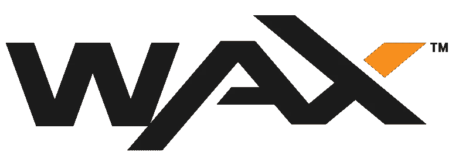

# WAX: NFTs 和游戏

> 原文：<https://medium.com/coinmonks/wax-nfts-and-gaming-3acbd312d1f3?source=collection_archive---------2----------------------->

电子游戏和互联网已经密不可分。在 2021 年，玩最流行的视频游戏需要互联网连接。在过去的 5 年里，我们看到了像《堡垒之夜》或《顶点传奇》这样的免费游戏的迅速崛起。这些免费游戏依赖于用户购买游戏中的货币来换取法定货币，以资助他们的开发。为了换取这种游戏中的货币，用户大多购买化妆品。“装饰性”物品会改变游戏中角色或武器的外观，并且通常不可在用户之间转移。堡垒之夜和 Apex Legends 在游戏内资产的主要销售中总共赚了超过 30 亿美元，这使得视频游戏市场采取了免费游戏的商业模式。大多数游戏中的资产是由玩家的时间投资创造的，或者是用实际的钱购买的，对他们的用户来说具有特殊的价值。在某些情况下，甚至有化妆品黑市。《反恐精英》是一款拥有大量化妆品黑市的游戏。这些化妆品中的一些已经卖到数千美元。像 Valve 这样的视频游戏创作者一直在努力关闭这些游戏内资产黑市。然而，游戏内资产的黑市依然存在。这就是蜡的用武之地。

Wax 是单词 Asset Exchange 的首字母缩写。Wax 协议旨在成为游戏内资产转移的基础层。Wax 利用区块链技术和智能合同为视频游戏开发商提供了二级市场解决方案。使用 Wax 的智能合同将游戏内资产部署为不可替代的令牌，将允许视频游戏开发商在每次游戏内资产易手时获得一部分利润。这将为二级游戏内资产市场提供一个繁荣和互利的途径。这将有助于视频游戏市场从免费游戏模式转向盈利模式，并有可能成为两者的混合体。我们已经看到像 Axie Infinity 这样的基于密码的游戏垄断了游戏赚取市场，以至于个人实际上放弃了他们的工作，因为他们可以通过玩游戏赚取更多或类似数量的钱。想象一下，如果玩两周或顶点传说成为一种可行的赚钱方式。这些游戏已经有玩家投入大量时间和精力来玩和掌握它们。像 Twitch 这样的网站已经允许通过游戏流以非常真实的方式进行视频游戏的货币化。Wax 允许轻松创建游戏内经济，让玩家和开发者平等受益。视频游戏用户已经在没有转售价值的游戏内资产上投入了数十亿美元。想象一下，如果转售价值大于零，游戏中的资产销售会增加。

Wax 还支持 NFT 收藏，并与 Weezer、Atari、Capcom 和 Street Fighter 建立了合作伙伴关系。不可替代的代币用途广泛，基于智能合约的代币是未来金融不可或缺的一部分。21 世纪的收藏家收集的是虚拟物品，而不是实物。NFT 收藏品最近人气直线上升。我们看到像[crypto 朋克](https://opensea.io/collection/cryptopunks)这样的流行 NFT 售价高达数百 ETH，比特币基地最近也宣布推出类似于 [OpenSea](https://opensea.io/) 的 NFT 平台。目前在蜡像区块链上有超过 450 万的 NFT，而且这个数字还在稳步增长。

Wax 是专门为非功能性测试设计的区块链。这些不可替换的令牌可以是任何东西，从 twitter 上的个人资料图片到游戏中的物品皮肤。Wax 在竞争对手中脱颖而出，因为它在创建 NFT 或在区块链上交易时的费用很低，甚至为零。Wax 已经拥有一个充满活力的 NFT dApp 市场生态系统，使用$WAXP，如 [NFTHive](https://nfthive.io/market?refresh=true) 。最近，许多加密游戏已经开始要求用户拥有一定的 NFT 来玩他们的游戏。用户将他们的蜡云钱包连接到他们选择的游戏，并根据他们钱包中的 NFTs 获得访问权限。《异形世界》目前在 Discord 上有 35，694 名成员，它只是使用蜡云钱包和相关 NFTs 的流行游戏之一。随着加密游戏变得越来越受欢迎，开发人员将被吸引到 Wax，因为它的交易费用低，并且预先构建了开发工具。

> 订阅 [**Coinmonks Youtube 频道**](https://www.youtube.com/c/coinmonks/videos) 获取每日加密新闻。

## **蜡的背后是什么？**

Wax 为开发者和企业提供了一套基于区块链的工具，来创建一个安全、快捷、易用的市场。Wax 已经建立了一个微服务层，允许视频游戏开发者和市场所有者基本上即插即用 Wax 区块链。这使得开发者不再需要花费资金为游戏中的资产建立一个安全的、不可变的、快速的交易系统。Wax 为现有企业建立了一个无缝集成系统，以参与一种新形式的数字资产转移。一种给予开发者产品永久剩余的形式。这些永久残差也可以应用于现实世界的项目。比方说，耐克推出了一款热卖的新款运动鞋，并使用蜡来标记这款运动鞋。这些运动鞋由耐克保存在一个安全的地方，直到代币持有者赎回代币并把它们运出去。这种新的数字-物理混合资产可以在几秒钟内多次买卖给世界各地的用户，而无需在太空中进行物理移动。这使得耐克可以永久地获得一次销售和一部分二次销售。这些混合数字实体资产的潜在买家和卖家不再需要担心资产转手时运动鞋的状况。最后，当代币被赎回时，赎回将被写入区块链，并永远与该混合数字-物理资产相关联，并告知其未来价格。这只是众多例子中的一个，在这些例子中，使用混合数字-物理资产令牌对所有各方都是互利的，并且增加了交互双方的价值。

Wax 协议是一份 DPoS(授权利益证明)区块链。这基本上意味着区块链像民主共和国一样治理。$WAXP 持有者作为委托人，将他们的代币委托给作为代表的行会。拥有最多授权代币的行会在区块链上记录最多的交易。公会和他们的成员都从处理交易中获得一定比例的奖励。如果一个公会的行为不诚实，他们会收到更少的块奖励，因此支付给他们的成员比他们在一个更值得信赖的公会下注$WAXP 所能得到的要少。这激励了$WAXP 持有者向诚信行事的行会授权。这种激励制度确保了区块链的安全，并允许快速交易，同时放弃了一些权力下放。这种分散的缺乏对于增加可伸缩性和安全性是必要的。要进一步了解原因，请阅读关于[可伸缩性三难困境](https://vitalik.ca/general/2021/04/07/sharding.html)的内容。

## **谁是幕后黑手？**

威廉·e·奎格利和[张克帆·扬蒂斯](https://everipedia.org/wiki/lang_en/jonathan-yantis)都是加密领域的老手，也是 Wax 的联合创始人。奎格利在加密领域内外都有着令人印象深刻的履历。奎格利曾在迪士尼工作，负责华特·迪士尼公司授权部门的战略规划和财务活动。奎格利还是 Tether (USDT)的联合创始人，Tether 是当今加密生态系统中使用最广泛的稳定硬币之一。奎格利是一位资深风险投资人，1997 年与人共同创立了 Clearstone Venture Partners。奎格利是比特币的早期采用者，现任 Cashel Enterprises 的董事总经理，该公司是一家基于加密货币的投资基金。Yantis 在 1997 年开创了虚拟物品交易市场，当时他创办了一家公司，允许用户在热门游戏如《魔兽世界》和《无尽的任务》中用法定货币交易游戏内物品。Yantis 也是比特币的早期采用者和挖掘者。Quigley 和 Yantis 的知识和专业技能相结合，将 Wax 推向了今天的位置，并预示着 Wax 的大规模增长和采用。Wax 由 Node Capital 的风险投资支持，分布在全球，Hashed 仅举几例。

## **我们为什么投资？**

Wax 处于一个完美的位置，可以让大量主流视频游戏和数码产品消费者进入加密领域。Wax 在区块链提供的一套工具使入职在短期内变得更加可行。2019 年，视频游戏行业的收入为 1090 亿美元。可以肯定的是，随着互联网连接变得越来越普遍，这个数字还会继续上升。随着免费游戏和赚取游戏收入的合并，我们将看到玩视频游戏的时间和视频游戏公司的收入增加。现实世界资产的令牌化有利于环境和商业，带来运输习惯的巨大变化和二级市场版税的新机遇。$WAXP 是为 Wax 的整个经济提供动力的加密货币。我们投资时，市值不到 2 亿美元。如今，WAXP 的市值约为 4.3 亿美元。相比之下，视频游戏公司 Take-Two 互动软件的市值为 191 亿美元。Wax 的团队是非凡的，在数字资产和加密货币方面都有深入的知识。Wax 也有精明的资金支持。DPoS coin $WAXP 的 tokenomics 是合理的，他们的白皮书既全面又易懂。Wax 区块链目前每天有 1500 万笔交易，支持 3 万个分散式应用程序。对 Wax 的采用越来越多，Wax 团队也在不断改进。$WAXP 增长的潜力是巨大的，根据检查，Wax 似乎已经准备好并能够处理这种增长。

由 Istari Capital LP 的加密专家和分析师 David Coryat 撰写。

https://www.istari.io/

*本内容仅供参考，您不应将任何此类信息或其他材料理解为法律、税务、投资、财务或其他建议。本报告中的任何内容均不构成 Istari 或任何第三方服务提供商在该司法管辖区或任何其他司法管辖区购买或出售任何证券或其他金融工具的邀约、建议、认可或要约，根据该司法管辖区的证券法，此类邀约或要约是非法的。请注意，Istari Capital LP 投资于本文讨论的项目或与本文相关的项目。*

> 加入 Coinmonks [电报频道](https://t.me/coincodecap)和 [Youtube 频道](https://www.youtube.com/c/coinmonks/videos)了解加密交易和投资

## 另外，阅读

*   [什么是融资融券交易](https://blog.coincodecap.com/margin-trading) | [美元成本平均法](https://blog.coincodecap.com/dca)
*   [币安 vs 比特邮票](https://blog.coincodecap.com/binance-vs-bitstamp) | [比特熊猫 vs 比特币基地 vs Coinsbit](https://blog.coincodecap.com/bitpanda-coinbase-coinsbit)
*   [如何购买 Ripple (XRP)](https://blog.coincodecap.com/buy-ripple-india) | [非洲最好的加密交易所](https://blog.coincodecap.com/crypto-exchange-africa)
*   [非洲最佳加密交易所](https://blog.coincodecap.com/crypto-exchange-africa) | [Hoo 交易所评论](https://blog.coincodecap.com/hoo-exchange-review)
*   [eToro vs robin hood](https://blog.coincodecap.com/etoro-robinhood)|[MoonXBT vs by bit vs Bityard](https://blog.coincodecap.com/bybit-bityard-moonxbt)
*   [有哪些交易信号？](https://blog.coincodecap.com/trading-signal) | [比特斯坦普 vs 比特币基地](https://blog.coincodecap.com/bitstamp-coinbase)
*   [ProfitFarmers 回顾](https://blog.coincodecap.com/profitfarmers-review) | [如何使用 Cornix Trading Bot](https://blog.coincodecap.com/cornix-trading-bot)
*   [如何在势不可挡的域名上购买域名？](https://blog.coincodecap.com/buy-domain-on-unstoppable-domains)
*   [印度的加密税](https://blog.coincodecap.com/crypto-tax-india) | [altFINS 审核](https://blog.coincodecap.com/altfins-review) | [Prokey 审核](/coinmonks/prokey-review-26611173c13c)
*   [Blockfi vs 比特币基地](https://blog.coincodecap.com/blockfi-vs-coinbase) | [BitKan 点评](https://blog.coincodecap.com/bitkan-review) | [Bexplus 点评](https://blog.coincodecap.com/bexplus-review)
*   [南非的加密交易所](https://blog.coincodecap.com/crypto-exchanges-in-south-africa) | [BitMEX 加密信号](https://blog.coincodecap.com/bitmex-crypto-signals)
*   [MoonXBT 副本交易](https://blog.coincodecap.com/moonxbt-copy-trading) | [阿联酋的加密钱包](https://blog.coincodecap.com/crypto-wallets-in-uae)