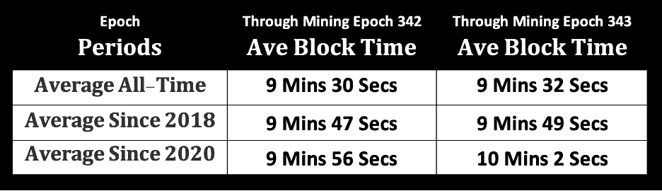
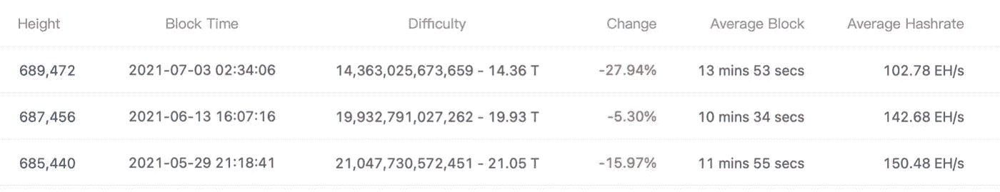
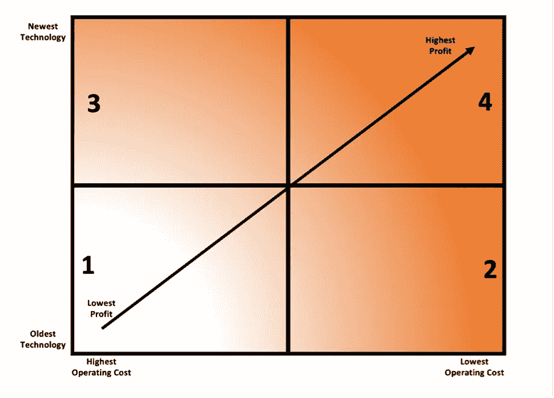
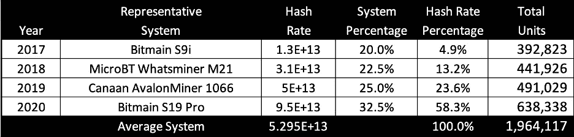
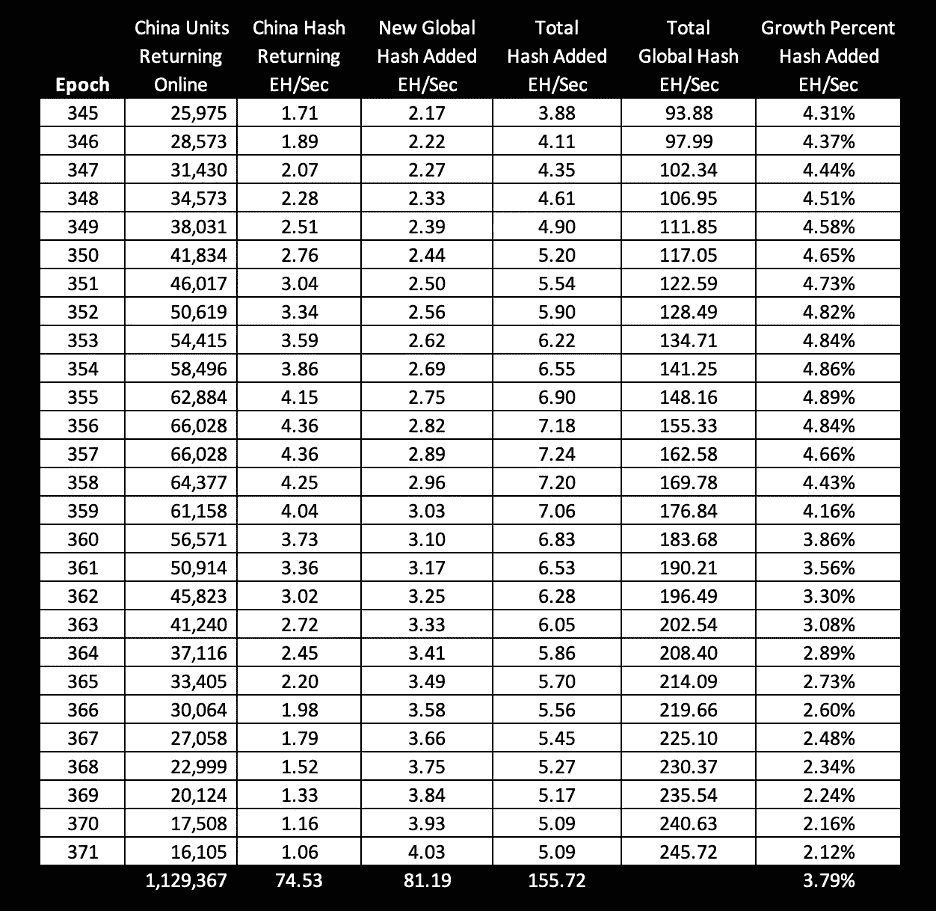
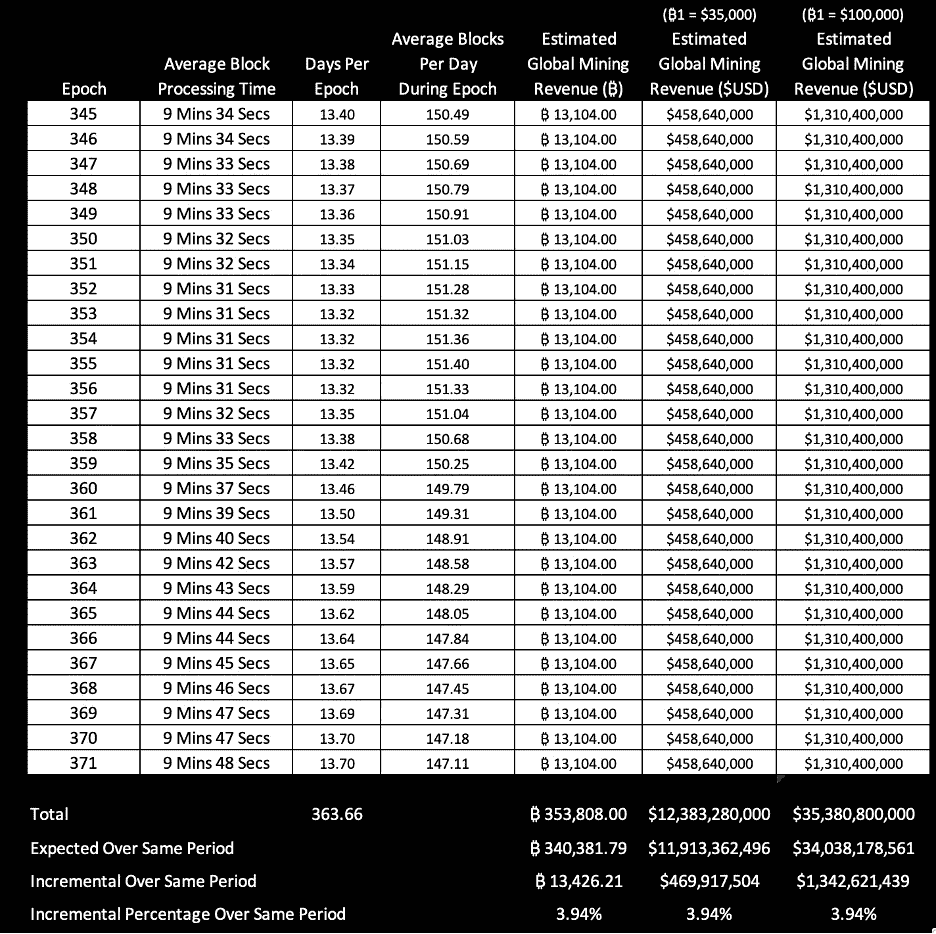

# 任意阻塞时间及其对比特币挖掘的影响

> 原文：<https://medium.com/coinmonks/wayward-block-times-and-their-impact-on-bitcoin-mining-d8d5c950d7e5?source=collection_archive---------1----------------------->

对于那些不熟悉比特币挖矿业务的人来说，挖矿的好处之一是可预测的收入流——尤其是对那些将财富储存在比特币中的矿工来说。决定采矿收入的变量只有三个，第一个是采矿者占世界散列能力(也称为计算能力或处理能力)的百分比。随着时间的推移，矿商获得的全球矿业收入份额，相当于他们在全球影响力中所占的比例。

矿工所提供服务的价格标签被称为区块报酬，它是决定采矿收入的第二个变量。整体奖励本身是两个变量的总和:整体补贴和交易费。区块补贴是新发行的比特币，发放给处理(赢得)区块的矿商。目前扩散率是每块₿6.25，它将保持固定在这个速度，直到第 840，000 块，在这一点上，它将下降到₿3.125.(撰写本文时的块高度为 691，153。每个街区的交易费都不一样，从₿0.05 到₿0.75.不等为了简单起见，假设典型的交易费是₿0.25；因此，典型的街区奖励是₿6.50.

第三个变量是每天的数据块数量，详细探讨这一点是本文的主题。Satoshi 在开发比特币方面的天才部分在于难度调整，它考察了处理之前 2016 块所需的平均时间。这些时期中的每一个都被称为难度调整时期，或块处理时期。在每个时期结束时，比特币协议增加/降低处理块的难度，希望下一个时期的平均块处理时间尽可能接近 10 分钟。因此，一般来说，任何想要估计一天中数据块数量的人都会简单地将一天中的分钟数 1440 除以 10 分钟。结果是每天 144 个数据块，除以每个时段 2016 个数据块，得出平均数据块处理时段为 14 天，即两周。

这意味着，可以通过₿6.50 的典型区块奖励乘以每天 144 个区块，得出每天的总₿936，从而简单预测每天的全球采矿收入。这就可以推断出₿341,640.每年的全球矿业收入许多人发现用美元来思考更容易，因此，以 35000 美元= ₿1 计算，日收入约为 3300 万美元，年收入为 120 亿美元。

但是，深入观察一下，每天 144 块并不是一个常数。由于数据块处理时间与 10 分钟的目标不同，每天生成的数据块数量也不同。下面的表 A 显示，在比特币的大部分生命周期中，块处理时间都快于 10 分钟。

Table A: Bob Burnett, Barefoot Mining

这是合乎逻辑的，因为在比特币历史的大部分时间里，世界总体散列率一直在不断增加，而且由于算法总是着眼于过去，它通常会低估即将到来的时代的处理能力。如表 A 所示，平均(所有时间)块处理时间比目标快 30 秒，或 5%。从表面上看，这可能并不重要，但事实确实如此——在比特币的历史上，平均每天处理的区块比目标多 7 个。然而在过去的 18 个月中，网络已经显著稳定，平均块处理时间已经非常接近 10 分钟。

即使在中国 6 月中旬禁止比特币挖矿之前，从 5 月初开始，网络中的哈希力量已经有所流失。这可能是因为比特币价格走软和/或因为一些中国矿商收到了即将出台禁令的预警。无论如何，在过去的三个时期中，块处理时间远远高于平均值，当前时期的趋势是大约 11 分钟。伟大的矿业

Table B: BTC.com

不过，中国的人口外流似乎即将结束，而当这种情况结束时，几乎肯定会标志着全球杂凑率触底。很难对全局哈希速率进行精确的实时测量，但对这个低点的合理猜测是大约 90 EH/sec，它为比特币采矿业建立了一个非常重要的施加点。

比特币采矿的全球散列率下降，使得几乎所有剩余的基于 ASIC 的采矿设备都盈利了——特别是 2017 年后建造的设备。通常情况下，4 到 5 年的系统将成为“缓冲”单元，随着比特币价格的上涨或下跌而开启或关闭。这些将是下图 A 中象限 1 和象限 2 底部的单位，也是在比特币价格和散列率的高度历史相关性中发挥关键作用的单位。然而这种关系已经不存在了。(关于这一点的更多信息，请参见“比特币价格和散列率的不可预见和悲剧性的破裂”，可在 https://bit.ly/3heWhxy.[获得)](https://bit.ly/3heWhxy.))相反，我们即将进入一个扩展的时代，散列率将持续上升，无论价格如何。这是因为采矿系统，甚至旧的采矿系统，将保持活跃，即使新的系统将上线，因为他们仍然有利可图。有人可能会说，中国政府给了坐在中国之外的旧体制一杯青春之泉的水。

Chart A: Bob Burnett, Barefoot Mining

由于在可预见的未来散列率将不断增加，对于即将到来的时代，困难将总是调整不足，并且有一些重要的分支。

**块处理时间将始终低于十分钟。**

**下一个减半的时间正在加快**

**每天将处理远远超过 144 块。**

**矿商的收入将大幅增加。**

比特币的货币供应量将比预期膨胀得更快。

预测这些数字的细节是困难的，但合理的近似值是可能的。假设中国的人口外流在公元 345 年完成(大约从 2021 年 8 月 1 日开始)，那么全球杂凑率将从那时开始稳步攀升。

Table C: Bob Burnett, Barefoot Mining

表 C 估计了禁令颁布时在中国使用的采矿设备的情况。正如我在以前的文章中所描述的，由于能源和设施不容易获得，中国的采矿业面临着重新部署这些系统的重大挑战。鉴于扩张能力有限，这些公司肯定会首先推出最新的机器，因为它们效率最高、利润最大。因为重新部署将是缓慢的，并且将从最年轻到最老发生，并且因为重新部署系统的成本很高，所以 2017 年和 2018 年的机组(组合的 18.1%)可能永远不会恢复运行。这大约是 83 万台将退役的系统，但剩余的 81.9%仍代表超过 110 万台需要退役，然后从中国运出，然后重新安装在新的设施中。让这些系统恢复运转不会在一夜之间发生。

表 D 估计了 110 万个单元重新联机的速率以及由此导致的散列速率的增加。此外，对比特币散列率的历史扩张(自 2018 年以来)的检查显示，它平均每月增长 2.41%(复合)。当将这一增长率应用于当前非中国的哈希速率时，它显示了在 345 年至 371 年期间，世界采矿能力增加了额外的 81 EH/Sec。将这两者结合起来，在这 27 个时期的跨度内，散列率每时期复合增长 3.8%。

Table D: Bob Burnett, Barefoot Mining

更深入地看，表 E 显示，从那个纪元 345(大约 2021 年 8 月 1 日)开始，块处理时间将比预期的 10 分钟块时间快大约 26 秒。这将加速纪元到 13 天 8 小时，或比计划提前 16 小时。

Table E: Bob Burnett, Barefoot Mining

这也意味着每天将处理多达 7.4 个额外区块，在某些时期，**这将导致全球采矿收入增加高达 5%** ，平均超出预期 4%。由于矿商的运营费用基本上是固定的，这些额外的收入将直接浮动到底线。总的来说，这将使采矿业的收入(和利润)增加 4 . 69 亿美元(₿1 = 3 . 5 万美元)，达到 13 亿美元(₿1 = 10 万美元)。显而易见，任何经营矿业的人都将迎来非常好的一年。

如前所述，预计纪元 345 将于 2021 年 8 月 1 日开始，表 E 预测纪元 371 将于 2022 年 7 月 30 日(363 天)左右完成。正常的 27 个时代跨度需要 54 周(378 天)才能完成，但中国的矿业禁令比这提前了 15 天。一个有趣的观察是，这个**还将减半**的预计时间从 2024 年 5 月 14 日提前到 2024 年 4 月下旬(根据 BitcoinBlockHalf.com)。

中国矿业禁令的另一个后果是**比特币的供应将以高于正常水平的速度增长**。从技术上讲，这意味着比特币的通胀率将略高于明年的预测。最终，2100 万的供应上限仍然适用，因此影响相对较小，但由于比特币社区传统上过度关注货币供应的任何变化，无论是法定货币、比特币还是替代货币，对这种增长的认识都是值得注意的。

最后，如果采矿社区在纪元跨度 345 至 371 期间的某个时间点进入“出售模式”，市场将不得不吸收更高的比特币供应，这将产生下行价格压力；然而，这不太可能。加速的块处理速度与任何额外的生产/操作成本无关。因此，流入货币供应的₿13,426(见表 e)对矿商来说是纯利润，大多数矿商，尤其是北美的矿商，从事这项业务是因为他们希望积累和持有比特币。出售比特币购买菲亚特与他们的理念不太一致。

虽然中国矿业禁令的一阶效应对中国矿业社区来说显然是灾难性的，但二阶和三阶效应对比特币的生态系统和剩余的比特币矿业来说是压倒性的积极影响。比特币再次证明，它就像一只海星，砍掉一只手臂，它会“继续，继续”，同时重新长出手臂。

滴答下一个街区。

鲍勃·伯内特
首席执行官，赤脚矿业
区块高度 691，153(或者有人可能会说——2021 年 7 月 15 日)

 [## 用 4GB 的采矿钻机开采什么？

### 对于矿工来说，这是艰难的一年，今年早些时候比特币的回报减半，独立矿工最喜欢的…

blog.coincodecap.com](https://blog.coincodecap.com/4gb-mining-rigs)  [## 7 大有利可图的新手矿池

### 为什么在池中开采比单独开采更好？答案很简单——当在一个池上采矿时，你的收入…

blog.coincodecap.com](https://blog.coincodecap.com/top-7-profitable-mining-pools-for-beginners)  [## 7 大有利可图的新手矿池

### 为什么在池中开采比单独开采更好？答案很简单——当在一个池上采矿时，你的收入…

blog.coincodecap.com](https://blog.coincodecap.com/top-7-profitable-mining-pools-for-beginners)