# WazirX 评论 2022 |安全合法吗？[先看这个]

> 原文：<https://medium.com/coinmonks/wazirx-review-5c811b074f5b?source=collection_archive---------0----------------------->

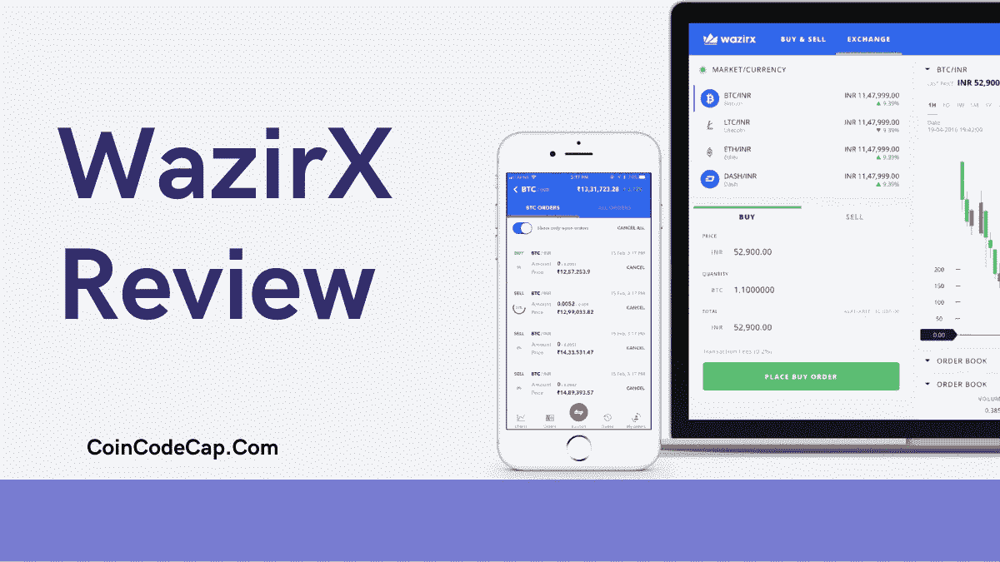

在这篇评论文章中，你将了解到 [WazirX](https://blog.coincodecap.com/go/wazirx) 提供的所有功能，在文章结束时，你也将有一个开始在 [**WazirX**](https://blog.coincodecap.com/go/wazirx) 上交易的指南。

WazirX 是印度最受欢迎的加密交易平台之一，也是印度加密投资者的必去之地。随着用户群的不断增长， [WazirX](https://blog.coincodecap.com/go/wazirx) 提供 100 多种加密货币进行交易，包括其 WRX 代币。

# 摘要

*   [WazirX](https://blog.coincodecap.com/go/wazirx) 是一个[印度加密交换](https://blog.coincodecap.com/bitcoin-exchange-in-india)平台，拥有最多的用户。
*   您可以通过完成一些简单的步骤开始交易，如注册、KYC 完成、存款印度卢比和下单。
*   [WazirX](https://blog.coincodecap.com/go/wazirx) 允许您使用 UPI 进行除 NEFT/ RTGS/ IMPS/银行转账之外的存款。
*   您还可以将加密资产转移到您的 [WazirX 钱包](https://wazirx.com/funds)中。
*   WazirX 让你通过 P2P 交易所买卖 USDT，并且不向你收取任何费用。
*   你可以通过向专业交易者支付一定比例的利润来维持你的投资组合。
*   [WRX 币](https://wazirx.com/exchange/WRX-INR)是 wazirx 代币，你可以用它在 wazirx 进行交易并支付你的交易费用。
*   您可以直接从您注册的银行账户中提取印度卢比。对于加密资产，您可以将其转移到您的钱包中。
*   与市场竞争对手相比，WazirX 收取的费用略高。
*   WazirX 提供了一个简单的交易应用程序，你可以从 Play Store 或 App Store 下载。(使用 **ad4e888q** 转介代码获得费用折扣)
*   你可以通过他们的推荐项目赚取 50%的交易费作为佣金。
*   他们提供 24×7 的支持系统。但是，您只能通过邮件提交请求，wazirx 将会恢复。

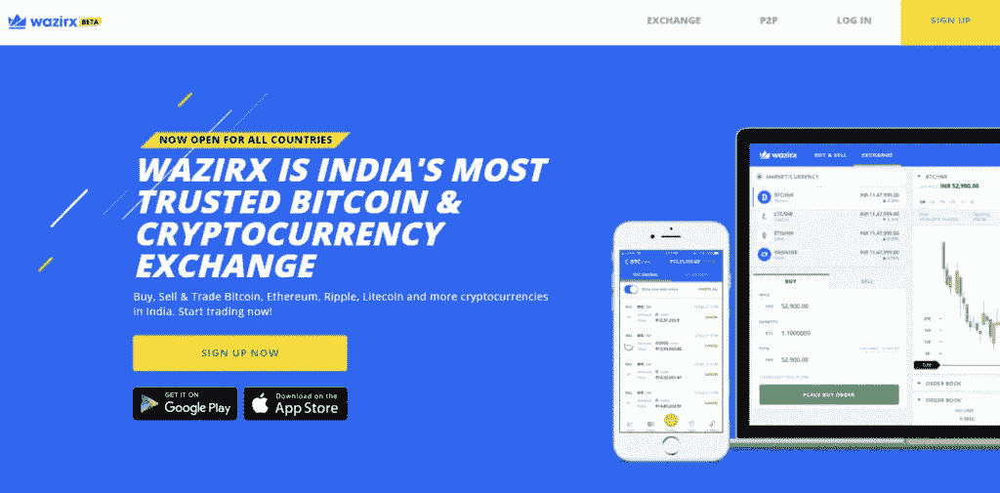

[币安](https://blog.coincodecap.com/go/binance)是[全球最大的密码交易所](https://blog.coincodecap.com/crypto-exchange)平台，2019 年底收购了 WazirX。这增加了 [WazirX](https://blog.coincodecap.com/go/wazirx) 在印度和密码市场的前景。

# WazirX 评论:功能

1.  WazirX 交易平台可通过网络、智能手机、android、windows、苹果 iOS mbiles 和 mac 系统访问。
2.  该平台提供多种加密货币。您可以交易 100 多种与 USDT 配对的加密货币。
3.  该平台能够高效流畅地处理数百万笔交易。
4.  WazirX 是由一些铁杆和热情的区块链专业人士建造的。因此，该平台集成了交易视图的几乎所有功能和图表工具。

# 如何开始在 wazirx 上交易？

开始 WazirX 的交易可能不到五分钟。你所要做的就是创建一个账户，完成你的 KYC，存入资金，然后你就可以开始你的第一笔交易了。

## 在 WazirX 上创建一个帐户

创建一个帐户是你的密码交易之旅的第一步。您可以按照以下步骤在 [WazirX](https://blog.coincodecap.com/go/wazirx) 上创建一个帐户:

1.  访问[WazirX 官方网站](https://blog.coincodecap.com/go/wazirx)并点击注册。
2.  输入您的电子邮件地址和密码。
3.  点击邮件中的帐户激活链接。
4.  现在登录，一切都准备好了。

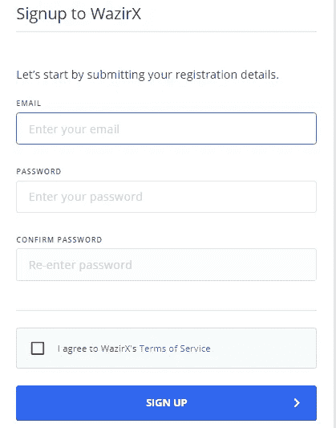

## 完整的 KYC

您需要完成您的 KYC，以便在印度卢比或加密存款。按照以下步骤完成您的 KYC:

1.  单击您的个人资料选项卡，然后单击完成验证。
2.  根据政府批准的身份证输入所有详细信息。
3.  现在输入您的银行详细信息。 [WazirX](https://blog.coincodecap.com/go/wazirx) 今后所有提款都将使用该银行账户。
4.  上传潘、阿达尔的照片和一张或 PNG 格式的自拍。
5.  一旦所有的细节都被核实，你就可以存款开始交易。

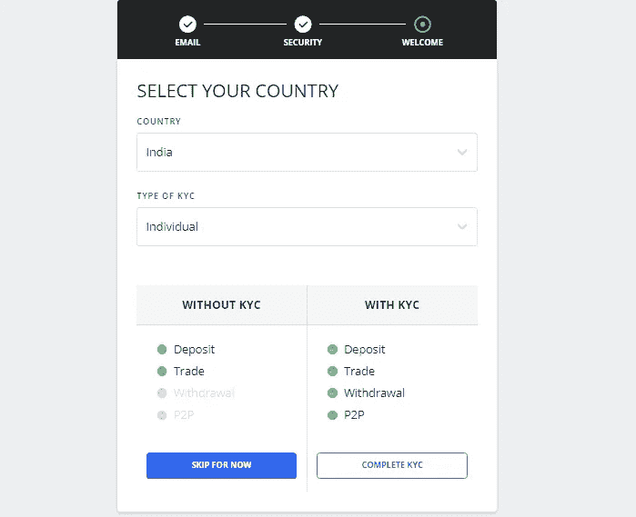

## 在 [WazirX](https://blog.coincodecap.com/go/wazirx) 上存款并开始交易

你需要存款，这样你才能开始投资加密货币。您可以通过任何接受的支付方式存入印度卢比。但是，您也可以存放加密货币(如果您拥有任何加密货币)。

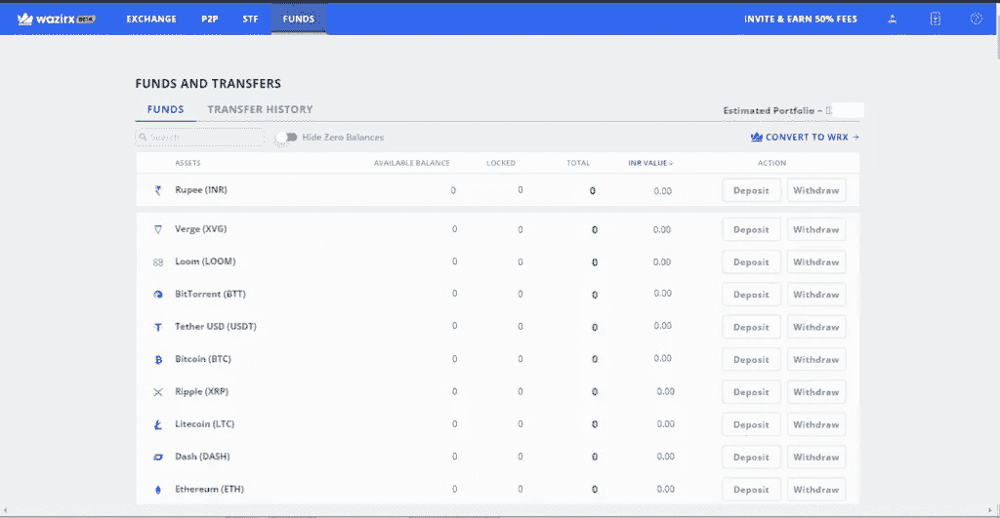

# WazirX 接受付款方式

[WazirX](https://blog.coincodecap.com/go/wazirx) 允许您以印度卢比和加密货币存款。在加密资产中，选择您希望存入的加密货币，并将其转移到您的 wazirx 钱包地址。

要存入印度卢比，您可以使用以下任何一种支付方式:

1.  NEFT/ RTGS/ IMPS
2.  合众国际社(United Press International)
3.  网上银行
4.  银行汇款

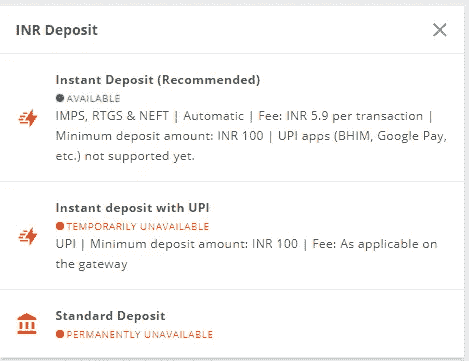

# 如何在 WazirX 上存钱？

存入 INR 很简单。但是，您可以按照以下步骤进行存款:

1.  在网站标题中，单击“基金”选项卡。
2.  在下一个屏幕上，单击您希望存款的资产旁边的存款按钮。
3.  现在，在印度卢比，您可以选择通过上述任何支付方式存款。
4.  如果是加密货币，复制目的地地址或扫描二维码并存入资金。

# 如何从 WazirX 取钱？

你可以在印度卢比提款，也可以在[瓦济克斯](https://blog.coincodecap.com/go/wazirx)提取加密资产。您可以按照以下步骤进行取款:

1.  点击标题中的“基金”选项卡。
2.  现在，单击您希望提取的资产前面的“提取”按钮。
3.  在 INR 的情况下，您可以在“即时退出”和“NEFT 退出”之间选择一个选项
4.  在加密资产的情况下，你可以将硬币发送到你的钱包地址或扫描二维码进行转账。

# WazirX 评论:WazirX 现货交易

在 WazirX 进行交易很容易，你可以通过点击网站标题上的“交易所”标签开始交易。 [WazirX](https://blog.coincodecap.com/go/wazirx) 允许你预先下单交易。当市场满足你的订单要求时，系统会自动执行。

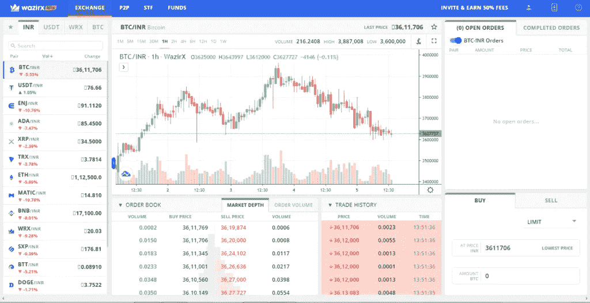

加密资产列表位于交换屏幕的左侧，您甚至可以标记您选择的资产。

# WazirX 评论:WazirX P2P

WazirX 也提供点对点的交换服务。然而，就 P2P 而言，你只能在 USDT 进行交易。 [WazirX](https://blog.coincodecap.com/go/wazirx) 拥有一款同类的买家和卖家匹配软件，当你作为买家下单时，它会自动为你匹配合适的卖家。

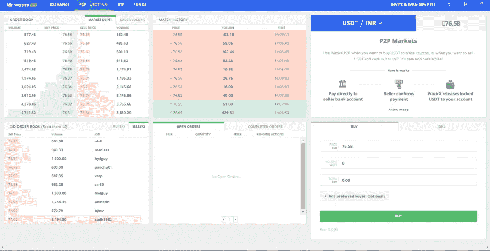

# 如何在 WazirX 上买卖 USDT？

您可以通过以下步骤在 WazirX 上购买 USDT:

1.  首先，点击屏幕顶部的 P2P。
2.  第二，你需要输入你想购买的 USDT 的数量。
3.  第三，点击**下单**按钮。现在，WazirX 平台将开始为您各自的订单搜索卖家。
4.  你会看到来自多个卖家的几个匹配。
5.  接下来，向每位卖家付款，付款后点击“**我已经支付了**”。
6.  最后，等待卖家确认你的付款。
7.  一旦卖家确认付款，USDT 就会存入你的 WazirX 账户。
8.  同样，出售 USDT 你需要**下一个卖单**，在收到付款后，点击“**是的，我已经收到付款**”。

# WazirX 评论:支持的加密货币

[WazirX](https://blog.coincodecap.com/go/wazirx) 支持[比特币](https://blog.coincodecap.com/a-candid-explanation-of-bitcoin) (BTC)、以太坊(ETH)、Ripple (XRP)、莱特币(LTC)、Dogecoin (DOGE)、[币安](https://blog.coincodecap.com/go/binance)币等百余种加密资产。

# WazirX 评论:最小和最大投资

在 WazirX 账户上，最低存款额为 100 卢比，存款额没有限制。然而，你也可以投资一些成本甚至低于 100 卢比的加密货币

# 瓦齐克斯评论:瓦齐克斯硬币(WRX)或瓦齐克斯代币

**WRX token** 基于币安区块链，最大市场供应量为 20 亿枚硬币。你可以在 WazirX 上交易 WRX 硬币，因为最近它的价值有所上升。此外，如果你使用 WRX 支付交易费用，那么你将得到折扣。此外，你可以使用 WRX 硬币在 [WazirX](https://blog.coincodecap.com/go/wazirx) 上购买其他加密资产。

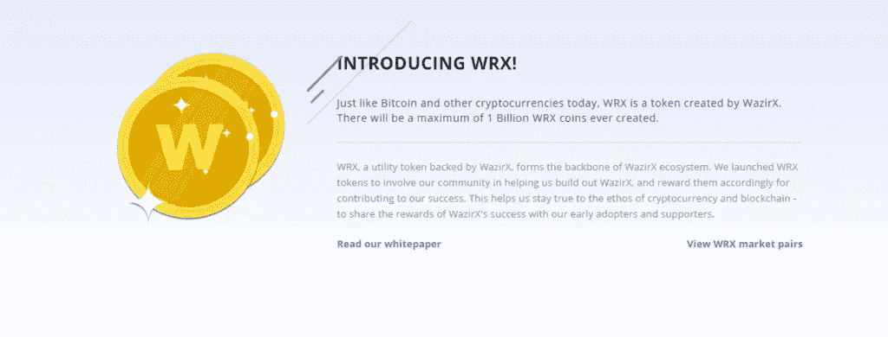

## WRX 矿业公司

你可以通过在 BTC、印度卢比和 USDT 市场交易来解锁 WRX 硬币。您可以根据下表解锁 WRX 硬币:

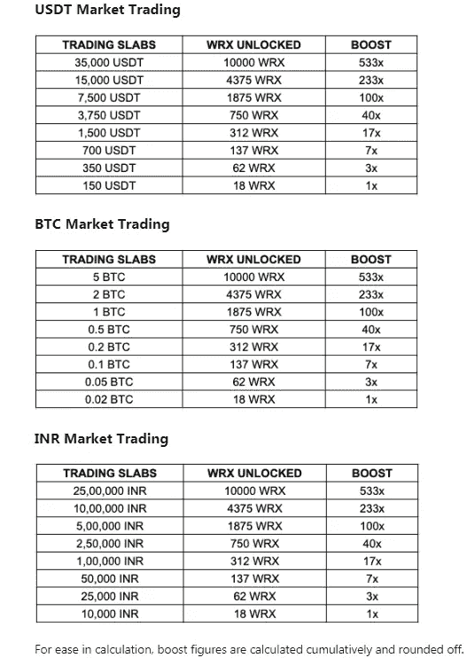

不过 WRX 挖矿一期已经结束，只能等待二期的进一步公布。

# 瓦济克斯评论:STF(智能代币基金)

智能代币基金是一种连接熟练交易者和不太有经验的交易者的方式，在某种程度上，他们可以互相帮助建立投资组合。这类似于复制交易，就好像你在购买一个专业投资者的投资组合；他为你做所有的交易。

然而，这并不能免除你的市场风险，因为加密货币是高度不稳定的资产类别。

## 谁应该在 STF 投资？

没有时间或技能来管理投资组合的人。STF 允许你购买一个智能令牌，让你把你的投资组合传递给熟练的投资者。然后这个专业投资者替你做所有的交易。

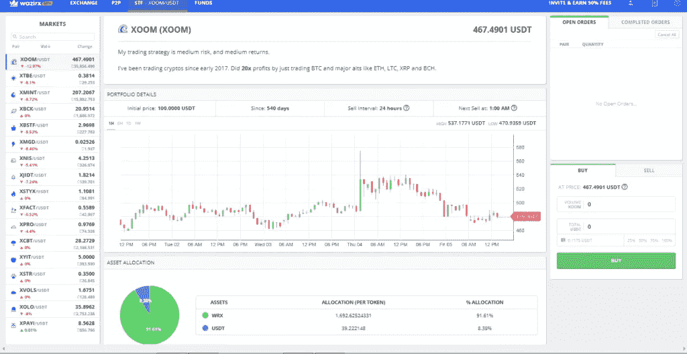

## 熟练交易者的 STF

熟练的交易者创造他们的智能代币，并把它们拿出来出售。投资者购买这些代币，当专业交易者从投资者的投资组合中获利时，代币的价值就会上升。

一个熟练的 STF 交易者可以从他们为投资者赚取的利润中获得 25%的佣金。

# WazirX 评论:WazirX 费用

WazirX 对现货交易收取 0.2%的做市商/收市商费用。进行 P2P 交易是免费的，你必须将 25%的利润交给 STF 交易的熟练交易者。

如果您通过银行转账存入印度卢比，您需要支付 6.7 印度卢比的交易费。然而，通过 UPI 存款几乎不收任何费用。

你将不得不支付一笔提取费用，如下表所述，或者在提取加密资产时支付[或这里的](https://wazirx.com/fees)。

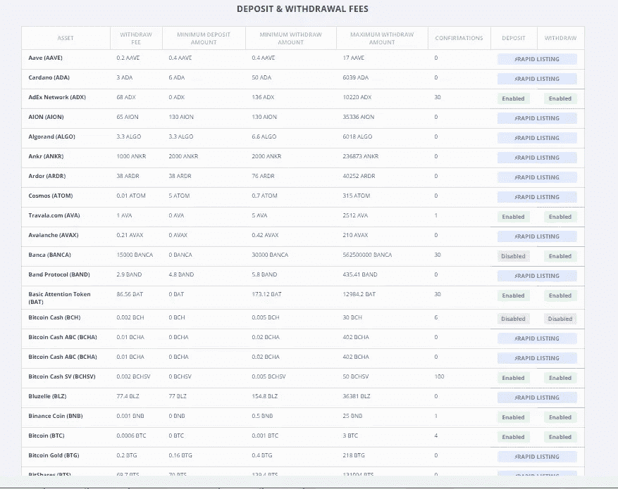

**注:** [与](https://blog.coincodecap.com/go/wazirx) [CoinDCX](https://blog.coincodecap.com/go/coindcx) 或 [Bitbns](https://blog.coincodecap.com/go/bitbns) 等交易所相比，WazirX 的交易费用较高。

# WazirX 评论:WazirX 安全吗？

是的， [WazirX](https://blog.coincodecap.com/go/wazirx) 是一个安全的平台，因为它将你几乎 95%的资金存储在离线冷库中，使其免受任何黑客攻击。但是，您可以跟踪一些事情来保护您的资产:

*   仅使用官网或从 play store 或 app store 下载的 app 登录并下单交易。
*   启用**双因素和 OTP 认证**。
*   不要与任何人分享你的账户信息，即使是在 wazirx 工作的人。
*   千万不要用公共 wifi 访问你的数据。

# WazirX 评论:移动应用程序

除了网站， [WazirX](https://blog.coincodecap.com/go/wazirx) 还有它的应用程序。该应用程序提供了几乎所有的功能，像现货交易，P2P，存款，取款等。

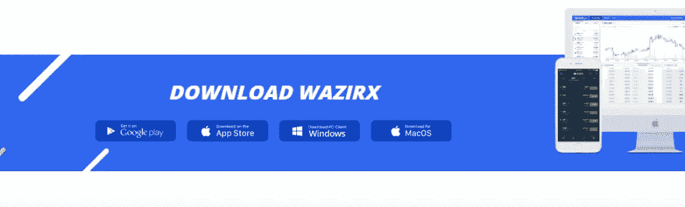

该应用程序有一个简单的用户界面，你可以从下面的链接下载:

*   [WazirX app — Playstore](https://play.google.com/store/apps/details?id=com.wrx.wazirx&referrer=utm_source%3DWazirX%2520Desktop%26utm_medium%3DFooter%26utm_term%3DDownload%2520App) (参考代码— **ad4e888q** )
*   [WazirX 应用—应用商店](https://itunes.apple.com/in/app/wazirx/id1349082789?mt=8)(推荐代码— **ad4e888q** )

您还可以了解如何开始使用该应用程序，并阅读我们关于如何使用 Wazirx 应用程序购买以太坊的文章。

# 瓦济克斯评论:推荐计划

[WazirX](https://blog.coincodecap.com/go/wazirx) 有一个独家推荐项目，让你从每笔交易中赚取 50%的佣金。你所需要做的就是分享你唯一的链接或推荐代码。

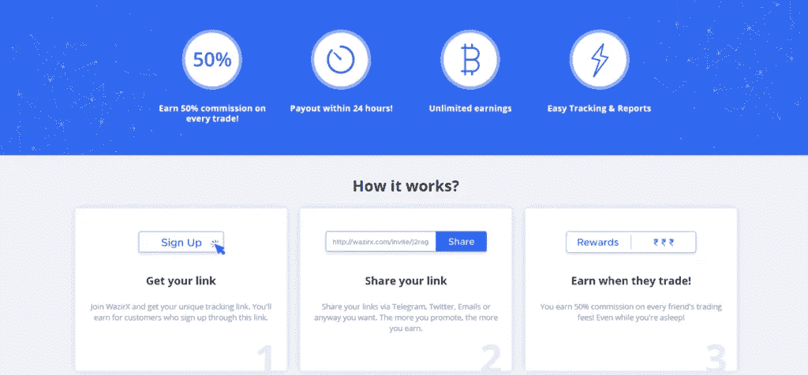

# WazirX 评论:客户支持

您可以通过提交问题请求并附上解释您的问题的必要文档来获得 [WazirX](https://blog.coincodecap.com/go/wazirx) 支持。支持团队将尽快与您联系。

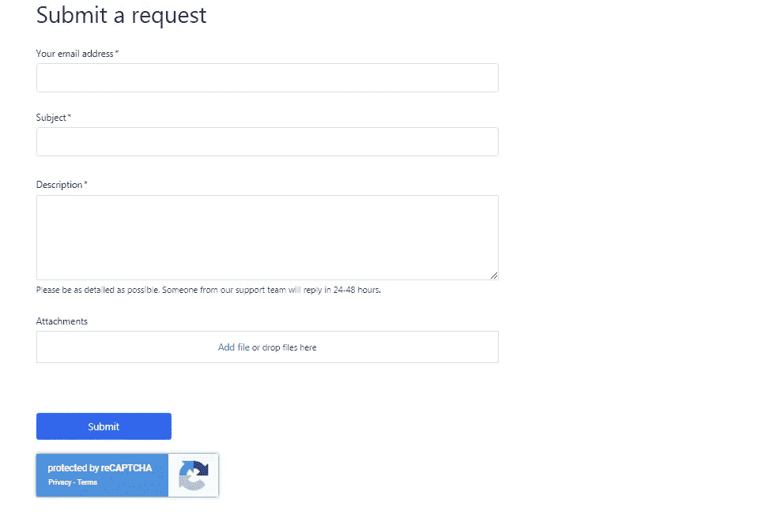

您可以按照以下步骤在 WazirX 上提出支持请求:

1.  点击 [WazirX](https://blog.coincodecap.com/go/wazirx) 主页底部的帮助中心。
2.  现在，您可以尝试在屏幕上的搜索栏中搜索您的问题，并检查解决方案是否可用。
3.  如果没有，请单击支持页面右上角的“联系我们”按钮。
4.  输入您的电子邮件地址、主题、问题描述，并附上任何必要的文档。
5.  完成后，单击提交按钮。

# 瓦济克斯评论:利弊

ProsConsThe 网站和应用程序都有一个初学者友好的用户界面。它们不提供高流动性。STF 让没有时间的投资者通过支付一定比例的利润来制作投资组合。截至 2021 年 3 月，它们没有加密贷款功能。它隶属于世界上最大的交易所币安交易所。他们对提取加密资产收取高额费用。您可以使用合众国际社存款。

# WazirX 评论:结论

[WazirX](https://blog.coincodecap.com/go/wazirx) 是一个[印度交易平台](https://blog.coincodecap.com/bitcoin-exchange-in-india)，提供自动完成订单和 STF 投资等功能。它是初学者友好的，有一个很棒的推荐程序和最好的移动交易应用程序之一。如果你正在寻找开始你的加密投资之旅，那么 WazirX 可以成为你的目的地。

# 常见问题

**WazirX 可信吗？**

是的，WazirX 是一个注册的交换平台，拥有超过一百万的用户。

## **WazirX 是比特币钱包吗？**

WazirX 是一个连接买家和卖家的印度交易平台。然而，它也提供了一个安全的钱包来存储您的加密资产。然后你可以用这个钱包来储存你的比特币。

瓦济里的 STF 是什么？

智能代币基金(STF)类似于复制交易，允许您购买智能代币，并让专业投资者代替您进行交易。作为交换，你必须付给他们你总利润的 25%。

**在 WazirX 上交易没有风险吗？**

WazirX 是一个[加密交换](https://blog.coincodecap.com/go/crypto-exchange)平台，采取所有必要的预防措施来保护你的资金。然而，你必须认识到，每一种投资都有市场风险，尤其是加密资产，因为加密货币非常不稳定。

## WazirX 在 Inida 合法吗？

是的，wazirX 在印度是合法的。此外，为了交易加密货币，WazirX 被视为一个可信的平台。

## WazirX 的创始人是谁？

WazirX 的创始人是 Nischal Shetty。

## 我们能在没有 KYC 的情况下开一个 WazirX 账户吗？

在 KYC 的帮助下，你可以存入印度卢比，进行 P2P 交易和取款，但没有 KYC，你只能存入现有的密码，如果你有任何密码的话。

## 什么是 WazirX 经纪计算器？

WazirX 对大多数加密货币对向用户收取 0.2%的交易费。此外，这与通常收取交易费、SEBI 费、清算费等费用的股票经纪人截然不同。导致需要经纪计算器。

> 加入 Coinmonks [电报频道](https://t.me/coincodecap)和 [Youtube 频道](https://www.youtube.com/c/coinmonks/videos)获取每日[加密新闻](http://coincodecap.com/)

## 另外，阅读

*   [复制交易](/coinmonks/top-10-crypto-copy-trading-platforms-for-beginners-d0c37c7d698c) | [加密税务软件](/coinmonks/crypto-tax-software-ed4b4810e338)
*   [网格交易](https://coincodecap.com/grid-trading) | [加密硬件钱包](/coinmonks/the-best-cryptocurrency-hardware-wallets-of-2020-e28b1c124069)
*   [密码电报信号](http://Top 4 Telegram Channels for Crypto Traders) | [密码交易机器人](/coinmonks/crypto-trading-bot-c2ffce8acb2a)
*   [最佳加密交易所](/coinmonks/crypto-exchange-dd2f9d6f3769) | [印度最佳加密交易所](/coinmonks/bitcoin-exchange-in-india-7f1fe79715c9)
*   开发人员的最佳加密 API
*   最佳[密码借贷平台](/coinmonks/top-5-crypto-lending-platforms-in-2020-that-you-need-to-know-a1b675cec3fa)
*   [杠杆代币终极指南](/coinmonks/leveraged-token-3f5257808b22)
*   [AscendEx Staking](https://coincodecap.com/ascendex-staking)|[Bot Ocean Review](https://coincodecap.com/bot-ocean-review)|[最佳比特币钱包](https://coincodecap.com/bitcoin-wallets-india)
*   [Bitget 回顾](https://coincodecap.com/bitget-review)|[Gemini vs block fi](https://coincodecap.com/gemini-vs-blockfi)|[OKEx 期货交易](https://coincodecap.com/okex-futures-trading)
*   [美国最佳加密交易机器人](https://coincodecap.com/crypto-trading-bots-in-the-us) | [经常性回顾](https://coincodecap.com/changelly-review)
*   [在印度利用加密套利赚取被动收入](https://coincodecap.com/crypto-arbitrage-in-india)
*   [霍比评论](https://coincodecap.com/huobi-review) | [OKEx 保证金交易](https://coincodecap.com/okex-margin-trading) | [期货交易](https://coincodecap.com/futures-trading)
*   [麻雀交换评论](https://coincodecap.com/sparrow-exchange-review) | [纳什交换评论](https://coincodecap.com/nash-exchange-review)