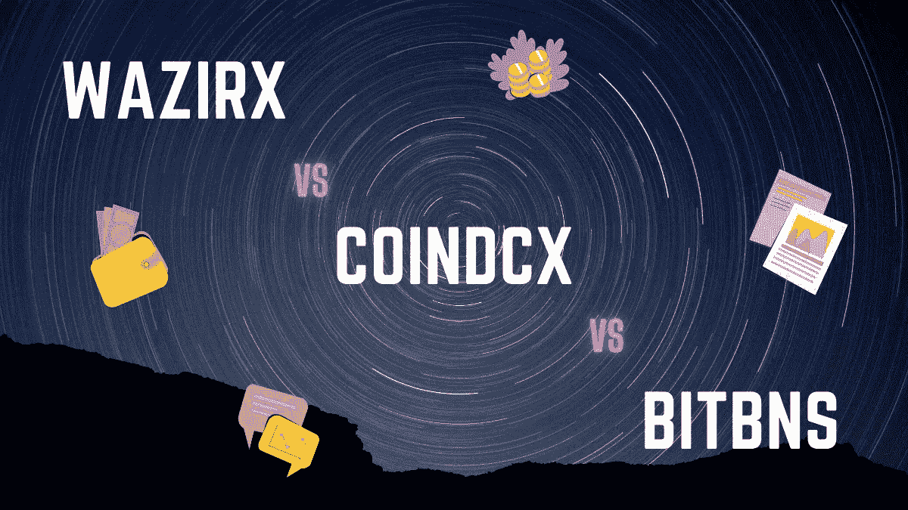
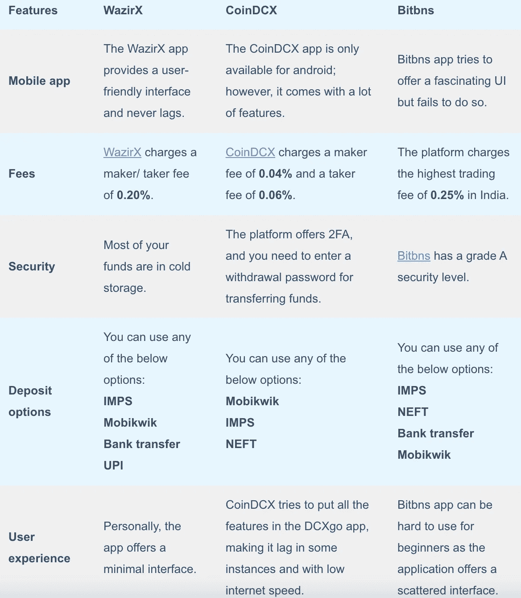
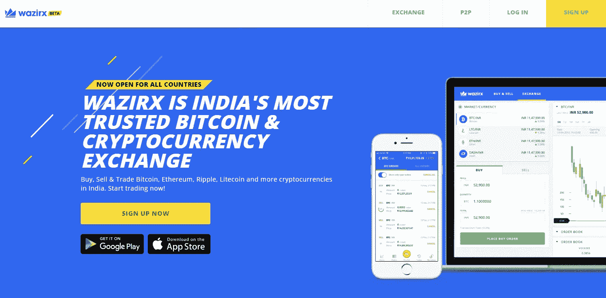
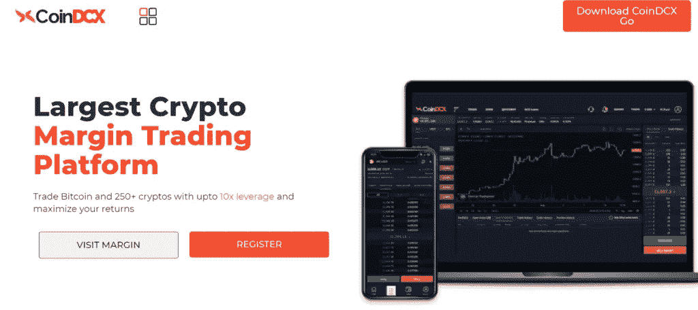
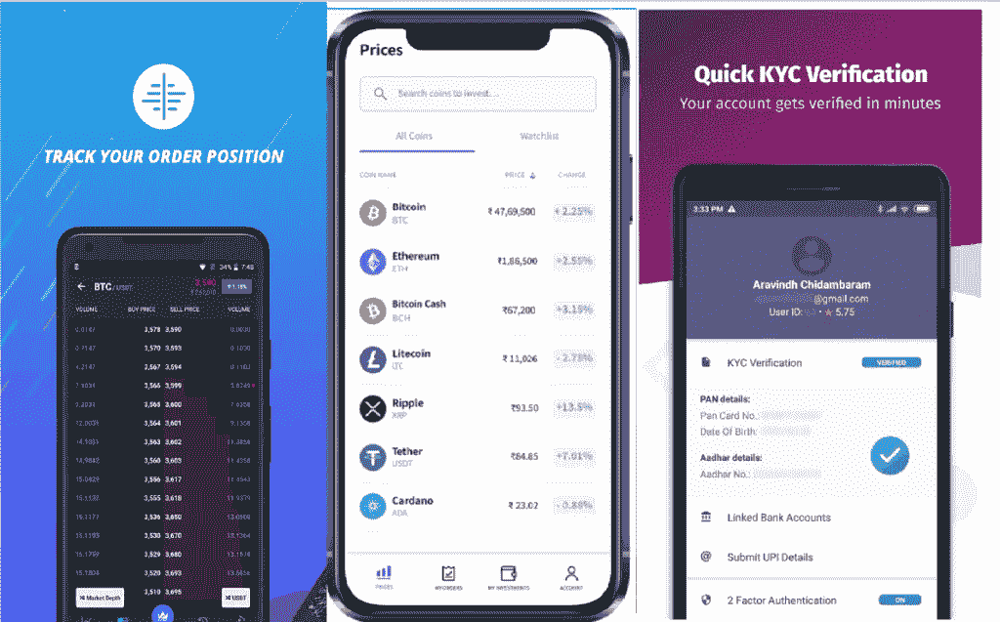
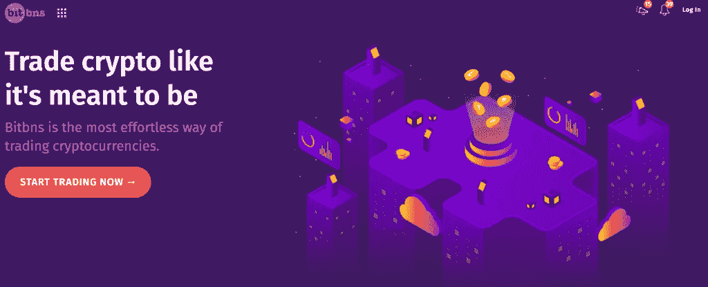

# WazirX vs CoinDCX vs bit bns——谁的费用最低？

> 原文：<https://medium.com/coinmonks/wazirx-vs-coindcx-vs-bitbns-149f4f19a2f1?source=collection_archive---------3----------------------->

在印度有各种各样的加密交易市场。那么今天，我们就来比较一下[印度 3 家最好的加密交易交易所](https://blog.coincodecap.com/bitcoin-exchange-in-india)，即 [WazirX](https://blog.coincodecap.com/go/wazirx) 、 [CoinDCX](https://blog.coincodecap.com/go/coindcx) 和 [Bitbns](https://blog.coincodecap.com/go/bitbns) 。

# 总结(TL；博士)

*   印度三大领先的加密货币交易平台分别是 [WazirX](https://blog.coincodecap.com/go/wazirx) 、 [CoinDCX](https://blog.coincodecap.com/go/coindcx) 和 [Bitbns](https://blog.coincodecap.com/go/bitbns) 。
*   [WazirX](https://blog.coincodecap.com/go/wazirx) 是用户数最多的一个；鉴于， [CoinDCX](https://blog.coincodecap.com/go/coindcx) 和 [Bitbns](https://blog.coincodecap.com/go/bitbns) 提供各种交易选项。
*   CoinDCX 和 [WazirX](https://blog.coincodecap.com/go/wazirx) 的移动应用比 Bitbns 的应用好得多。
*   [CoinDCX](https://blog.coincodecap.com/go/coindcx) 和 WazirX 提供了简单易用的手机 app 然而，Bitbns 试图使其移动应用程序具有吸引力，但没有成功。
*   WazirX 和 [Bitbns](https://blog.coincodecap.com/go/bitbns) 收取市场上最高的费用；鉴于 CoinDCX 收取最低交易费。
*   您可以轻松地将 WazirX 与币安连接起来，然后将您的所有资金转移到币安，而无需支付任何转账费用。
*   这三个平台的安全性一直是创始人的首要关注点。到目前为止，它们都没有遭受任何形式的破坏。

# CoinDCX vs WazirX vs Bitbns:概述

## 瓦济克斯

WazirX 是印度顶级加密交易所之一，提供最安全的服务。该交易所有一个名为 WRX 的令牌，它是基于 T2 的币安链 T3。在 WazirX 上使用 WRX 有多重好处，比如在交易费用上获得折扣。

[币安](https://blog.coincodecap.com/binance-review)在 2019 年底收购了 WazirX。因此，您可以轻松连接两个交易所，在 [WazirX](https://blog.coincodecap.com/go/wazirx) 存入印度卢比，然后在[币安](https://blog.coincodecap.com/go/binance)转账 USDT。

要了解更多信息，请阅读我们的 [WazirX 评论](https://blog.coincodecap.com/wazirx-review)。如果你希望投资比特币，你可以阅读我们关于如何在 WazirX 购买比特币的指南？

## CoinDCX

[CoinDCX](https://blog.coincodecap.com/go/coindcx) 由新加坡一家名为 DCX 的公司创建，自 2018 年以来一直活跃在印度。平台支持多种加密货币；但是，您只能撤回有限数量的加密资产。

要了解更多信息，请阅读我们的 [CoinDCX 评论](https://blog.coincodecap.com/coindcx-review)。也可以参考我们的指南如何[在 CoinDCX](https://blog.coincodecap.com/buy-shiba-coindcx) 购买柴犬？。

## Bitbns

Bitbns 由 IIT 大学的毕业生于 2017 年创立，该平台现在支持 90 多种加密资产的交易。除此之外，该平台还提供 A 级安全级别，并拥有可靠的客户支持。

要了解更多，请阅读我们的 [Bitbns 评论](https://blog.coincodecap.com/bitbns-review)。你也可以参考我们关于如何[在 Bitbns](https://blog.coincodecap.com/buy-shiba-bitbns) 购买柴犬的指南？

如果你是初学者，想知道从哪里开始你的交易之旅，我们可以帮你。参考我们的[投资加密货币指南](https://blog.coincodecap.com/crypto-investing-guide)，了解交易前你需要知道的一切。

# Bitbns vs WazirX vs CoinDCX:交易选项

作为一名加密交易者，你需要了解任何平台上的所有交易选项。因此，在这里，我们将涵盖所有三个平台上的所有内容。

## WazirX 交易期权

1.  **现货交易:**WazirX 的现货交易允许你下限价单、市价单或止损单。如果您选择限价单，您的订单只有在市场满足您设定的价格时才会执行。而在止损限价单中，你的限价单只有在市场触及止损价时才会被下单。
2.  **WazirX P2P 交易所:**当你的订单要求得到满足时，WazirX P2P 会自动为买家和卖家配对。一旦您成功验证您的付款，平台将释放您的资金。需要记住的一点是，在 WazirX P2P 上运营时，你只能在 USDT 进行交易。
3.  **WazirX 智能交易基金(STF):**WazirX STF 类似于[复制交易](/coinmonks/top-10-crypto-copy-trading-platforms-for-beginners-d0c37c7d698c)，因为它连接了专业交易者和新手。这些专业交易者收取你一定比例的利润，维护你的投资组合。但是，您每天只能提取一次资金，您将根据专业交易员的投资组合分配获得您的投资金额。
4.  **WazirX 硬币:** WRX 是一种 [**WazirX**](https://blog.coincodecap.com/go/wazirx) 硬币，你可以用它来获得交易费折扣或交易其他加密资产。该交易所推出了自己的 NFT 平台，导致 WRX 的价值突然上升。如果你拥有一枚 WazirX 硬币，你就有资格享受许多优惠，包括空投、折扣等。

## CoinDCX 交易期权

1.  **现货交易:** [CoinDCX](https://blog.coincodecap.com/go/coindcx) 为其所有用户提供现货交易选项，由世界一流的撮合引擎提供支持。该交易所为所有限价和市价订单提供高流动性。
2.  [**保证金交易**](https://blog.coincodecap.com/go/margin-trading) **:** 是印度首批支持[保证金交易](https://blog.coincodecap.com/margin-trading)的交易平台之一，杠杆高达 10 倍。你可以在比特币和差不多 250+的替代币上进行保证金交易。平台对前 24 小时借入的资金不收取任何利息。此后，适用名义利率 **0.05%** 。
3.  **期货交易:**期货交易允许你在未来以预定的价格买入/卖出一种商品。你可以在 [CoinDCX](https://blog.coincodecap.com/go/coindcx) 交易期货，杠杆高达 15 倍。
4.  **CoinDCX 贷款:**而 [crypto lending](https://blog.coincodecap.com/top-5-crypto-lending-platforms) ，借款人从投资者处贷款，并向投资者支付利息作为回报。最长放款时间为七天，随时可以提取资金。
5.  **CoinDCX Staking** :使用 CoinDCX [staking](https://blog.coincodecap.com/staking-crypto) 时，你必须锁定你的资产一段指定的时间，以验证[区块链网络](https://blog.coincodecap.com/what-is-blockchain-a-simple-guide-for-dummies) k。成功验证区块后你将获得奖励。

## Bitbns 交易期权

1.  **现货交易:** [Bitbns](https://blog.coincodecap.com/go/bitbns) 现货交易在印度加密市场提供了很高的流动性。您可以在印度卢比/ USDT/ BTC 交易超过 130 种加密资产。
2.  [**保证金交易**](https://blog.coincodecap.com/go/margin-trading) **:** 在 Bitbns，你可以对 28 项加密资产进行高达 4 倍的杠杆操作。作为一个初学者，你应该远离保证金交易，因为它也可能导致高额损失。
3.  **融资融券:**该功能在 Bitbns 的融资融券交易选项内可用。你通过在一段时间内对你借出的资产赚取利息来赚取保证金贷款。
4.  **固定收益计划(FIP):** 固定收益计划或 FIP 允许您在固定的时间和回报率内投资 USDT 或 BTC。您可以在仪表板上选择任何一个可用的计划。但是，每个计划都有一个分配限额，在此限额之前，您将无法在该特定计划中添加任何投资。要了解更多关于 FIP 的信息，请参考 [Bitbns 博客](/bitbns/introducing-fixed-income-plan-3bc59a18aed2)。

# WazirX vs CoinDCX vs Bitbns:费用

你可能没有意识到，但交易费在加密交易中起着至关重要的作用。你必须做你的研究，寻找一个交易费用最低的平台；众所周知，如果你赢了一笔交易，你得到的比你赢的少，如果你输了一笔交易，你输的比你的实际损失多。

## WazirX 费用

[WazirX](https://blog.coincodecap.com/go/wazirx) 收取的交易费用比 CoinDCX 高，但比 Bitbns 低。WazirX P2P 不收取任何费用。但是，在现货交易中，你必须支付 0.2%的庄家/庄家费用。

除此之外，对于通过银行转账的存款，收取 6.7 卢比的交易费。通过合众国际社存款不收取任何费用。然而，通过 [Mobikwik](https://www.mobikwik.com/) 存款有大约 2%的存款费。此外，你通过 STF 获得的利润的 25%流向了熟练的交易者。

## CoinDCX 费用

[CoinDCX](https://blog.coincodecap.com/go/coindcx) 交易费用较低，做市商费用为 0.04%，收单者费用为 0.06%。然而，交易所收取很高的取款费，每笔 BTC 取款收取 0.001 BTC。平台对借入资金收取 0.05%的利息。

## Bitbns 费用

[Bitbns](https://blog.coincodecap.com/go/bitbns) 费用是印度[加密交易平台](https://blog.coincodecap.com/go/crypto-exchange)中最高的费用之一。它向交易者收取 0.25%的做市商和收市商费用。谈到保证金交易，只有贷款人必须支付他们向借款人收取的利息的 15%的费用。

平台不收取任何押金费用。但是，所有交易都要收取取款费。关于 Bitbns 费用的详细信息，可以参考 [Bitbns 费用结构](https://bitbns.com/fees/)。

[WazirX](https://blog.coincodecap.com/go/wazirx) 最近转向 MobiKwik 收取押金，并开始收取大约 2%的押金。虽然，你也可以用 WazirX P2P 进行存款，完全免费。 [CoinDCX](https://blog.coincodecap.com/go/coindcx) 不收取任何存款费用，Bitbns 也是如此。然而，您可以通过将资金转移到[币安](https://blog.coincodecap.com/go/binance)来节省您在 WazirX 的交易费用，并且不收取任何取款费。

# CoinDCX vs Bitbns vs WazirX:移动应用

手机是我们生活中不可或缺的一部分，在加密交易中扮演着重要的角色。你可以使用手机应用程序进行交易、转移资金、分析市场，以及做任何事情。

## WazirX 应用程序

WazirX 应用程序有一个简单的用户界面。这款应用并没有在功能上妥协，几乎拥有所有的元素，就像它的官网一样。这些功能包括现货交易、WazirX P2P 等。你也可以推荐你的朋友，从他们的交易费中赚取 50%的佣金。

除此之外， [WazirX](https://blog.coincodecap.com/go/wazirx) 应用可用于所有[安卓](https://play.google.com/store/apps/details?id=com.wrx.wazirx&hl=en_IN&gl=US)和[苹果](https://apps.apple.com/in/app/wazirx/id1349082789)设备(参考代码— **ad4e888q** )。还可以使用 WazirX app，使用 UPI 进行资金存款；然而，WaxirX 在 INR 存款方面面临问题，经常改变其存款方法。

## CoinDCX 应用程序

CoinDCX 移动应用称为 [CoinDCX Go](https://go.coindcx.com/) 仅适用于 android 用户。该应用程序允许您通过链接您的银行账户立即购买加密资产。但是，未经 KYC 验证的账户有每月印度卢比存款限额。CoinDCX Go 移动应用程序经常挂起，并且对缓慢的互联网速度没有响应。

## Bitbns 应用程序

[Bitbns](https://blog.coincodecap.com/go/bitbns) 移动应用同时面向 [Android](https://play.google.com/store/apps/details?id=com.bitbns&hl=en_IN&gl=US) 和 [IOS](https://apps.apple.com/in/app/bitbns-crypto-trading-exchange/id1346160076) 用户。您可以通过合众国际社存款、下单、借出/借入、提取等。使用 Bitbns 应用程序。然而，Bitbns 应用程序包含许多错误，经常滞后。

WazirX 应用程序击败了 CoinDCX 和 Bitbns，因为它提供了一个简单的用户界面，可以在所有类型的市场条件下工作。而另外两个在极端的市场条件下经历沉重的负荷。

要了解更多信息，请阅读我们的印度最佳比特币应用指南。

# WazirX vs CoinDCX vs Bitbns:用户界面

用户界面在决定你与网站的互动方面起着至关重要的作用。用户界面越简单，你在交易所的交易就越容易。

## 瓦济里克斯 UI/UX

WazirX 有一个简单直观的用户界面。在其网站和移动应用程序上，事情很容易理解。您可以通过 [WazirX app](https://wazirx.com/download) 非常轻松地进行交易、存款和取款。

## CoinDCX 用户界面/UX

CoinDCX 提供了一个简单的交互式用户界面。网站上的事情很简单，但由于平台提供了如此多的功能，移动应用程序有点复杂。

## Bitbns 用户界面/UX

Bitbns 提供了一个非常丰富多彩、引人注目的用户界面。如果你喜欢迷人的插图，这是启动你的交易之旅的绝佳选择。然而，移动界面可能会感觉奇怪，因为图标和按钮主要是错位的。

所有三个交换都有一个简单明了的用户界面。然而，与其他两个平台相比，WazirX 的 UI 更简单，更易于使用。

# WazirX vs CoinDCX vs Bitbns:安全性

## WazirX:WazirX 安全吗？

[WazirX](https://blog.coincodecap.com/go/wazirx) 将 95%的用户资金存储在线下冷库中。因此，您的资金是安全的，防止黑客。除此之外，您必须始终启用双因素身份验证，并使用官方网站和移动应用程序。

## coin dcx:coin dcx 安全吗？

CoinDCX 是印度最安全的交易平台之一。因此，该平台维护您的数据的适当安全性，并且由您来保护您所有的密码。您还必须启用双因素身份验证，以获得更安全的交易体验。

平台要求您每 30 天创建一个新的取款密码，密码只有在更改后 24 小时才会启用。这增强了平台的安全性。

## bit bns:bit bns 安全吗？

在安全性方面，Bitbns 击败了它的竞争对手。它拥有先进的安全架构和 A 级安全功能。这使得您的 INR 数量，数据，加密资产和钱包，是完全安全的。另一方面，Bitbns 也支持 google 认证或者 2FA 认证。

# WazirX vs CoinDCX vs Bitbns:支持

在任何加密交易平台上，客户支持都是客户满意度不可或缺的一部分。如果客户支持是疏忽的，那么你作为一个用户必须面对许多麻烦。

## WazirX 支持

您可以通过写请求来联系 WazirX 支持团队，不要忘记附上必要的文档。WazirX 的团队可能会尽快通过电子邮件与您联系。

## CoinDCX 支持

CoinDCX 通过电子邮件提供 24 小时支持。但是，电报频道和聊天支持时间是从早上 6:00 到晚上 11:00。

## Bitbns 支持

同样，和其他两个平台一样，你可以通过 Telegram、Instagram、脸书等联系 Bitbns 支持。或者，您也可以通过[提交票证](https://bitbns.freshdesk.com/support/home)来提交您的疑问/问题。

## 比特恩斯电报

你可以通过他们的[电报频道](https://t.me/Bitbns)联系 Bitbns，也可以跟进他们的公告。

## Bitbns Twitter

你也可以通过 Bitbns Twitter 账户联系他们，给他们加标签或者给他们发信息。

# WazirX vs CoinDCX vs Bitbns:结论

WazirX、CoinDCX 和 [**Bitbns**](https://blog.coincodecap.com/go/bitbns) 是印度[排名前三的加密交易所](https://blog.coincodecap.com/bitcoin-exchange-in-india)。相比之下，WazirX 最适合新手；但是，它收取很高的交易费用。另一方面， [**CoinDCX**](https://blog.coincodecap.com/go/coindcx) 有一些最低的交易费用可供你选择。谈到 Bitbns，它收取市场上最高的交易费用，并提供了一个有吸引力但令人迷惑的用户界面。

然而， [**WazirX**](https://blog.coincodecap.com/go/wazirx) 可能会赢得每一期的比赛，因为你可以使用该平台存入印度卢比并将其兑换成 USDT。然后，您可以在[币安](https://blog.coincodecap.com/go/binance)上创建一个账户，并连接两个账户。这将允许您将资金直接转移到您的 [**币安**](https://blog.coincodecap.com/go/binance) 账户，而不收取任何费用。

# 常见问题

**我如何处理 CoinDCX INR 提款？**

首先，您必须登录到您的 CoinDCX 帐户。然后从 DCXgo 移动应用程序底部的导航栏进入基金部分，点击 INR 钱包。输入您希望提取的金额，并通过验证流程进行转账。

从比特币银行提取加密货币需要多长时间？

加密货币的提取时间取决于特定的加密资产和您要提取的资产数量。比如[比特币](https://blog.coincodecap.com/a-candid-explanation-of-bitcoin)需要四块确认才能转账成功。您的资金可能需要几分钟到几个小时才能反映在您的收款账户中。

在 WazirX 上交易没有风险吗？

WazirX 是一个[加密交换](https://blog.coincodecap.com/go/crypto-exchange)平台，采取所有必要的预防措施来保护你的资金。然而，你必须认识到，每一种投资都有市场风险，尤其是加密资产，因为加密货币非常不稳定。因此，没有任何投资是无市场风险的。

*   [如何在印度购买以太坊？【手机和网站 2021】](https://blog.coincodecap.com/buy-ethereum-in-india)
*   [Bitbns 评论 2021:合法安全吗？](https://blog.coincodecap.com/bitbns-review)
*   [CoinDCX 评论 2021 |安全吗？【必读】](https://blog.coincodecap.com/coindcx-review)
*   [印度 5 大最佳比特币交易所【2021】](https://blog.coincodecap.com/bitcoin-exchange-in-india)
*   [如何在印度购买比特币 2021？【先看这个】](https://blog.coincodecap.com/buy-bitcoin-india)

***包含附属链接**

> 加入 [Coinmonks 电报频道](https://t.me/coincodecap)，了解加密交易和投资

## 另外，阅读

*   最好的[密码交易机器人](/coinmonks/crypto-trading-bot-c2ffce8acb2a)
*   [电网交易机器人](https://blog.coincodecap.com/grid-trading) | [Cryptohopper 审查](/coinmonks/cryptohopper-review-a388ff5bae88)
*   [加密复制交易平台](/coinmonks/top-10-crypto-copy-trading-platforms-for-beginners-d0c37c7d698c) | [如何在 WazirX 上购买比特币](/coinmonks/buy-bitcoin-on-wazirx-2d12b7989af1)
*   [CoinLoan 点评](/coinmonks/coinloan-review-18128b9badc4)|[Crypto.com 点评](/coinmonks/crypto-com-review-f143dca1f74c) | [火币保证金交易](/coinmonks/huobi-margin-trading-b3b06cdc1519)
*   [尤霍德勒 vs 科恩洛 vs 霍德诺特](/coinmonks/youhodler-vs-coinloan-vs-hodlnaut-b1050acde55a) | [Cryptohopper vs 哈斯博特](https://blog.coincodecap.com/cryptohopper-vs-haasbot)
*   [顶级付费加密货币和区块链课程](https://blog.coincodecap.com/blockchain-courses) | [币安评论](/coinmonks/binance-review-ee10d3bf3b6e)
*   [MXC 交易所评论](/coinmonks/mxc-exchange-review-3af0ec1cba8c) | [Pionex vs 币安](https://blog.coincodecap.com/pionex-vs-binance) | [Pionex 套利机器人](https://blog.coincodecap.com/pionex-arbitrage-bot)

*原载于 2021 年 6 月 7 日*[*【https://blog.coincodecap.com】*](https://blog.coincodecap.com/wazirx-vs-coindcx-vs-bitbns)*。*