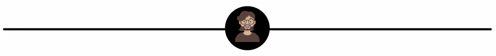

# 我们都是中本聪，我们是这个故事的关键

> 原文：<https://medium.com/coinmonks/we-are-all-satoshi-nakamoto-and-were-the-key-to-this-story-15168f17b99d?source=collection_archive---------16----------------------->

## 重要的不是谁，而是他们做了什么

在谷歌上输入“中本聪”,你会得到数百万，甚至数十亿条关于比特币的结果，并试图揭开它们可能是谁的秘密。

在过去的十年里，一些人被认为是比特币的神秘创造者，更多的人声称自己是神秘的实体，还有一些人一直否认自己是神秘的角色。

如果你来这里是为了另一个问题，“中本聪会是谁？”*那我就要让你失望了，* **因为这不是那个**。

> 在我看来，是谁或者他们是谁并不重要(如果我们假设不是一个人)。更重要的是，他们早在 2009 年就开始写的故事，以及我们现在如何成为这个故事的作者。

在比特币进入我们生活之前不久，我们在 2008 年遭受了毁灭性的金融衰退。

这场经济衰退见证了贪婪、伦理和道德被带到了一段时间未见的高度。从本质上讲，世界顶级银行做着他们一直在做的事情——去他妈的普通人，帮助富人变得更富。在此期间，似乎不管他们的鲁莽行为，没有惩罚这些机构。

相反，他们的政府救了他们，以阻止系统崩溃到灾难性的程度，尽管他们是首先对此负责的人。

因此，尽管这些银行家只是受到了轻微的惩罚，但他们仍能拿到年度奖金，而普通人却在受苦。人们失去了家园、生计，在某些情况下甚至失去了生命。但是，普通人能做什么呢？当所有这些银行都控制着金融操作系统时，哪一家能够挣脱呢？

感觉这是一个更好的魔鬼你知道的情况，我们所有人都在与他们做生意。

# 输入比特币和我们的神秘朋友

我们都觉得被自己的处境困住了。

控制我们处理金融交易方式的机构的囚犯。然而，在我们小小的蓝色星球的某个地方，有人想出了一个改变这一切的主意。

2008 年 10 月 31 日，一份名为**“比特币:点对点电子现金系统”**的著名白皮书在 Bitcoin.org 发布，作者是我们现在所知的神秘实体中本聪。

在这份白皮书中，他们分享了**“我一直在开发一个完全点对点的新电子现金系统，没有可信的第三方”**。现在，对于社会的很大一部分人来说，他们刚刚被那些本应保护他们和他们的财务的机构所欺骗，这使人们的兴趣达到了顶峰。

> 在最简单的层面上，比特币的产生是为了从传统金融机构(即银行)手中夺走权力。这将是一个没有障碍的支付系统，不能被第三方管理、控制或操纵。这是来自机构的财务自由的承诺，这些机构刚刚表现出对许多人辛苦挣来的钱的严重滥用。

我们被赋予了一条从银行控制中挣脱出来的道路，在过去十年中，我们中的越来越多的人已经深入那个兔子洞，继续为这个故事做出贡献。

# 故事还在继续…

每个研究加密、区块链技术、购买比特币或任何加密货币的人都是这个故事的一部分。

当我在 2021 年写这篇文章的时候，一个简单的回应富人贪婪的理想已经发展到难以想象的高度。加密给了人们创造财富的机会，尽管风险很大，但这在 10 年前是不可能的。

去中心化的财务应用程序让我们可以用自己的钱做更多的事情。受比特币启发的支付系统的演变使我们能够购买并真正拥有数字资产。

也许，Satoshi 的实体没有预见到所有或任何这一切的发生。但是，由于他们播下了种子，我们都发现自己在继续这项工作和这个故事。2010 年，聪自己离开了公众对这段旅程的看法？然而，他们是谁并不重要，重要的是他们做了什么。

据我们所知，最初的团队或个人很可能正在幕后工作，仍然为这个故事做出贡献。我为此感谢他们。但不管他们是谁，事实上，我们现在都是中本聪。

每个走进这个故事，参与比特币开创的一切的人，都是神话的一部分。那些说这是不对的，我们不能成为这个腐败系统的一部分，并决定对此做些什么的人现在都是这个正在进行的故事的创造者。

那么，中本聪是谁？**毫无头绪！**

然而，我们继续这个故事，并为一个或许更新、更透明、更平等的金融运营体系撰写叙事。这才是最重要的，故事在继续，我们感谢他们所做的一切，而不是浪费时间去了解他们是谁。

# 更多来自我

[剑拔弩张的 NFT 解释道:买不起整个 NFT？只买一个零件代替](https://wire.insiderfinance.io/fractionalised-nfts-explained-can-t-afford-a-whole-nft-just-buy-one-part-instead-a17ab98c06bc)

[矩阵影响了区块链、加密、去伪存真和 NFT 的一切](/coinmonks/how-the-matrix-paved-the-way-for-blockchain-and-decentralisation-e22ade176564)

# 想要更多这样的吗？

[订阅我的免费双周刊简讯](https://www.getrevue.co/profile/One_More_Thing)专注于分享提高你财商的最佳内容。没有垃圾邮件，随时退订。

# 重要的🚨

我不是财务顾问、心理学家或任何被认可的专业人士。因此，这不是财务建议，我没有资格或许可提供任何类似的东西。这些内容是一群来自人类同胞的想法，仅用于教育目的——仅此而已。

> 加入 Coinmonks [电报频道](https://t.me/coincodecap)和 [Youtube 频道](https://www.youtube.com/c/coinmonks/videos)了解加密交易和投资

## 也阅读

 [## 最佳加密交易所| 2021 年十大加密货币交易所

### ICON _ PLACEHOLDEREstimated 预计阅读时间:28 分钟加密货币交易所的加密交易需要知识…

blog.coincodecap.com](https://blog.coincodecap.com/crypto-exchange)  [## 2021 年 10 大最佳加密贷款平台| CoinCodeCap

### 当谈到加密货币贷款时，大量因素等同于良好的收入状况。此外，借款的一部分…

blog.coincodecap.com](https://blog.coincodecap.com/crypto-lending)  [## 2021 年最佳免费加密交易机器人

### 2021 年币安、比特币基地、库币和其他密码交易所的最佳密码交易机器人。四进制，位间隙…

medium.com](/coinmonks/crypto-trading-bot-c2ffce8acb2a)  [## 最佳 4 个加密交易信号电报通道

### 这是乏味的找到正确的加密交易信号提供商。因此，在本文中，我们将讨论最好的…

medium.com](/coinmonks/best-crypto-signals-telegram-5785cdbc4b2b)  [## BlockFi 评论 2021:利弊和利率| CoinCodeCap

### 今天，我们提出了一个全面的 BlockFi 评论，这是一个成立于 2017 年的加密贷款平台，拥有其…

blog.coincodecap.com](https://blog.coincodecap.com/blockfi-review)  [## 如何在印度购买比特币？2021 年购买比特币的 7 款最佳应用[手机版]

### 如何使用移动应用程序购买比特币印度

medium.com](/coinmonks/buy-bitcoin-in-india-feb50ddfef94)  [## 加密税务软件——五大最佳比特币税务计算器[2021]

### 不管你是刚接触加密还是已经在这个领域呆了一段时间，你都需要交税。

medium.com](/coinmonks/best-crypto-tax-tool-for-my-money-72d4b430816b)  [## 存储比特币的最佳加密硬件钱包[2021] | CoinCodeCap

### 保管您的数字资产很容易，但找到正确的存储方式却是一项繁琐的任务。在线钱包有一个风险…

blog.coincodecap.com](https://blog.coincodecap.com/best-hardware-wallet-bitcoin)