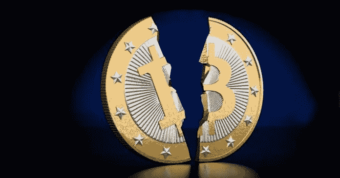

# 我们需要给加密货币更多的时间

> 原文：<https://medium.com/coinmonks/we-need-to-give-cryptocurrencies-more-time-89aedf791cb2?source=collection_archive---------0----------------------->

It ain’t broken — it’s just too early to call.

这个理论吸引人的地方在于它的优雅和简单，以及全世界励志演讲大师的响亮号召，

> “成功就像烤蛋糕，如果你遵循别人成功做过的食谱，你应该会得到同样的结果。”

另一个经常听到的格言是，“成功留下线索。”