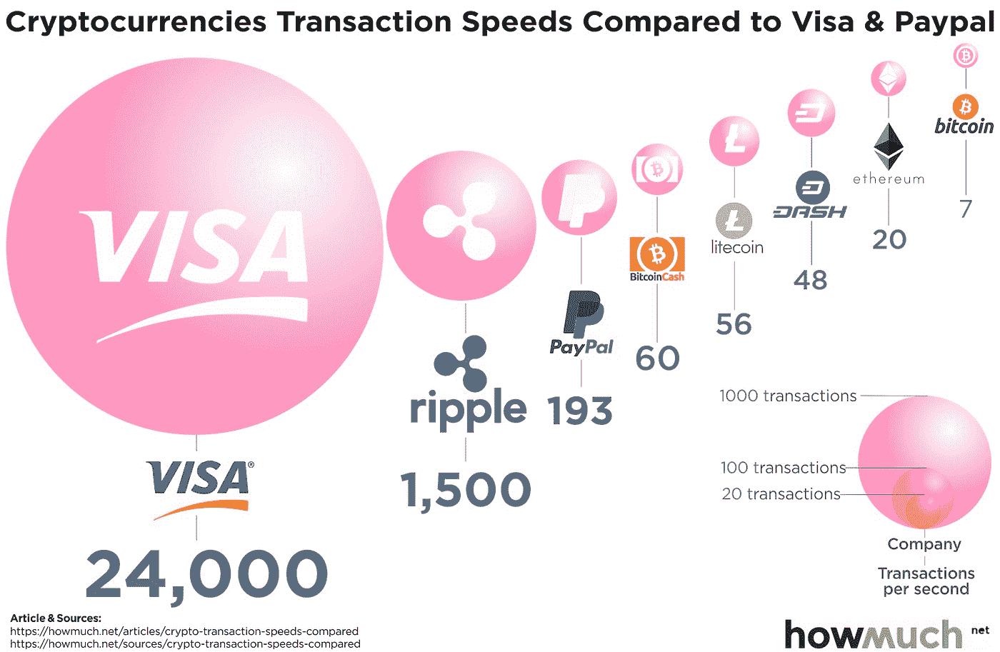
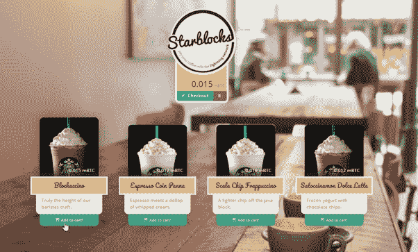
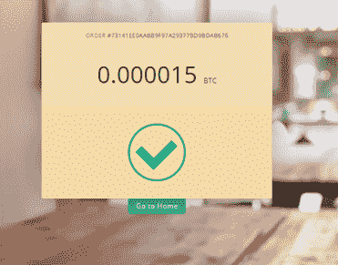
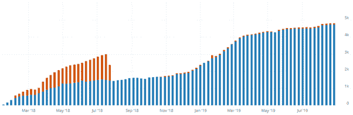

# 我们需要谈谈比特币闪电。它是游戏规则的改变者吗？

> 原文：<https://medium.com/coinmonks/we-need-to-talk-about-bitcoin-lightning-fed6613d8df9?source=collection_archive---------1----------------------->

在这篇综述中，我将看看闪电网络的现状。我正在调查自 2016 年[白皮书](https://lightning.network/lightning-network-paper.pdf)以来取得了哪些进展，我将建立自己的 Lightning node。

Lightning…

# 闪电网是什么？

闪电网络可以被视为比特币之上的一层。也称为“第二层”解决方案。这一层解决了比特币目前面临的许多问题。闪电网络解决的主要问题是交易速度。目前，比特币网络上的每秒交易量(TPS)在 3.3 到 7 TPS 之间。此外，平均每 10 分钟就会创建一个新的“数据块”。像 Visa 这样的信用卡网络每秒可以处理约 2000 笔交易，比比特币的约 7 TPS 多得多。为了增加 TPS，有几种可能的解决方案，其中之一是闪电网络。

Differences in Transactions Per Second (TPS)

# 但是闪电网络是如何工作的呢？

闪电网络背后的想法是，没有必要在区块链上存储小额的日常交易。相反，闪电网络在比特币网络之上提供了第二层。

尽管这是一个独立的层，但交易仍然存储在比特币网络区块链上。为了通过闪电网络发送交易，必须首先在两个用户之间开通“支付通道”。该事务存储在区块链上。然后，两个用户可以通过 lightning 网络相互发送交易。当他们发送完事务后，他们可以再次关闭这个通道。为了关闭通道，在区块链上保存另一个事务。在区块链上，你总共只需要两笔交易，但你可以通过一个支付渠道发送无限笔交易(只要有足够的比特币)。

要通过 lightning network 进行支付，您需要与他人开通一个支付通道。但假设你在一家餐厅有支付渠道，你的一个朋友也想在同一家餐厅交钱。然后你的朋友就可以使用你已经拥有的餐厅频道。如果您还没有连接到支付通道，lightning network 将自动尝试找到连接网络的最快路径。幸运的是，您只需支付很少的费用(～0.000102061 美元)就可以进行支付，并为渠道打开和关闭一次性交易。

# 帮助闪电网络

为了看看设置一个帮助闪电网络的节点有多难，我买了一个树莓 Pi (35 欧元)和一个外置硬盘(45 欧元)。目前，通过托管这样一个节点并在闪电网络上处理支付，你每年可以赚大约 300 美元。

# 如果你想自己主持一个闪电节点，你必须注意的事情:

闪电网络还没有完全稳定，所以你有失去比特币的危险。此外，比如你的硬盘可能会坏掉，如果你没有做备份，你可能会失去一切。

*   确保你在闪电网络“测试网”上练习，这是一种练习区块链，你可以在开始使用真正的比特币之前免费测试。

我花了大约 1.5 小时在测试网上运行了一个 lightning node，使用的是 RaspiBolt 的这个[指南](https://stadicus.github.io/RaspiBolt/)。然后我从一个 [testnet 水龙头](https://bitcoinfaucet.uo1.net/)加了一些资金，买了一个 testnet ' [Blockaccino](https://starblocks.acinq.co/) 。

Starblocks’, a site where you can make testnet lightning purchases.

My first testnet purchase completed!

# 闪电网络的现状

闪电网络的发展速度令人难以置信，我们正在努力改进它。这种第 2 层解决方案为提高网络的可扩展性提供了很好的解决方案。要解决所有问题，比特币将不仅仅依靠第二层解决方案。但是其他技术，比如 SegWit 和' [Schnorr signatures](https://youtu.be/JeJzwZgxF50?t=226) '将会有助于进一步提高长期的可伸缩性。

Growth of the number of nodes on the Lightning network

# 闪电网的优缺点是什么？

# 优势

1.  **交易处理速度更快。**这减轻了比特币网络的压力，最终降低了所有人的交易成本。
2.  **发送交易费用非常低。**比特币目前每笔交易的平均费用约为 1 美元。与闪电网络你平均支付~$0.000102061！
3.  **用户获得对网络的更多控制。此刻，矿工们手中握有很大的权力，他们使用昂贵的设备来切碎。对于闪电网络，你只需要一个树莓派，硬盘和互联网连接。**
4.  **匿名**。在闪电网络上发送的交易不可能从外部追踪，也不能在区块链上看到。

# 不足之处

1.  **尚未完全稳定。**还有一些 bug&开发正在进行中。网络完全稳定还需要一点时间。
2.  **对于普通用户来说，lightning 网络的设置和使用仍然非常复杂。这将在未来得到改进，以便更多的人可以使用它。更多的比特币钱包将需要开始支持闪电网络，以使其得到广泛使用。**
3.  **限制。**你发送的比特币不能超过支付渠道中的数量。这有时会导致恼人的决定。你希望你的比特币在闪电网上还是在你的比特币钱包里？
4.  **不能发送离线交易**，比特币可以。

# 结论

闪电网络是比特币的一大发展。问题仍然是它是否最终满足所有需求，以及它需要多长时间才能变得更容易被用户使用。如果你仍然有一个树莓皮躺在某个地方，那么我建议你尝试建立一个闪电节点。它很有教育意义，你为网络的发展做出了贡献。

**有问题吗？备注？告诉我，我很乐意收到你的来信。**

*来源:*

[https://lightning . network/lightning-network-paper . pdf](https://lightning.network/lightning-network-paper.pdf)

[https://eprint.iacr.org/2019/416](https://eprint.iacr.org/2019/416)

[https://USA . visa . com/dam/VCOM/download/corporate/media/visa-fact-sheet-jun 2015 . pdf](https://usa.visa.com/dam/VCOM/download/corporate/media/visa-fact-sheet-Jun2015.pdf)

[https://1ml.com/statistics](https://1ml.com/statistics)

[https://stadicus.github.io/RaspiBolt/](https://stadicus.github.io/RaspiBolt/)

[https://github.com/lightningnetwork/lnd](https://github.com/lightningnetwork/lnd)

[https://bitcoinvisuals.com/ln-nodes](https://bitcoinvisuals.com/ln-nodes)

> [直接在您的收件箱中获得最佳软件交易](https://coincodecap.com/?utm_source=coinmonks)

