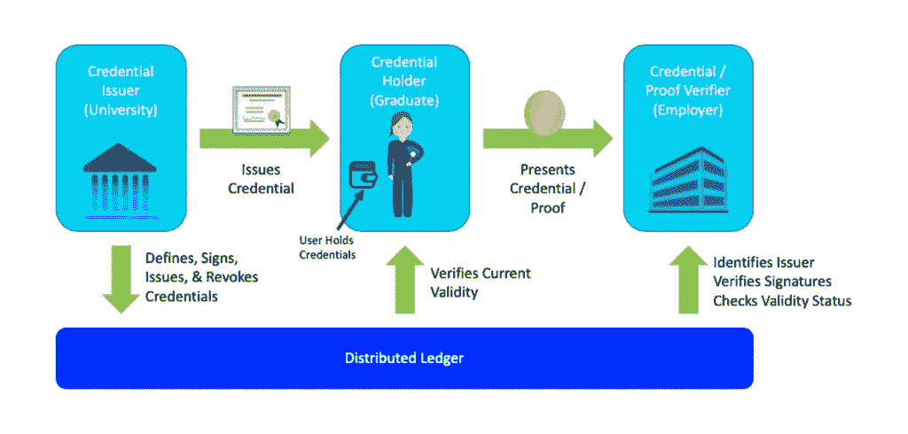
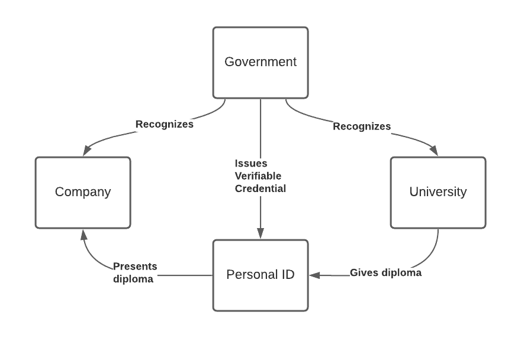
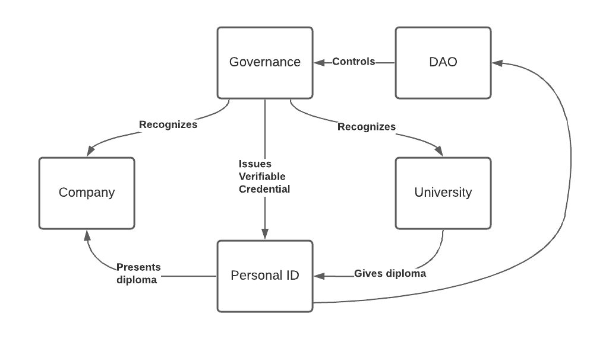
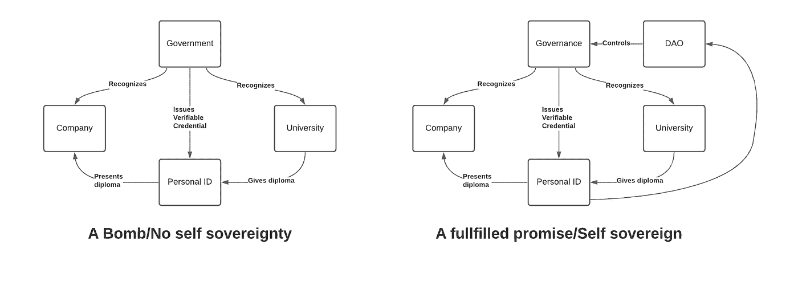

# 我们需要谈论自我主权身份

> 原文：<https://medium.com/coinmonks/we-need-to-talk-about-self-sovereign-identity-2f741eda2591?source=collection_archive---------2----------------------->

分散技术带来的一个主要问题是，我如何正确地识别我的用户？在集中式应用程序中，这通常通过电子邮件来完成，更常见的是使用双因素身份认证应用程序。

分散技术不具备的工具。这就是自我主权身份(SSI)承诺的来源。一种使用典型的分散技术(如区块链和对等网络)来识别和验证身份的方法。有一个 w3c 标准正在开发中，有很多，我是说很多，创业公司，倡议，甚至企业和政府都在抓住这个巨大的机会成为解决 SSI 的人。

对于那些在“空间”中的人来说，知道 SSI 可以是非常强大的，并且对于建立去中心化的系统是必不可少的。

自我主权身份经常用这样一个形象来解释:

从概念的角度来看，它总是看起来足够简单。你毕业了，拿到了你的证书，并能把它展示给一家公司。另一个经常使用的例子是，这允许你有选择地分享“可信的”数据和声明，如:“是的，我 18 岁以上”。验证者/酒吧老板不需要知道你的其他信息。如果他要求更多的信息，你就能证明他/她违反了规则。

这看起来像是“自我主权”，你控制你所给予的。

但是…公司怎么知道该相信哪所大学呢？还有你怎么知道在什么情况下一个地方或者卖家可以问你最小年龄？

我的朋友们，这才是我们真正需要讨论的！

# 谁来决定？

到目前为止，我所看到的是，所有与 SSI 相关的计划都看到了管理机构所扮演的重要角色。很自然，这是为了政府的许多举措。这使得信任关系看起来更像这样:

看起来是一个小的增加，并且符合大多数计划的期望和我们现在治理的方式。所以像上面这样的图表很快被认为是一个好方法。然而，上述方法并不是独立自主的，它使用与分散式系统相同的技术，但在实践中，它是一种自上而下的方法，规定了何时需要共享什么。这个系统是一条单行道，在这里，只要按一下按钮，你就可以被迫分享比你原本想要的更多的数据，否则就会被拒绝服务。如果你问我的话，我觉得不是真正的自我主权。做决定的仍然是政府，但可以用光速来做。

## 一个类比:核能

核能走了一条与 SSI 相似的道路，前景是巨大的，一个巨大的能源来源，将使世界变得更好，并可以解决污染问题。但是我们得到的是半吊子的更不稳定的版本，所以政府可以用副产品来制造炸弹。因此，人们普遍认为任何有核的东西都是危险的、不好的、邪恶的。

> 引用爱因斯坦的话:“原子能的释放并没有产生新的问题。它只是让解决现有问题的必要性变得更加紧迫了……”

当我们谈论 SSI 与去中心化运动的关系时，比特币是这场运动的领跑者，我们以类似于核能最初承诺的方式谈论它。在这种情况下，不是丰富的廉价能源，而是比特币分类账运作层面的自我控制概念。但是那会是什么样子呢？

非常简单，与之前的图像相同，但是具有网络验证的控制机制。这里简称为去中心化自治组织(DAO)。自我主权身份系统真正需要的是一种反馈机制，这种机制可以通过液态民主机制被用户控制。

我们都生活在一个社会中，总会有我们不同意的规则和社会规范，但如果我们对这些规则毫无控制，如果没有即时的抵制机制来阻止“计算机说不”的情况，那么这种系统的唯一最终结果是完全的权力失衡，有利于已经强大的人。不是 SSI 渴望成为的。

> 如果自我主权身份是系统自治，只有这样，我们才能真正谈论自我主权。否则，我们只是在创造自上而下的人口控制系统。

这话有点刺耳，但不幸的是，这是真的。不要误解我，我真的相信自我主权身份可以是一种工具，类似于国家免费的钱，可以帮助社会以一种更加公平与和平的方式发展。我甚至参与了一个名为[虚无](https://www.nihilium.io)的项目，以帮助解决一个主要障碍，使适当的 SSI 成为可能。我相信它会成功。

当然，政府可以在 SSI 中发挥作用，但有了这样一个强大的系统，他们不可能是唯一规定条件的人。旧式的 N 年选举周期不适合这种类型的治理。即使你相信你的政府会完全按照他们在选举中承诺的那样去做，我也很确定你会找到一个你不想把这种权力交给的政治对手。

因此，我强烈呼吁那些建立 SSI 系统的人:要明智，不要制造炸弹，而是建立一个“自治身份系统”。这是数量级更多的工作，技术上更具挑战性，但这将实现它对社会的承诺。

在推特上关注我:https://twitter.com/ovanwijk

> 加入 Coinmonks [电报频道](https://t.me/coincodecap)和 [Youtube 频道](https://www.youtube.com/c/coinmonks/videos)了解加密交易和投资

## 另外，阅读

*   [尤霍德勒 vs 考尼洛 vs 霍德诺特](/coinmonks/youhodler-vs-coinloan-vs-hodlnaut-b1050acde55a) | [Cryptohopper vs 哈斯博特](https://blog.coincodecap.com/cryptohopper-vs-haasbot)
*   [币安 vs 北海巨妖](https://blog.coincodecap.com/binance-vs-kraken) | [美元成本平均交易机器人](https://blog.coincodecap.com/pionex-dca-bot)
*   [新加坡十大最佳加密交易所](https://blog.coincodecap.com/crypto-exchange-in-singapore) | [购买 AXS](https://blog.coincodecap.com/buy-axs-token)
*   [投资印度的最佳加密软件](https://blog.coincodecap.com/best-crypto-to-invest-in-india-in-2021) | [HitBTC 评论](/coinmonks/hitbtc-review-c5143c5d53c2)
*   [AscendEx Staking](https://blog.coincodecap.com/ascendex-staking)|[Bot Ocean Review](https://blog.coincodecap.com/bot-ocean-review)|[最佳比特币钱包](https://blog.coincodecap.com/bitcoin-wallets-india)
*   [霍比评论](https://blog.coincodecap.com/huobi-review) | [OKEx 保证金交易](https://blog.coincodecap.com/okex-margin-trading) | [期货交易](https://blog.coincodecap.com/futures-trading)