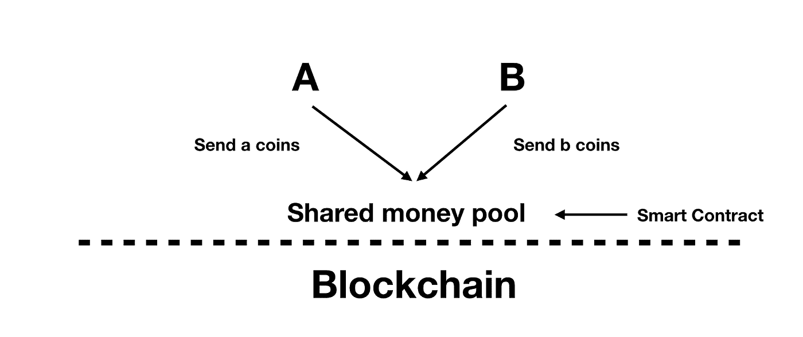
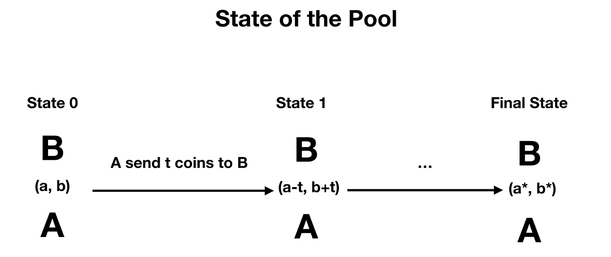
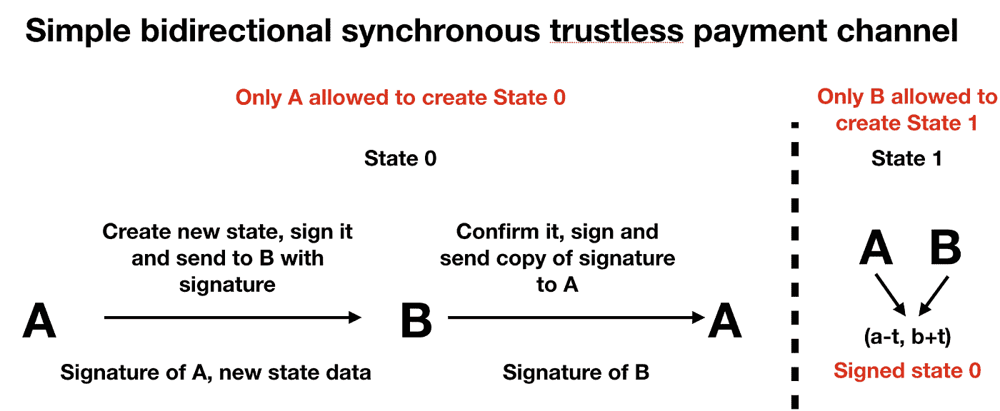
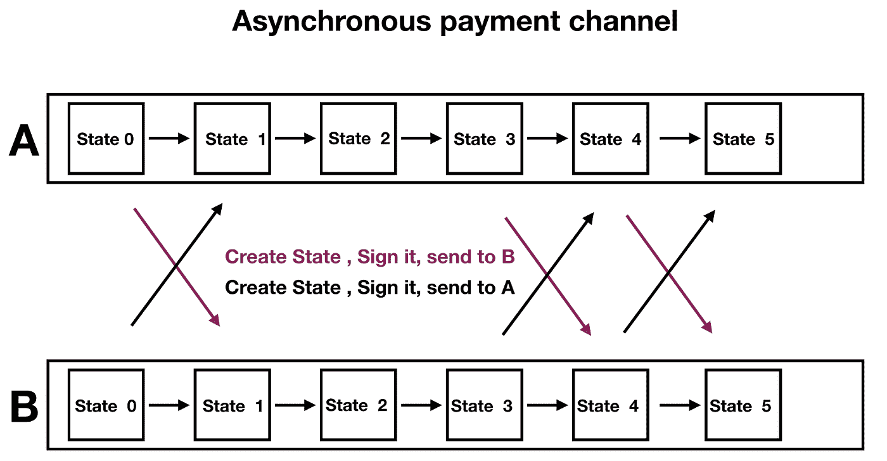

# 我们连续三周尝试入侵 Telegram 的加密货币吨(第一部分)

> 原文：<https://medium.com/coinmonks/we-tried-hacking-telegrams-cryptocurrency-ton-for-3-straight-weeks-part-i-eeed1e8273f5?source=collection_archive---------1----------------------->

*总结*[*【https://contest.com/blockchain】*](https://contest.com/blockchain)*来自纽扣钱包团队*

不是每个人都听说过几周前[发生的](https://cointelegraph.com/news/telegram-to-award-devs-400k-in-ton-blockchain-smart-contracts-contest)电报开放网络竞赛。这是一个非常重要的事件，它改变了 TON 开发者社区的很多东西。

> *正如我们已经* [*说过的*](https://cointelegraph.com/news/what-to-expect-from-the-telegram-open-network-a-developers-perspective) *，TON 相当缺乏一个开发者社区，并且*[*Fift*](https://test.ton.org/fiftbase.pdf)*(TON 的智能契约语言)由于其低级的方法而与普通语言大相径庭。*

[竞赛](https://contest.com/blockchain)是吸引新开发者和建立社区的好方法，也是解决缺少文档和例子的问题的好方法。我们决定从我们的角度总结比赛期间和之后发生的一切。

# 缺少文件

( **FunC** )没有 FunC(类 C 智能合约语言)的文档。这是一个问题，因为大多数吨竞赛任务需要你写一个聪明的合同。FunC——是将要使用的主要语言，可用于编写智能合同。

用它代替 Fift 要容易得多。然而，由于缺乏文档(根本没有文档)，每个人都需要分析并试图理解使用 funC at 编写的几个示例

```
[crypto/smartcontract](https://github.com/ton-blockchain/ton/tree/master/crypto/smartcont)
```

文件夹。

> 这并不真的那么难，然而，很难理解必要的东西。开始在 funC 上写东西没有困难大概需要几天时间。

(**基础**)当你用 funC 写一个智能合约——你需要理解如何部署和编译它，以及如何用参数调用你的函数——基础。有趣的是，没有任何关于这方面的详细信息，也没有完整的步骤示例。

我们很感激 TON 给了我们一个小的指导方针，这对我们真的很有帮助，但是这仍然很有挑战性。我们发现了如何做到所有这些——但这需要很多时间和痛苦。

# 关于竞赛任务

我们想强调 5 中的两个任务。异步支付通道和同步支付通道。那么，什么是支付渠道呢？

支付渠道——是一种在两方**之间进行非连锁交易**(在区块链之外)的方式，以使交易更快、更便宜且更具定制性。每一方在区块链上都有自己的账户。

> *此外，还有一种特殊的智能合同，在支付通道开放时，它将存储双方的存款。您可以用您的存款金额在彼此之间发送交易。*

当您需要撤销时，您将调用带有特殊数据的智能合约，这将在下面讨论。



*代理人 A 和 B 向智能合约发送硬币，进行存款以在他们之间开通支付通道*

当你打开支付通道时——你需要从双方向智能合约存入资金。



*A 向 B 发送交易，并将支付通道的状态从(A，B)更改为新的状态*

> *如果支付通道开放，您可以开始以每秒超过 100，00 0 笔交易的速度向对方发送交易。*

重要的是要明白，所有事情都发生在链外，有一天你将需要与你的对手达成协议，并从智能合约中撤出你的资金。



*(在同步支付通道从 A 到 B 的链外交易的可视化表示)*

我们假设每一方都可以欺骗收回所有的池。因此，每一方都需要证明他们将要提取的金额属于他们。

**为了证明这一点** —他们需要发送证明状态正确的每个合作伙伴的签名(金额 A、金额 B 和一些其他信息)。如果我们谈论的是同步支付渠道，我们有一个州号。

a 不能连续向 B 发送几笔交易。每个新状态都需要双方(A 和 B)的签名。因此，当 A 向 B 发送交易时，A 需要创建一个状态，该状态将改变属于 A 和 B 的金额，使用私钥对该状态进行签名，并将新的状态和签名发送给 B。

只有在交易状态被确认之后。此后，a 不能在 B 之前发送另一个事务。a 需要等待 B 创建一个新的状态。因此，它被称为同步通道。



(*异步支付通道从 A 到 B 的链外交易的可视化表示)*

在异步支付通道中，每个交易对手都有自己的状态组。每个状态由 A 从 B 收到的金额，A 发送给 B 的交易数量，B 发送给 A 的金额，B 发送给 A 的交易数量组成。

> 在那种情况下，A 和 B 不需要等待确认。他们只需要发送一个签名状态。

这两种渠道中最困难的部分是取款过程。智能合同需要检查每一方是否提供了正确的数据来提取资金。

我们需要检查状态的签名，并且该状态是最新的。这可能是当事人之间的冲突，智能合同需要根据规则(最新状态)来解决它。必须有保护发送相同的数据到不同的支付渠道，我们也需要解决的情况下，如果一个参与者将不会提供任何信息。

所有这些都必须用 funC 编写，并经过充分测试以确保安全。听起来很有挑战性。

# 解决方案和竞争对手

根据官方的竞赛渠道，有 65 份参赛作品。

大部分提交的都是多签名钱包和 DNS 解析器。不过有几家是有支付渠道的。很明显，支付渠道是最复杂的任务，因此解决方案会更少，大多数提供这些解决方案的团队会比其他团队更强大。我们看到了像 [363](https://contest.com/blockchain/entry363) 、 [375](https://contest.com/blockchain/entry375) 、 [381](https://contest.com/blockchain/entry381) 这样的几个强队和方案

# 下一步是什么？

目前，大约有 10-20 个团队拥有足够的技能和知识来开始构建 TON 的基础设施。我们认为这些团队会将大多数成功的 ETH 解决方案转移给 TON。TON 大赛真正改变局面的是能和 TON 合作的队伍数量。一些团队将继续他们的项目。

# 纽扣钱包团队体验

作为电报的早期采用者和爱好者，我们决定全力以赴。我们有一个很大的团队，大约有 8 个人。因此，我们决定建立同步和异步支付渠道。

我们在比赛中犯了很多错误，但是，我们成功地用所有的包装器创建了一个同步支付通道，允许您使用我们的 CLI 存款、取款和发送交易。因此，我们不仅制定了一个智能契约，而且在它上面有许多包装器，使得与 TON 一起工作更加容易。

在我们完成 sync 频道后，我们想起了许多我们已经从等离子开发经验中了解到的东西，所以我们建立了另一个智能合同，实现异步链外支付。

> 然而，我们没能在截止日期前将所有的包装器都写入其中。
> 
> 我们真的很喜欢所有的任务，希望我们有更多的时间来完成它们。但目前我们只有同步和异步支付渠道:)

在即将发布的第 2 部分中，我们将有更多关于智能合约的细节

由[纽扣钱包](https://github.com/button-tech)的首席技术官尼克·科兹洛夫
撰写

> [直接在您的收件箱中获得最佳软件交易](https://coincodecap.com/?utm_source=coinmonks)

[](https://coincodecap.com/?utm_source=coinmonks)