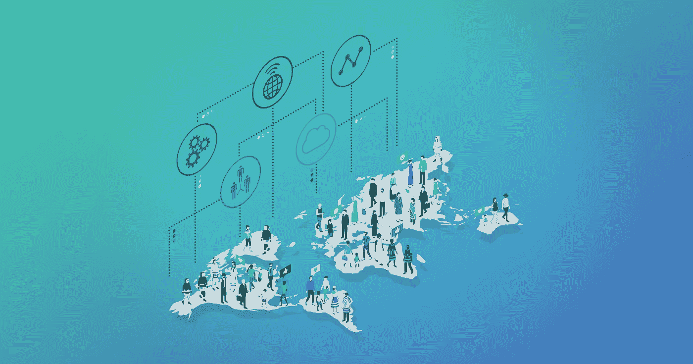
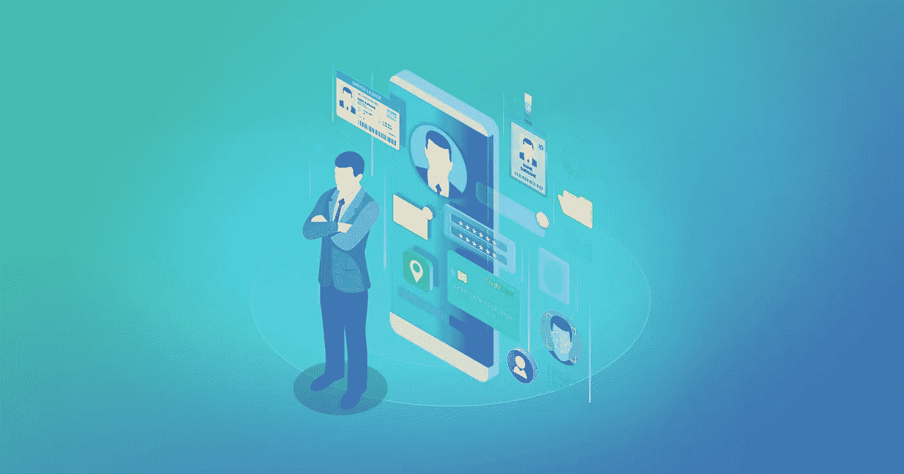

# Web 3.0 是一个全球性的数字工厂

> 原文：<https://medium.com/coinmonks/web-3-0-is-a-worldwide-digital-factory-97b60b1db448?source=collection_archive---------1----------------------->

## 我们对互联网未来的愿景

The worldwide digital factory

网络的发展是基于用户角色的。这个方案很简单:在 Web 1.0 中，用户只能查看内容，而在包含社交网络的 Web 2.0 中，用户可以创建内容。

> Web 3.0 是一场革命，为了理解它是什么，让我们从利益的角度来看这个方案。

在上世纪 90 年代，在论坛和社交网络出现之前，网站所有者创造有用的内容并吸引观众。因此，他们开始获得小额广告收入。用户创建内容的平台模式不仅可以增加收入，还可以降低成本。规模扩大增加了更多的收入，而支出保持不变。今天，每个脸书用户每年带来超过 20 美元的广告收入。这个社交网络有超过 20 亿活跃用户。

# 用户变成了实干家

> 那么为什么 Web 3.0 是一场革命呢？因为在互联网上作为收入来源的用户变成了权威来源。

这并不意味着用户有意选择或投票支持某样东西。用户是一个广义的概念。它指的是人们在互联网上的行为，他们对内容、路径的反应，以及取决于网站页面显示的选择。推荐算法和广告技术的产生是为了推断用户的意图。现在，用户访问互联网，互联网充满了 Web 3.0 元素，互联网也相应地进行了调整:各种服务为用户兴趣创建提要，移动和桌面版本的浏览器同步关于用户路径的信息，合适的广告显示，以及用户位置被考虑。如果用户体验包括操纵和不适当的广告信息，很可能用户不会留在网站上并为其带来收入。

> 然而，这些仍然没有革命的迹象。当互联网能够给用户带来与其支出相称的收入时，变革就发生了。

想象一下，所有服务于广告行业的分析和跟踪技术都将用于评估员工的数字输入和声誉。创建复杂的数字产品将达到一个新的水平:成本、时间和结果将被准确预测。服务将被设计成这样。一位企业家提出了一个想法，并将其传达给一个自动聊天机器人。机器人会问一些问题，然后根据对类似项目和投资组合的跟踪，提供对成本、时间和专家名单的预测。

User’s digital twin

这对用户创建积极的数字足迹是有益的。不仅仅是商业社交网络中的个人资料，而是现有项目的链接、专业内容和虚拟社区中的认可。由于不需要权威监管，互联网将不再保持匿名，因为用户将对获得他们的声誉感兴趣。

# 权力下放事项

哪些技术构成了 Web 3.0 的基础并继续发展？当然，这些是已经在推荐和广告系统中使用的人工智能、大数据和语义网。它们让我们能够更准确地分析用户行为。物联网数据丰富了用户档案和消费者习惯信息。购物中心的各种个人和交通追踪器、智能家居系统、蓝牙信标让服务为用户创造一个舒适的环境并留住观众。

与 Web 3.0 相关的去中心化技术允许我们获得更多关于用户的信息，并改善他们与服务交互的体验。例如，有一些初创公司采用分散的数据库来存储用户的医疗信息，他们可以与机构和服务机构共享这些信息。医疗机构将能够为患者提供更好的护理，并在分散的注册表中为他们的档案添加更多数据。

推荐系统也可以使用在分散式分类帐中收集的来自各种来源的用户位置日志。有些服务会帮你找到同路人，有些会告诉你沿途有专门的爱好商店。有创业公司帮助用户创建他们的数字身份。就像您使用脸书帐户登录其他网站一样，您可以授予他们访问您的数字身份的权限。

> 全球数字办公室将根据比简历更全面的信息来雇用个人。

即使是评论和建议也不能提供足够的信息，并且可能被篡改。但是来自社会关系、对项目的贡献和公开投资组合的图表可以让你创建一个员工的准确档案。这种以分散方式存储的数据将构成一个数字孪生体。例如，设计师使用数字工具和服务参与开放和封闭项目，在这些项目中，他通过其分散的数字身份获得授权。他的数字档案将包括由这些服务自动生成的项目列表。人工智能将能够评估设计师的分布式投资组合，并将其推荐给合适的客户。

> [发现并回顾最佳 Web3 产品](https://coincodecap.com/category/blockchain-node-and-api)

[EVEN 团队](https://evensolutions.org/en)在一个分散的数据源上工作，这将允许数据所有者管理他们的数字档案。这是一个分布式数据库和文件存储。需要分布式文件系统来存储照片、文档的扫描副本、专用数据格式和其他内容。

这些数据不是由用户手动输入的，而是作为用户与各种服务交互的结果而生成的。目前，此类数据存储在孤岛中，例如在社交网络和其他平台中。作为 Web 3.0 概念的一部分，数据必须存储在分散存储中，以便其所有者可以管理。

> 用户可以阻止服务对数据的访问，或者轻松地将数据转移到另一个服务。这些服务将争夺访问这些数据的能力，这意味着用户体验将会改善。

我们期望去中心化技术将它们的范围从金融服务扩展到用户应用。这将是向 Web 3.0 的过渡。

> [在您的收件箱中直接获得最佳软件交易](https://coincodecap.com/?utm_source=coinmonks)

