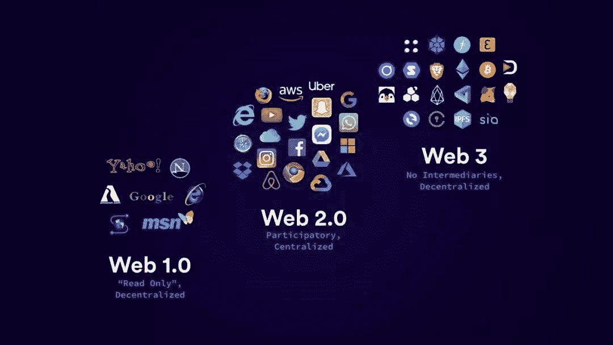
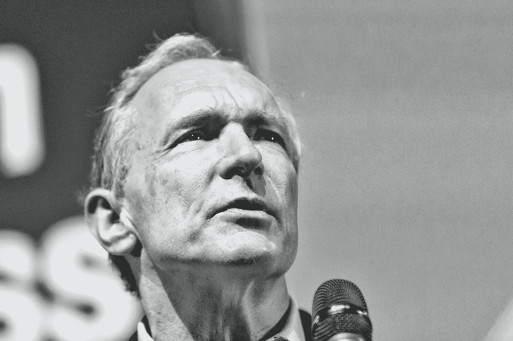
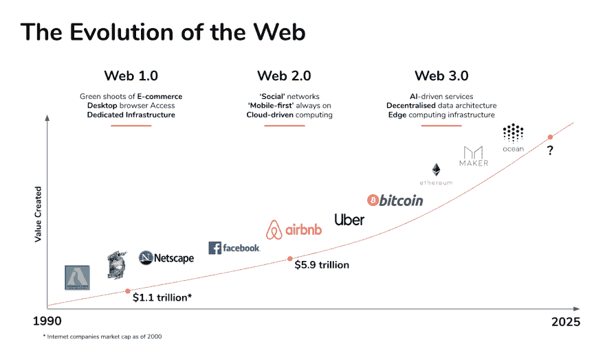

# WEB 3 的未来

> 原文：<https://medium.com/coinmonks/web-3-the-future-is-nigh-1e975ae710ab?source=collection_archive---------2----------------------->

pixabay

## 摘要

web 3.0 还没有明确的定义，但是我们将讨论它是什么以及它与区块链的关系。我们这个物种正在经历一场从前计算文明到后计算文明的巨大转变。我们伴随着互联网长大，知道能够随时与任何人联系和交流是什么感觉。

大型机、个人电脑、互联网、web 1.0、web 2.0、移动设备、区块链以及现在的 web 3.0 都是这一转变的一部分。

所有这些都发生在过去的 80 年里，差不多。你能想象 30 年后的情况吗？

在我们研究 web 3.0 如何影响未来之前，让我们先来看看为什么这样的发展是必不可少的。

## 互联网的演变

Source: dev.to

*互联网—基础层*

20 世纪 80 年代初，互联网出现了，也被称为 TCP/IP。控制计算机之间交互方式的物理线路和网络协议。最初，它主要是学术性的，主要由军方使用。

*Web 1.0*

1991 年至 2004 年间，互联网主要由静态网站组成，这意味着当你加载它们时，它们只显示“只读”内容。无法登录、参与内容或监控分析。对于早期的大多数互联网来说，广告甚至都不赚钱。在缺乏像“flash”或“java script”这样的东西的情况下，它主要是一个超级链接在一起的巨型百科全书。当时的互联网用户是“消费者”，他们上网消费信息。世界上大多数人并没有真正每天使用互联网。

*Web 2.0*

大约从 2004 年开始，网络发生了翻天覆地的变化。互联网的交互性是最重要的变化之一。这意味着，除了从网页上接收信息，网络还开始向我们“学习”。当我们使用脸书、YouTube、Instagram 和谷歌时，这些公司开始在我们的输入中使用机器学习和人工智能，为我们提供更好的内容。想想我们现在使用的在线应用，如优步、AirBnB 和 Deliveroo，它们利用了 Web 2.0 并产生了新的行业。今天，世界上大多数人每天都在使用互联网，它对工作、商务和许多其他商业活动至关重要。

## 我们为什么需要 Web 3？

不幸的是，集中式组织收集的数据被打包卖给出价最高的人。我们变成了‘产品’。作为伟大应用的回报，我们牺牲了我们的隐私。在 web 2.0 中，我们既可以访问脸书，也可以收到两种完全不同的新闻，这是基于我们的政治、社会和其他偏好，而脸书已经从我们这里学到了这些。不管我们喜欢与否，中央互联网公司拥有我们所有的数据，了解我们的一切，包括比我们自己更了解自己，这是一个可怕的想法。

## **Web 3.0**

Web 3.0 是互联网发展的下一个阶段，包括区块链技术和去中心化。Web 3 提供信任，这种信任被集成到核心层——区块链中。你不再是一个“产品”，而是成为你自己的数字自我和个人数据的“所有者”，这在数据是新的石油并有价格标签的数字世界中尤为重要。我们使用可验证性来直接连接信息和应用程序，不需要中介。我们正在将集中式应用程序转换为分散式协议。我们正在将比特币在金钱方面取得的成就应用于广泛的服务和应用，同时保持隐私和透明度。

在 Web 3.0 中，我们可以预计互联网将达到这样一个阶段，即每个公司都由一个 DAO 或分散的自治组织来管理，由编码为计算机程序的规则来表示，这些规则是透明的，由组织的成员来管理，不受中央集权的影响。

## 最初的分散愿景

Source: commons.wikimedia.org — Open Data Institute Knowledge for Everyone

万维网的创始人蒂姆·伯纳斯·李的梦想不是从互联网中获利，而是赋予人们权力和自由。

> “那里的精神非常分散。个人被赋予了不可思议的力量。这一切都是基于没有中央权力机构，你必须去请求许可。”

相反，网络的力量没有被夺走或偷走。随着每一份签署的用户协议和与技术分享的亲密时刻，我们集体将它送出了数十亿。脸书、谷歌和亚马逊现在几乎控制了网上发生的一切，从我们买什么到我们读什么到我们喜欢谁。

这里要记住的关键一点是，蒂姆·伯纳斯·李、区块链运动和去中心化运动今天都有着相同的目标。

Source: dev.to

## 前方是什么？

今天，很多事情都在发展中，很难预测，而我们通过对我们构建的技术做出选择，在其中扮演着重要的角色。我们赋予这些技术的属性将在未来产生深远的影响。

Web 3.0 是这一技术进步的最新浪潮，极大地增强了现有的架构。

首先，web 3 旨在消除数据锁定、数据寻租和数据垄断。主要问题是广告商业模式，这种模式产生了巨大的经济压力，要求人们通过材料尽可能多地参与进来，其中一些材料故意让你生气，只是为了让你参与进来。

第二，Web 3 的很大一部分是在区块链和 Web 之间架起一座桥梁，让这两者可以互相交流，让人们可以使用区块链系统。可验证性，即通过区块链技术将用户之间的信任编码到互联网管辖权中的能力，是所有这一切的一个重要方面。

把 Web 3.0 看作是一个可执行的大宪章。

*免责声明:本文包含的信息仅用于教育目的，并不构成 Wheatstones 的任何形式的建议或推荐，用户在做出(或避免做出)任何投资决定时也不打算依赖这些信息。*

> 加入 Coinmonks [电报频道](https://t.me/coincodecap)和 [Youtube 频道](https://www.youtube.com/c/coinmonks/videos)了解加密交易和投资

## 也阅读

 [## 杠杆代币[多头代币]终极指南

### 杠杆化令牌是具有杠杆化风险敞口的 ERC20 令牌，不考虑保证金、要求、管理…

medium.com](/coinmonks/leveraged-token-3f5257808b22)  [## 最佳加密交易所| 2021 年十大加密货币交易所

### 加密货币交易所的加密交易需要了解市场，这可以帮助你获得利润。之前…

blog.coincodecap.com](https://blog.coincodecap.com/crypto-exchange)  [## 2021 年最佳加密借贷平台| 6 大比特币借贷平台

### 获得比特币和其他加密货币的最佳贷款利率

medium.com](/coinmonks/top-5-crypto-lending-platforms-in-2020-that-you-need-to-know-a1b675cec3fa)  [## 2021 年最佳免费加密交易机器人

### 2021 年币安、比特币基地、库币和其他密码交易所的最佳密码交易机器人。四进制，位间隙…

medium.com](/coinmonks/crypto-trading-bot-c2ffce8acb2a)  [## 最佳 4 个加密交易信号电报通道

### 这是乏味的找到正确的加密交易信号提供商。因此，在本文中，我们将讨论最好的…

medium.com](/coinmonks/best-crypto-signals-telegram-5785cdbc4b2b)  [## 获取信号、交易机器人和套利

### 在本文中，我们将回顾 Bitsgap，这是一个满足您所有交易需求的一站式加密交易平台。它…

blog.coincodecap.com](https://blog.coincodecap.com/bitsgap-review)  [## 5 个最佳社交交易平台[2021] | CoinCodeCap

### 困惑于社交交易和副本交易哪个平台最好？本文将带您了解各种…

blog.coincodecap.com](https://blog.coincodecap.com/best-social-trading-platforms)  [## BlockFi 评论 2021:利弊和利率| CoinCodeCap

### 今天，我们提出了一个全面的 BlockFi 评论，这是一个成立于 2017 年的加密贷款平台，拥有其…

blog.coincodecap.com](https://blog.coincodecap.com/blockfi-review)  [## 如何在印度购买比特币？2021 年购买比特币的 7 款最佳应用[手机版]

### 如何使用移动应用程序购买比特币印度

medium.com](/coinmonks/buy-bitcoin-in-india-feb50ddfef94)  [## 加密税务软件——五大最佳比特币税务计算器[2021]

### 不管你是刚接触加密还是已经在这个领域呆了一段时间，你都需要交税。

medium.com](/coinmonks/best-crypto-tax-tool-for-my-money-72d4b430816b)  [## 存储比特币的最佳加密硬件钱包[2021] | CoinCodeCap

### 保管您的数字资产很容易，但找到正确的存储方式却是一项繁琐的任务。在线钱包有一个风险…

blog.coincodecap.com](https://blog.coincodecap.com/best-hardware-wallet-bitcoin)  [## Pionex 评论 2021 |免费加密交易机器人和交换

### Pionex 是为交易自动化提供工具的后起之秀。Pionex 上提供了 9 个加密交易机器人…

medium.com](/coinmonks/pionex-review-exchange-with-crypto-trading-bot-1e459d0191ea)