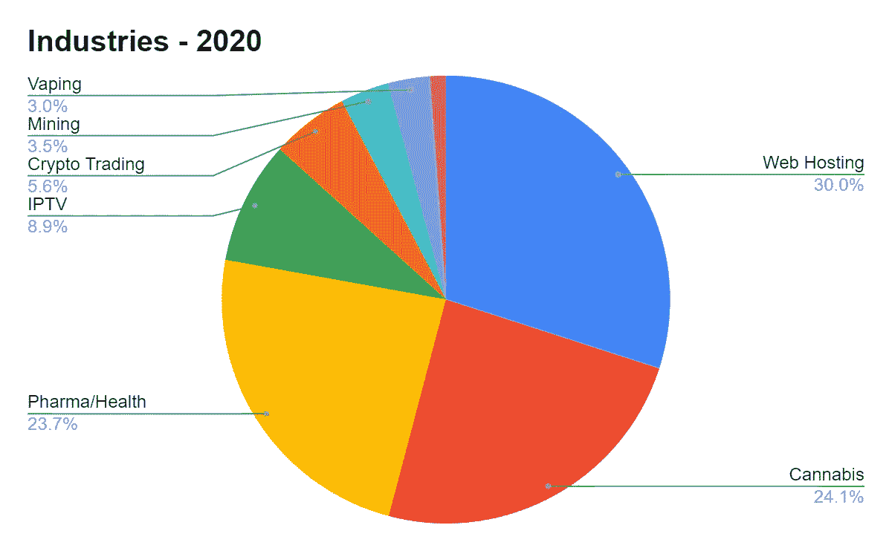
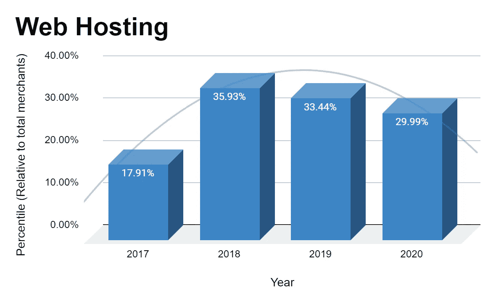
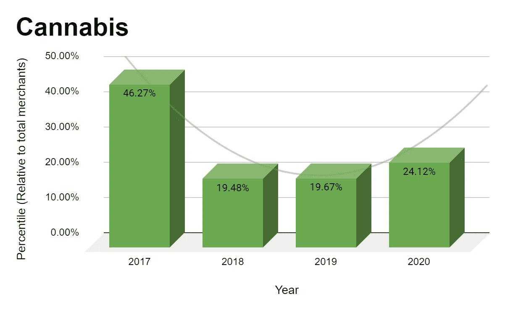
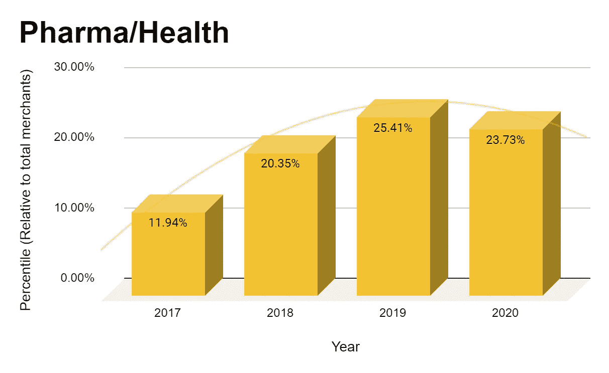
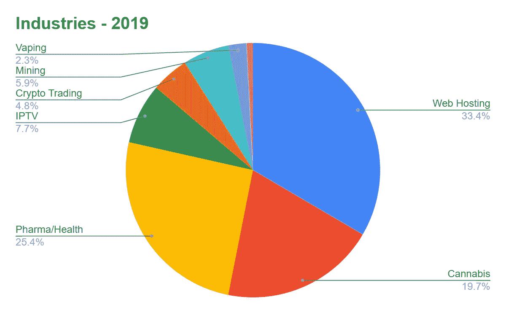
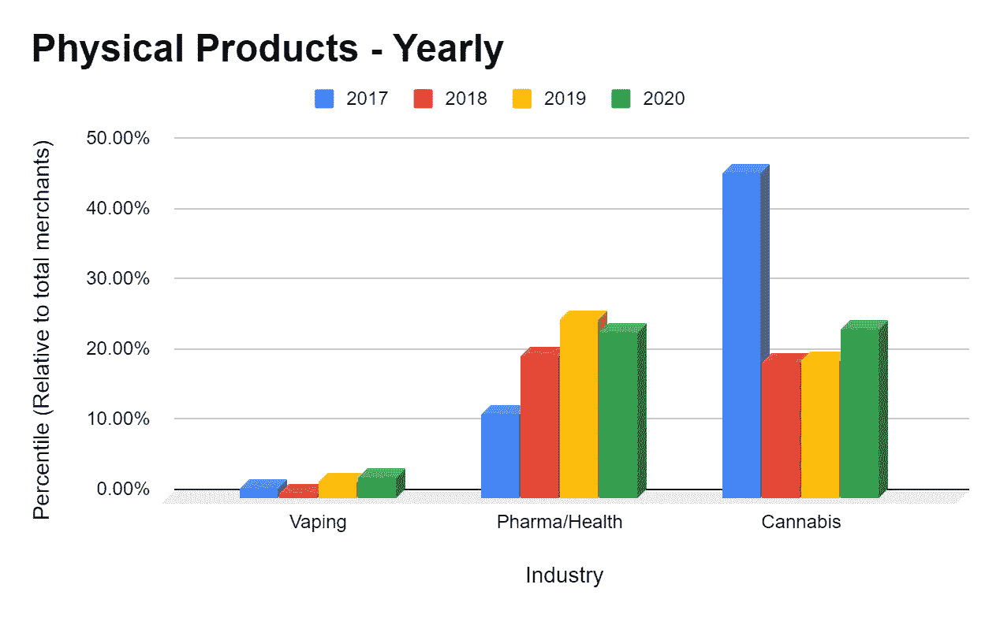
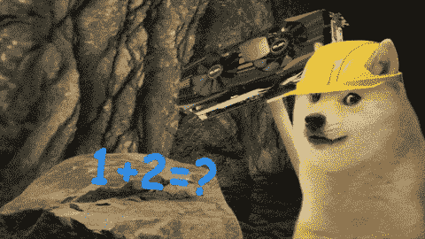
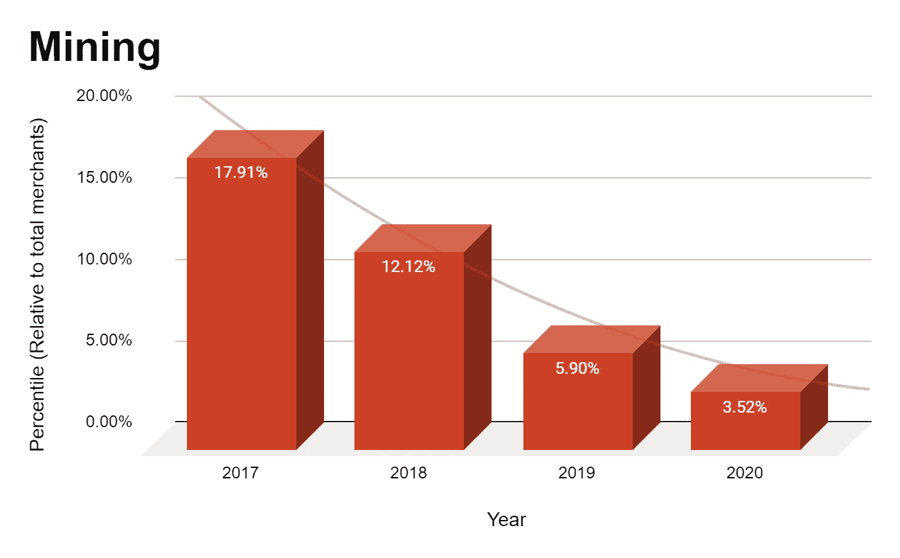
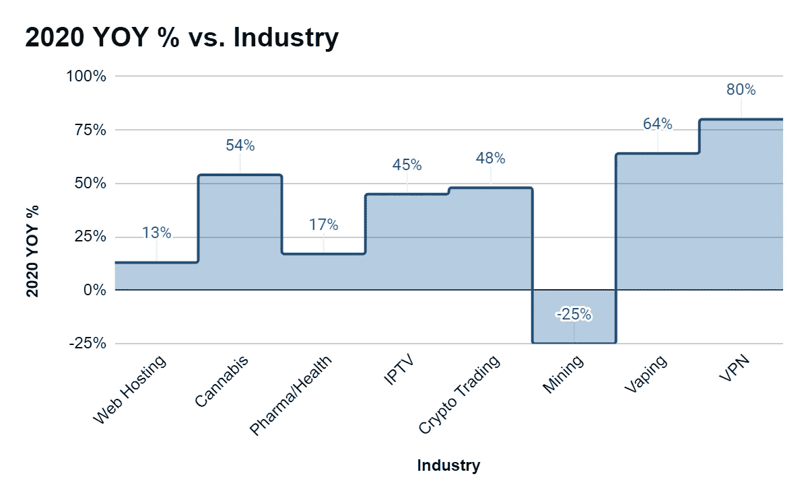
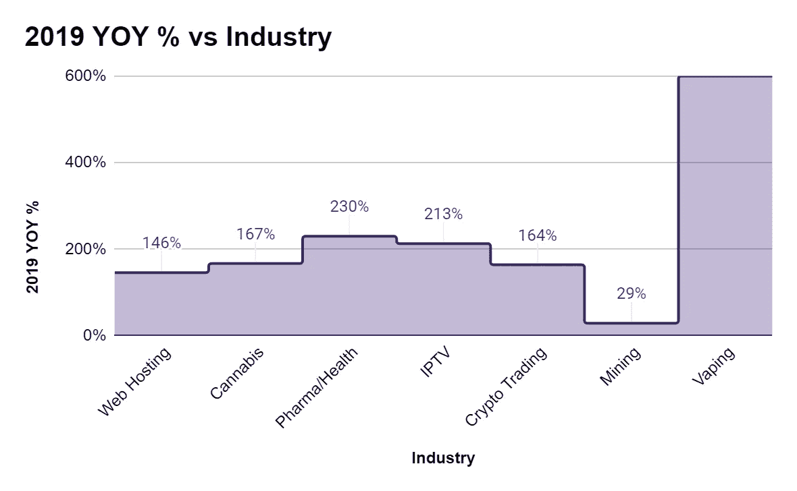

# 虚拟主机、大麻和健康占据了 75%的比特币商业生态系统——数据显示…

> 原文：<https://medium.com/coinmonks/web-hosting-cannabis-health-capture-75-of-the-bitcoin-merchant-ecosystem-data-says-501ee0ab75f4?source=collection_archive---------5----------------------->

过去 10 年，比特币的发展简直就像坐了一次过山车。一种十年前甚至没有听说过的货币现在已经达到了 2020 亿美元的[市值](https://coinmarketcap.com/)，[估计每天的交易量为 15 亿美元](https://www.blockchain.com/charts/estimated-transaction-volume-usd)。

比特币的巨大崛起不仅体现在它的价格上，还体现在它的应用上。据估计，大约有 [1 亿比特币用户](https://www.buybitcoinworl/)每天执行几乎 [35 万次比特币交易](https://www.blockchain.com/charts)。

当我们从电子商务的角度来看比特币的应用时，它的大幅增长并不令人惊讶。世界各地的商家和客户都喜欢比特币的无边界和无控制交易。

就像比特币一样，多年来，使用比特币的商家的格局也发生了变化。

[比特币支付处理器 Blockonomics](https://www.blockonomics.co/merchants#/) 最近对其商户数据进行了分析，以探索该市场在过去几年(2017 年至 2020 年)的演变，得出了一些有趣的发现。

以下是市场分析的要点…

# 赢家是网络托管、制药/健康和大麻

这 3 个行业作为接受比特币支付的顶级商业行业脱颖而出，成为明显的赢家。

> *2020 年，虚拟主机、医药/健康和大麻占据了整个比特币商业生态系统的近 75%。*

**虚拟主机**率先成为接受比特币支付的顶级行业。它在 2020 年占据了总市场份额的 30%，而在 2018 年和 2019 年，这一份额甚至更高，分别为 36%和 33.4%。

其次是**大麻**，2020 年占总市场的 24.1%，比上年增长 22.6%。

毫无疑问，比特币是发展最快的接受比特币支付的行业之一。

最后， **Pharma/Health** 在比特币顶级商户行业中排名第三，占据 23.7%的总市场份额，较上年略有下降。

# 不仅仅是数码产品，实体产品也在崛起

接受比特币的行业不仅销售数字产品，还销售实物商品。

自 2017 年以来，**大麻**、**制药/健康**、 **Vaping** 等行业的采用率有所上升，而且这一趋势只会上升。

这三个行业在 2020 年和 2019 年占据了整个比特币市场的近 50%。

与 2019 年相比，2020 年，*大麻*行业采用比特币的比例增长了 54%， *Vaping* 增长了 64%，而*制药/健康*增长了 17%。

尽管 Vaping 行业的增长率很高，但从数量上来看，增长最多的是大麻和医药/健康。

# 给我还是不给我

毫不奇怪，比特币催生了一个全新的行业，在比特币诞生后，大量与区块链空间相关的业务涌现出来。

一个这样的行业是**加密货币开采**，这是比特币和区块链的一个关键行业。对于那些不知道的人来说，正是通过矿工，区块链的交易得到确认，新的比特币被创造/开采出来。

> 有趣的是，采矿业是唯一一个采用率下降的行业。

上面的结论可能会让你们中的一些人感到有点惊讶，因为比特币的挖掘散列率只随着时间的推移而增加，目前为 136.5 TH/s，这意味着花费了更多的计算能力，交易更加安全，更能抵御攻击。

> 需要注意的一点是，这里的数据并不代表整个比特币采矿业，而是代表向用户出售采矿硬件或采矿能源的企业(中小企业)。

尽管采矿散列率每年都在增加，但这种采用率的下降并不完全令人惊讶，因为采矿是一个竞争非常激烈的领域。

采矿领域经历了一些艰难时期，特别是在 2018 年加密货币价格暴跌之后。

在 2017 年 12 月创下历史新高后，比特币的价格下跌了近 65%，由于销售几乎消失，严重影响了采矿业务。结果，领先的 GPU 制造商(矿工使用的)英伟达[市值损失了 230 亿美元](https://venturebeat.com/2018/11/17/how-crypto-mining-collapse-caused-nvidia-to-lose-23-billion-in-market-value/)。

此外，由于*运营成本*增加、*比特币价格减半*以及*采矿难度增加、*为直接获得制造设备的大型企业留出了空间，采矿近来变得利润更低，尤其是对小企业而言。

# 吸烟屏幕和白日梦

与 2019 年相比，2020 年增长率最高的 3 个行业是**大麻、Vaping 和 VPN** 。

*VPN* 涨幅最高，达到 80%，其次是*Vaping*64%，最后是*大麻*54%。

2019 年，增长最快的行业略有不同，其中 **Vaping** 领先，其次是 **Pharma/Health** 和 **IPTV** 。

*Vaping* 增长率高达 600%,而 *Pharma/Health* 增长了 230 %, IPTV 增长了 213%。

# 结论

在过去的 4 年里，比特币交易市场已经发生了很大的变化，和其他市场一样，它也受到了经济因素的影响。

*国际法规*、*媒体/新闻*、*比特币交易数量、价格、*都影响其采用。这本质上是一件好事，因为它让比特币成为全球经济的一部分，而不是与之分离。

虽然一些行业，如**网络托管、大麻和医药/健康** *(占比特币商户总数的 75)*的商户数量大幅增加，但像**加密货币开采**的行业在 2020 年的采用率会下降。

像 **Vaping** 、**大麻**、 **VPN** 等行业在 2020 年的增长率最高，而在 2019 年，这一趋势包括**制药/健康**、 **IPTV** 和 **Vaping** 。

有趣的是，在销售实物产品的商家中，比特币的表现相当不错。**大麻**、**制药/健康**和 **Vaping** 占 2020-2019 年总商户数的 **50%** 。

尽管比特币只有十年的历史，但它已经在全球市场掀起了波澜，接下来的事情会非常令人兴奋。

就像比特币一样，其商业市场仍有很长的路要走，前景看起来很乐观。

**免责声明:**

*   *市场调查由 Blockonomics 的数据进行，包括 2020 年至 2017 年期间的 6000 家商户。该分析基于收集的总商户数据的 30%。*
*   *由于隐私原因，未收集或分析任何地理数据。*
*   2020 年的数据反映了截至 2020 年 8 月的商户情况。

## 另外，阅读

*   最好的[密码交易机器人](/coinmonks/crypto-trading-bot-c2ffce8acb2a)
*   [密码本交易平台](/coinmonks/top-10-crypto-copy-trading-platforms-for-beginners-d0c37c7d698c)
*   最好的[加密税务软件](/coinmonks/best-crypto-tax-tool-for-my-money-72d4b430816b)
*   [最佳加密交易平台](/coinmonks/the-best-crypto-trading-platforms-in-2020-the-definitive-guide-updated-c72f8b874555)
*   最佳[密码借贷平台](/coinmonks/top-5-crypto-lending-platforms-in-2020-that-you-need-to-know-a1b675cec3fa)
*   [最佳区块链分析工具](https://bitquery.io/blog/best-blockchain-analysis-tools-and-software)
*   [加密套利](/coinmonks/crypto-arbitrage-guide-how-to-make-money-as-a-beginner-62bfe5c868f6)指南:新手如何赚钱
*   最佳[加密制图工具](/coinmonks/what-are-the-best-charting-platforms-for-cryptocurrency-trading-85aade584d80)
*   [莱杰 vs 特雷佐](/coinmonks/ledger-vs-trezor-best-hardware-wallet-to-secure-cryptocurrency-22c7a3fd391e)
*   了解比特币的[最佳书籍有哪些？](/coinmonks/what-are-the-best-books-to-learn-bitcoin-409aeb9aff4b)
*   [3 商业评论](/coinmonks/3commas-review-an-excellent-crypto-trading-bot-2020-1313a58bec92)
*   [AAX 交易所评论](/coinmonks/aax-exchange-review-2021-67c5ea09330c) |推荐代码、交易费用、利弊
*   [Deribit 审查](/coinmonks/deribit-review-options-fees-apis-and-testnet-2ca16c4bbdb2) |选项、费用、API 和 Testnet
*   [FTX 密码交易所评论](/coinmonks/ftx-crypto-exchange-review-53664ac1198f)
*   [n 零审核](/coinmonks/ngrave-zero-review-c465cf8307fc)
*   [Bybit 交换审查](/coinmonks/bybit-exchange-review-dbd570019b71)
*   [3Commas vs Cryptohopper](/coinmonks/cryptohopper-vs-3commas-vs-shrimpy-a2c16095b8fe)
*   最好的比特币[硬件钱包](/coinmonks/the-best-cryptocurrency-hardware-wallets-of-2020-e28b1c124069?source=friends_link&sk=324dd9ff8556ab578d71e7ad7658ad7c)
*   最佳 [monero 钱包](https://blog.coincodecap.com/best-monero-wallets)
*   [莱杰 nano s vs x](https://blog.coincodecap.com/ledger-nano-s-vs-x)
*   [bits gap vs 3 commas vs quad ency](https://blog.coincodecap.com/bitsgap-3commas-quadency)
*   [莱杰纳米 S vs 特雷佐 one vs 特雷佐 T vs 莱杰纳米 X](https://blog.coincodecap.com/ledger-nano-s-vs-trezor-one-ledger-nano-x-trezor-t)
*   [block fi vs Celsius](/coinmonks/blockfi-vs-celsius-vs-hodlnaut-8a1cc8c26630)vs Hodlnaut
*   [Bitsgap 评论](/coinmonks/bitsgap-review-a-crypto-trading-bot-that-makes-easy-money-a5d88a336df2)——一个轻松赚钱的加密交易机器人
*   为专业人士设计的加密交易机器人
*   [PrimeXBT 审查](/coinmonks/primexbt-review-88e0815be858) |杠杆交易、费用和交易
*   [埃利帕尔泰坦评论](/coinmonks/ellipal-titan-review-85e9071dd029)
*   [SecuX Stone 评论](https://blog.coincodecap.com/secux-stone-hardware-wallet-review)
*   [BlockFi 评论](/coinmonks/blockfi-review-53096053c097) |从您的密码中赚取高达 8.6%的利息