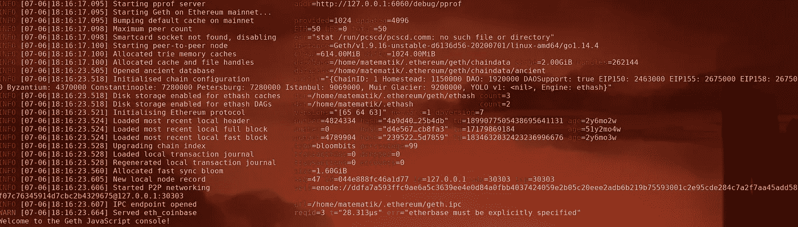

# Web3.go 简介第 1 部分:EthClient

> 原文：<https://medium.com/coinmonks/web3-go-part-1-31c68c68e20e?source=collection_archive---------1----------------------->

## 如何使用 go-ethereum 作为库

许多开发人员问我，他们如何使用他们最喜欢的编程语言 Go 来访问以太坊网络。这篇文章是系列文章的一部分，它将解释使用 [go-ethereum](https://github.com/ethereum/go-ethereum) 作为库来访问以太坊的鲜为人知的能力。

早在 2015 年，Péter Szilágyi 和 geth 团队就开始开发`ethclient`包和`abigen`工具。这个旧的[视频](https://www.youtube.com/watch?v=R0Ia1U9Gxjg)深入探究了它背后的推理以及如何使用它们。除了这个视频，没有太多关于他们的可用文档。本系列的目的是为开发人员提供更多关于这些工具的文档。

## **连接:ethclient 包。**

包`ethclient`是当你试图把 geth 作为一个库使用时，你会偶然发现的第一个包。它使您能够通过 websocket、http 或 ipc 连接到节点。`ethclient`允许您连接到**任何支持在 [RPC-Spec](https://eth.wiki/json-rpc/API) 中定义的 rpc API 的**节点。

Connect to an ethereum node

Dial 返回一个包装了 raw `rpc.Client`的对象，例如可以用来调用以下函数(还有很多):

Common functions

在上一个片段中，您已经看到了 ethclient 的一些基本用法，但是细心的读者已经注意到我们正在创建一个会导致错误的无效事务，那么我们如何创建有效的事务以及帐户管理是如何工作的呢？

**账户管理:账户包。**

为了创建原始事务，您可以使用以下代码片段:

Create a new transaction

现在你需要签署交易。如果您有明文形式的密钥，您可以使用以下代码对您的交易进行签名:

Sign your transaction

但是，如果您不想处理原始密钥或使用硬件密钥来发送事务，该怎么办呢？我们掩护你！您可以使用`keystore.Keystore`作为您私钥的加密存储，如下所示:

Use keystore.Keystore to create a TransactOpts

使用`TransactOpts`对象，您可以签署交易。稍后需要该对象通过自动生成的绑定与智能合约进行交互。

Sign a transaction with TransactOpts

这看起来很酷，但是如果我想与智能合约交互呢？您可以在事务的`data`字段中输入原始数据，但是这非常不安全，所以 geth 提供了`bind`包和`abigen`二进制文件来为您的智能契约创建契约绑定。我们将在本系列的第二部分中讨论这个问题。

如果你想联系我，就发消息给我，地址是@ v[dWijden](https://twitter.com/vdWijden)Twitter[或 Linkedin](https://twitter.com/vdWijden) 。

[第一部分:连接和发送事务](/@m.vanderwijden1/web3-go-part-1-31c68c68e20e)
[第二部分:调用智能合约上的函数](/@m.vanderwijden1/web3-go-part-2-aebdcb8d926e)
[第三部分:监听来自智能合约的事件](/@m.vanderwijden1/intro-to-web3-go-part-3-d4f08a32c0ae)
[第四部分:创建用于测试的模拟区块链](/@m.vanderwijden1/intro-to-web3-go-part-4-5a21bc71fddc)

特别感谢 [Rene](https://twitter.com/renelubov) 的校对！

> 加入 Coinmonks [电报频道](https://t.me/coincodecap)和 [Youtube 频道](https://www.youtube.com/c/coinmonks/videos)获取每日[加密新闻](http://coincodecap.com/)

## 另外，阅读

*   [复制交易](/coinmonks/top-10-crypto-copy-trading-platforms-for-beginners-d0c37c7d698c) | [加密税务软件](/coinmonks/crypto-tax-software-ed4b4810e338)
*   [网格交易](https://coincodecap.com/grid-trading) | [加密硬件钱包](/coinmonks/the-best-cryptocurrency-hardware-wallets-of-2020-e28b1c124069)
*   [密码电报信号](http://Top 4 Telegram Channels for Crypto Traders) | [密码交易机器人](/coinmonks/crypto-trading-bot-c2ffce8acb2a)
*   [最佳加密交易所](/coinmonks/crypto-exchange-dd2f9d6f3769) | [印度最佳加密交易所](/coinmonks/bitcoin-exchange-in-india-7f1fe79715c9)
*   [开发者最佳加密 API](/coinmonks/best-crypto-apis-for-developers-5efe3a597a9f)
*   最佳[密码借贷平台](/coinmonks/top-5-crypto-lending-platforms-in-2020-that-you-need-to-know-a1b675cec3fa)
*   [免费加密信号](/coinmonks/free-crypto-signals-48b25e61a8da) | [加密交易机器人](/coinmonks/crypto-trading-bot-c2ffce8acb2a)
*   杠杆代币的终极指南