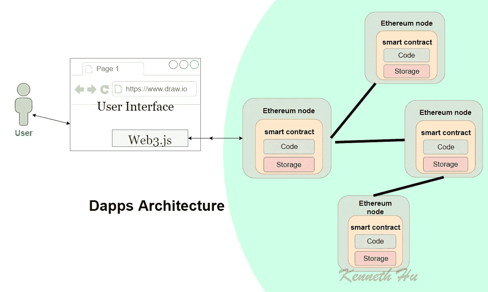

# Web3。js 以太坊 Javascript API

> 原文：<https://medium.com/coinmonks/web3-js-ethereum-javascript-api-72f7b22e2f0a?source=collection_archive---------0----------------------->

web3.js 是一个库的集合，它允许您使用 HTTP 或 IPC 连接与本地或远程以太坊节点进行交互。web3 JavaScript 库与以太坊区块链交互。它可以检索用户帐户，发送交易，与智能合同交互，等等。

# 版本:1.0.0-beta.36

## Web3.js API 类型