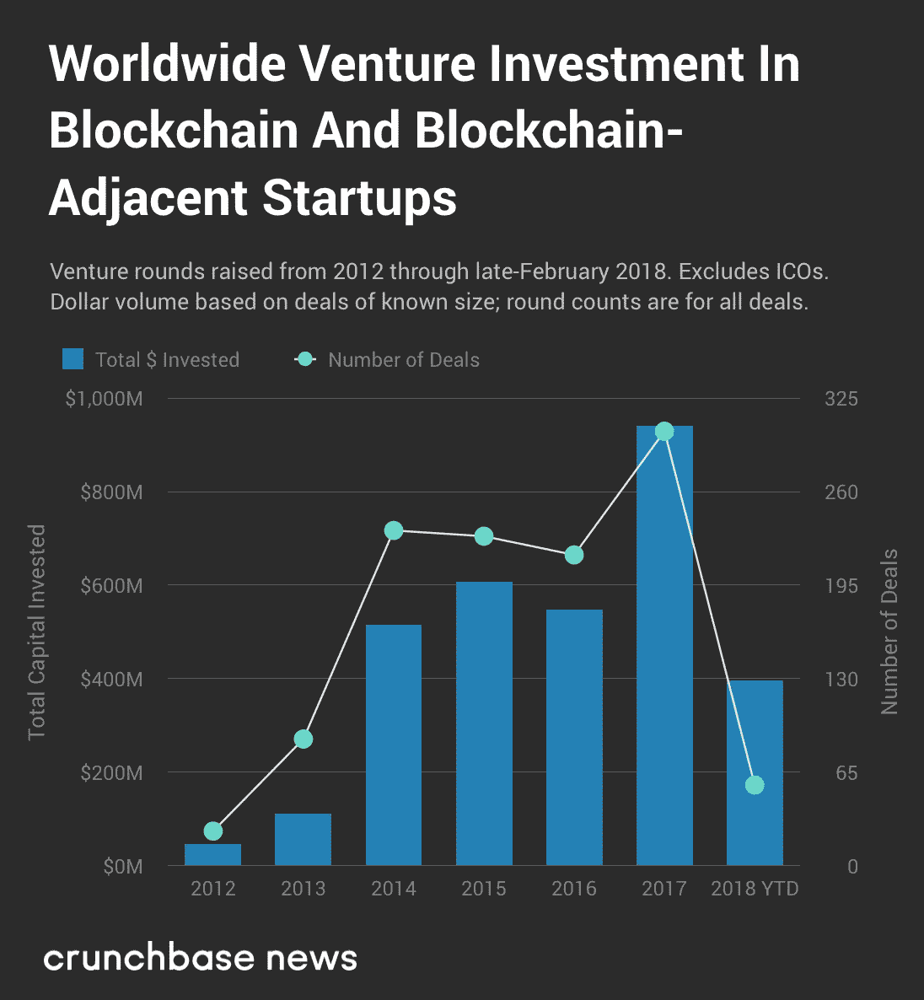

# Web3 需要 UX 专家。很快。

> 原文：<https://medium.com/coinmonks/web3-needs-ux-specialists-fast-9dfb932001fb?source=collection_archive---------3----------------------->

## WEB3 是无服务器互联网的愿景。去中心化的网络。在互联网上，用户可以控制自己的数据、身份和命运。[https://web3.foundation/](https://web3.foundation/)

# 对去中心化网络的投资正在爆炸式增长

除了加密货币的价格波动，风险资本家对区块链初创公司的投资正在爆炸式增长。

[2018 年前两个月，风投投资额超过 2017 年总额的 40%。](https://news.crunchbase.com/news/2018-vc-investment-crypto-startups-set-surpass-2017-tally/)

数百家初创公司正试图用区块链技术解决问题。他们在招人。或者试图这么做。

我们有麻烦了。

# 分散网络上的用户体验

我交谈过的大多数以用户为中心的人对去中心化如何影响 UX 知之甚少。

用户研究员、交互设计师、产品负责人——**如果你想要挑战，去中心化就是了。**

因为去中心化需要范式转变。

在一个中央集权的世界里，你和我都掌握在少数几个有权有势的人手中。我们被虐待，不管是自愿的还是无意的。我们被拿来做实验。当他们被黑时，我们都会被黑。

但在中央集权的世界里，当我的信用卡被盗时，我会打电话给银行。他们冻结它，然后发行一张新的。如果没有中央权威，我该向谁求助？现在在 Web3 中，我没有朋友。

把权力从一个中央权威手中拿走，我仍然想要他们提供的价值。因此，这个关于去中心化的基本“UX”问题需要解决。我们需要找到一种既能保持收益又没有风险的方法。

UX 专家面前有一项艰巨的任务。工作就在那里。钱是好的。目的有意义。挑战很大。

我期待着看到更多我的用户拥护者伙伴(你！)在接下来的几个月进入这个空间。

# 我们在招人

如果你对网络/区块链的未来感到兴奋，并且是一名拥有动作技能的优秀移动 UI 设计师，我很乐意见到你。请看这里的公司和角色:[https://www.argent.im/](https://www.argent.im/)

# 这有帮助/有用吗？

如果你喜欢读这篇文章，请考虑捐赠。如果你能想出如何做到这一点！事实上，这是一种加强我的观点…我们真的需要 UX 专家。

# 醚

0 xc 81d 64870 FD 8 bbff 284 d2d 082634 ADB 0b 407096 e

顺便说一句，以太坊名称服务(ENS) 正在努力改善这一点。跟随 [beltran](https://medium.com/u/3d9d3a22b291?source=post_page-----9dfb932001fb--------------------------------) 了解更多信息。