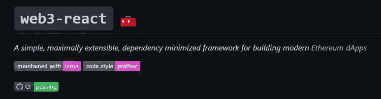

# web3-react:从您的前端将用户连接到元掩码(或任何钱包)

> 原文：<https://medium.com/coinmonks/web3-react-connect-users-to-metamask-or-any-wallet-from-your-frontend-241fd538ed39?source=collection_archive---------1----------------------->

你好，在这篇文章中，我将展示如何使用一个名为 [web3-react](https://github.com/NoahZinsmeister/web3-react) 的库从你的前端将用户连接到 MetaMask 或任何钱包。

我的计划是向您展示最简单的实现方式。它看起来会像这样: