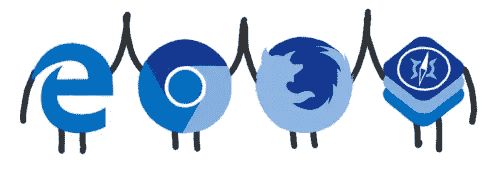
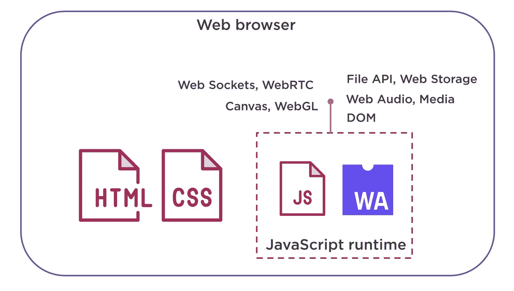

# WebAssembly —有什么大不了的？

> 原文：<https://medium.com/coinmonks/webassembly-whats-the-big-deal-662396ff1cd6?source=collection_archive---------2----------------------->

Credits: Mozilla Hacks

最近我听说了很多关于 WebAssembly 的事情。为了满足我的好奇心，我开始深入挖掘。所以，我在这里给大家一个关于 WebAssembly 的概述。

**什么是 WebAssembly？**

*“web assembly 是一种新型代码，可以在现代 web 浏览器中运行，并提供了新的功能和性能上的重大提升。”Mozilla 开发者网络。*

web 主要由 HTML 和 CSS 表示的文档组成。Javascript(JS)为不同组件之间的交互提供了 HTML 支持。JS 在浏览器中的安全沙盒环境中执行，该环境称为 Javascript runtime 或 JVM。

*在这幅图中，WebAssembly 在哪里？*

Credits: Pluralsight — Barry Luijbregts

WebAssembly(WASM)与 JS 一起位于 Javascript 运行时沙箱中，并以相同的方式执行。因为它在沙盒环境中，所以它也有和 JS 一样的安全性。它被表示为抽象语法树(AST ),并构建成二进制格式。WebAssembly 的文件格式是 wasm。它已经是 Javascript 运行时无需解释语言就能理解的二进制格式。它还可以访问 WebAPI，WebAPI 可以访问 DOM、音频和 Web 套接字等内容。

我们为什么需要它？

如上所述，Wasm 模块和 JS 在同一个沙箱中。那么，我们为什么需要 WebAssembly 呢？虽然我在理论上提到了它，但是 WebAssembly 附带的特性将会改变到目前为止您构建 web 应用程序的方式。以下是主要的几个:

1.  **其快。由于 wasm 已经是二进制格式，不需要额外的解释，它的执行速度比 javascript 模块快得多。这将比 JS 更好地提高应用程序的启动速度和优化。它将以接近本机的速度运行代码。**
2.  **其他各种高级语言的编译目标。曾经想象过你能够用 C/C++/C#或 RUST 来构建 web 应用程序吗？惊喜！！！！！现在，您可以将所有这些语言编译成 wasm。想一想您从未能在浏览器中运行的各种应用程序，因为底层语言不受支持。这也意味着，所有那些讨厌 JS 的人现在可以和 JS 的建设者们一起工作了。我们正在获得一个资源池:)**
3.  **由没有任何插件的浏览器支持。**各大浏览器已经在支持 wasm 了！你不需要安装任何插件来运行它。
4.  **Javascript 代码可以运行 wasm 模块。你可能会想，所有现有的 javascript 模块和应用程序会发生什么？Wasm 不是要取代 JS，它将与我们现有的各种 JS 框架共存。您也可以在 JS 代码中导入和包含 wasm 模块。**
5.  **可以在移动设备上运行。**除了 JS 运行时，Wasm 还可以在 WASM 运行时运行。像安卓或 IOS 这样的设备可以很容易地提供这个运行时，这将使 wasm 模块可以访问可用的 API。
6.  **业绩提升。**使用网络组装给应用程序带来了性能提升，这是 JS 从未有过的。这实际上来自于像 C/C++等高级语言中特性的使用。

**网络组装用例**

*   视频/音频编辑工具
*   视频/音频流工具
*   赌博
*   视频/音频通话
*   虚拟/增强现实
*   人工智能

**历史**

【2015 年 4 月 — *一个名为 WebAssembly 社区组的新小组成立。这个社区团体是由 W3C 委员会成立的。它由来自主要浏览器供应商的人组成，他们希望创建一种新的代码格式，而不是 javascript，这种格式对于 web 应用程序来说可以工作得更快、更容易移植。*

**2015 年 6 月—** *该集团发布公告，表示正在研究一种新标准，即网络组装。*

**2016 年 3 月—** *该社区发布了将在 WebAssembly 中发布的核心特性和标准的定义。一些浏览器已经将这些特性作为实验来实现。*

**2016 年 10 月—** *一款最低生存力产品发布，供社区试用。所有主要的浏览器都支持这一点。*

**2017 年 1 月—** *选择 logo。到目前为止，所有的工作都是由社区完成的，github 中的一切都是开放的。*

**2017 年 3 月***——像 chrome、Edge、Firefox 和 Webkit 这样的主流浏览器就最小可行产品达成共识。在这个阶段，社区决定他们需要更多的实施经验和大量的使用，以帮助推进进一步的设计。这标志着浏览器预览期的结束。*

**2017 年 8 月—** *W3C 成立了一个 WebAssembly 工作组，为 WebAssembly 创建标准，就像 HTML、CSS 和 Javascript 一样。*

**2017 年 9 月—** *Safari 也开始支持网络组装。*

**2018 年 2 月—** *W3C 发布了网络组装规范草案。这包含了开发网络组件的标准。*

**更多资源**

*   [https://webassembly.org/](https://webassembly.org/)——官网
*   [https://developer.mozilla.org/en-US/docs/WebAssembly](https://developer.mozilla.org/en-US/docs/WebAssembly)—开发者文档
*   http://www.wasmrocks.com/[—教程和文章](http://www.wasmrocks.com/)

> [在您的收件箱中直接获得最佳软件交易](https://coincodecap.com/?utm_source=coinmonks)

