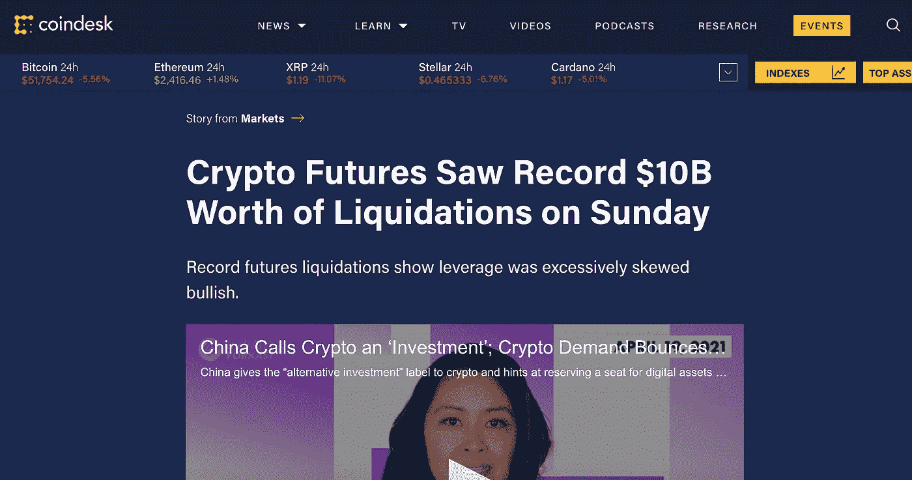
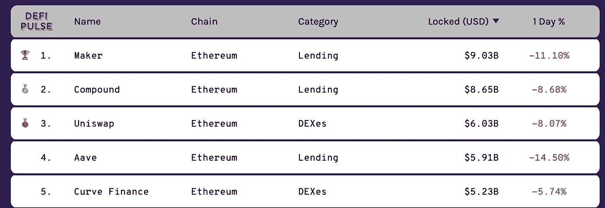
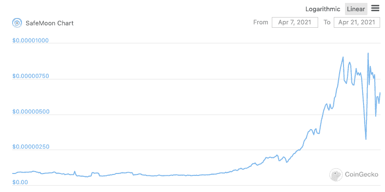

# 每周加密更新:4 月 19 日这一周

> 原文：<https://medium.com/coinmonks/weekly-crypto-update-week-of-april-19th-42947d31bb04?source=collection_archive---------6----------------------->

## 本周最佳和最差项目

*免责声明:本文出于教育目的。希望人们发现这些更新有助于跟上这些天来 crypto 飞速发展的步伐。*

*这不是财务建议；你总是对硬币进行尽职调查吗:)*

# 本周的反思

从各方面考虑，本周是相当平静的一周。

是的，上周末[发生了创纪录的清算](https://www.coindesk.com/crypto-futures-saw-record-10b-worth-of-liquidations-on-sunday)，美国时间周六深夜，创纪录的 100 亿美元加密衍生产品化为乌有。

但是加密市场反弹相当可观 ETH 达到 2600 美元的 ATH，挑战 Maker 和 Compound pumping 等蓝筹股。然而，比特币在上周比特币基地周触及 65000 美元后，在 51000 美元至 55000 美元之间徘徊。

老实说，我认为价格调整是健康的——尤其是在比特币基地周的疯狂抛售之后——因为它迫使多头从不可持续的水平去杠杆化。

我也不关心市场上发生的事情，因为坦白地说，我太笨了，不会去杠杆化，可能会立即被清算并重新交易。

从产品和技术的角度来看，比特币基地的上市相当平静——这本身就有点平淡，在首日上涨近 450 美元后，美元硬币的交易价格约为 290 美元。

无论如何，这是我这周发现的一些很酷的东西:

# 本周最佳项目

## 多边形

连续几周我都在标记多边形。

我上周提到了第二层(L2)战争正在升温，这将是一场激烈的市场份额争夺战，其基础是通过采用最受欢迎的 dapps 来建立网络效应。

好了*瞧*——在与 Aave 公布了一项流动性挖掘计划后，Polygon 本周早些时候宣布，另一家著名的以太坊 dapp——目前在 TVL 排名前五 Curve Finance 也将使用 Polygon 作为其扩展解决方案。

Source: DeFi Pulse

Curve 还宣布将提供流动性挖掘奖励 Polygon 将向 bootstrap 用户提供 500 万美元。

它还告诉我们，Polygon 在任何 L2 缩放解决方案 QuickSwap 中仍然拥有确定的每日流量排名第一的指标。

是第二大竞争对手 LoopRing 的两倍。

## 图表

本周，Graph 取得了两项重大进展，这是一个用于索引、组织和查询区块链数据的分散式索引协议。

首先，该图在 Moonbeam Network 上是实时的，这意味着该图正在扩展到多链支持——超越其在以太坊上的现有实现——到 Polkadot 上。

这太棒了，因为(1)我认为索引对于任何区块链来说都是一个超级重要的基础能力，不仅仅是以太坊；(2)我认为最好的协议将是那些在多链未来蓬勃发展的协议。

第二个是 Scalar 的推出，该图与[连接网络](https://twitter.com/ConnextNetwork)的合作。

从表面上看，这很棒，因为 Scalar 允许在 Graph 协议上进行异常快速和廉价的查询交易——这意味着每当 dapp 或用户想要从 Graph 中查询数据时，他们可以以非常快速和廉价的方式使用 Scalar 进行支付。

除此之外，标量可能是未来机器对机器微交易的基础，这是未来学家在近十年前物联网推出时大肆宣传的。

## 制造者

上周，MakerDAO 通过了一项新产品提案，这是一种 ERC20 令牌，代表着一个真实世界的资产池，即一个抵押的真实资产池。

这对 DeFi 来说是一个巨大的突破，它有能力解放价值约 280 万亿美元的全球房地产。

相比之下，整个加密市场的市值为 2 万亿美元——比房地产市场小几个数量级。

# 本周最差项目

## 安全月

又是一周，又一枚屎币在币安智能链上被抽取。

在与 Dogecoin 相同的迷因能量驱动下，SafeMoon 是一个令牌，它唯一的效用是供应随着网络交易的函数而减少。

每当有人发送硬币时，SafeMoon 就会被烧毁，从而无限期地耗尽供应，希望价格会随着供应的减少而上涨。

所以基本上是一个庞氏骗局，只不过多了几个步骤。一个烫手山芋，看谁来背黑锅。

无论如何，谢谢你收听我的每周演讲。直到下周:)

*如果你认为这篇博文值得你花 5 分钟来阅读，请帮我在下面鼓掌(最多 50 次)或者与一个会从这篇内容中受益的朋友分享。非常感谢！*

> 加入 Coinmonks [电报集团](https://t.me/joinchat/PmKOYQ9NNKZlZGNl)，了解加密交易和投资

## 另外，阅读

*   最好的[加密交易机器人](/coinmonks/crypto-trading-bot-c2ffce8acb2a) | [网格交易机器人](https://blog.coincodecap.com/grid-trading)
*   [加密复制交易平台](/coinmonks/top-10-crypto-copy-trading-platforms-for-beginners-d0c37c7d698c) | [如何在 WazirX 上购买比特币](/coinmonks/buy-bitcoin-on-wazirx-2d12b7989af1)
*   [CoinLoan 点评](/coinmonks/coinloan-review-18128b9badc4)|【Crypto.com】点评 | [火币保证金交易](/coinmonks/huobi-margin-trading-b3b06cdc1519)
*   [尤霍德勒 vs 科恩洛 vs 霍德诺特](/coinmonks/youhodler-vs-coinloan-vs-hodlnaut-b1050acde55a) | [Cryptohopper vs 哈斯博特](https://blog.coincodecap.com/cryptohopper-vs-haasbot)
*   [杠杆代币](/coinmonks/leveraged-token-3f5257808b22) | [最佳密码交易所](/coinmonks/crypto-exchange-dd2f9d6f3769) | [Paxful 点评](/coinmonks/paxful-review-4daf2354ab70)
*   [加密套利](/coinmonks/crypto-arbitrage-guide-how-to-make-money-as-a-beginner-62bfe5c868f6)指南| [如何做空比特币](/coinmonks/how-to-short-bitcoin-568a2d0b4ae5) | [1xBit 回顾](https://blog.coincodecap.com/1xbit-review)
*   [如何在印度购买比特币？](/coinmonks/buy-bitcoin-in-india-feb50ddfef94) | [WazirX 评论](/coinmonks/wazirx-review-5c811b074f5b) | [BitMEX 评论](https://blog.coincodecap.com/bitmex-review)
*   [印度比特币交易所](/coinmonks/bitcoin-exchange-in-india-7f1fe79715c9) | [比特币储蓄账户](/coinmonks/bitcoin-savings-account-e65b13f92451)
*   [币安收费](/coinmonks/binance-fees-8588ec17965) | [Botcrypto 审查](/coinmonks/botcrypto-review-2021-build-your-own-trading-bot-coincodecap-6b8332d736c7) | [Hotbit 审查](/coinmonks/hotbit-review-cd5bec41dafb) | [KuCoin 审查](https://blog.coincodecap.com/kucoin-review)
*   [我的密码副本交易经验](/coinmonks/my-experience-with-crypto-copy-trading-d6feb2ce3ac5) | [BuyCoins 评论](https://blog.coincodecap.com/buycoins-review)
*   [Bybit 融资融券交易](/coinmonks/bybit-margin-trading-e5071676244e) | [币安融资融券交易](/coinmonks/binance-margin-trading-c9eb5e9d2116) | [Overbit 审核](/coinmonks/overbit-review-9446ed4f2188)
*   [加密货币储蓄账户](/coinmonks/cryptocurrency-savings-accounts-be3bc0feffbf) | [YoBit 审核](/coinmonks/yobit-review-175464162c62) | [Bitbns 审核](/coinmonks/bitbns-review-38256a07e161)
*   [Botsfolio vs nap bots vs Mudrex](/coinmonks/botsfolio-vs-napbots-vs-mudrex-c81344970c02)|[gate . io 交流回顾](/coinmonks/gate-io-exchange-review-61bf87b7078f)
*   [最佳比特币保证金交易](/coinmonks/bitcoin-margin-trading-exchange-bcbfcbf7b8e3) | [萝莉点评](/coinmonks/lolli-review-e6ddc7895ad8) | [比特币保证金交易](https://blog.coincodecap.com/bityard-margin-trading)
*   [创造并出售你的第一个 NFT](https://blog.coincodecap.com/create-nft) | [本地比特币评论](/coinmonks/localbitcoins-review-6cc001c6ed56)
*   [加密保证金交易交易所](/coinmonks/crypto-margin-trading-exchanges-428b1f7ad108) | [赚取比特币](/coinmonks/earn-bitcoin-6e8bd3c592d9) | [Mudrex 投资](https://blog.coincodecap.com/mudrex-invest-review-the-best-way-to-invest-in-crypto)
*   [如何在印度购买以太坊？](https://blog.coincodecap.com/buy-ethereum-in-india) | [如何在币安购买比特币](https://blog.coincodecap.com/buy-bitcoin-binance)
*   [顶级付费加密货币和区块链课程](https://blog.coincodecap.com/blockchain-courses) | [币安评论](/coinmonks/binance-review-ee10d3bf3b6e)
*   [MXC 交易所评论](/coinmonks/mxc-exchange-review-3af0ec1cba8c) | [Pionex vs 币安](https://blog.coincodecap.com/pionex-vs-binance) | [Pionex 套利机器人](https://blog.coincodecap.com/pionex-arbitrage-bot)
*   [在美国如何使用 BitMEX？](https://blog.coincodecap.com/use-bitmex-in-usa) | [BitMEX 评论](https://blog.coincodecap.com/bitmex-review)