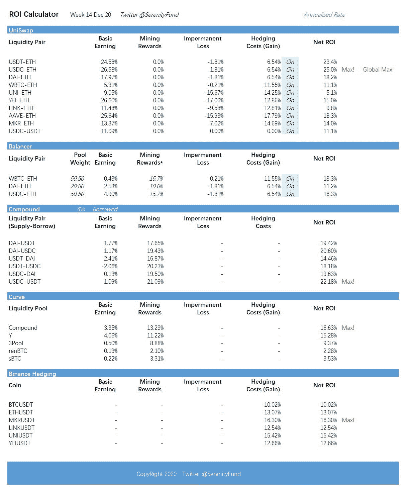

# 基于稳定货币策略的市场回报(2020 . 12 . 14)

> 原文：<https://medium.com/coinmonks/weekly-market-return-on-stablecoin-based-strategies-14-dec-2020-9af97a98ea5c?source=collection_archive---------6----------------------->

根据 Serenity Fund 对 stablecoins 投资的[策略，我们提供每周更新的回报。](https://serenityfund.medium.com/serenity-funds-general-strategies-f91a7fecb696)

过去一周的快速分析:

*   我们看到收益率本周有所下降，主要是因为平台代币的价格已经下降。
*   Uniswap 的采矿奖励仍在讨论中。我们认为这是一个战术举措，Uniswap 不需要采矿奖励来激励流动性提供者。本周，Uniswap 的 USDC-ETH 组合给出了 26.6%的收益率，完全基于其交易佣金。
*   曲线保持强劲，你可以通过检查渴望是否有一个更好的比率来进一步增强这一点(因为渴望使用增强)。
*   上周我们增加了平衡器的投资回报率。展望未来，我们将监测 Balancer 的顶级池，WBTC-韦瑟，USDC-韦瑟，戴-韦瑟的回报。这里使用的策略与 Uniswap 相同。

此外，我们上周还关注了其他市场机会(大多是暂时的):

*   [奶油杠杆矿业](https://serenityfund.medium.com/strategy-paper-cream-leverage-mining-eth-as-principal-a9ec1ea6a7d)，APY 现在是 20%到 30%。这是 ETH 命名的。
*   [Cover Protocol Mining](https://serenityfund.medium.com/strategy-paper-mining-cover-with-an-understanding-of-the-risk-e1bd446c996) ，现在 APY 接近 100%，是最近新出的，可能会有变化。
*   本周我们将在 BarnBridge 和 PowerPool 上发布策略建议。关注我们的 twitter 了解更多信息。

关注我们的[推特](https://twitter.com/SerenityFund)获取最新更新。

(宁静队，2020 年 12 月 14 日。推特[https://twitter.com/SerenityFund](https://twitter.com/SerenityFund)

## 另外，阅读

*   最好的[加密交易机器人](/coinmonks/crypto-trading-bot-c2ffce8acb2a)
*   [Uniswap API](https://bitquery.io/blog/uniswap-pool-api) —如何获取 Uniswap 数据？
*   [Deribit 审查](/coinmonks/deribit-review-options-fees-apis-and-testnet-2ca16c4bbdb2) |选项、费用、API 和 Testnet
*   [FTX 密码交易所评论](/coinmonks/ftx-crypto-exchange-review-53664ac1198f)
*   [Bybit 交换审查](/coinmonks/bybit-exchange-review-dbd570019b71)
*   最好的比特币[硬件钱包](/coinmonks/the-best-cryptocurrency-hardware-wallets-of-2020-e28b1c124069?source=friends_link&sk=324dd9ff8556ab578d71e7ad7658ad7c)
*   [密码本交易平台](/coinmonks/top-10-crypto-copy-trading-platforms-for-beginners-d0c37c7d698c)
*   [Bitsgap vs 3 commas vs quad ency](https://blog.coincodecap.com/bitsgap-3commas-quadency)
*   最好的[加密税务软件](/coinmonks/best-crypto-tax-tool-for-my-money-72d4b430816b)
*   [最佳加密交易平台](/coinmonks/the-best-crypto-trading-platforms-in-2020-the-definitive-guide-updated-c72f8b874555)
*   最佳[加密贷款平台](/coinmonks/top-5-crypto-lending-platforms-in-2020-that-you-need-to-know-a1b675cec3fa)
*   [莱杰 Nano S vs 特雷佐 one vs 特雷佐 T vs 莱杰 Nano X](https://blog.coincodecap.com/ledger-nano-s-vs-trezor-one-ledger-nano-x-trezor-t)
*   [block fi vs Celsius](/coinmonks/blockfi-vs-celsius-vs-hodlnaut-8a1cc8c26630)vs Hodlnaut
*   [bits gap review](/coinmonks/bitsgap-review-a-crypto-trading-bot-that-makes-easy-money-a5d88a336df2)——一个轻松赚钱的加密交易机器人
*   为专业人士设计的加密交易机器人
*   [PrimeXBT 审查](/coinmonks/primexbt-review-88e0815be858) |杠杆交易、费用和交易
*   [Altrady 评论](https://blog.coincodecap.com/altrady-reivew)
*   [埃利帕尔泰坦评论](/coinmonks/ellipal-titan-review-85e9071dd029)
*   [赛克斯石评论](https://blog.coincodecap.com/secux-stone-hardware-wallet-review)
*   [BlockFi 评论](/coinmonks/blockfi-review-53096053c097) |赚取高达 8.6%的加密利息
*   开发人员的最佳加密 API
*   [最佳区块链分析工具](https://bitquery.io/blog/best-blockchain-analysis-tools-and-software)
*   [加密套利](/coinmonks/crypto-arbitrage-guide-how-to-make-money-as-a-beginner-62bfe5c868f6)指南:新手如何赚钱
*   顶级[比特币节点](https://blog.coincodecap.com/bitcoin-node-solutions)提供商
*   最佳[加密制图工具](/coinmonks/what-are-the-best-charting-platforms-for-cryptocurrency-trading-85aade584d80)
*   了解比特币最好的书是什么？

> [在收件箱中直接获得最佳软件交易](/coinmonks/newsletters/coinmonks)

