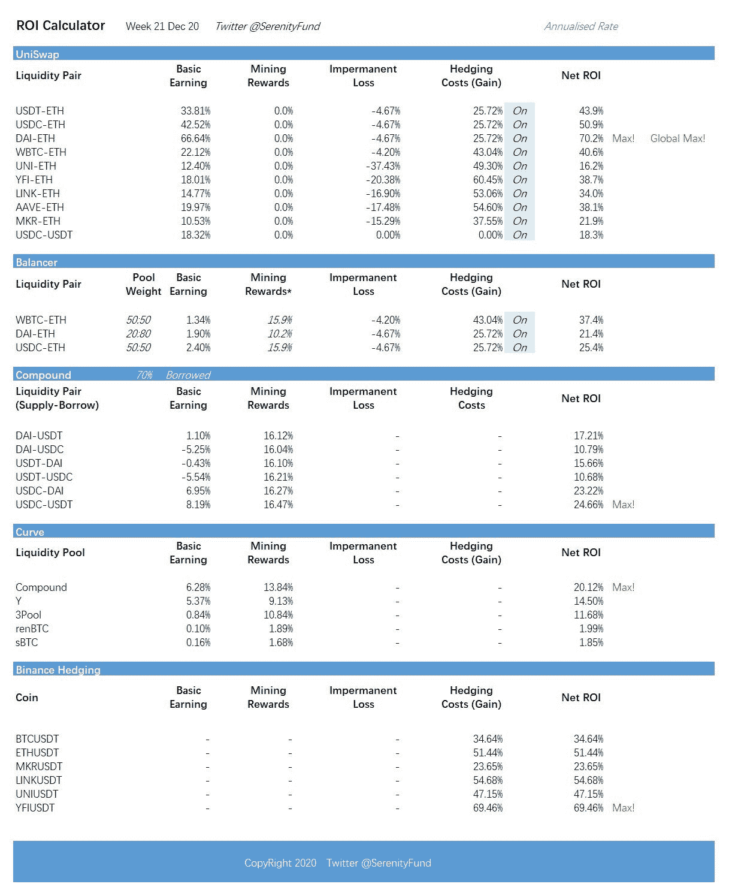

# 基于稳定货币策略的市场回报(2020 . 12 . 21)

> 原文：<https://medium.com/coinmonks/weekly-market-return-on-stablecoin-based-strategies-21-dec-2020-ea6aea5160ac?source=collection_archive---------3----------------------->

根据 Serenity Fund 对 stablecoins 投资的[策略，我们提供每周更新的回报。](https://serenityfund.medium.com/serenity-funds-general-strategies-f91a7fecb696)

过去一周的快速分析:

*   上周，收益率最高的资产被 Uniswap 的 DAI-ETH 投资组合买走。由于 Warp Finance hack，交易了 3 亿 DAI，这将这对组合的周收益率推高了。USDT 联邦理工学院和 USDC 联邦理工学院也在较小程度上受益。圣诞横财~
*   无论如何，我们在过去几周观察到，自从 Uniswap 停止流动性挖掘奖励以来，它仍然比 Balancer 和 Sushiswap 更强。除非意外收获，Uniswap 的 APY 通常等于 Balancer 和 Sushiswap 的，两者都必须提供采矿奖励才能竞争。如果一切保持不变，尤尼斯瓦普将赢得这场比赛；但我们希望 Balancer 和 Sushiswap 能够创新，迎头赶上。
*   上周，由于比特币破纪录的价格，币安的融资利率也一直居高不下。因此，如果你只是使用我们的 CEX 对冲策略，这是我们最基本的策略之一，年化收益率将为 30%至 50%。
*   尽管各地都在竞争吸引稳定的收益，但复合和曲线基金的收益率仍保持在 10%以上。

此外，我们上周还关注了其他市场机会(大多是暂时的):

*   [奶油杠杆矿业](https://serenityfund.medium.com/strategy-paper-cream-leverage-mining-eth-as-principal-a9ec1ea6a7d)，APY 现在是 20%到 30%。这是 ETH 命名的。圣诞节后不久就结束了。
*   [盖协议开采](https://serenityfund.medium.com/strategy-paper-mining-cover-with-an-understanding-of-the-risk-e1bd446c996)，其 APY 已降至 50%至 60%区间。为了把收益率提高到 200%，我们冒了一点风险。我们将在退出后发布，因为这是付费观众的优质策略。
*   我们进一步分析了[嘉实金融](https%3A%2F%2Fmedium.com%2Fcoinmonks%2Fcompany-watch-harvest-finance-the-passive-defi-fund-earning-the-risk-takers-money-76193f496a4b)，以及其他几个有[高收益稳定收入采矿奖励](https%3A%2F%2Fserenityfund.medium.com%2Fstrategy-paper-high-yield-stablecoin-exotics-1-2-d5baee90b3bc)的平台，比如 Idle、KeeperDao、Rari 和 Barn Bridge。

下周我们将会休息一下，但是如果时间允许的话，我们将会关注 Defi 行业的宏观情况。例如，除了挖掘奖励之外，还有多少真正的价值创造活动？敬请关注。

关注我们的 [Twitter](https://twitter.com/SerenityFund) 获取最新更新。祝大家圣诞快乐！！

(宁静队，2020 年 12 月 21 日。https://twitter.com/SerenityFund 推特

## 另外，阅读

*   [密码交易机器人](/coinmonks/crypto-trading-bot-c2ffce8acb2a)
*   [3 商业评论](/coinmonks/3commas-review-an-excellent-crypto-trading-bot-2020-1313a58bec92)
*   [AAX 交易所评论](/coinmonks/aax-exchange-review-2021-67c5ea09330c) |推荐代码、交易费用、利弊
*   [Deribit 审查](/coinmonks/deribit-review-options-fees-apis-and-testnet-2ca16c4bbdb2) |选项、费用、API 和 Testnet
*   [FTX 密码交易所评论](/coinmonks/ftx-crypto-exchange-review-53664ac1198f)
*   [Bybit 交换审查](/coinmonks/bybit-exchange-review-dbd570019b71)
*   [3Commas vs Cryptohopper](/coinmonks/cryptohopper-vs-3commas-vs-shrimpy-a2c16095b8fe)
*   最好的比特币[硬件钱包](/coinmonks/the-best-cryptocurrency-hardware-wallets-of-2020-e28b1c124069?source=friends_link&sk=324dd9ff8556ab578d71e7ad7658ad7c)
*   [密码本交易平台](/coinmonks/top-10-crypto-copy-trading-platforms-for-beginners-d0c37c7d698c)
*   [bits gap vs 3 commas vs quad ency](https://blog.coincodecap.com/bitsgap-3commas-quadency)
*   最好的[加密税务软件](/coinmonks/best-crypto-tax-tool-for-my-money-72d4b430816b)
*   [最佳加密交易平台](/coinmonks/the-best-crypto-trading-platforms-in-2020-the-definitive-guide-updated-c72f8b874555)
*   最佳[加密贷款平台](/coinmonks/top-5-crypto-lending-platforms-in-2020-that-you-need-to-know-a1b675cec3fa)
*   [莱杰 Nano S vs 特雷佐 one vs 特雷佐 T vs 莱杰 Nano X](https://blog.coincodecap.com/ledger-nano-s-vs-trezor-one-ledger-nano-x-trezor-t)
*   [block fi vs Celsius](/coinmonks/blockfi-vs-celsius-vs-hodlnaut-8a1cc8c26630)vs Hodlnaut
*   Bitsgap 评论——一个轻松赚钱的加密交易机器人
*   为专业人士设计的加密交易机器人
*   [PrimeXBT 审查](/coinmonks/primexbt-review-88e0815be858) |杠杆交易、费用和交易
*   [Altrady 评论](https://blog.coincodecap.com/altrady-reivew)
*   [埃利帕尔泰坦评论](/coinmonks/ellipal-titan-review-85e9071dd029)
*   [SecuX Stone 点评](https://blog.coincodecap.com/secux-stone-hardware-wallet-review)
*   [BlockFi 评论](/coinmonks/blockfi-review-53096053c097) |从您的密码中赚取高达 8.6%的利息
*   [面向开发人员的最佳加密 API](/coinmonks/best-crypto-apis-for-developers-5efe3a597a9f)
*   [最佳区块链分析工具](https://bitquery.io/blog/best-blockchain-analysis-tools-and-software)
*   [加密套利](/coinmonks/crypto-arbitrage-guide-how-to-make-money-as-a-beginner-62bfe5c868f6)指南:新手如何赚钱
*   顶级[比特币节点](https://blog.coincodecap.com/bitcoin-node-solutions)提供商
*   最佳[加密制图工具](/coinmonks/what-are-the-best-charting-platforms-for-cryptocurrency-trading-85aade584d80)
*   了解比特币的[最佳书籍有哪些？](/coinmonks/what-are-the-best-books-to-learn-bitcoin-409aeb9aff4b)

> [直接在您的收件箱中获得最佳软件交易](/coinmonks/newsletters/coinmonks)

