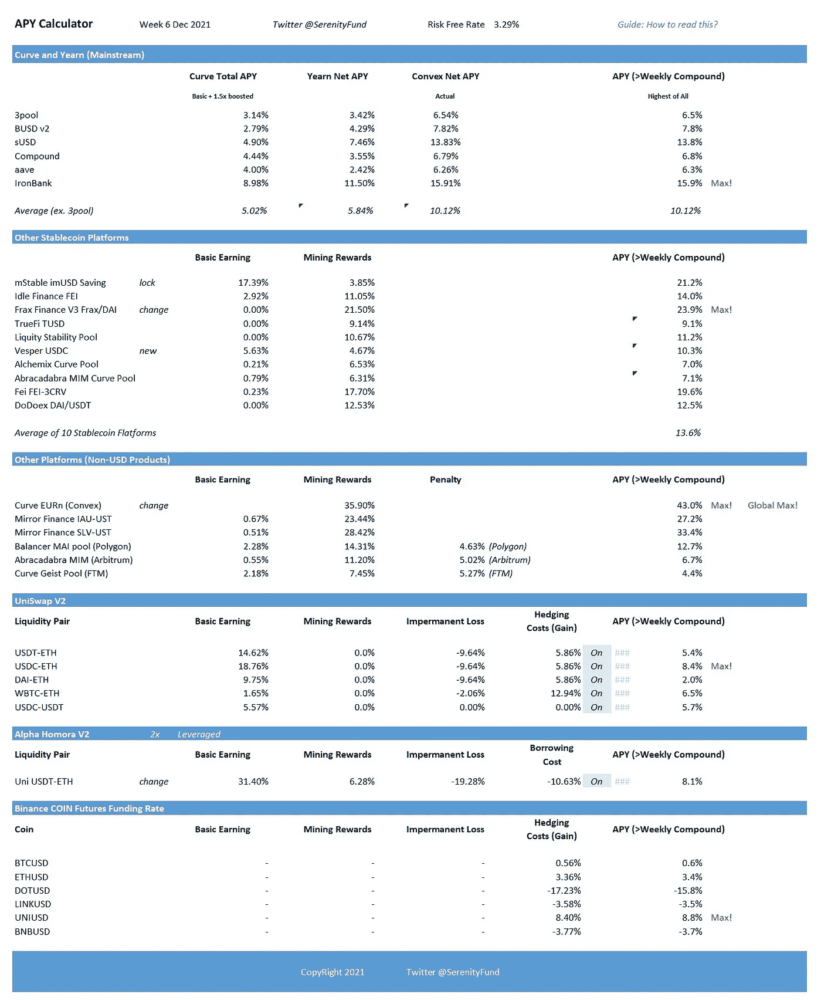

# 基于稳定货币策略的市场回报(2021 年 12 月 6 日)

> 原文：<https://medium.com/coinmonks/weekly-market-return-on-stablecoin-based-strategies-6-dec-2021-d2103b638f73?source=collection_archive---------9----------------------->

我们根据 Serenity Fund 的[stable coin 投资概述](https://serenityfund.medium.com/strategy-paper-overview-of-stablecoin-investments-c6af07fa06a1)中讨论的策略和定期更新，提供我们跟踪的平台的每周更新。

*(注:采矿奖励代币产生的收益基于 12 月 6 日的代币价格。累积收益，例如 Uniswap 和 Compound 的基本收益和币安融资利率，是上周的实际收益，每周复合以产生 APY。)*

12 月 6 日快速分析:

*   **无风险利率:3.29%** 。无风险利率，代表复合、Aave 和 Curve 的安全收益率，低于上周的 3.48%。上周末，市场经历了一次严重的回调，但在周一有所反弹。Defi 代币受到的影响较小，无风险利率略有下降。
*   曲线/渴望/凸:曲线/渴望大盘基准利率现为 10%，低于上周的 12%。这与周末的市场修正一致，因为 CRV 下跌超过 20%，影响了 Curve 和附属平台的收益率。CVX 比其他 defi 巨头反弹得更快，因为其估值得到了投票系统的支持，根据上个月的贿赂估计其收益率约为 40%。
*   **其他稳中有降平台:**收益率 7% ~ 24%不等，平均 14%，明显低于上周的 21%。Frax Finance 在 uni swap V3(FRAX/戴)上的流动性池继续在该类别中领先，尽管从 40%以上的高点回落。其他平台大多因市场调整而下跌。本周，我们用 Vesper 替换了 WasabiX，因为 WasabiX 的策略是基于 Liquity 的衍生产品 LUSD。这与这一类别的平均产量下降有一点关系。
*   **其他(非美元稳定币或非以太币)平台，又名奇异策略:**奇异策略现在提供 4%到 43%的收益率。凸面上的欧洲妖魔化产品在这一类别中名列前茅，因为镜像协议的产量下降到了一个更合理的水平。在下跌市场中表现强劲的 LUNA 让投资者对 Terra chain 的平台(如 Mirror Protocol)更有信心。其结果是，更多的流动性流入了市场，降低了收益率，此外还有更低的平台令牌 MIR。
*   **Uniswap/Alpha:** Uniswap 上周收益一般，一半是 stablecoin，一半是 ETH pairs。这在下跌的市场中是意料之中的，只是被强劲的 ETH 抵消了。
*   **币安保证金融资利率:**在下跌市场中，融资利率处于低位或负值。

上面的总结是对上周和周一市场状况的一个快照。这绝不是任何宁静基金的投资组合。上表既不是排名表，也不是详尽无遗的。还有各种其他 defi 协议和产品可以提供不同的风险和回报。关注我们下面的 Twitter，获得更多关于 defi 市场的及时和详细的信息。

(宁静队，2021 年 12 月 6 日，推特:【https://twitter.com/SerenityFund】T2)

> 加入 Coinmonks [电报频道](https://t.me/coincodecap)和 [Youtube 频道](https://www.youtube.com/c/coinmonks/videos)了解加密交易和投资

## 另外，阅读

*   [印度最佳 P2P 加密交易所](https://blog.coincodecap.com/p2p-crypto-exchanges-in-india) | [柴犬钱包](https://blog.coincodecap.com/baby-shiba-inu-wallets)
*   [八大加密附属计划](https://blog.coincodecap.com/crypto-affiliate-programs) | [eToro vs 比特币基地](https://blog.coincodecap.com/etoro-vs-coinbase)
*   [最佳以太坊钱包](https://blog.coincodecap.com/best-ethereum-wallets) | [电报上的加密货币机器人](https://blog.coincodecap.com/telegram-crypto-bots)
*   交易杠杆代币的最佳交易所
*   [5 大最佳社交交易平台](https://blog.coincodecap.com/best-social-trading-platforms) | [瓦济克斯 NFT 印度](https://blog.coincodecap.com/wazirx-nft-india)
*   [10 本关于加密的最佳书籍](https://blog.coincodecap.com/best-crypto-books) | [英国 5 个最佳加密机器人](https://blog.coincodecap.com/uk-trading-bots)
*   [Koinly 回顾](https://blog.coincodecap.com/koinly-review) | [Binaryx 回顾](https://blog.coincodecap.com/binaryx-review) | [Hodlnaut vs CakeDefi](https://blog.coincodecap.com/hodlnaut-vs-cakedefi-vs-celsius)
*   [比斯勒评论](https://blog.coincodecap.com/bitsler-review)|[WazirX vs coin switch vs coin dcx](https://blog.coincodecap.com/wazirx-vs-coinswitch-vs-coindcx)
*   [7 大副本交易平台](https://blog.coincodecap.com/copy-trading-platforms) | [BuyCoins 点评](https://blog.coincodecap.com/buycoins-review)
*   [XT.COM 评论](https://blog.coincodecap.com/profittradingapp-for-binance)币安评论 |
*   [SmithBot 评论](https://blog.coincodecap.com/smithbot-review) | [4 款最佳免费开源交易机器人](https://blog.coincodecap.com/free-open-source-trading-bots)