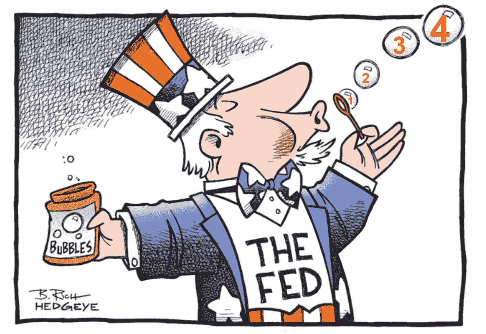
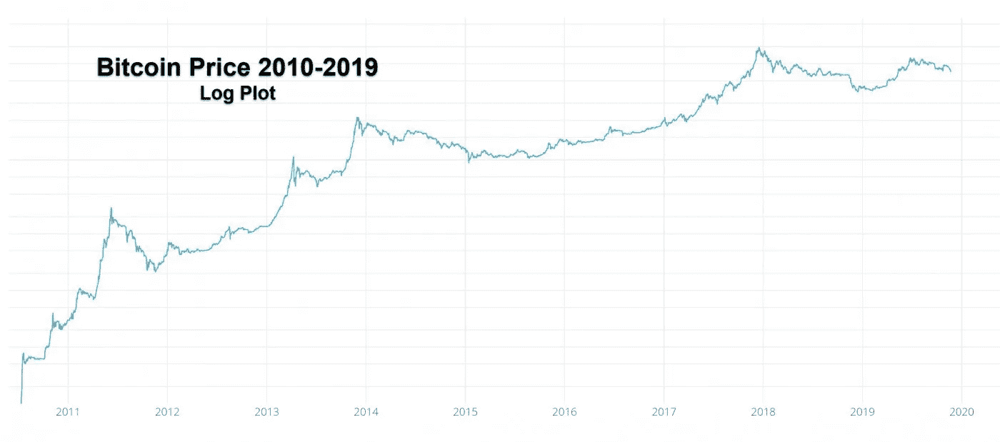

# 欢迎来到“非 QE”，即 QE4

> 原文：<https://medium.com/coinmonks/welcome-to-not-qe-ie-qe4-4fd5f4e3c05f?source=collection_archive---------1----------------------->

## ***乘坐采用加密技术的革命性火箭……完全进化***

Image courtesy of B. Rich of Hedgeye with edits by Dr. Chris Kacher aka Dr K

**欢迎来到“非 QE”，即 QE4**

尽管美联储宣称他们没有重启 QE，但事实似乎并不如此。10 月份，美联储的资产增加了 1620 亿美元，创下 2008 年以来的最大月度增幅。尽管一切都很好😹

此外，据报道，自 9 月 11 日以来，资产负债表上增加了 2700 亿美元，这意味着平均每天增长 58 亿美元。根据圣路易斯美联储银行的数据，截至 11 月 15 日，美联储的总资产为 4.04 万亿美元。

说到底，只是语义而已。美联储资产负债表的增加和自 9 月 11 日以来增加的 2700 亿美元不可避免地有助于提升资产价格。

**比特币火箭助推器**

较低的利率、更多的 QE，以及 2020 年 5 月矿工的报酬减半，这些因素加在一起，对比特币来说是很好的火箭助推器。比特币减半减少了 50%的供应扩张，这与央行扩大货币供应相反。自 2008 年以来，美国美联储已将货币供应量扩大了 2 万亿美元。这是拥有比特币和硬资产的 2 万亿个理由。

**坎蒂隆效应**

坎蒂隆效应指的是货币供应量增加导致的相对价格变化。它认为货币注入(QE 和其他通胀促进政策)可能不会改变一个经济体的长期产出。事实上，全球经济停滞强调了这一点，布里奇沃特的雷伊·达里奥也指出，资本经常被“富人”囤积，因为他们已经实现了充足。达利欧同意，额外的 QE 应该被推到那些不太幸运的人手中，他们会花掉这些钱，并投入到有利于经济的项目中，如小企业或教育。

富人和穷人之间的差距越来越大，推动民粹主义的是那些在股市和房地产上投资最多的人，他们是 QE 的第一批受益者。我们经历了十多年的 QE，这解释了自上世纪 30 年代以来未曾见过的民粹主义崛起。与此同时，那些存款不足的不幸者甚至赚不到多少钱，或者更糟的是，如果他们的账户是越来越多的负利率账户之一，他们的存款就会减少，特别是在德国和日本等主要国家。随着硬资产和必需品的价格持续上涨，即使是美国或英国的人也认为他们的美元和英镑贬值了。所以储蓄不再安全。菲亚特不适合长期储蓄。随着利率走低，德国和其他储蓄国将把他们的部分数万亿储蓄转移到收益率更高的投资上。

**有哪些选项？**

也就是说，储蓄者和穷人有什么选择？房地产是一种选择，但通常不适合那些不太富裕的人。比特币解决了这个问题。菲亚特有意制造通胀，而比特币有意制造通缩。

VanEck 数字资产策略师/董事 Gabor Gurbacs 表示，比特币和黄金都可能受益于 QE 主导的美元贬值和资产通胀。根据 Gurbacs 的说法，“央行扩大资产负债表是变相的量化宽松。实际上，央行购买政府债券并扩大回购市场计划，意在控制货币市场。比特币和黄金可能会为这种受到严格控制的中央银行系统提供一种替代选择，并可能对冲灾难性的失败。”

尽管比特币的波动性非常大，但它的整体波动性随着每一轮牛市和熊市周期的过去而减少，如下图所示。我们不要忘记，黄金，一种经典的避险资产，在截至 2011 年的三年里从 800 美元上涨到 1，921 美元，但在 2015 年 12 月回落到 1，050 美元时损失了近 50%。波动大吗？

**更好的选择**

尽管黄金(当然还有比特币)有时表现出极大的波动性，因此可能不会引起保守储户和那些财务状况不太好的人的兴趣，但在这个不断膨胀的债务泡沫中，房地产和股票等硬资产的价值将继续上升。但是 RE 和股票通常是不太富裕的人买不起的。

还有另一个选择。一股硬资产被令牌化的浪潮正在到来。纳斯达克前首席执行官表示，在 5 年内，所有股票将被令牌化。其他人指出，这几乎适用于任何硬资产。区块链技术通过消除中间人，同时允许散户和机构投资者参与部分所有权，为流动性较差的市场带来了流动性和效率。

区块链的令牌化房地产只是冰山上的冰块。经济优势是巨大的。最重要的是，这种代币的价值与基础资产挂钩，因此，随着法定货币继续贬值，资产价格上涨，代币可以获得资本收益和收益。

因此，HanseCoin 是首批将证券令牌化的受监管公司之一，在一个法定贬值和负收益率债务的世界里，证券将成为下一个财富仓库。HanseCoin 的目标是众多领域，包括 500 多亿欧元的建筑股权项目，这些项目因 MiFID 等繁重的法规而急需资金，这些法规摧毁了封闭式基金市场。到目前为止，进入这一领域的其他公司都专注于为零售市场做好准备的已完成项目。

但投资者要小心。正如我们从 ICO 领域所知，许多公司都是建立在破碎的商业模式之上，类似于上世纪 90 年代 dot.com 的繁荣。这类公司通常使用“懒惰”的解决方案，例如将权利令牌化为基础资产，而不是资产本身。因此，只有合格的投资者才被允许投资。这当然不是突破性的，因为可以让庞大的零售市场进行投资的监管被规避了。然后，这些公司会做出虚假声明，将资产证券化，从而推高其证券的价格。

相反，HanseCoin 通过遵守不断发展的证券法来推动区块链向前发展，同时利用区块链以低得多的成本将透明度、效率和流动性带入投资领域，使卖方、买方和投资者受益。举个例子，在航运业，通过取消中间商，成本从占总费用的 20%以上下降到 4%以下。德国最大的交易所之一，Boerse Stuttgart 将在获得监管机构批准开始上市股票后，将 HanseCoin 的股票上市。

**全球经济停滞意味着未来的低利率**

根据经济合作与发展组织(OECD)的数据，尽管有 QE，全球经济正以自 2008 年金融危机以来最慢的速度增长。各国央行试图重振投资，但世界经济预计今明两年将增长 2.9%，为十年来最低水平。经合组织表示，2021 年增长可能会小幅上升至 3.0%，但前提是包括贸易战和中国经济意外大幅放缓在内的一些风险得到遏制。

美国关税对中国经济的压力显而易见，10 月份工业利润同比下降 9.9%。这是自中国 2011 年开始编制该数据以来的最大降幅。特朗普可能会采取强硬态度，这可能会进一步拖延任何有意义的决议，尽管他谨慎地回避了两国正处于谈判的“最后阵痛”，以达成“第一阶段”协议，缓解贸易战。

随着世界经济陷入困境，一种范式转变正在发生，其中包括经济的数字化，这最终将是一个乐观的事件，特别是对比特币和区块链/加密作为一个整体来说，但与此同时，这种转变对传统保守势力来说并不容易，这将给全球经济带来进一步的压力。经合组织首席经济学家劳伦斯·布恩在报告中写道:“将这些转变视为可以通过货币或财政政策解决的临时因素将是一个政策错误:它们是结构性的。”雷伊·达里奥在他的作品中重复了这种观点。

**利率降至 0%及以下**

今年美国经济增长预计为 2.3%，低于 9 月份的 2.4%，因为随着贸易战的持续，2017 年减税的财政优势减弱。随着世界上最大的经济体在 2020 年和 2021 年增长 2.0%，经合组织表示，如果增长变弱，将有必要进一步降息。这表明，正如著名投资者斯坦利·德鲁肯米勒(Stanley Druckenmiller)用自己的钱预测的那样，已经很低的利率水平将降至 0%，而负利率将进一步降至负区间。呀。

历史低利率、接近零或负收益率的储蓄账户以及 18 万亿美元的负收益率债券强调了将资金转移到另类投资的必要性，正如雷伊·达里奥、吉姆·罗杰等知名投资者所建议的那样，这些投资者拥有值得关注的终身记录。HanseCoin 等公司通过允许散户投资者投资于流动性、可交易性和令牌化资产，为市场带来了一个关键的替代选择。

这是我最近写的一份报告，它有助于引导投资者进入我一直认为未来风险/回报更高的投资领域。

**由克利斯·凯驰博士的** [的**美德自私投资**](http://www.selfishinvesting.com/)**[**汉胜数码接入**](https://hansedigitalaccess.com) **和 KJA 数码投资****

> **[直接在您的收件箱中获得最佳软件交易](https://coincodecap.com/?utm_source=coinmonks)**

********