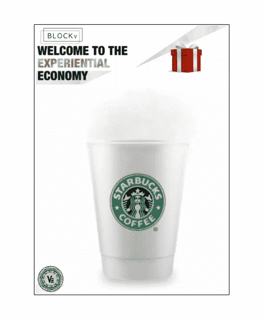
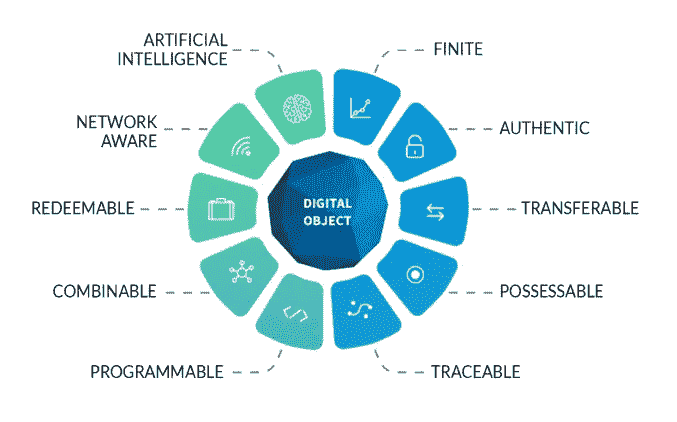
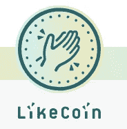

# 欢迎来到体验经济！

> 原文：<https://medium.com/coinmonks/welcome-to-the-experiental-economy-f0b808ff3bf?source=collection_archive---------10----------------------->

昨天我用[**block v**](https://blockv.io/)**-**app 领取了我的第一个数字代币！😁

> 你可以发送、丢弃、删除它，还可以给留下它的人发信息……显然，你还可以用它买一杯咖啡！

***..引用“我”昨天在**[**block dam**](http://www.meetup.com/nl-NL/Permissionless-Society/)**见面会上的话…去看看我们吧！；)***

*这些新代币有如此多的可能性，我甚至不知道从哪里开始。那么，让我们从头开始吧…*

*如果你下载了应用程序，并使用相机扫描网站上的这个红色惊喜框，你将获得你的第一个 **vAtom** -token！这些 VEE 令牌是根据 ERC 20 令牌标准构建的智能合约令牌，您将是其中的早期适应者之一，所以首先让我们庆祝一下！*

**

*BLOCKV-SURPRISE BOX*

*如果你随后在应用程序中打开地图，那么你会看到“一个新的层网格”已经被放置在世界各地。一个新的地方，在那里突然之间新的和令人兴奋的事情成为可能。当然，我们已经知道这个概念了。我们中的许多人还没有真正使用它，但我们称之为'*一个* *增强现实应用'。不过这次有点不同。这个新的层将很快与数以百万计的数字代币结合起来。**

*让我们想象一年后。BlockV-app 会更发达。在你的城市里，你将会带着成千上万的这些“藏起来的代币”离开你的房子。它们只是等着你去发现，但也许这一次它们是你的一些亲爱的朋友亲自为你放在那里的，只因为这是你的生日！早上，当你醒来并喝了一杯咖啡后，你会惊讶地发现一条很好的私人信息。这条消息将告诉你打开应用程序，并按照指示，这当然是你做的。*

*在接下来的几个小时里，通过一个接一个地发现下一个数字惊喜，同时会见你的朋友*(当然，他们可以在他们的手机上跟踪你的一举一动)*你将有一种全新的方式度过你的一天，并完全感到惊讶！告诉我，谁不想在他们的生活中寻找一个像这样令人兴奋的新旅程？或者…也许你早上有点暴躁？或者你不再喜欢应用程序了…你可能认为你能够承受你的好奇心？*

*当然，这些永远都是选择…但是象征性的惊喜生日派对只是一个疯狂的想法。只要想想这些代币的可能性，就会产生一系列令人惊奇的新想法。*

*我们在咖啡店呆一会儿吧。突然，这个令牌可以变成:*

*   ***‘一张优惠券’…**这样你就可以免费得到一杯咖啡。*
*   ***一个“忠诚计划”**，它可能会建立..*你的特殊关系*与你当地的咖啡店。因此，去收集一些这些代币，并免费获得一盒甜巧克力作为回报吧！*
*   *一件收藏品，为了将来某一天的特殊场合。你刚刚和一个朋友或亲戚在咖啡店里经历的专属时刻，这个朋友或亲戚对你来说很重要。等等，也许你最喜欢的艺术家会出现，在某个地方为你留下亲笔签名的信物，当然还有一张照片，或者一首专为你写的歌！*
*   *一张礼品卡，是给你母亲的免费生日咖啡，是你送她的，还有那盒你仍放在钱包里的巧克力。你没有消费它们，因为你正在节食，因为你已经从这些收集的代币中吃了所有的糖果。*
*   ***一张产品代金券**，可以在*她自己当地的咖啡店买到一杯完全按照你母亲喜欢的方式制作的咖啡！不需要解释什么，信息都在令牌里…**
*   ***一个游戏代币**，给站在你咖啡店外面的虚拟警卫…这样你就可以在他免费享用咖啡的时候拿走他的虚拟汽车！*

*好吧。所以我们已经想到了一些惊人的场景。这些信物可以成为我们的私人日记！但是…让我们把所有相同的可能性应用到我们能想到的其他一些行业…*

*这些数字代币可以真正带来一种新的教育人的方式！学校旅行将永远不会是一样的。它们可以给游客一种全新的体验，没有一个城市可以像你一样用这些代币作为向导来探索。让我们看一下艺术品市场。新的数字艺术家可以使用这些代币以一种前所未有的方式进行创作。绘画可以是这些隐藏标记的秘密载体，你也可以很容易地把它们送出去。当其他更需要他们的人出现时，你只需按一下按钮就可以了。新工作或环境问题呢？人们可以在节日后的第二天打扫公园的草地。或者它们可以被市政当局用来分配奖金以完成附近的不同任务。这只是列举了一些可能性…这里的创造力没有限制。它们都是有价值的！和..*

****..你也可以使用它们，就像你现在使用你的钱一样……****

*如果你想到了一些其他的例子，请在评论中告诉我！*

**

***Anatomy of a vAtom, excerpt from the white-paper!***

*彼得·迪亚曼蒂斯(是的，他是 BlockV 董事会的顾问；)调用一个‘用户界面时刻’发生…*

> *"..当一个平台或界面出现时，以前难以使用的东西变得易于使用和构建，释放其创收潜力..*

**一个很好的例子就是 90 年代互联网浏览器的推出。1993 年只有 26 个网站。1994 年，有 10，000 个，到 1998 年，有数百万个！**马赛克** *(后来的网景)*也是一个“用户界面时刻”或者想想史蒂夫·乔布斯带来 iPhone 的时候，同时 App store 也出现了。**

> **“App Store 允许任何人将想法带入生活，并接触大量的全球受众。自 2008 年以来… 30 万开发人员编写了 200 万个应用程序，被下载了 1400 亿次…”来自:Bold，Peter Diamandis，2016。**

**我现在已经尝试了这个应用程序，我意识到这些令牌可能是相同的。老实说，好吧，它现在并不是 100%有效，那是因为它处于测试阶段。是的，这个平台以后可能会有一些可伸缩性的问题。当然，当一个真正受欢迎的游戏开发出来时，很多人会有一段时间不能使用它…但除此之外，我很好奇，很想看看开发者和新创作者会拿出什么。BlockV 的这个新的数字令牌平台可能确实是类似于**加密的杀手级应用程序！****

**当我昨天在阿姆斯特丹中央车站的花店提到有一条虚拟信息时，柜台后面的三位女士看着我，好像我有点疯了。但是当我解释了自己，并提到在不久的将来一个 DJ 可能会像这样丢票时，他们已经不那么不情愿了。当我提到它们甚至可能是参加一个很酷的派对的门票时，这些女孩立刻笑了，并想知道在哪里下载这个应用程序。**

**一旦一个类似这样的 app 在几个月内被下载超过 7.5 亿次会怎么样？是的，当然我说的是口袋妖怪 Go 这里…增强现实的第一个杀手级应用。或者，如果……在适当的时候，更多的市场开发人员将开始发现和使用这样的应用程序，并为他们的特别促销做广告，那会怎么样？说实话。我认为他们将不得不…因为其他一些人会，而且正因为每个人都想跟上他们的竞争对手，他们可能不想错失良机。接下来你知道我们都在为一些代币跑来跑去！**

**或者，如果你漫步在附近的星巴克，你的手机会收到一个通知，告诉你一些咖啡代币被空投到了你的钱包里。你不进去在午餐时喝一杯免费咖啡吗？**

**老实说，我甚至不喝咖啡..❌☕️❌ ..所以我可能会离开他们..但是等等，也许有人想以合理的价格从我这里购买这些？假设它们只花了大约两欧元...🤣是的，当然，我们以后会有可能将这些产品直接投放市场。**

**总有一天，一些数字代币的市值将超过欧元。可能是这些 vAtoms 将完成它。我想知道这对经济、政府和所有四处奔波的人们会有什么影响。但我想现在我只能把代币放在钱包里再久一点，作为收藏品。**

**请在下面的评论区让我知道你对此的想法。但是一如既往，请保持礼貌！；)**

**#区块链#增强现实# blockv # vatoms #收藏品# erc725 # myfirsttoken #梦幻营销#用户界面时刻# peterdiamandis # idontevenkcoffee # hod ler # token everywhere**

**PS。如果你想要最新的更新，你可以在我的 Instagram 频道上关注我！如果你喜欢这篇文章，你可以给我发一些免费的 4 you-***LIKE-coin****via*[***此链接***](https://button.like.co/masteringcrypto) ***！*******:)******

******

***[**www.instagram.com/masteringcrypto/**](http://www.instagram.com/masteringcrypto/)***