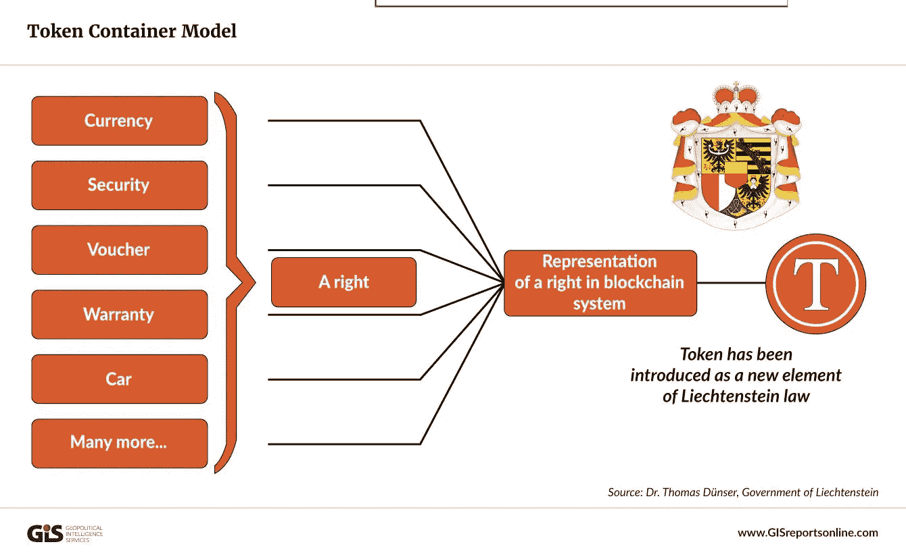
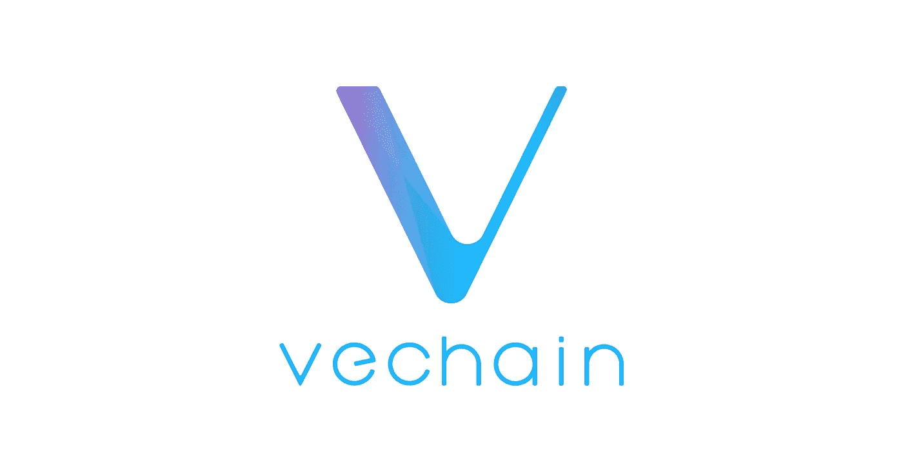

# 欢迎来到人猿星球

> 原文：<https://medium.com/coinmonks/welcome-to-the-planet-of-the-ape-stor-ii-es-d827265b1b89?source=collection_archive---------9----------------------->

> 建议财务顾问如何用严肃的头脑看待新技术，如 NFTs、DAOs 和 DEFI。

# P/ART2:太空是最后的边疆

Photo by [John Fowler](https://unsplash.com/@wildhoney)

大西洋和太平洋两岸的监管者正在公开追逐那些不愿意服从的精神恍惚的牛仔。加密交易所 Bitmex 最近与监管机构达成 1 亿美元的和解。相当多的加密发射台已经明智地开始提供针对流氓演员的保险，试图带着投资者的钱逃跑。这些都是好的迹象。整体行业愿意专业成长。因此，同样重要的是，有关金融工具创造性重新包装的监管，应避免扼杀一个新兴行业…

很难理解的是，这些项目会直接跳到那些在法律方面更友好、更清晰的国家。就像跨国公司一样，如今小型、敏捷、灵活的团队可以选择在哪里开店。各国甚至在各自的领土上磕磕绊绊地开展项目。人们可能想知道，SEC(美国证券交易委员会)目前的行为是否足以应对复杂性以及数量庞大的指数级增长的项目？对冲加密的期权已经通过大量的交易所产生，这是好事。如果证交会想要清除坏人以保护小投资者，它应该格外小心。

答毕竟，猎金鹅是一回事；接受比特币这样的发明是另一回事。在甜蜜的密码天才和疯狂的通货膨胀印钞的边缘，还有很多事情有待观察。尽管有明显隐藏的议程，这是渴望权力的恐龙的症状，旧的必须为新改进的范式让路。执着于所有权、版权、创造性合作和流动性的老派定义是站不住脚的。更广阔的前景是将人类“强迫”进入太空。它要求我们处理越来越复杂的问题，比如气候变化和移民。因此，我们应该感谢像加密这样的天赐工具…

D ogecoin 将被送上月球，不仅仅是因为[埃隆马斯克](https://twitter.com/elonmusk)是个守信用的人。很简单，因为大玩家已经进入游戏。例如，在当局拒绝 Libra 之后，Visa 坚定地选择了以太坊协议。马斯克指导特斯拉接受比特币。Space X 可能会为商业太空探索开辟另一个场所:[从低轨道开始的太空广告…](https://goodchi.medium.com/are-elon-musk-spacex-planning-for-a-highly-exciting-artistic-publicity-stunt-21e432c9e777) 所有这一切都与 crypto &其卓越的效率有关。根据列支敦士登的[容器模型](https://philippsandner.medium.com/liechtenstein-blockchain-act-how-can-nearly-any-right-and-therefore-any-asset-be-tokenized-based-389fc9f039b1)，截至 2020 年 1 月，几乎任何权利或资产都可以被“打包”成一个令牌。这种范式转变正在进行中&不仅仅是地震。

photo by [Geopolitical Intelligence Services](https://www.gisreportsonline.com/opinion-liechtensteins-use-of-blockchain-may-upend-the-finance-industry,technology,3458.html)

## 如果正确的代码编写得当，它会增加安全性

也许人们应该恰当地意识到太空硬币是非常真实的。交易必须在地球之外协调，广告受到管制&科幻小说不被当作笑话。加密货币功能的范围延伸到我们已知(和未知)宇宙的最遥远的角落。我们将不得不面对这样一个事实，这种扩张不会很快停止。毕竟，我们在这里面对的是一场明确的复兴，一场技术革命，它本质上在人们可以想象的每一个层面上都产生了更高的效率。再说一遍:否认的人只会灭亡。

相反，Y 领域属于那些正确把握正在发生的事情的绝对重要性的人。密码不仅改善了纳斯达克的运作方式，它还让任何想分一杯羹的人都能拿到任何股票。将一只亚马逊股票分割成 1000 个更小的单位，几乎成了孩子们的游戏。酵素(MLN)允许任何人建立对冲基金。宝马或马士基等公司的生产流程由于加密而得到了简化。一些协议甚至已经拥有不可破解的量子密码术。机会会降临到那些愿意看的人身上。

Logo by [Vechain](https://www.vechain.com)

## 消除第三方提高经济效益

持续消除第三方(批发商——如果产品可以直接从生产商流向消费者)会带来越来越多的经济和可持续的好处(更少的办公空间、更高的成本效率、精益模块化等等)。)只要看看 VeChain(VeChain)的成长，就能明白一些财富 500 强公司是如何进入加密领域的。他们也清楚地明白，更顺畅的交易机制可以更好地应对后现代社会的复杂性。

我介绍在任何地方追踪货物:从葡萄酒到新鲜沙拉，Vechain 也抓住了奢侈品设计师的想象力。它标志着真实性的证明，处于数字和现实世界信息交织的尖端。以认证的方式将真实世界的数据贴在密封的标签上&二维码被证明是生产商和终端用户的福音。此外，它带来了超越国界的信任承诺。奖励机制的巧妙利用，结合功能性应用，打开了全新行业生态系统的大门，不仅仅是在供应链管理方面。

P 艺术和银行业务完美地延伸到混合功能中，无缝地融入互动和协作游戏中，谁会在十年前预测到这种情况？虽然区块链被命名为无信任协议，但正是代码的可信性(在良好编程的情况下)保证了跨越以前的政治、工业和社会分歧的边界的更好的合作。从本质上说，我们正在目睹一场正在形成的巨大飞跃。真实、虚拟和增强现实的边界交织在一起，一个新的几乎超现实的宇宙正在连接人们以及艺术家和企业家…

S 暗示放？早期适应者将会获益。恐龙将会灭绝。将其与电视或电脑的发明相比较。或者，谁不想站在汽车和内燃机发明的最前沿呢？也许是智能电风扇？然而，我们可以向地球上(甚至更远)的任何人出售电视、汽车或电脑的精明想法是一个非常强大的想法。我们在乎买家是朝鲜人还是北美人吗？只要我们不挨家挨户地推销钚，我们就能获利。因此，关键是要进行正确的审计，保证代码写得很好，使交易值得信赖并具有法律约束力。

**继续阅读**

[**点击此处阅读 P/ART3:各国争当先锋**](https://goodchi.medium.com/welcome-to-the-planet-of-the-ape-stor-iii-es-cae4c81b9bcf)

[**或者/回 P/ART 1:代码为王**](/coinmonks/welcome-to-the-planet-of-the-ape-stor-i-es-2d6bc00737c8)

> 加入 Coinmonks [电报频道](https://t.me/coincodecap)和 [Youtube 频道](https://www.youtube.com/channel/UCbyDhTbOiKh2iUMKBi4-4Zg)了解加密交易和投资