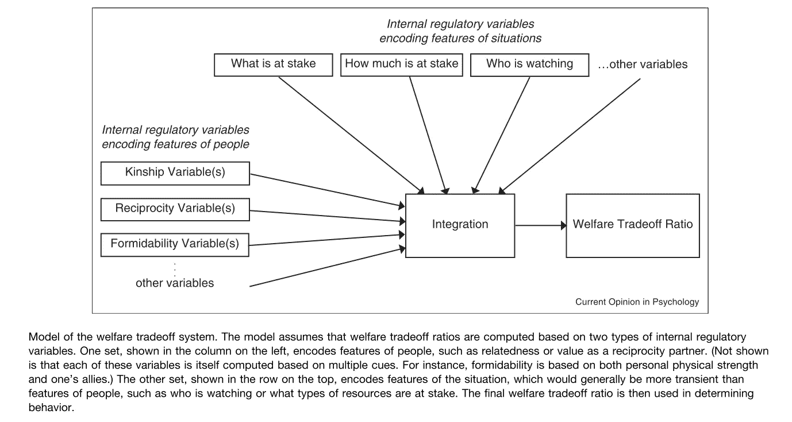
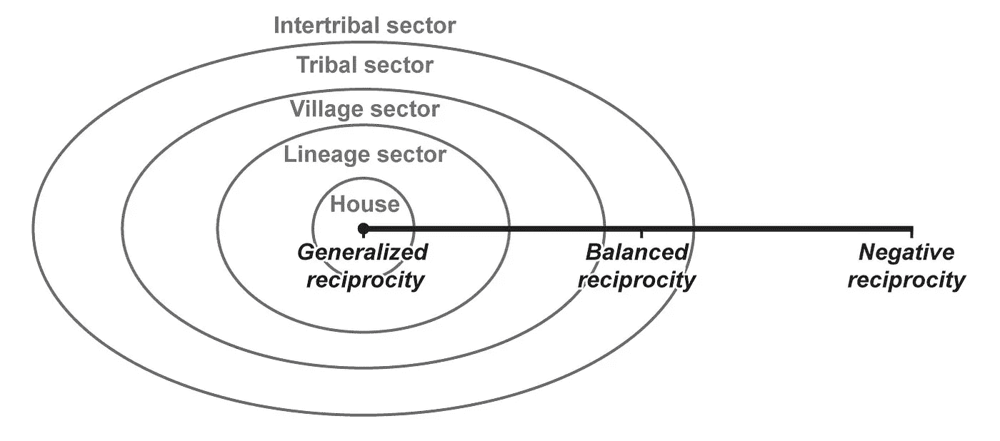
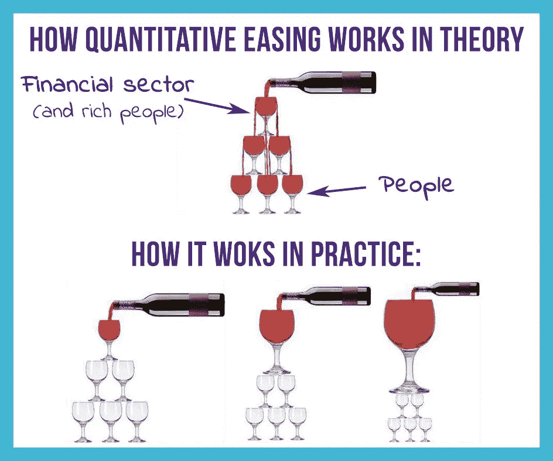

# 福利权衡比率、惩罚性情绪和货币伦理

> 原文：<https://medium.com/coinmonks/welfare-tradeoff-ratios-punitive-sentiment-and-monetary-ethics-524d09404117?source=collection_archive---------3----------------------->

image by [@swedetoshi](https://twitter.com/swedetoshi)

## **福利权衡比率**

进化心理学家 Delton 和 Robertson (2016)断言，自然选择设计了一个由几个变量组成的福利权衡比率，这是利他主义者牺牲个人福利以提高另一个人或一群人的福利的决定的基础。总结他们的模型，内部调节变量编码了自我和他人的特征，如某人是朋友还是敌人，作为量化的表示。所涉及的情境因素包括处于危险中的福利的大小，以及还有谁在关注潜在的利他决策。

Figure 1\. Delton & Robertson (2016)

互惠理论和包容性适应理论各自提供了描述如何计算这些预测自我牺牲行为的定量表示的公式。Delton 和 Robertson (2016 年)发现这些公式在实际操作中偶尔会发生冲突。为了纠正潜在的冲突，他们提出了一个汇总变量，该变量综合考虑并平衡了个人特征和情境特征的输出。情绪作为一个动态因素被额外纳入他们的模型，以动态调整福利权衡比率。

社会折扣研究通常包括要求受试者对那些在一个被操纵的连续体中个人亲密度不同的人做出福利决定。利用这些任务，研究人员已经表明，参与各种亲社会行为的可能性确实取决于一些因素，如关联性和互惠的预期机会。如果参与者之间有更高的社会距离，直到完全匿名，以他人为代价的利己行为变得越来越有可能，事实上也很有可能。Price 等人(2002)报告说，在许多常见的集体行动问题中，激励结构更倾向于搭便车和背叛，而不是鼓励对公共利益的自愿贡献。

# 惩罚性情绪

这些研究的结论对大规模治理系统的基本设计具有重要意义，在这种系统中，一小部分人做出的决定会影响到大量附属人群的福利，特别是当那些拥有决定权的人能够从选择一种行动方案而非另一种行动方案中获益时。在这样的博弈论设计中，只有当双方都可以从继续保持良好关系中预期未来价值时，稳定持久的合作才有可能。

幸运的是，大型经济系统是可能的，其中的设计内在地利用了我们进化的福利权衡比率和个人的自利动机，以造福未知的陌生人和整体社会福利。奥地利资本主义的经济形式可能是这种制度的最好例子。在《财富的福音》一书中，安德鲁·卡内基指出，与任何致力于慈善事业的公共基金会相比，出于自身利益行事的个人反而为更大的利益做得更多。引用亚当·斯密的*《国富论》*观察到了同样的现象，*“他在这种情况下，就像在许多其他情况下一样，被一只看不见的手牵着去促进一个不是他本意的目的。”*通过商业竞争，以公平的价格和足够的规模提供高质量的商品和服务以获取利润，除了自私行为的个体成员的生殖健康之外，普通大众的财富也增加了。读者可能想知道现代西方资本主义是如何偏离奥地利自由市场模式的。主要的偏离发生在我们经济互动的最基础的层面——货币本身。

适当的货币技术能够实现陌生人之间的互惠利他主义，因此对于讨论最佳集体福利制度至关重要。理想的货币是一种记忆存储和可信赖的会计工具，它密切反映了一段时间内个人对社会所做贡献的价值。美元和其他现代货币被称为法定货币，这意味着它们被认为是有价值的，因为政府这样说，而不是因为它们与任何真实世界的商品(如黄金)有联系，这些商品已经由自由市场民主地分配了价值。这种让渡允许法定货币的发行者任意创造更多的单位，没有上限(即合法伪造)。反过来，美国美联储前主席保罗沃尔克(Paul Volcker)曾提出，央行的首要责任是防止本币贬值。然而，国家法定货币都不可避免地被央行行长贬值，他们通过随意印刷来增加总供应量，然后选择性地将新创造的货币分配给他们最亲密的朋友和盟友。

“*允许我发行和控制一个国家的货币，我不在乎谁制定它的法律*”，这是一句经常被认为是王朝银行家迈耶·罗斯柴尔德的名言，它强调了金钱对立法者闭门决策施加的无可争议的影响。量化宽松是一个听起来无害的名字，它被归因于道德上危险的财富创造过程和向大型银行机构、公司、对冲基金和资产持有人的偏袒分配。这些最接近水龙头的群体可以在由此产生的价格通胀之前消费，而每天为支付支票而挣扎的人们则首当其冲地承受价格上涨的后果。

这种非合意的行为损害了货币作为与创造价值成比例的值得信赖的存储设备的完整性。从抽象的意义上说，惩罚性情绪朝着货币和政府发展，因为一群紧密团结的搭便车者不成比例地从系统内的特权安排中受益(以他人为代价)。这与 Price 等人对群体水平的行为适应的描述相一致，这种行为适应旨在逆转不利的适应性差异，这种差异经常以突然和不稳定的方式发生。

因此，详细说明福利权衡比率的进化框架解释了在历史上任何给定政府的一生中不断增加的社会动荡和最终革命的普遍观察。对于那些以更大的集体——银行家、立法者、企业等——为代价，系统性地搭便车的少数人，惩罚性的情绪不断累积。如果没有能力直接惩罚受益者，被剥削的集体只会减少对易出错的货币体系的依赖，并最终转向另一种可靠地存储合作劳动记忆的方式。

# 比特币

比特币的网络设计采用了类似的游戏理论上合理的激励模型，有利于自由放任资本主义所做的善良、诚实的行为者。通过合作参与验证交易，个人网络贡献者比他们攻击系统和欺骗人们获得更多的利润，因为他们得到了其他人一致同意有价值的硬币的奖励，并且没有单方面权力贬低的集中发行者(Nakamoto，2008)。每个人都有平等的特权，可以自由选择是否自愿参加，并且可以很容易地审核供应。因此，这种网络设计通过其不对称排列的激励模型优雅地惩罚了诋毁者，甚至奖励了那些自私行为的人，而不需要任何市场参与者在执行惩罚时产生个人成本。

免费搭车者在这里可能被定义为那些拥有硬币但不参与向网络提供计算资源的人，尽管只是通过拥有硬币和减少可用的市场供应，比特币的价格就会上涨，作为回报，集体利益也会增加。这样，搭便车的人实际上受到了集体网络的欢迎。如 Price 等人(2002 年)和 Delton and Robertson (2016 年)所述，提供共同经济效用的无信任、去中心化网络的算法编码是一种新颖的系统，它巧妙地奖励陌生人之间的集体行动，并利用激励它的适应性进化机制。

*   
*   **【hope.com】T5[T6](http://www.hope.com)**

# **参考**

**德尔顿，A. W .，&罗伯逊，T. E. (2016 年)。大脑如何进行福利权衡:进化、计算和情感。*当前心理学观点*、 *7* ，12–16。[https://doi.org/10.1016/j.copsyc.2015.06.006](https://doi.org/10.1016/j.copsyc.2015.06.006)**

**普莱斯，M. E .，科斯米德斯，l .，&图比，J. (2002 年)。作为反搭便车心理装置的惩罚性情绪。*进化与人类行为*， *23* (3)，203–231。[https://doi . org/10.1016/s 1090-5138(01)00093-9](https://doi.org/10.1016/S1090-5138(01)00093-9)**

**中本聪(2008)比特币:点对点电子现金系统。[https://bitcoin.org/bitcoin.pdf](https://bitcoin.org/bitcoin.pdf)**