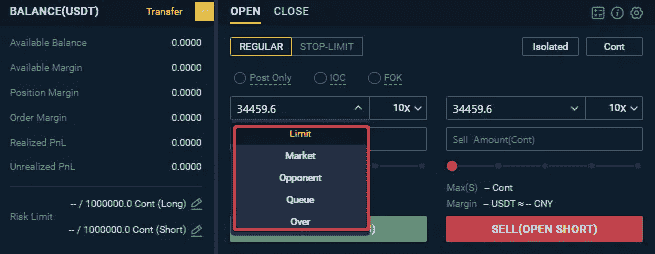

# 温克斯专业评论-它是安全和合法的吗？

> 原文：<https://medium.com/coinmonks/wenx-pro-review-9cc6453d7508?source=collection_archive---------5----------------------->

今天我们将回顾 WenX Pro，这是一个从 2020 年初开始运行的[加密交易交易所](https://blog.coincodecap.com/crypto-exchange)，帮助您交易比特币和许多其他加密货币。现在让我们仔细看看 [**WenX Pro**](https://blog.coincodecap.com/go/wenx-pro) ，了解它的特点，让我们的收益最大化。

## 总结(TL；博士)

WenX Pro 现任 CEO 是 [Jack Chia](https://www.linkedin.com/in/jackyschia/?originalSubdomain=sg) ，他是前[火币](https://blog.coincodecap.com/go/huobi)高管。他是一位经验丰富的区块链专家，已经开始创造性地带领文创走向辉煌。

*   温克斯专业版让你现货贸易和保证金贸易与几个可用的贸易对。
*   他们在 2020 年初成立了一家相对较新的公司。
*   KYC 和 3FA 可用。
*   [WenX Pro](https://blog.coincodecap.com/go/wenx-pro) 提供永久合约、幸运 8 等多种产品。
*   ETF 代币在保证金模式下可用。
*   根据被邀请人的数量获得推荐折扣。
*   WenX Pro 移动应用可在 [Android](https://play.google.com/store/apps/details?id=com.wenxpro.broker.android&hl=en_IN&gl=US) 和 [iOS](https://www.wenxpro.com/m/other/download) 设备上使用。(邀请码— **Ctxot7** )

## 什么是 WenX Pro？

[**WenX Pro**](https://blog.coincodecap.com/go/wenx-pro) 是一个[加密货币交易所](https://blog.coincodecap.com/go/crypto-exchange)平台，是 Wen 生态系统中值得骄傲的一员。使用 WenX Pro，您可以进行加密对加密交易，获得菲亚特 OTC 服务，并交易永久合同。他们在工作中强调安全感、理解力、创造力和真诚。

WenXPro 提供安全、透明的交易以及结构良好的系统。该平台重视你作为用户的价值，并深入其用户群，以便能够提供按需功能。作为一个初学者，你不必担心，因为他们的帮助中心是同情和有见地的。甚至定期提供折扣，开展互利的创意活动。

## WenX Pro 应用程序

WenX Pro 已经在 [Android](https://play.google.com/store/apps/details?id=com.wenxpro.broker.android&hl=en_IN&gl=US) 和 [iOS](https://www.wenxpro.com/m/other/download) 设备上推出了移动应用，让你获得便捷无缝的交易体验。这款应用的用户界面不复杂，时尚，而且很有描述性。

## 如何在 WenX Pro 上报名？

可以访问 [**WenX Pro**](https://blog.coincodecap.com/go/wenx-pro) 点击右上角报名。您必须填写您的全名、手机号码或电子邮件 id。选择一个强密码，并输入一个推荐代码(如果有的话)开始。

## 如何用 WenX Pro 下单？

使用温克斯专业图表，你可以很容易地破译市场趋势。你可以买入并建仓，从上涨趋势中获利。而要从下跌趋势中获利，你可以卖出建立一个空头头寸。

你可以卖出去平仓之前的多头头寸。并买入平仓早先的空头头寸。

## 温克斯专业评论:功能

*   [WenX Pro](https://blog.coincodecap.com/go/wenx-pro) 借助图表，为您提供交易对的市场深度分析。你还可以使用辅助交易工具来更好地理解和回顾图表和市场趋势。
*   WenX Pro 通过帮助您选择风险限额来避免头寸风险。如果您是利润率不足的高等级风险限额用户，您将降级到较低等级。如果头寸没有完全清算，选择风险限额可以防止交易所经历去杠杆化事件。
*   当进行永久合约交易时，你可以选择互换 BTC、EOS、LTC、XRP 和 ETH。
*   WenX Pro 上可用的支付方式有 OTC、MasterCard、Visa 和 Apple Pay。
*   您可以使用止损功能在 [WenX Pro](https://blog.coincodecap.com/go/wenx-pro) 平台上进行明智的交易。
*   通过查看加密货币的最后交易价格和阻力，您可以推算出它的价格在到达阻力后是否会上涨。这时你可以下一个限价止损单，让 WenXPro 在达到你的目标价格时自动买入更多的密码。这样，你就不必等待并时刻关注市场动向。提交订单后，您可以在 WenXPro 页面的“未平仓订单”部分找到现有的限价止蚀订单。

使用 WenXPro，您可以选择对订单应用以下条件:

1.  取消前有效:订单在您取消前一直有效。
2.  履行或取消:履行整个订单，否则取消订单。
3.  立即或取消:立即完成订单，然后取消其余订单。
4.  Post-only: WenX Pro 不会立即执行订单。如果您在输入时执行，订单将被取消。

*   [WenX Pro](https://blog.coincodecap.com/go/wenx-pro) 为您提供限价单、市价单、对手价、排队价、超价等多种下单类型，满足您的不同需求。

## WenX Pro 费用

在 WenX Pro 上交易费用低至 **0.2%** 。

可以免费做菲亚特场外交易。另外， [**WenX Pro**](https://blog.coincodecap.com/go/wenx-pro) 不收取您任何存款费用。你甚至可以免费交易回扣。制单和收单费用为 **0.2%** 。虽然，你要为隔夜持仓支付 **0.1%** 的持仓管理费。

## 温克斯专业评论:提款限额

在 [WenX Pro](https://blog.coincodecap.com/go/wenx-pro) 中，您可以提取的代币数量有一定的限制。下表显示了同样的情况。

## 温克斯专业评论:产品

## （同 EngineTestFacilities）发动机试验设备

[WenX Pro](https://blog.coincodecap.com/go/wenx-pro) 为您提供在二级市场买卖[杠杆代币](https://blog.coincodecap.com/leveraged-token)的服务。通过这样做，平台旨在为你带来底层资产的多重收益。如果您希望交易 BTC 3 倍杠杆多头或 BTC 3 倍空头，请注意基础货币将是 USDT。

目前上市的杠杆 ETF 有 BTC3S/ USDT、BTC3L/ USDT、KNC3S/ USDT、KNC3L/ USDT、LRC3S/ USDT、LRC3L/ USDT、NEAR3S/ USDT、NEAR3L/ USDT、RSR3S/ USDT、RSR3L/ USDT、ZIL3S/ USDT、ZIL3L/ USDT。

## 永久合同

永久合同是一种衍生期货合同。WenX Pro 在 USDT 结算这些交易。你可以进入一个多头或空头头寸，并获得高达 100 倍的杠杆。

虽然，对于账户结构，目前只有[交叉保证金](https://blog.coincodecap.com/margin-trading)模式可用。在这种模式下，你的头寸的保证金将独立于其他头寸。你也可以用这种方法计算你的 USDT 保证金永久合同:

(合同乘数)*(金额)*(费率)*(执行价格)。

## 幸运 8

WenX Pro 推出了独一无二的产品 Lucky 8。一个自动加密交易机器人通过一个程序帮助你在一个特定的价格范围内自动低买高卖。这种产品在横盘交易中更容易交易。 [WenX Pro](https://blog.coincodecap.com/go/wenx-pro) 幸运 8 bot 协助严格执行您设定的低买高卖交易策略。通过在 Lucky 8 建立账户，你可以在很大程度上避免不精确的交易决策。

幸运 8 的最低取款金额是 5 USDT。你将不得不支付 100 USDT 获得激活代码。每个这样的代码从帐户激活日起 365 天内有效。

## WenX Pro 安全吗？

[**WenX Pro**](https://blog.coincodecap.com/go/wenx-pro) 使用 3FA 将潜在黑客攻击的风险降至最低，并将您的资金存储在冷热存储钱包中。该平台已适应分散的暗池技术，以消除膨胀资产的搅动。您的身份和资金是安全的，因为 WenX Pro 在 KYC 和反洗钱方面拥有一流的自动化。

## WenX Pro 评论:支持的加密货币

在 [WenX Pro](https://blog.coincodecap.com/go/wenx-pro) 可以购买 BTC、ETH、LTC、USDT，并链接可用的支付方式。

对于场外交易，支持的加密货币有 USDT、BTC 和 ETH。支持的本地货币包括 CNY、新加坡元、TWD、HKD、韩元、日元和 MYR。

# WenX 专业推荐

WenX Pro 根据您的**被邀请人数量给予您邀请推荐折扣。**

## WenX Pro 的客户服务

WenXPro 拥有全天候的客户支持服务。你可以提交一张票或者邮寄给 support@wenxpro.com[寻求帮助。](mailto:support@wenxpro.com)

您可以通过各种平台与他们联系:

*   [Reddit 社区](https://www.reddit.com/user/WenXPro_Official)
*   [电报通道](https://t.me/WenXpro)
*   [推特](https://twitter.com/OfficialWenx)
*   [脸书](https://www.facebook.com/WenXPro)
*   [微博](https://weibo.com/WenXPro)
*   [领英](https://www.linkedin.com/company/wenx/mycompany/)
*   [Instagram](https://www.instagram.com/wenxpro_official/?hl=en)
*   [中等](https://wenxmarketing.medium.com/)

他们也有一个广泛的常见问题部分，以指导您与加密术语。该平台通过社交媒体平台向您提供关于他们新推出的产品和功能的最新更新。此外， [WenX Pro](https://blog.coincodecap.com/go/wenx-pro) 让您了解加密货币行业的最新消息。

## 温克斯专业评论:利弊

## 温克斯专业评论:结论

[**WenX Pro**](https://blog.coincodecap.com/go/wenx-pro) 刚刚开始在加密货币市场拓展触角。目前它的员工比率可能很低，但它有很高的目标要在行业中留下印记。它已经推出了许多先进的产品和易于使用的功能。它声称能为你的资产提供最好的安全保障，而且费用低廉。WenX Pro 将很快推出加密期权等金融衍生品，并开展法定转加密业务。

如果你希望有一个透明、安全、有利的交易体验，你应该试试 [WenX Pro](https://blog.coincodecap.com/go/wenx-pro) 。

# 常见问题

**为什么我在幸运 8 上的存款还没有到账？**

[WenX Pro](https://blog.coincodecap.com/go/wenx-pro) 表示，从 WenX wallet 地址转移您的资产大约需要 15 分钟。您可以重新检查您是否正确绑定了您的 WenX Pro 钱包地址和您的幸运 8 帐户。

**如何申请** [**融资融券交易**](https://blog.coincodecap.com/go/margin-trading) **？**

首先，你必须将你的资金从钱包账户转到保证金账户。完成后，您可以在[融资融券](https://blog.coincodecap.com/go/margin-trading)页面点击[融资融券](https://blog.coincodecap.com/margin-trading)申请。要了解更多信息，请阅读 [5 个最佳比特币保证金交易平台](https://blog.coincodecap.com/bitcoin-margin-trading-exchange)。

**在 WenX 平台场外交易前需要注意哪些事项？**

在开始场外交易之前，平台会要求您设置交易者姓名、支付密码、KYC 验证和支付方式。

*   **包含附属链接**

## 另外，阅读

*   最好的[密码交易机器人](/coinmonks/crypto-trading-bot-c2ffce8acb2a)
*   [电网交易机器人](https://blog.coincodecap.com/grid-trading) | [Cryptohopper 审查](/coinmonks/cryptohopper-review-a388ff5bae88)
*   [加密复制交易平台](/coinmonks/top-10-crypto-copy-trading-platforms-for-beginners-d0c37c7d698c) | [如何在 WazirX 上购买比特币](/coinmonks/buy-bitcoin-on-wazirx-2d12b7989af1)

