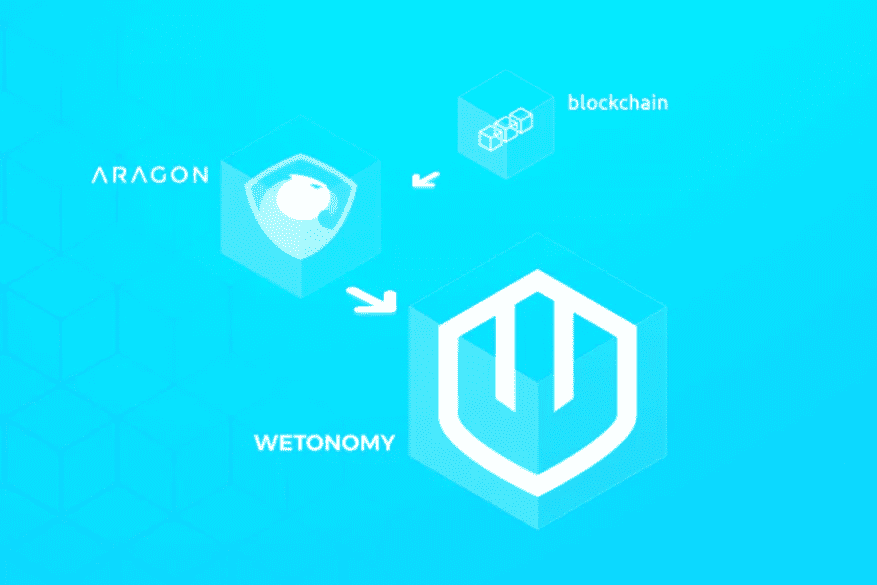

# Wetonomy 的工具和 Libs 生态系统

> 原文：<https://medium.com/coinmonks/wetonomys-tools-libs-ecosystem-4e790aa1cf51?source=collection_archive---------2----------------------->

**Wetonomy** 是一个工具包，它简化了 DAO 的创建，允许团队、公司和组织进行协作、分享利润、资助想法和奖励贡献。如果你不熟悉它，可以看看我的博客文章中关于[的介绍](/@MayaZhecheva/hello-world-from-wetonomy-toolkit-7476554cb2f9)，我们美丽的[网站](http://wetonomy.com/)或者更好的(如果你是开发者)——我们的 [GitHub 回购。](https://github.com/comrade-coop/wetonomy)

在这篇文章中，我将简单介绍一下我们使用的工具/框架/语言，让你对这个项目的生态系统有一个简单的了解。按字母顺序排列，名单来了。

[](http://wetonomy.com/)

# 阿拉贡

阿拉贡是一个很棒的平台，可以在以太坊上建立组织，并把 DAO-s 部署到区块链(因此，天生适合我们的经济目的)。它实现了治理、筹资、工资和会计等组织功能。此外，它允许您在其上创建自己的应用程序，并为自己的 DAO 扩展功能。Aragon 提供了几个您可以使用的组件——aragonOS(智能契约框架)、aragon.js(用于与 dapp 状态交互的库)和 aragonUI(用于构建 dapp UI 的组件)。查看他们不断改进的[文档](https://wiki.aragon.org/)了解更多信息。

额外提示—阿拉贡有一个非常好的专注和热情的社区(❤)

# IPFS

[IPFS](https://ipfs.io/) 是一个点对点分布式文件系统，它将所有具有相同文件系统的计算设备连接起来。这类似于单个 BitTorrent 群在一个 Git 存储库中交换项目。IPFS 所做的是，它给每个数据块一个唯一的哈希，删除重复的，然后每个网络节点可以存储它需要的内容，并通过 IPNS 提供的人类可读的名称进行搜索。

Aragon 和 OrbitDB 都指望 IPFS，所以它对我们的经济(实际上对整个区块链世界)或多或少是必不可少的。

# 莱尔纳

Lerna 是一个工具，用于管理一个有很多依赖项的 JavaScript 项目。一旦在一个项目中设置好，它将检查其中的每个应用程序，并将其依赖项符号链接到在`packages`中遇到的本地版本(根据来自`packages.json`的信息下载)。所有那些没有在`packages`中找到的都将通过 npm 安装，就像它们本来的样子。

**Wetonomy** 使用以下脚本:

```
"scripts": { "bootstrap": "lerna bootstrap --no-hoist=@aragon/os", "test": "lerna run --scope=wetonomy-* --concurrency=1 --stream test", "coverage": "lerna run --scope=wetonomy-* --concurrency=1 --stream coverage", "build": "npm run compile && lerna run --stream build", "publish": "lerna run --concurrency=1 --stream publish",}
```

当然，主要使用的是`bootstrap` —一旦执行，它将在当前的 Lerna repo 中安装所有的依赖项和链接交叉依赖项。因此，在每个应用程序中运行`npm install`和管理软件包的需求减少到仅仅运行一个简单的命令。

# 元掩码

[MetaMask](https://metamask.io/) 是一个插件，允许你通过一个简单的 UI 从浏览器运行以太坊交易。

它将一个 JS lib——web 3 . JS——注入到每个加载的页面中，从而在区块链上实现读写请求。你可以签署交易，更改网络(从主要的以太坊网络更改为测试网络— Ropsten、Rinkeby、localhost 等。)，创建或导入帐户。

此外，MetaMask 允许用户定义发送请求的以太坊节点(因此，没有必要将整个节点(大量的 GB 区块链)下载到您自己的计算机上)。

# OrbitDB

[OrbitDB](https://github.com/orbitdb/orbit-db) 是一个很棒的点对点数据库——每个用户都有他/她自己的数据库实例，数据库的所有更新都会在所有对等点之间自动同步。与数据库存储在一个地方的传统客户机-服务器模型相反，OrbitDB 将数据存储在所有用户中。一旦有人想要访问它，他/她需要订阅该数据库实例并获得访问权(如果需要的话)。

OrbitDB 支持各种数据模型和用例——日志(仅追加结构)、提要(追加和删除模型)、键值存储(类似字典的结构)、文档(文档数据库)、计数器(用于计数事件)。

**Wetonomy** 遵循 feed 模型——可以添加、搜索和删除所有项目。它的初始化设置在相应的存储中(遵循回流约定),类似于:

```
this.orbit = new Orbit(ipfs)this.feed = await orbit.feed(DB_NAME, config)
```

# 反应-还原-回流

[**React**](https://reactjs.org/) 是一个用于构建交互式用户界面的 JavaScript 库。它使得为应用程序的每个状态创建简单的视图变得非常容易，然后根据数据变化处理 UI 的呈现和更新。

一个简单的组件看起来像:

```
class AddMemberForm extends React.Component { static propTypes = { onAddMember: PropTypes.func.isRequired, onClose: PropTypes.func.isRequired } render() { return (      <MemberFormBase onSubmitMember={this.props.onAddMember} onClose={this.props.onClose} submitBtnText={'Add'} /> ) }
}
```

在这种情况下，member performance base 是另一个简单的 React 组件，可以在任何需要的地方重用。它的行为取决于绑定到组件的相应属性的方法和属性。

由于组件逻辑是用普通的 JavaScript 而不是模板表示的，所以您可以很容易地通过应用程序传递丰富的数据，并将状态排除在 DOM 之外。

[**Redux**](https://redux.js.org/) 是一个运行在不同环境中的 JS 应用程序的状态容器，易于测试并简化了复杂组件的行为。它为用户界面行为设置了特定的规则——状态是只读的，一个存储负责一个动作，所有的改变都是通过一个简单的 JS 函数进行的。

[**回流**](https://github.com/reflux/refluxjs) 同样是一个 JS lib，用于引入一致的数据流——一旦一个动作被执行，相应的存储会根据其类型做出反应，并将所需的数据传递给 UI(视图组件)。

# Solhint

[Solhint](https://protofire.github.io/solhint/) 是一个开源项目(lib 和 cli)，用于林挺实实在在的代码。与大多数其他选项不同的是，它不仅可以确保遵循最佳的编码实践并发现语法错误，还可以检测任何安全漏洞。

安装后，您可以在相应的. solhint.json 和中配置其规则和被忽略的文件。solhintignore 文件。

```
".solhint.json: "extends": "default", "rules": { "not-rely-on-time": false}.solhintignore: node_modules/
```

**湿地经济**林挺指挥部:

```
"scripts": { "lint": "solhint apps/**/contracts/*.sol contracts/*.sol",},
```

# 固态

[稳健性](https://solidity.readthedocs.io/en/v0.4.25/)是当您需要编写智能合同时可以选择的语言。它是静态类型的，支持继承、库和复杂的用户定义类型，旨在针对以太网虚拟机(EVM)。

当然，在我们的经济中，所有的智能合同都是用坚固性写的。

# 特拉维斯

我敢肯定，几乎每个人都知道[特拉维斯](https://travis-ci.org/)做什么，但如果你不知道——它确保了 GitHub 回购的持续集成(CI)，并在自己的虚拟环境中运行测试。一旦设置好，它会自动构建和测试更改，并立即返回反馈——无论您所做的承诺是否正确。

它的网站提供了一篇很好的[入门](https://docs.travis-ci.com/user/getting-started/)文章，你可以关注并确保你的应用程序也适合 CI 程序。考虑到**湿气**，其`.travis.yml`文件类似于:

```
before_install: 
  - npm i -g npm 
  - npm i -g lernainstall:
  - npm install
  - npm run bootstrap
  - npm run publish before_script:
  - npm prune script: 
  - npm run $TASKenv: 
  - TASK=test 
  - TASK=lint
```

Travis 将按以下顺序执行这些步骤:

*   `before_install` —安装项目所需的附加依赖项的阶段
*   `install` —运行所有安装命令——在主文件夹中运行 **Wetonomy** — `npm install`,然后运行 Lerna 引导命令，用于同步内部应用程序之间的依赖关系
*   `before_script` —脚本运行前的命令—在这种情况下，`npm prune` 从应用程序中清除无关的包
*   `script`——最重要的命令——运行测试或您需要的任何东西的命令(在 Wetonomy 中——林挺项目也是如此)

# 松露

[Truffle](https://truffleframework.com/) 是一个工具/框架，有助于开发、部署和测试智能合约。一旦你安装了它，你将得到内置的编译，部署，迁移历史，网络和软件包管理，一个执行命令的控制台。总而言之，开发智能合约所需的一切(到目前为止),而不需要设置所有依赖关系、部署细节和其他许多东西，我想没有人会想自己撞自己的头。

您可以在 Wetonomy 中立即测试其功能，只需在应用程序中执行:

```
truffle developtruffle(develop)> test
```

它将在相应的 Aragon 应用程序中运行测试。

到目前为止，这是我们正在使用的堆栈的简要介绍。下一个帖子将是关于我们为什么选择阿拉贡以及我们为什么喜欢它。

不过，如果你有任何问题，来加入我们的 [Discord chat](https://discordapp.com/invite/Bq68vHD) 吧。

*原载于 2018 年 10 月 11 日*[*wetonomy.com*](http://wetonomy.com/wetonomys-tools-libs-ecosystem/)*。*

> [直接在您的收件箱中获得最佳软件交易](https://coincodecap.com/?utm_source=coinmonks)

[](https://coincodecap.com/?utm_source=coinmonks)