# 多么大的变化啊:两年前的加密货币

> 原文：<https://medium.com/coinmonks/what-a-change-2-years-ago-in-cryptocurrency-4aa6528b1aec?source=collection_archive---------5----------------------->

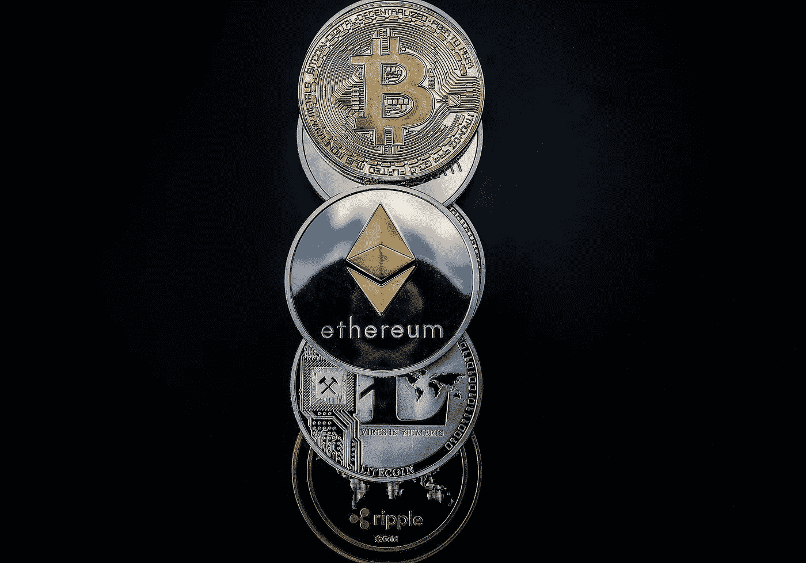

Image by WorldSpectrum on Pixabay [https://pixabay.com/photos/cryptocurrency-ethereum-litecoin-3409641/](https://pixabay.com/photos/cryptocurrency-ethereum-litecoin-3409641/)

我浏览着媒体上我用书签标记的故事，漫不经心地想知道几年来我读了些什么。偶然看到 DK 的一个故事，回忆起自己几乎没有从他那里读到过什么。我到了他的页面，他在 2019 年期间相当不活跃。我向下滚动查看他写的内容，无意中发现了他在 2017 年 12 月发表的题为《对加密泡沫的观察》[https://medium . com/@ dennyk/Observations-on-the-crypto bubble-and-the-bit coin-price-prediction-update-ACF 38 b 44 CD 35](/@dennyk/observations-on-the-cryptobubble-and-bitcoin-price-prediction-update-acf38b44cd35),他分享了一张来自 coinmarketcap.com 的图表，其中基本上包含了我总结如下的信息:

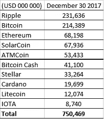

这份名单对我来说似乎很陌生，有些名字我记不起来了，除了比特币，其他的估值似乎都不对。所以我决定一个接一个地比较这两年间发生的变化。请记住，2017 年 12 月是泡沫的顶部，任何比较都应该记住这一点。

**数字 10: IOTA**

从最后一个开始，IOTA 并不是该组中表现最差的，但它在两年内损失了超过 94%的价值。

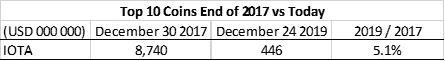

**9 号:莱特币**

莱特币和以太币表现相对强劲，仅损失约 80%的价值。

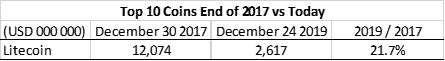

8 号:卡达诺

卡尔达诺已经损失了 95%的价值。

第七号:恒星

恒星已经损失了 97%的价值。

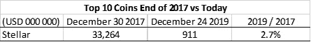

**数字 6:比特币现金**

比特币现金已经贬值 91%。

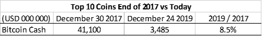

**数字 5:自动取款机**

ATMCoin 已经不存在了。

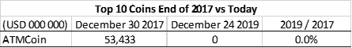

**数字 4:太阳能币**

SolarCoin 实际上已经倒闭了。

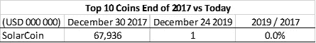

**数字 3:以太坊**

以太坊和莱特币表现相对强劲，仅损失约 80%的价值。

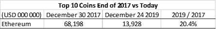

**数字 2:比特币**

与泡沫的规模相比，比特币已经损失了一点。然而，这一观察掩盖了一个事实，即比特币在恢复到目前 38%的损失之前，也损失了超过 80%的价值。目前，比特币的复苏潜力明显不同于所有其他主要货币。

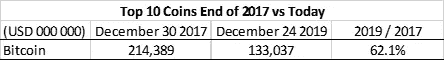

第一名:涟漪

Ripple 已经损失了 96%的价值，但仍留在 2019 年的前 10 名名单中。

**2017 年顶级币完整名单(以及 2019 年排名):**

下面你可以看到说明全貌的表格和相应的图表。简而言之，从泡沫顶部开始出现了大规模调整，所有加密资产都受到了沉重打击，比特币最终明显比其他资产更具弹性。请注意，顶部的损失接近 6000 亿美元，当比特币在 19 年第一季度跌至 3000 美元时，损失数字甚至更高。

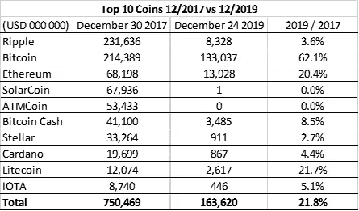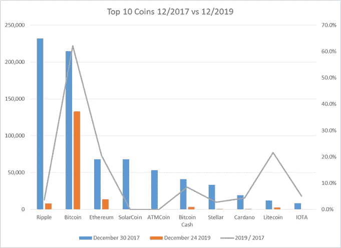

【2017 年前 10 名与 2019 年前 10 名的对比:

2019 Top 10 榜单比 2017 Top 10 榜单低 77%。如果排除比特币，则低 93%。很明显，这是一次大规模的调整，人们对替代硬币的态度更加保守。

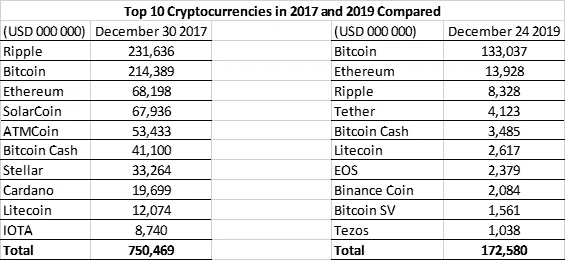

**意见、结论和问题:**

2017 年前 10 名中有 2 家几乎已经倒闭。

2017 年前 10 名名单中有 5 人的价值损失了 90%以上。

2017 年前 10 名中有 2 人的价值损失了 75%以上。

2017 年前 10 名榜单中有 1 名只损失了 38%的价值。

两年时间隧道突显了 2017 年底的一个大泡沫。

然而，为什么比特币保留了大部分价值？促成这种正背离的因素是什么？这些因素可持续吗？

以太币和莱特币有什么不同，使它们能够保持相对较高的价值？这其中有多少是由于实际使用(而不是市场力量)？它们与 2019 年前 10 名榜单相比如何？

随着 Tether 进入 2019 年十大名单，我们应该期待稳定的硬币在加密货币领域产生更大的影响吗？如果是的话，是什么特征造就了有竞争力的稳定币？

随着前 10 名名单总共下降 77%，超过 90%的人没有比特币，未来是否具有有意义的升值潜力或黯淡的长期表现？

2019 年 12 月 24 日

> [在您的收件箱中直接获得最佳软件交易](https://coincodecap.com/?utm_source=coinmonks)

