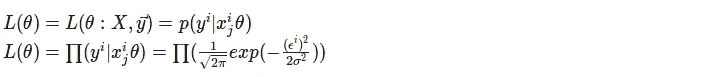

# 线性回归中的最小二乘误差到底是什么？

> 原文：<https://medium.com/coinmonks/what-actually-is-least-square-error-in-linear-regression-6e637a8a1f22?source=collection_archive---------4----------------------->

## TL；DR:通过最大化对数似然来最小化误差

image [source](https://www.inspirationde.com/image/14908/)

最小平方误差在线性回归中用作成本函数。但是，为什么要选择平方误差，而不是绝对误差，或者其他选择呢？有一个简单的证明可以表明，最小平方误差是一个合理和自然的选择。

假设目标变量和输入如下相关:

我们希望通过最大化对数似然来最小化误差。可能性函数是:

最小化对数似然函数

，**，也称为最小平方函数**，注意，在这种情况下，σ是不相关的。

> 注意，最小二乘法对应于最大似然估计。因此，人们可以证明最小二乘法是正确的，其自然假设是ϵn(μ，σ)

image [source](https://www.foozine.com/36-fonds-decran-absolument-sublimes-et-ideals-pour-vos-smartphones-18655)

> [在您的收件箱中直接获得最佳软件交易](https://coincodecap.com/?utm_source=coinmonks)

