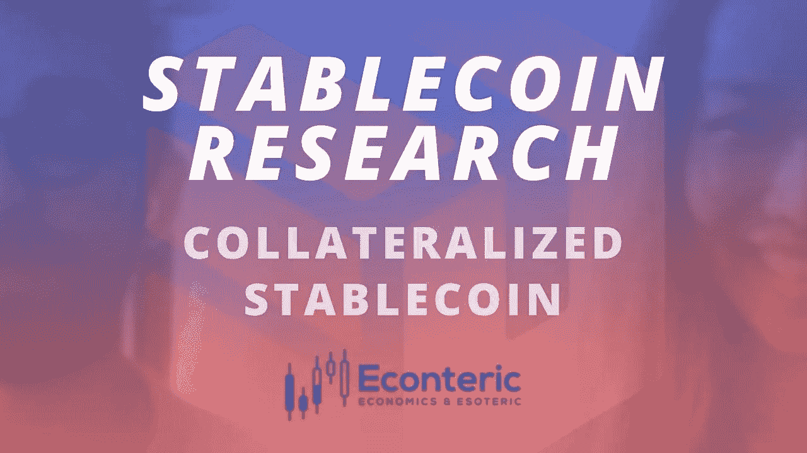

# 什么是抵押稳定币？

> 原文：<https://medium.com/coinmonks/what-are-collateralized-stablecoin-3411a24def7c?source=collection_archive---------8----------------------->

## 抵押稳定硬币是一种可替换的代币，完全或几乎完全由发行该代币的协议储备中持有的抵押品支持。它们是如何工作的？他们如何保持稳定？

