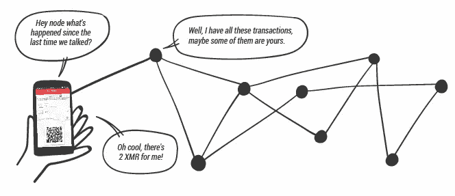

# 什么是 Monero 节点，它们在 Monerujo 中如何工作

> 原文：<https://medium.com/coinmonks/what-are-monero-nodes-and-how-they-work-in-monerujo-81e2b87abbe0?source=collection_archive---------0----------------------->

最新版本的 Monerujo(1.10 . x)引入了期待已久的重新制作的节点管理屏幕，并重新思考了如何将分散的节点与足够优雅的 UX 结合起来。首先，让我们快速了解一下什么是节点。

# 什么是节点？

Monero 网络是一个相互连接的计算机网络。它看起来像这样:

Each dot is a computer running Monero node software

这些计算机中的每一台都是一个节点。他们互相交流，所以每个人都有一个分散的账本，并对谁有多少保持一致意见。要成为一个正常工作的节点，它需要:

1.  运行 Monero 节点程序(知道该做什么)
2.  连接到互联网(以便接收和广播交易)
3.  有一个更新的本地副本的莫内罗区块链(这就像 60 千兆字节和增长)

所以如果你在电脑上运行 Monero 官方钱包，你就可以成为一个节点！它将下载整个区块链(这是所有过去交易的列表)并连接到互联网，仅此而已。但是，如果你在智能手机上使用类似 Monerujo 的 *light* 钱包，你需要连接一个节点，它可以告诉你是否收到了 moneroj，以及有多少与你的地址相关联。大概是这样的:

Monerujo interacts with the Monero network through the node it’s connected to.

目前，智能手机不是一个完整的节点是有意义的，但在未来，谁知道呢。目前，它们是必需品。现在让我们看看他们在 Monerujo 是如何工作的。

> 另请阅读:[最佳 Monero 五金钱包](/coinmonks/the-best-cryptocurrency-hardware-wallets-of-2020-e28b1c124069)

# 他们在 Monerujo 是怎么工作的？

Monerujo 会在你的手机上保存一个加密的钱包文件，其中包含证明什么是你的就是你的密钥。这就是为什么它需要你的密码才能打开，但当它打开时，它需要连接到 Monero 网络的一个节点，以便能够与该网络进行交互。

当你打开最新的 Monerujo，你会看到这样的东西:

在你的钱包上方，有一个**节点**显示屏。它显示了 Monerujo 将在您下次打开钱包时尝试连接的节点。如果你点击那个节点，Monerujo 将测试你所有的书签节点，并自动选择最快的回复。这是为了让您尽快体验使用钱包的过程。如果是全新的 Monerujo 安装，它将是空的。

单击右侧的搜索图标，您将看到以下屏幕:

下拉菜单，Monerujo 会向你已知的书签节点询问更多他们看到的节点。您将看到您的屏幕上填充了找到的节点。事情大概是这样的:

Monerujo ask its know nodes for more nodes, and then those and so on…

看到新发现的橙色节点，连接到您保存的紫色节点。正如您可能注意到的，它增长得非常快，因此您找到快速响应的节点的机会非常大。

在每个节点的右侧，您可以看到一个小的“信号”指示器，告诉您该节点对我们的 ping 的响应速度。如果你点击列表中的一个节点，它会向你显示它的技术细节，但是如果你不知道它的用途，就不要去关注它。

下面还有一个 **+添加节点**按钮。使用它来手动输入您想要使用的节点，例如您自己的节点。如果你愿意，你也可以使用[社区](https://moneroworld.com/#nodes)提供的几个节点来引导整个系统。

## 重要的是你至少有一个书签节点，所以当你回到主屏幕时，Monerujo 知道该连接谁。

你可以只做一次就结束，或者定期使用节点搜索来发现和保存最佳节点，这样你就可以获得最佳的日常使用体验。

# 非常好…但是为什么呢？为什么？

因为我们相信去中心化，并努力实现一种可用的、足够舒适的体验，这样我们就不会因为方便而最终退回到集中式解决方案。对于用户来说，如何简化这一切？我们可以设置一个 Monerujo 节点，并将其作为 Monerujo 的默认强制选项:

这将消除所有的节点管理，但代价是严重的集中化，并减少所有用户的隐私。例如，许多流行的比特币手机钱包就是这样工作的。相反，我们的目标是让人们尽可能容易和有机地找到方便的、不同的节点来使用，这就是著名的去中心化。非常符合 Monero 的传统。

我们相信正在朝着正确的方向迈出微小但重要的步伐。如果您使用 Monerujo，请[提供反馈](https://www.reddit.com/r/Monerujo/)和[取得联系](https://twitter.com/monerujowallet)。想法是受欢迎的，[捐款更是如此](https://www.monerujo.io/index.html#support)，*你们这些忘恩负义的混蛋！*

> 地址:
> **4 adkpjoxn 7 jcvaby 9 szgnt 93 msewdnxdhaasxbbm 6 x 5 dcwmsdep 2 uyn 4 fhstdn 5 I 11 nsjbpu 7 OJ 59 ahg 8 XB 1mg 3 viqcuk**
> 
> [open alias](/@anhdres/how-openalias-works-in-monerujo-and-how-you-can-setup-your-own-2e83f94ab81f):
> **monerujo . io**
> 
> [直接在您的收件箱中获得最佳软件交易](https://coincodecap.com/?utm_source=coinmonks)

