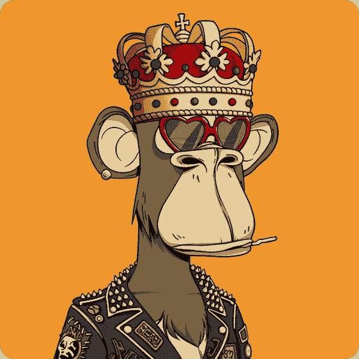

# 什么是 NFT，你能通过交易赚钱吗？

> 原文：<https://medium.com/coinmonks/what-are-nfts-and-can-you-make-money-trading-them-48155502e7fa?source=collection_archive---------13----------------------->

NFT 是最近网络世界的热点之一，随着数百万美元被兑换成“jpegs ”,许多人试图理解 NFT 以及它们为什么有价值。

NFT 代表不可替代的令牌。不可替换令牌指的是具有独特属性的任何事物，由于所述独特属性，该事物不能与另一事物交换。另一方面，一个可替换的令牌可以被另一个替换，因为它是由它的值而不是它的唯一属性来定义的。

例如，一美元是一种可替代的代币，因为它可以兑换成另一种货币，比如说 0.89 欧元，按照当时的汇率。

# 它们是如何工作的

那么，为什么人们要为非功能性测试支付数千甚至数百万美元呢？答案在于稀缺性、独特性和所有权证明。NFT 用于将所有权与各种项目相关联，包括:

●艺术

●视频

●一篇文章

●游戏中的物品，如服装、游戏角色等。

●域名

NFT 数字地表示这种真实世界物品的独特属性，并且最重要的是，帮助这种物品的所有者证明所有权。非功能性测试被安全地存储和记录在区块链上。

区块链可以定义为一种公共分类账，它以一种极难更改或改变的方式记录所有交易。

区块链还确保了 NFT:

●独一无二，不可复制。

●只有一个所有者，并且证明对所有人公开。

●是原创。

当前支持 NFT 的区块链有:

●以太坊(最受欢迎)

●比特币现金

●卡尔达诺

●流量

● GoChain

●索拉纳

●泰佐斯

因此，如果某个皮特先生是艺术家，并决定创作一件精美的艺术品，他可以将它作为 NFT 上传到区块链，并证明其真实性。如果他的艺术品被证明是受欢迎的，他可以通过在区块链上发起交易来将它卖给迪克西夫人，从而将艺术品的所有权永久转移给迪克西夫人。

虽然你可以争辩说，你可以下载一个 png 或 jpeg 格式的艺术品，但这里重要的是所有权的证明，根据区块链的说法，皮特先生是原始艺术品的创作者，是他把它卖给了现在的所有者迪克西夫人。

同样，达芬奇的《蒙娜丽莎》也可能有复制品，只有原作才是重要的，也是艺术收藏家想要购买的。

**注意** : NFTs 不应与 Crypto 混淆。虽然两者都在区块链上运行，但 Crypto 也称为加密货币，是一种与法定货币一样具有价值的数字货币，可用于购买产品和服务。

# 买卖 NFT 能赚钱吗？

通过创作一件艺术品、录像等，在非物质文化遗产领域赚一大笔钱是可能的。把它作为 NFT 卖掉，或者买一幅 NFT，然后转手。

许多人仅在 2021 年就赚了数百万美元，并且每天都有数千笔高额交易发生。一些最受欢迎的 NFT 销售是:

在佳士得拍卖行****举行的一场****拍卖会上，著名艺术家皮普尔的一幅作品《每一天——前 5000 天》以 6900 万美元的价格被拍卖。****

****勒布朗-贾梅的** [**勒布朗-詹姆斯“宇宙”扣篮**](https://www.actionnetwork.com/nba/the-10-biggest-nba-top-shot-sales-to-date) **的一段视频片段拍出了 20.8 万美元。****

**Twitter 首席执行官拍卖了他作为 NFT 的第一条推文，成交价为 290 万美元。他将收益直接捐给了非洲慈善机构 give。**

****一件罕见的** [**无聊猿游艇俱乐部 NFT**](https://hypebeast.com/2021/10/bored-ape-yacht-club-nft-3-4-million-record-sothebys-metaverse) **以 340 万美元被拍卖。****

**歌手兼埃隆·马斯克的配偶格莱姆斯在一场拍卖会上卖出了价值 600 万美元的非专利音乐作品。**

# **哪里可以买到 NFT**

**NFT 可以在市场和交易所买卖和交易。你也可以通过网站预售来铸造 NFT，这主要发生在一系列非功能性测试公开出售之前。**

**后者是最受欢迎的赚钱方法之一，因为买家在 NFTs 项目爆发前尽早进入，然后在价格高时抛售。**

**一些 NFT 市场包括:**

**OpenSea :最受欢迎和最大的市场，有许多功能和一个初学者友好的用户界面。**

****:另一个以许多独特的 NFT 艺术品为特色的大市场。****

******:展示知名品牌、艺术家和创作者策划的作品。******

******超级稀有 :另一个像 OpenSea 一样的市场，提供艺术、视频等市场。******

******可铸造的(Mintable):一个由马克·库班支持的项目，以各种类型的非专利技术市场和创作者的免费铸造为特色。******

********注意**:不能保证你会从非功能性交易中赚钱。虽然有些人赚了数千美元，但其他人最终投资的项目却一文不值。然而，如果你尽职尽责，投资有价值的项目，你可以赚很多钱。******

****请继续关注我们即将发布的关于如何用 NFTs 赚钱的帖子。****

# ****未来会发生什么？****

****我认为 NFTs 和 Crypto 作为一个整体将继续存在。随着政府试图限制各种事情，加密货币提供了某种形式的自由，免受政府干预。****

****至于 NFT，他们说情人眼里出西施。因此，只要有人愿意为“jpeg”支付数百万美元，数字艺术市场就会长期存在。****