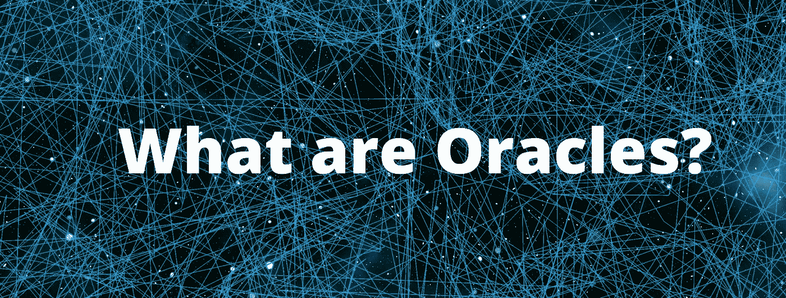

# 神谕是什么？

> 原文：<https://medium.com/coinmonks/what-are-oracles-bdc5e4a2b6c3?source=collection_archive---------4----------------------->

## 我们经常谈论去中心化金融，却不清楚以太坊区块链之上允许所有这些协议的基础是什么。

在 DeFi 的基础水平上，我们肯定会找到稳定的硬币，让用户更少地暴露于加密货币的波动性。随着…