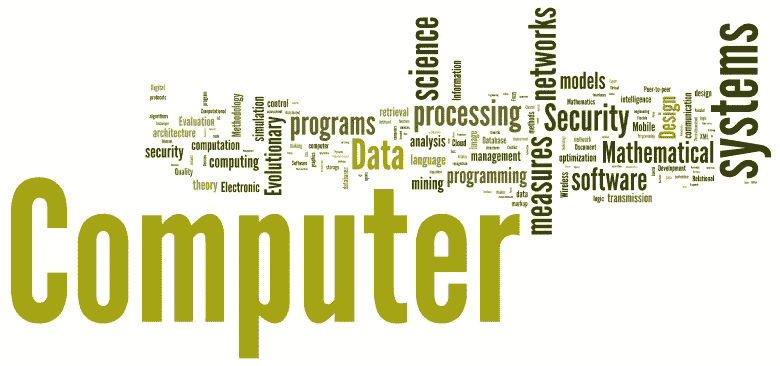

# 计算机科学和 IT 专业有哪些潜在的工作岗位

> 原文：<https://medium.com/coinmonks/what-are-potential-job-positions-for-computer-science-and-it-major-54b3e5f16c25?source=collection_archive---------3----------------------->

> **IT 行业的职业选择**

毕业日带来了许多复杂的感觉和期望，一方面是兴奋和成就感，另一方面是对未来的不确定性。我记得毕业后几天，母亲问我，“祝贺你获得学位。现在，什么！?"

就个人而言，当我作为一名刚毕业的计算机科学和信息技术专业的学生开始申请一份全职工作时，决定申请哪个职位对我来说是最困难的。我开始意识到，我对大多数职位的含义没有清晰的概念或理解，也不知道在这些职位上取得成功所需的技能。但我对自己在编程、软件开发和计算机概念方面的基础知识很有信心。

我们在课堂上获得的知识为我们满足劳动力市场的需求做好了准备。现在，几乎每一个拥有计算机化商业模式或系统的公司或行业，计算机科学家都被雇佣在各种工作岗位上。

然而，工作职责有很大的不同，并根据具体公司的技术需求或专业领域而有所变化。举例来说，与金融或医疗保健公司的软件工程师相比，谷歌的软件工程师有着不同的工作职责。

所以，我将试着列出一些我熟悉的工作职位，包括在这些职位上取得成功所需的必要技能，以及他们的专业领域。

What Can You Do with a Computer Science Degree?

# 软件工程师

软件的设计、开发、维护、测试和评估。以下是软件工程师的基本资格:对算法的扎实理解，优秀的分析能力，解决问题的能力，采取主动，调试和编码技能(通常可以用一种以上的编程语言编码，如 Java，C#，C++，Python，Clojure，Ruby，。Net，JavaScript，SQL 等。)扎实的概念和方法背景和知识，例如敏捷、源代码管理、版本控制、配置管理、供应、自动化、网络等等。

# **类似工作**

*   [电脑硬件工程师](https://g.co/kgs/6xyHKs)
*   [计算机和信息系统经理](https://g.co/kgs/2EpV12)
*   [计算机网络架构师](https://g.co/kgs/1TcYLK)
*   云架构师

# 软件应用开发者

设计或定制计算机应用软件。修改现有软件以优化操作效率或纠正错误。评估软件需求和用户需求以确定软件的可行性

# 计算机系统分析员

分析数据处理问题以改进计算机系统。开发和测试系统设计程序。增强系统兼容性，便于信息共享

# 相似的工作

*   应用分析员
*   数据分析师
*   系统分析员

# 软件系统开发者

为各种行业设计、开发和测试软件。修改现有软件以纠正错误或提高性能。分析数据以识别、推荐和计划新系统的安装或修改

# Web 开发人员

撰写、设计或编辑网页内容，或指导他人制作内容。识别和纠正测试或用户反馈发现的问题。专门从事万维网应用程序或通过 HTTP 从 web 服务器到 Web 浏览器运行的应用程序的开发。

以下是 web 开发人员使用的一些工具、概念、平台和编程语言。

*   大多数现代 Web 应用程序都是使用 JavaScript 框架开发的，如 Angular、React、Vue、Node JS、WebPress 等。而用 TypeScript、JavaScript、PHP、HTML、CSS、XML 等语言编码。
*   Mobil App: NativeScript、React Native、Ionic、Xcode、Android Studio、Xamarin、Redhat、Kony、iFactr、Sencha、PhoneGap 等。
*   CS 语言:Java，C++，C#，HTML5，XML，JavaScript (AJAX，jQuery，JSON)，TypeScript，PHP
*   概念:API、REST、HTTP 协议

# 相似的工作

*   网页设计师
*   UX 设计师
*   移动应用开发者
*   游戏开发商

# 网络系统管理员

安装和支持组织的网络系统。检查网站功能以确保性能不中断。执行数据备份和灾难恢复操作

# 数据库管理员

测试和管理计算机数据库。协调计算机数据库中的变化和纠正错误。应用安全措施保护信息。

Computer Science Grads: Here are 5 Jobs to Look At

# 全栈开发人员

一个**全** - **栈**开发者就是一个对计算机软件开发的所有层面都很熟悉的人。这些开发人员并不是所有方面的专家；他们只是拥有将概念转化为成品的功能知识和能力。他们对网络、数据库、用户界面、API、安全性等有相当的了解。他们在 web 应用程序的后端和前端工作。 ***我做了两年的全栈软件工程师，这是我非常喜欢的事情*** 。

# DevOps 工程师

***我在 DevOps 做工程师实习生，从大学三年级到大四*** 。现在，定义 **DevOps 工程师**做什么仍然在不断变化，因为 DevOps 不是一个框架或工作流。它是一种文化，一种做事的方式——一套实现来简化软件开发过程的概念和方法，以改进交付或上市时间。DevOps 确保开发(Dev)和运营(Ops)之间的协作和沟通。下面的视频给出了 DevOps 广泛而详细的定义。

DevOps Engineer | DevOps Engineer Roles | DevOps Career And Skills | DevOps Tutorial | Simplilearn

# 相似的工作

*   系统工程师
*   质量保证工程师-自动化
*   软件测试工程师

总而言之，自我评估是选择工作并将其转化为职业生涯的关键。大一或大二学生可以根据他们最擅长的课程来选择职业道路。大三和大四学生应该利用他们剩余的教育时间来发展自己感兴趣的工作技能。这可以通过参加课外项目、专注于与渴望的工作密切相关的课程以及获得实习机会来实现。

当谈到选择 It 行业的工作职位时，我建议选择激情，而不是其他所有的考虑因素，否则你会筋疲力尽，金钱也于事无补。你在 IT 行业选择追求的任何职位都需要你全身心地投入才能获得成功。努力工作和不断学习是无可替代的

> 如果你喜欢这个故事，你可能也会喜欢“ [**编码面试:解决问题的技巧**](/coinmonks/coding-interview-problem-solving-techniques-ae6a82d98dbb) ”
> 
> 请给它几个掌声支持！

> 干杯！！！