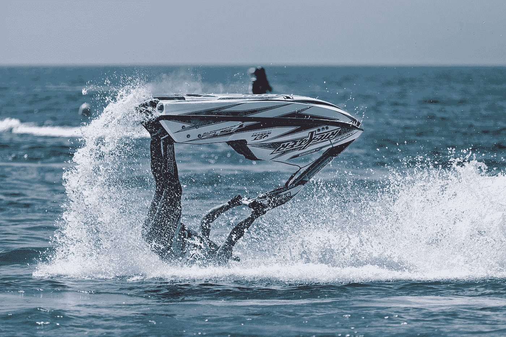
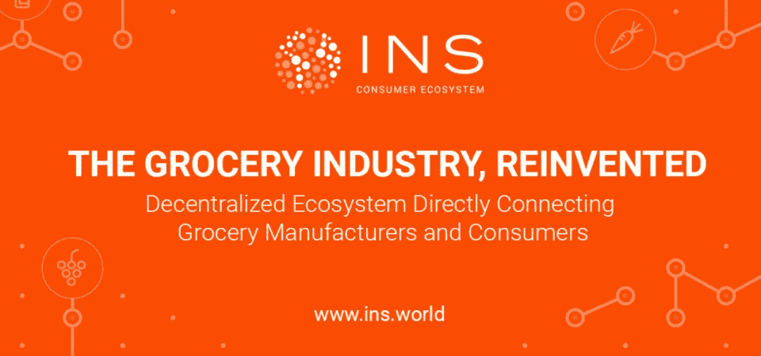
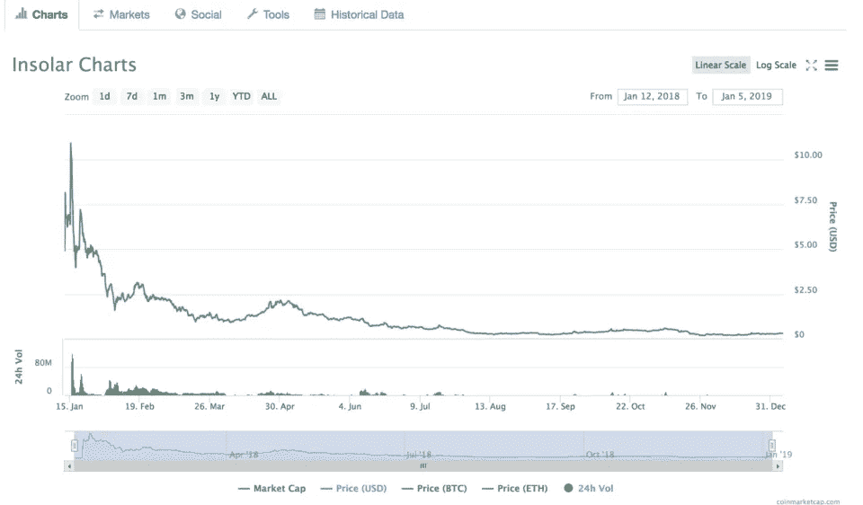
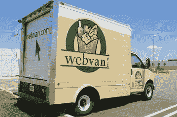
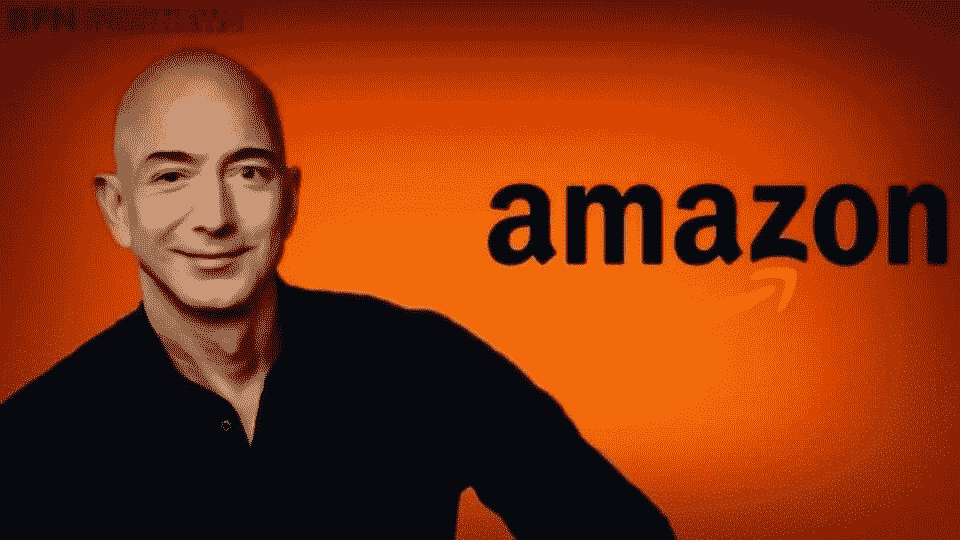
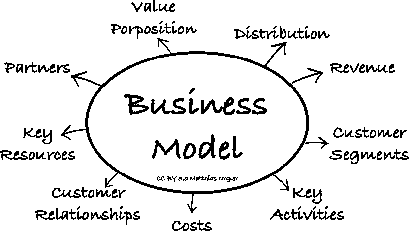
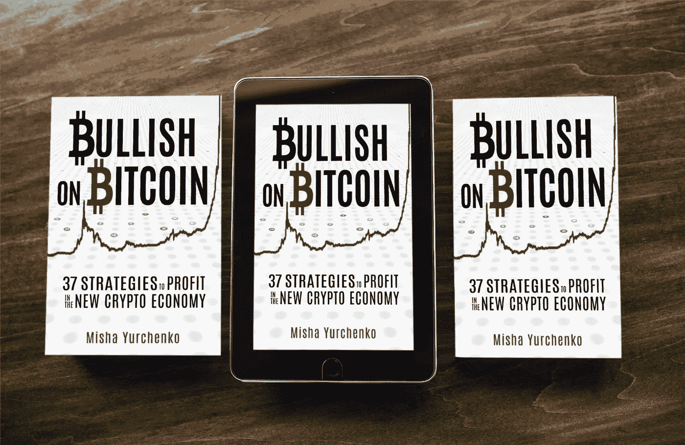

# 什么是反向 ico？

> 原文：<https://medium.com/coinmonks/what-are-reverse-icos-94be123d38c3?source=collection_archive---------5----------------------->

你可能还记得“反向首次公开募股”——互联网热潮中最具争议的[首次公开募股](http://cryptoinsider.com/tag/ipo)——即一家私人公司收购一家上市公司，以绕过漫长的公开证券发行过程。反向 ICO 与此类似。Investopedia 定义了以下流程:

> *“…现实世界的企业使用反向 ICO……[它]的工作方式与标准 ICO 完全一样，尽管据说它们的估值更容易、更透明。当人们将资金投入标准 ICO 时，现实世界中已建立的企业的跟踪记录为评估反向 ICO 提供了更好、更值得信赖的建议。”*

INS ICO——区块链的 web van——在 2017 年出现在 ICO 雷达上。他们的口号是“直接连接食品制造商和消费者”。

投资者在 2017 年支付了 4500 万美元，这是迄今为止第 45 高的 ICO 筹款。然而，在这一年中，INS 已经成为一个独立的分布式商业网络，并改变了它的商业模式。

从技术上来说，INS 并没有做反向 ICO，但它确实改变或扩展了它的商业模式。

结果是一样的。原始投资者持有与他们最初投资的 ***不同的*** 业务的代币。他们现在拥有一个企业级区块链平台的所有权。

代币交易价为 0.28 美元，低于 1.5658 美元的 ICO 价格。80%的跌幅与同期其他加密货币的贬值不相上下。真扫兴。

为什么？该公司表示，它已经“扩大了自己的商业视野”但是，从投资者那里获得数千万美元的原始模式曾经可行吗？

**让我们重温一下**[**web van**](https://en.wikipedia.org/wiki/Webvan)**的兴衰，这是一家始于 20 世纪 90 年代的网上杂货配送企业。**

Webvan 在首次公开募股中筹集了 3.75 亿美元，从私人投资者那里筹集了更多资金。

Webvan 和 INS 的商业模式**看起来是一样的，**包括在货物交付给客户之前储存货物的仓库系统。

问题是 Webvan 无法为实体基础设施的建设提供资金。这包括一份花费 10 亿美元在全国范围内建设仓库的合同，以及 12 亿美元购买家庭杂货商的股票。

这是一项现金密集型的资本密集型业务。

到 2001 年 Webvan 申请破产时，它已经花光了筹集的 10 亿美元！

# 快进到今天，看看亚马逊。

*   亚马逊的 Prime Now 服务目前正在美国 60 个城市进行杂货配送。
*   2017 年，亚马逊为 465 家全食商店支付了 137 亿美元。
*   亚马逊的净利润率为 5.1%，因此它有运营杠杆来慢慢建立全球交付基础设施。

亚马逊做了 Webvan 试图做的事情，因为他们的商业模式更好。

# 网络崩溃与加密

许多被误导的类比被拿来与网络崩溃和加密崩溃相提并论。ICO 热潮破灭了——换句话说，融资模式失败了。然而，一些商业模式却完好无损。亚马逊就是其中之一！

虽然 pets.com、[webvan.com](http://webvan.com/)和[eToys.com](http://etoys.com/)的利润率大幅下降，但图书/音乐(21%)、玩具/体育用品(19%)和宠物产品(5%)在全球电子商务市场中占据了很高的份额。

这就是教训所在。

问题不在于融资模式，而在于商业模式。

快速浏览几个即将推出的 ico 会发现许多可行的交付模式。

*   [TEMCO 项目](https://icobench.com/ico/temco)是众多区块链供应链管理服务中的一项，旨在供现有的物理供应链网络使用。TEMCO 利用大数据为供应链网络提供分析、商业智能工具和供应商验证。
*   [Zapaygo](https://zapaygo.com/) —娱乐、酒店和休闲行业的移动订单和支付应用 Zapaygo (ZAP)正在活动场馆内进行交付。你再也不用在阿森纳的比赛中排队买啤酒，或者在酷玩乐队的演唱会上排队买签名 t 恤。该活动应用程序预计到 2019 年底将在英国的 10，000 个娱乐场所运营。
*   [KaratCoin (KCG](https://bitcoinexchangeguide.com/karatcoin-ktc-ico/) )是开采、交易和储存实物黄金。你只需要关心你自己的令牌化黄金证书，而黄金坐在一个金矿金库。

**大外卖:**

回顾这些数字，经营业绩强劲(商业模式)和低债务杠杆(融资模式)的互联网公司获得了成功。

虽然更多的 ico 将会失败，但其中许多商业模式将会盛行。但如果商业模式不可行，IPO、ICO 或其他融资模式可能会推迟，但无法阻止最终的崩溃。

每个利基市场都会有赢家和输家。

*感谢阅读。*

*识别被低估的加密项目的最佳估值框架和工具是什么？您如何进行更明智的投资并停止亏损？李小龙要教我们什么才能成为更好的交易者？*

*我采访了数十名投资者、交易员和企业家，向他们提出了这些问题，还有更多。从奖金到为您赢得代币的头像，《看好比特币》概述了数十种交易、投资、创造和探索新分散经济的策略。*

## [今天就在亚马逊上买本书](http://mybook.to/bullishonbitcoin)

[原载于《密码内幕》。](https://cryptoinsider.com/reverse-icos/)

> [直接在您的收件箱中获取最佳软件交易](https://coincodecap.com/?utm_source=coinmonks)

